# Access environment (Lab 00)

## Syntax notation in Labs

Throughout the lab instructions, the following conventions are used:

* **Command and Option Names:** Command names, flags, parameter names, and UI elements appear in **bold** (e.g., **ssh**, **systemctl**, **-p**).
* **Variable Parameters:** Values that you must replace with specific data from your environment are enclosed in angle brackets: `<parameter>` (e.g., `<raptor_public_ip>`).
* **Mutually Exclusive Values / Choices:** When a parameter or target accepts one of several possible values from a predefined list, options are separated by a vertical bar: `|` (e.g., `cm|coll1|kafka1|appnode1|appnode2`).

## Get deployed environment details

1.	Select **My Requests** in **IBM Technology Zone** to review the environments that are currently available or being deployed. Open the details (**Open This Reservation**) for the environment you want to access.
[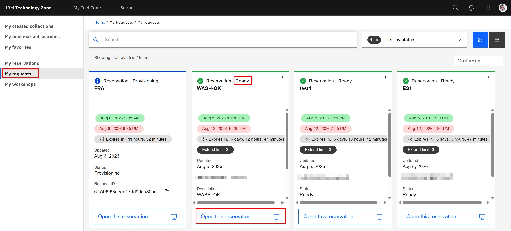{ width="90%" }](../images/acc1.webp)
1.	Confirm that the environment was created from the **bootcamp manifest**. The environment name should follow the format **gdp_bootcamp_v13**. The version number is incremented for newer releases of the training environment. Expand the deployment details by clicking the arrow next to the manifest name.
[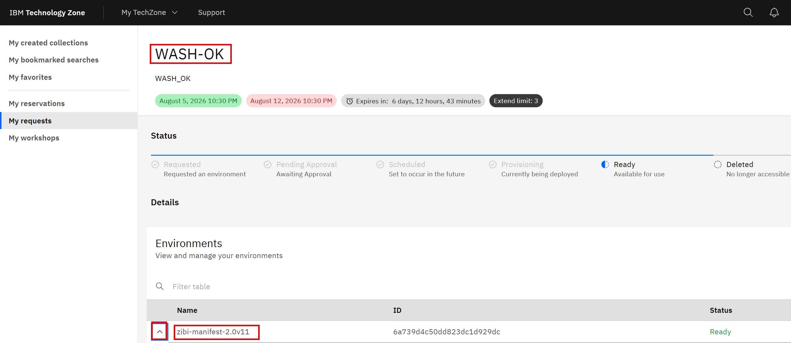{ width="90%" }](../images/acc2.webp)
1.	The expanded **Output** list contains key information about machines in the environment. The number of systems may vary depending on the bootcamp version, but the general principle remains the same. *Machine names* include a random suffix, which can be ignored throughout the lab environment.
Some machines and services are accessible directly from the Internet. In those cases, use the **public IP addresses** listed in the machine descriptions.
Record the *public IP addresses* of the **raptor**, **cm**, **coll1**, and **ceratops** machines, as you will access these systems directly from your workstation throughout the bootcamp.
[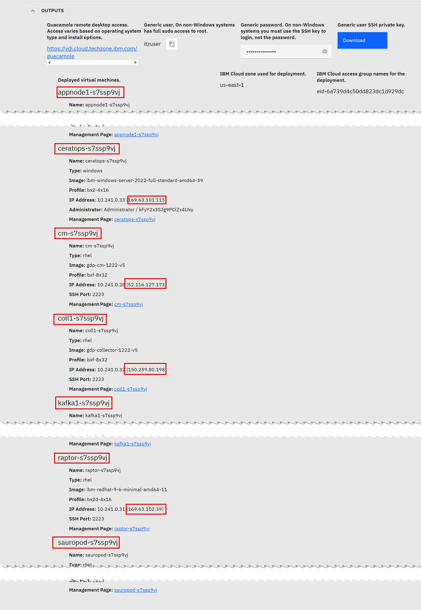{ width="90%" }](../images/acc3.webp)
1.	The **cm**, **coll1**, **appnode1**, **appnode2**, and **kafka1** systems are **Guardium** appliances. Administrative access to these appliances is performed by connecting to them via SSH from the **raptor** machine. The appliances use the standard *SSH* port *22*.
In addition, the **cm** and **coll1** systems provide access to the *Guardium UI*, which is available over *HTTPS* on port *8443*. You will access this interface using your local web browser.
The **sauropod** machine is accessible from **raptor** through *SSH* on port *2223*.
[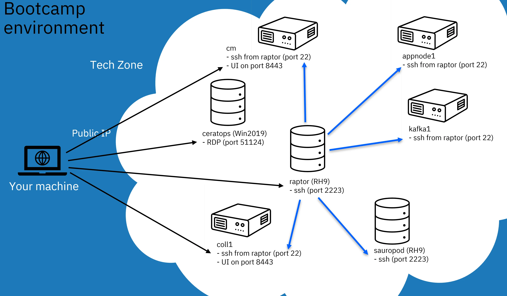{ width="90%" }](../images/acc4.webp)

## Access to machines

1.	To connect to **raptor**, use an *SSH client* on your workstation. On *Windows*, **MobaXterm** or the standard **PuTTY** client are recommended. On *macOS*, use **iTerm** or connect directly from the **command line** using the built-in *SSH client*. The *default password* for the environment services is provided in the **TechZone** environment description. Use this password to sign in to the **root** account. raptor can be accessed using non-standard *SSH* port number 2223.
[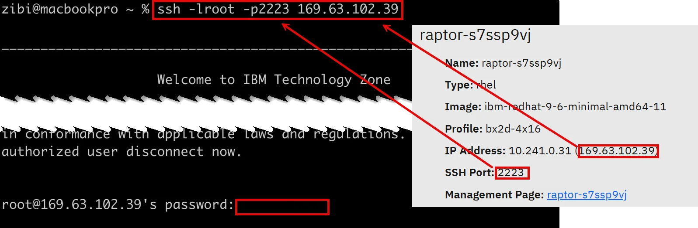{ width="90%" }](../images/acc5.webp)
```bash
ssh -lroot -p2223 <raptor_public_ip>
```
1.	To sign in to the **cli** account on a *Guardium appliance*, connect via *SSH* from your **raptor** session. The password for the **cli** account is different from the password used for the other environment services and can also be found in the **TechZone** environment description.
```bash
ssh -lcli -p22 cm|coll1|kafka1|appnode1|appnode2
```
[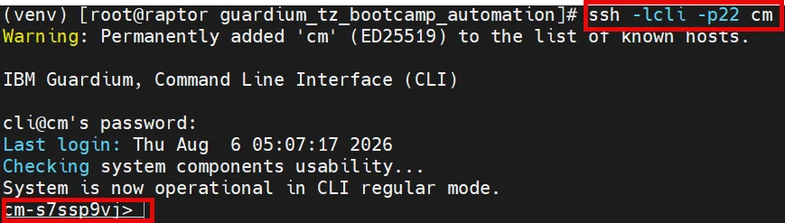{ width="90%" }](../images/acc6.webp)
1.	To log in to the **sauropod** machine, you do not need to provide credentials, as the **root** accounts on **raptor** and **sauropod** are configured to use *SSH* key-based authentication.
```bash
ssh sauropod
```
[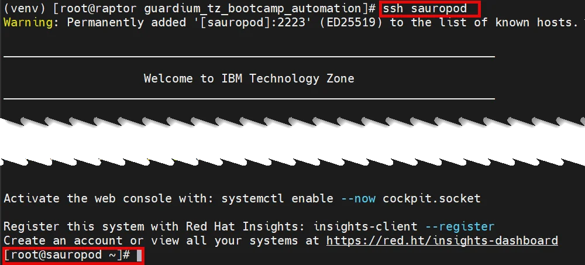{ width="90%" }](../images/acc7.webp)
1.	For security reasons, *RDP* access to the *ceratops* (**Windows**) machine is not exposed to the Internet. To temporarily access this machine, enable a tunnel on **raptor** using the following command.
```bash
systemctl start socat-RDP
```
1.  To connect to the **ceratops** Windows machine, use an *RDP* client on your workstation and specify the **raptor** *public IP address* on port *8443*. This will forward the connection to the **ceratops** machine. Sign in using the **demo** user account and the default environment services password.
[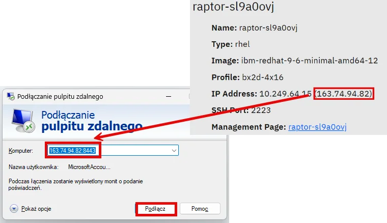{ width="90%" }](../images/acc8.webp)
1.  Ensure that you sign in as **.\demo** using the default environment services password.
[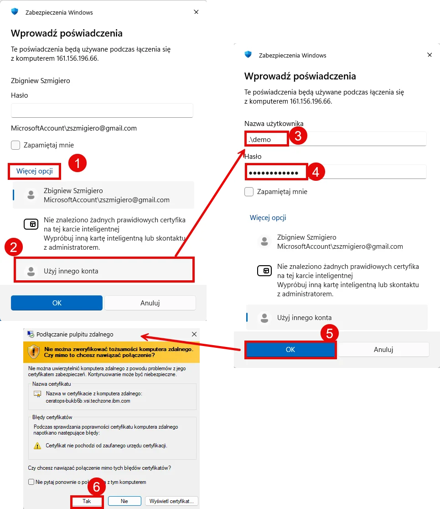{ width="90%" }](../images/acc9.webp)
1.	Close *RDP* session and stop tunnel. You will start it if needed.
```bash
systemctl stop socat-RDP
```
1.	For macOS, the recommended way to connect to the **ceratops** machine is to use the **Windows App** available from the *App Store*. Add a new machine by creating a new **Configure PC**, then enter the *public IP address* of the **raptor** machine and port *8443*. Sign in using the **demo** user account and the default environment services password.
[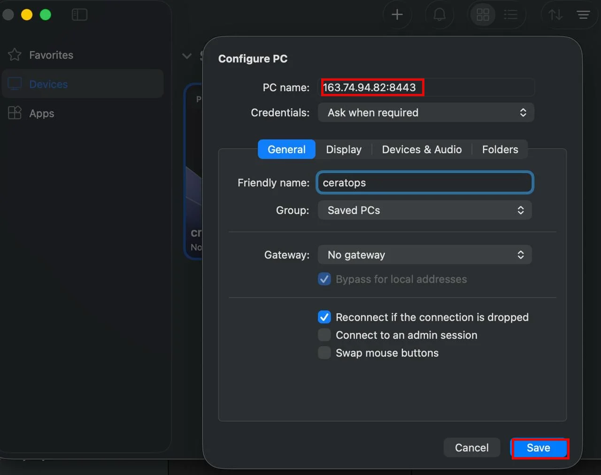{ width="90%" }](../images/acc10.webp)
[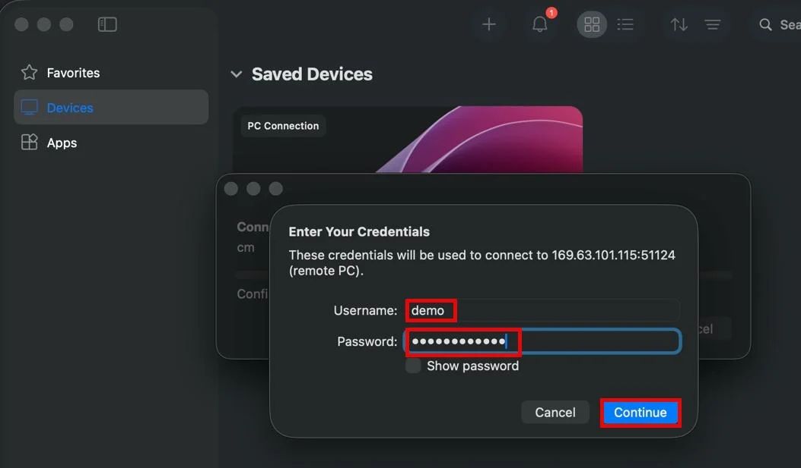{ width="90%" }](../images/acc11.webp)
1.	The **Central Manager** and **collector** *GUIs* are accessible from a web browser on your workstation. Connect using *HTTPS* to the *appliance's public IP address* on port *8443*. Do not log into UI yet, only check connectivity and save access page in the Bookmarks to simplify connection later.
```html
https://<public_ip_cm|public_ip_coll1>:8443
```
[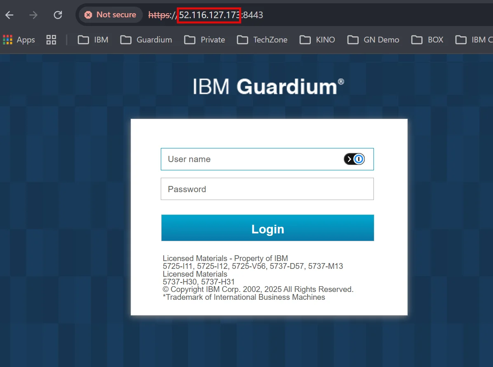{ width="90%" }](../images/acc12.webp)

## Appendix
!!! note "Dependencies:"

!!! note "Resources:"

!!! note "Instructor notes:"
    In case of on-site training passwords are provided by instructor<BR>
    In case of TZ automation, check the password file located there