## Appliance basic configuration
1.	Login to **raptor** and check local ip address of **cm**
```bash
cat /etc/hosts
```
[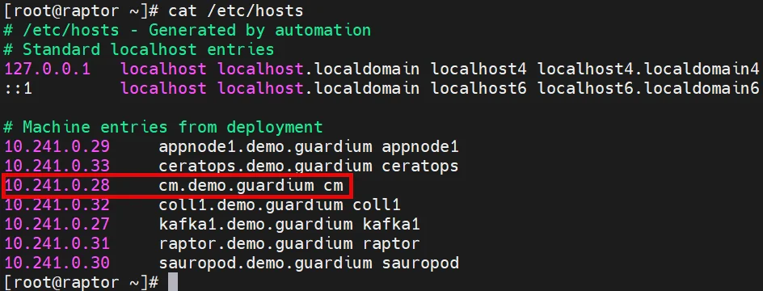{ width="90%" }](../images/appl1.webp)
1.	Login to **cm** cli using *ssh* session on **raptor**
```bash
ssh -lcli -p22 cm
```
1.	Run two commands to pause the data aggregation process. In the test environment, enabled aggregation services may cause unintended delays while waiting for several steps to be completed (the second command will require confirmation).
```bash linenums="1"
store run_cleanup_orphans_daily off

store purge_age_period 0
```
[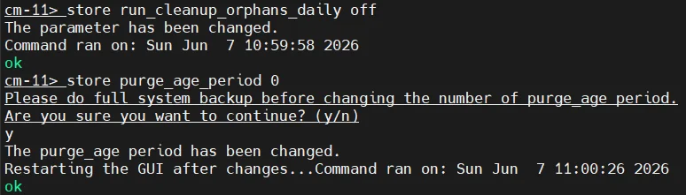{ width="80%" }](../images/appl2.webp)
1.	Display network interfaces and routes to verify connectivity.
```bash linenums="1"
show network interface all

show network route default
```
[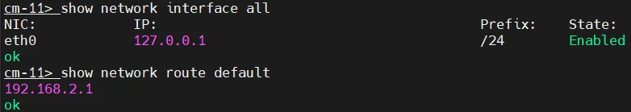{ width="85%" }](../images/appl3.webp)
1.	Notice that the IP address is set to **localhost** or temporary deployment IP, which is specific to the ***IBM Cloud*** environment. Update the IP address to the correct value based on IP address identified in step 1.
```bash
store network interface ip <cm_ip_address>/24
```
[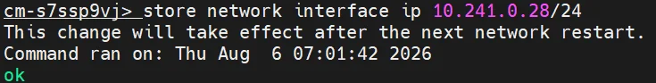{ width="85%" }](../images/appl4.webp)
1.	Check DNS resolver configuration. The list will be empty because the appliance is deployed in the cloud.
```bash
show network resolvers
```
1.	In this case, you can retrieve the dynamically assigned list of local servers using the following command.
```bash
show network resolvers_cloud
```
[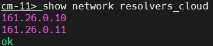{ width="45%" }](../images/appl5.webp)
1.	Test external DNS resolution by pinging a *public hostname*. Do not interrupt the test with **++ctrl+c++**, because this may terminate the ssh connection.
```bash
ping www.ibm.com
```
1.	Display the current system time settings.
```bash
show system clock all
```
[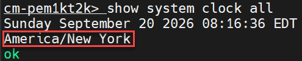{ width="45%" }](../images/appl6.webp)
1.	List available time zones. 
```bash
store system clock timezone list
```
1.	Set the system time zone to lab timezone. Wait a few minutes until the change is fully applied. All machines in the lab will use *GMT (Europe/London)* time zone configuration.
```bash
store system clock timezone Europe/London
```
[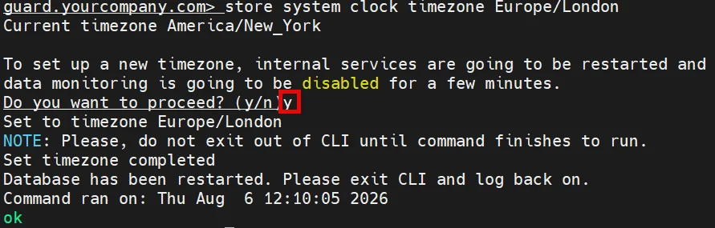{ width="90%" }](../images/appl7.webp)
1.	Re-login to **cli** session on **cm** and confirm new time zone.
```bash
show system clock all
```
[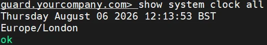{ width="55%" }](../images/appl8.webp)
1.	Configure NTP servers (three *pool.ntp.org* servers) and enable the NTP client.
```bash
store system time_server hostname 0.pool.ntp.org 1.pool.ntp.org 2.pool.ntp.org
```
1.	Confirm that they are correctly set.
```bash
show system time_server all
```
[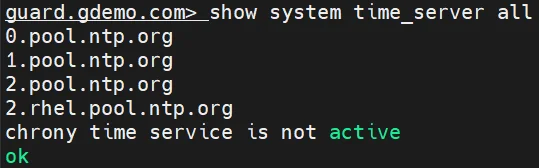{ width="55%" }](../images/appl9.webp)
1.	Activate NTP client, execute:
```bash
store system time_server state on
```
1.	Change the central manager host name to **cm**. When asked about cloning, answer *“y”*. This command can take timeout (10 minutes). In that case re-login and confirm than name was set to ***cm.yourcompany.com*** and continue.
```bash
store system hostname cm
```
[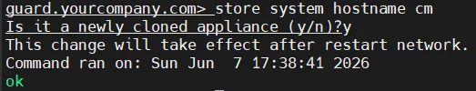{ width="65%" }](../images/appl10.webp)
1.	Set the domain name
```bash
store system domain demo.guardium
```
[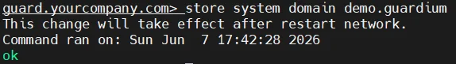{ width="70%" }](../images/appl11.webp)
1.	Re-login and confirm that machine prompt is now set to ***cm.demo.guardium.***
[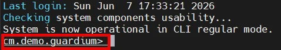{ width="60%" }](../images/appl12.webp)
11.	Restart network, insert *Yes* to confirm. It is crucial after machine name change because it intiate the GUI certificate recreation.
```bash
restart network
```
[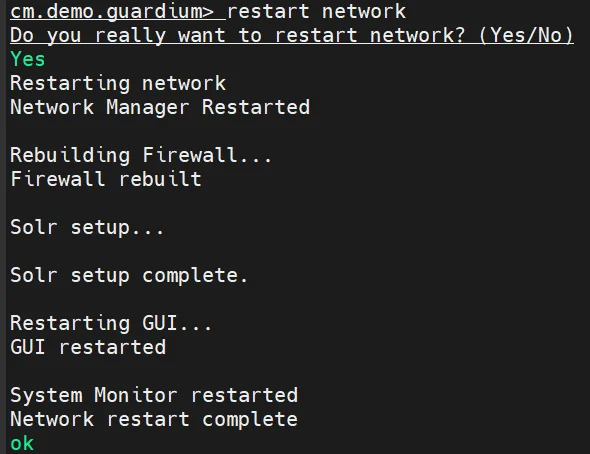{ width="60%" }](../images/appl13.webp)
1.	Because we have multiple cloned appliances in our environment and all share the same Guardium ID (*GID*), assign a **unique** ID to each of them before configuring them to work together, use the following command.
```bash
store product gid 1111
```
1.	All appliances in a centrally managed environment must share the same ***shared secret***. Set it to "*guardium*" on cm.
```bash
store system shared secret guardium
```
1.	Set cm configuration to accept small disk.
```bash
store system small_disk
```
[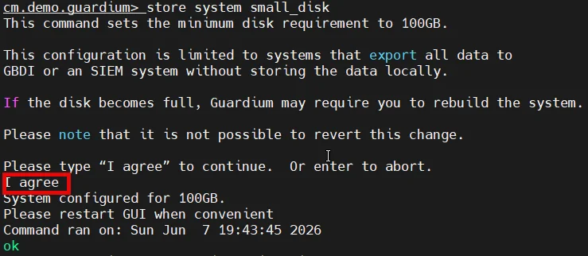{ width="90%" }](../images/appl14.webp)
1.	Increase GUI and CLI session timeouts to avoid unexpected logouts.
```bash linenums="1"
store gui session_timeout 9999

store timeout cli_session 600
```
1.	Display the static host mappings; initially this list is empty.
```bash
support show hosts
```
1.	Add static host entries for all lab machines (**coll1, appnode1, appnode2, kafka1, raptor, sauropod, ceratops**)
```bash linenums="1"
support store hosts <coll1_ip_address> coll1.demo.guardium

support store hosts <appnode1_ip_address> appnode1.demo.guardium

support store hosts <appnode2_ip_address> appnode2.demo.guardium

support store hosts <kafka1_ip_address> kafka1.demo.guardium

support store hosts <raptor_ip_address> raptor.demo.guardium

support store hosts <sauropod_ip_address> sauropod.demo.guardium

support store hosts <ceratops_ip_address> ceratops.demo.guardium
```
[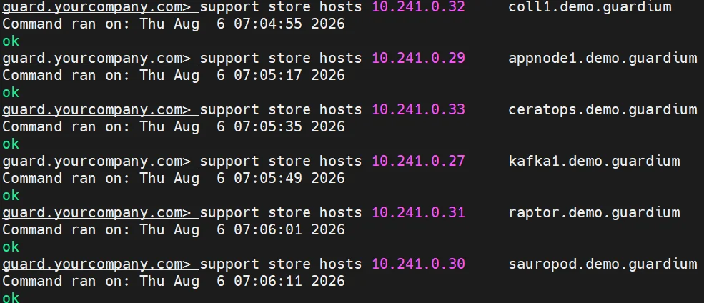{ width="90%" }](../images/appl15.webp)
1.	Display the host list again and confirm that all entries are correctly configured.
```bash
support show hosts
```
[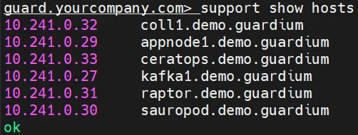{ width="50%" }](../images/appl16.webp)
1.	Restart the **cm**. If the appliance reports that MySQL is archiving, choose *“No”* to abort the restart and try again later, as shown in the screenshot.
```bash
restart system
```
[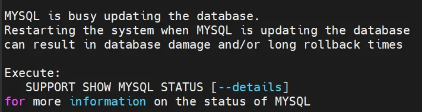{ width="75%" }](../images/appl17.webp)
28.	Reconnect to the cm and check appliance unit type. The appliance is an *aggregator* and is not yet configured as a *central manager*.
```bash
show unit type
```
[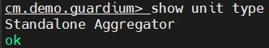{ width="40%" }](../images/appl18.webp)
1.	The system has valid license keys loaded, so you can now promote the *aggregator* to be a **Central Manager**. This command may take some time as it activates all services required for managing the appliance group
```bash
store unit type manager
```
[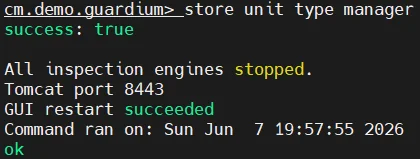{ width="55%" }](../images/appl19.webp)
30.	You can proceed with the next part of the lab and return to this *CLI* session once the command above is completed. Then verify that the aggregator has been successfully promoted to a manager.
```bash
show unit type
```
[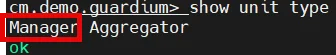{ width="45%" }](../images/appl20.webp)

## Other appliances setup

1.	Sign in to the **coll1** collector from **raptor** and execute a set of configuration commands to prepare the machine for connection to the **cm**.
```bash linenums="1"
store run_cleanup_orphans_daily off

store network interface ip <coll1_ip_address>/24
```
1.	Set the correct time zone (it should match the one configured on the **cm**) and re-login to the **collector**.
```bash
store system clock timezone Europe/London
```
1.	Then configure NTP, as well as the host name and domain. Make sure to confirm that the appliance is cloned when prompted during hostname configuration.
```bash linenums="1"
store system time_server hostname 0.pool.ntp.org 1.pool.ntp.org 2.pool.ntp.org

store system time_server state on

store system hostname coll1

store system domain demo.guardium
```
1.	Re-login and confirm that the command prompt reflects the configured hostname.
[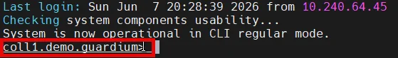{ width="75%" }](../images/appl21.webp)
1.	Execute the remaining configuration commands and reboot the appliance.
```bash linenums="1"
restart network

store product gid 2222

store system shared secret guardium

store system small_disk

store gui session_timeout 9999

store timeout cli_session 600

support store hosts <cm_ip_address> cm.demo.guardium

support store hosts <appnode1_ip_address> appnode1.demo.guardium

support store hosts <appnode2_ip_address> appnode2.demo.guardium

support store hosts <kafka1_ip_address> kafka1.demo.guardium

support store hosts <raptor_ip_address> raptor.demo.guardium

support store hosts <sauropod_ip_address> sauropod.demo.guardium

support store hosts <ceratops_ip_address> ceratops.demo.guardium

support show hosts

restart system
```
[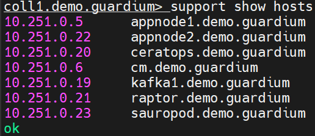{ width="55%" }](../images/appl22.webp)
1.	Now perform the same steps on the **appnode1** node.
```bash linenums="1"
store run_cleanup_orphans_daily off

store network interface ip <appnode1_ip_address>/24

store system clock timezone Europe/London
```
1.	Re-login and continue on the **appnode1**
```bash linenums="1"
store system time_server hostname 0.pool.ntp.org 1.pool.ntp.org 2.pool.ntp.org

store system time_server state on

store system hostname appnode1

store system domain demo.guardium
```
1.	Re-login to appnode1 and confirm that name is changed
```bash linenums="1"
restart network

store product gid 3333

store system shared secret guardium

store system small_disk

store gui session_timeout 9999

store timeout cli_session 600

support store hosts <cm_ip_address> cm.demo.guardium

support store hosts <coll1_ip_address> coll1.demo.guardium

support store hosts <appnode2_ip_address> appnode2.demo.guardium

support store hosts <kafka1_ip_address> kafka1.demo.guardium

support store hosts <raptor_ip_address> raptor.demo.guardium

support store hosts <sauropod_ip_address> sauropod.demo.guardium

support store hosts <ceratops_ip_address> ceratops.demo.guardium

restart system
```
1.	Then do the same steps on the **appnode2** node.
```bash linenums="1"
store run_cleanup_orphans_daily off

store network interface ip <appnode2_ip_address>/24

store system clock timezone Europe/London
```
1.	Re-login and continue on the **appnode2**
```bash linenums="1"
store system time_server hostname 0.pool.ntp.org 1.pool.ntp.org 2.pool.ntp.org

store system time_server state on

store system hostname appnode2

store system domain demo.guardium
```
1.	Re-login to **appnode2** and confirm that name is changed
```bash linenums="1"
restart network

store product gid 4444

store system shared secret guardium

store system small_disk

store gui session_timeout 9999

store timeout cli_session 600

support store hosts <cm_ip_address> cm.demo.guardium

support store hosts <coll1_ip_address> coll1.demo.guardium

support store hosts <appnode1_ip_address> appnode1.demo.guardium

support store hosts <kafka1_ip_address> kafka1.demo.guardium

support store hosts <raptor_ip_address> raptor.demo.guardium

support store hosts <sauropod_ip_address> sauropod.demo.guardium

support store hosts <ceratops_ip_address> ceratops.demo.guardium

restart system
```
1.	We must do this same for **kafka1** appliance as well
```bash linenums="1"
store run_cleanup_orphans_daily off

store network interface ip <kafka1_ip_address>/24

store system clock timezone Europe/London
```
1.	Re-login and continue on **kafka1**
```bash linenums="1"
store system time_server hostname 0.pool.ntp.org 1.pool.ntp.org 2.pool.ntp.org

store system time_server state on

store system hostname kafka1

store system domain demo.guardium
```
1.	Re-login to **kafka1** and confirm that name is changed
```bash linenums="1"
restart network

store product gid 5555

store system shared secret guardium

store system small_disk

store gui session_timeout 9999

store timeout cli_session 600

support store hosts <cm_ip_address> cm.demo.guardium

support store hosts <coll1_ip_address> coll1.demo.guardium

support store hosts <appnode1_ip_address> appnode1.demo.guardium

support store hosts <appnode2_ip_address> appnode2.demo.guardium

support store hosts <raptor_ip_address> raptor.demo.guardium

support store hosts <sauropod_ip_address> sauropod.demo.guardium

support store hosts <ceratops_ip_address> ceratops.demo.guardium

restart system
```

## Add user and create dashboard

1.	Login to **cm** UI as an **accessmgr** user (use this same password like you used for **cli** access to appliances) and press **Add User** button in **Access manager** view
[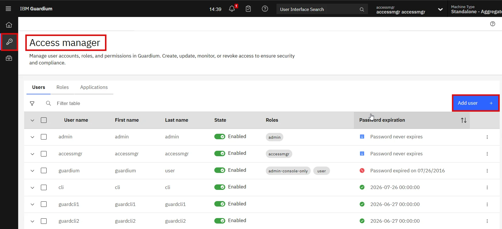{ width="99%" }](../images/appl23.webp)
1.	Create a new user - **demo**. Set password and description. Expand the **Roles** panel and select: **admin, cli, fam, user** and **vulnerability assess** roles.
[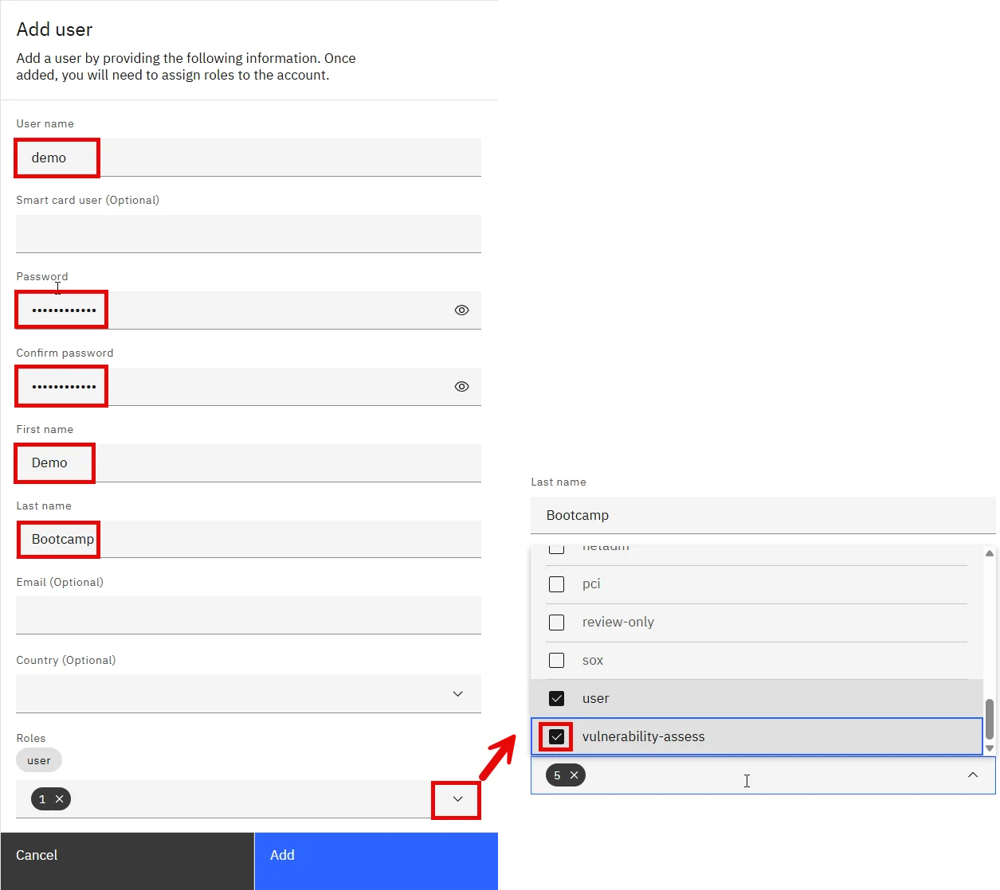{ width="99%" }](../images/appl24.webp)
1.	Scroll slightly down, select **Password never expires**, then click **Add** to create the user.
[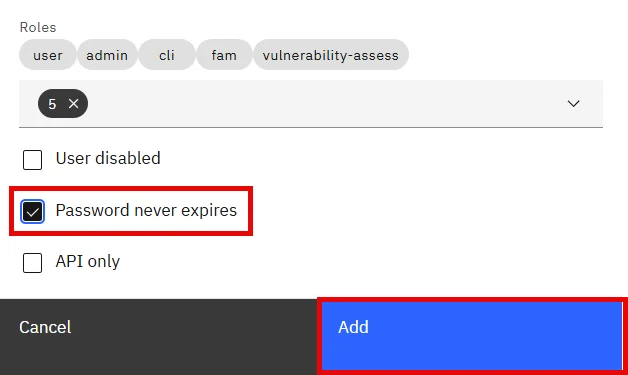{ width="60%" }](../images/appl25.webp)
1.	The newly created user should appear at the bottom of the list. Then, use the **State** toggle for the **guardium** account to deactivate it.
[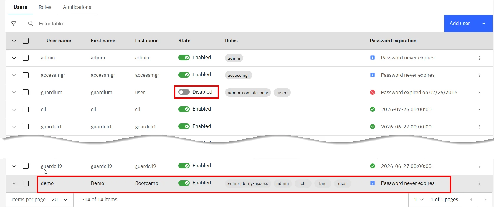{ width="99%" }](../images/appl26.webp)
1.	Sign out of the **accessmgr** account and sign in as the newly created **demo** user.
[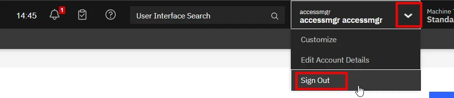{ width="99%" }](../images/appl27.webp)
1.	In the **Search** field, enter ***License*** to filter the options. Select the **License** view and review the installed license keys. The *Central Manager*, as mentioned earlier, has pre-installed license keys for a centrally managed environment. Functional (*append*) keys enable **DAM, FAM** and **VA** features.
[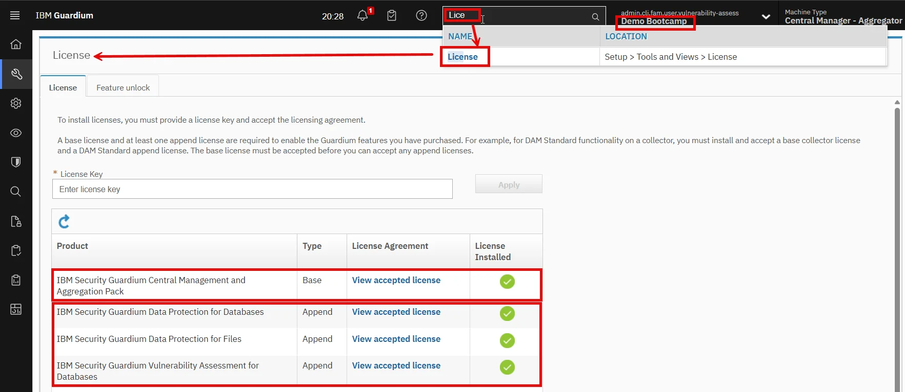{ width="99%" }](../images/appl28.webp)
1.	Navigate to the **Feature Unlock** tab and verify that the additional features have been loaded into the system. Note that this does not mean they have been activated.
[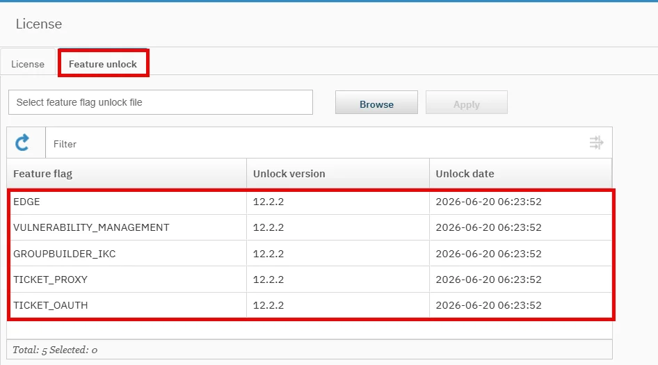{ width="99%" }](../images/appl29.webp)
1.	Next, select **Definition Export/Import**, go to the **Import** tab, choose the report definition file `exp_full_sql_report.sql` from your exports folder (student materials), and click **Upload** file.
[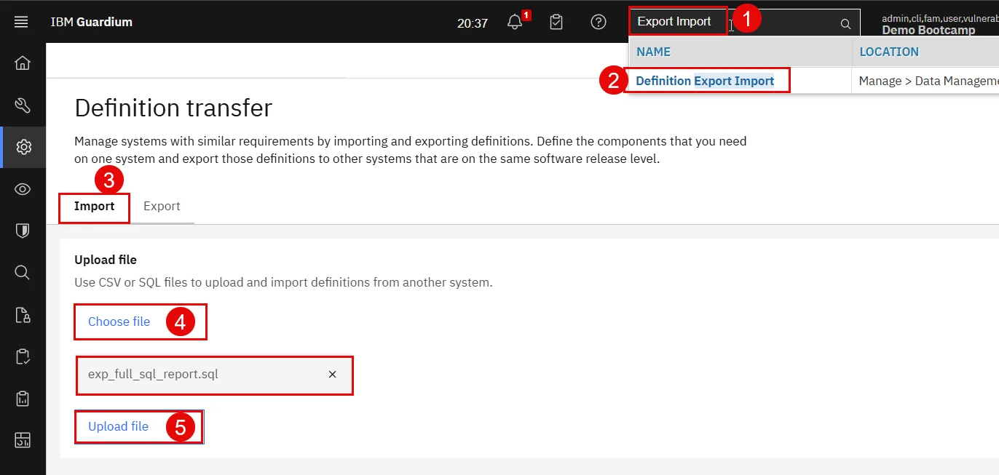{ width="99%" }](../images/appl30.webp)
1.	After a moment, the *Full SQL (Training)* report should appear in the **Uploaded files** section. Select it and click **Import**.
[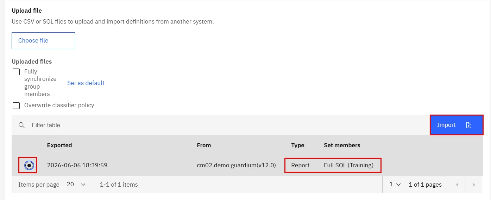{ width="99%" }](../images/appl31.webp)
1.	After a moment, a confirmation message should appear indicating the report was successfully imported.
[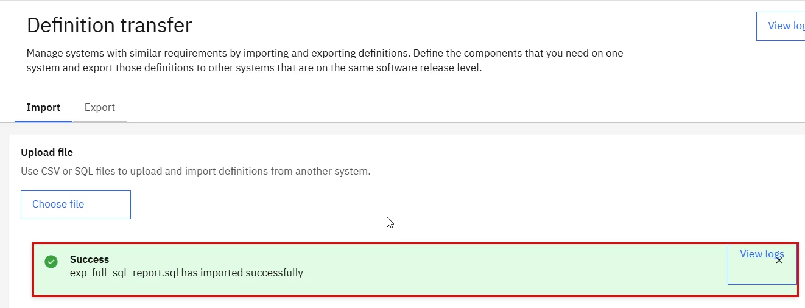{ width="99%" }](../images/appl32.webp)
1.	Repeat the import process, but this time use the `exp_default_policy.sql` file. This will load the policy named *Default bootcamp policy*.
[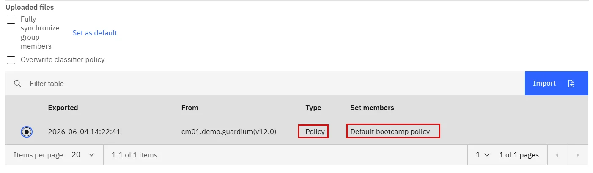{ width="99%" }](../images/appl33.webp)
1.	To create a dashboard, select the **My Dashboards** icon from the vertical menu, then choose **Create New Dashboard**. Edit the name (pencil icon) to *Training* and click **Save**. Next, click **Add Report** to open the report selection window and add three reports: the newly imported *Full SQL (Training)* and the built-in *SQL Errors* and *S-TAP and External S-TAP Statistics*. Reports are added to the dashboard upon selection from the list.
[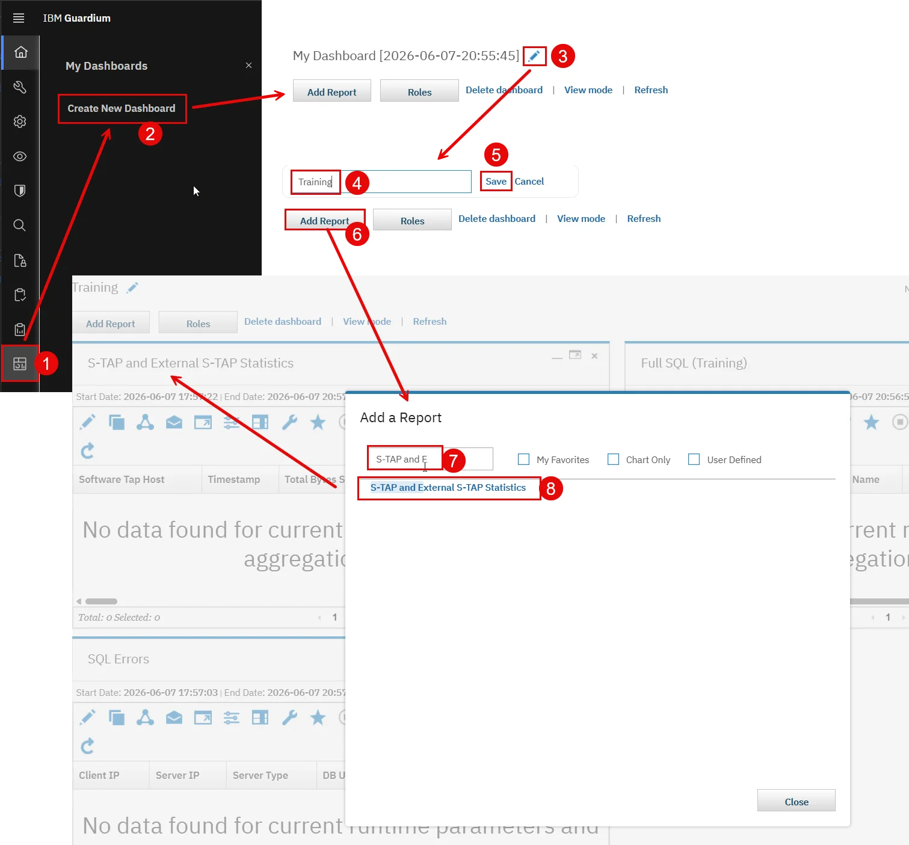{ width="99%" }](../images/appl34.webp)
!!! warning "Uwaga"
    Use **demo** account for all UI activities in the bootcamp labs unless a different one is explicitly required.

## Register appliances

1.	From **cm** UI open **Central Management** application and select **Register unit** button from **Actions** list. Notice that there are no appliances managed by our *Central Manager* yet. Register unit pop-up will provide the possibility to insert **coll1** Unit IP (select appropriate one) and default communication port (8443) then press **Register** button.
[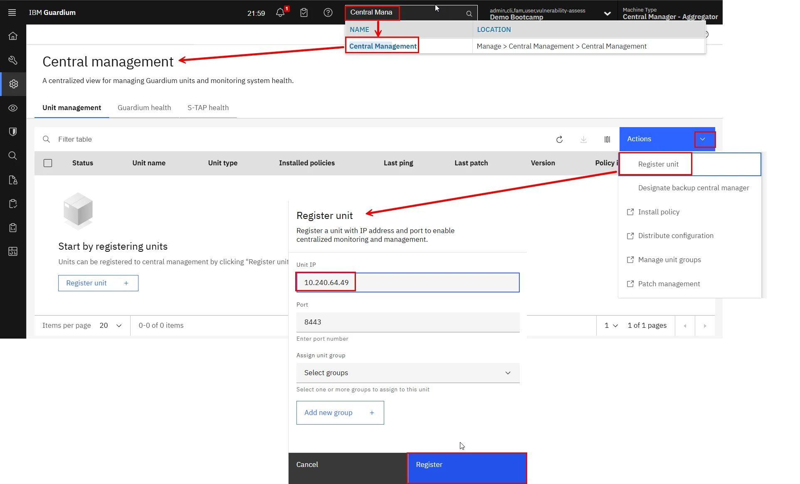{ width="99%" }](../images/appl35.webp)
1.	After a longer wait (be patient), the view should refresh and the **coll1** collector will appear in the managed appliances list. Its presence on the list does not yet mean full synchronization—this process may take a few more minutes.
[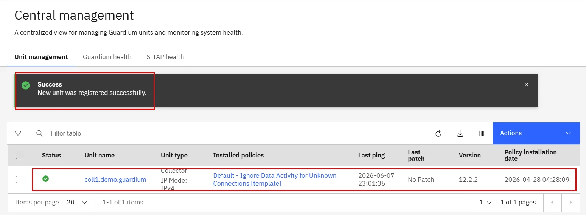{ width="99%" }](../images/appl36.webp)
1.	Sign in to the **coll1** via CLI and notice that the appliance mode has changed from Standalone to Managed.
```bash
show unit type
```
[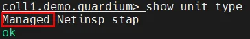{ width="45%" }](../images/appl37.webp)
1.	Repeat the full appliance registration process on **appnode1**, **appnode2** and **kafka1** and confirm that all appliances are visible from the **cm** *Central management* view.
[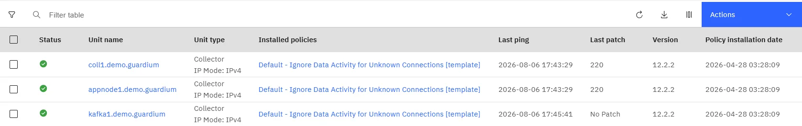{ width="99%" }](../images/appl38.webp)