# ATAP Configuration

## Install STAP 12.0.6

1.	Install kernel-devel for currently used kernel.
```bash
dnf install -y kernel-devel-$(uname -r)
```

1.	Install the latest *GIM client* on **raptor**
```bash linenums="1"
cd /opt/guardium_tz_bootcamp_automation/upload/source_files/agents/shell/

./guard-bundle-GIM-12.2.2.0_r123489_v12_x_1-rhel-9-linux-x86_64.gim.sh -- --dir /opt/guardium --tapip <raptor_ip> --sqlguardip <cm_ip>
```

1.	In **cm** UI deploy **STAP 12.2.1.1_r123268_5**. Rember to ucheck option to see all available releases and confirm successful deployment.
[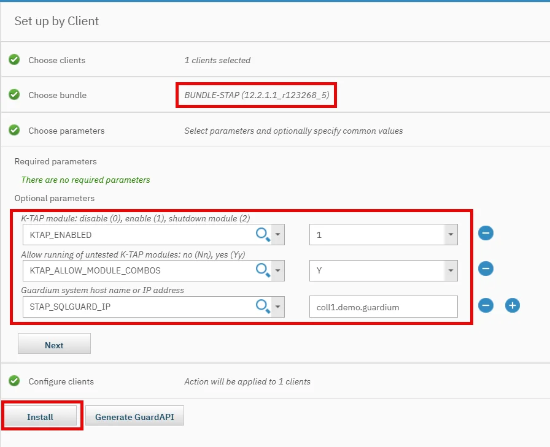{ width="99%" }](../images/atap1.webp) 

1.	Then check in **S-TAP Control** view in **coll1** UI that *Postgres* inspection engine (database instance) has been discovered by agent. Use { width="14" } icon in row where **raptor** *STAP* appears and select **Edit** option. In the pop-up point **Inspection engines** and locate *pgsql* instance on the list.
[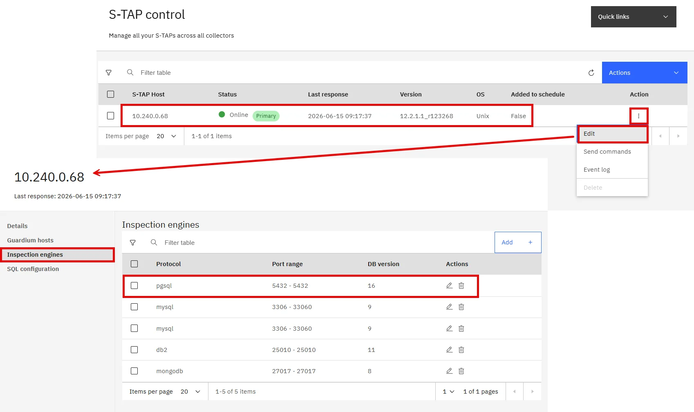{ width="99%" }](../images/atap3.webp) 
 
## Check encrypted traffic visibility

1.	From **root** session on **raptor** connect to *Postgres* instance as a **tom** user using non-encrypted connection and then check connection type and execute simple dummy SQL (use default environment password).
```sql linenums="1"
psql "postgresql://raptor.demo.guardium:5432/postgres?sslmode=disable" -U tom -W

SELECT * FROM pg_stat_ssl WHERE pid=(SELECT pid FROM pg_stat_activity WHERE query LIKE 'SELECT%');

SELECT 'TOM’s SESSION WITHOUT SSL';

\q
```
Notice that column ssl in output from first query has value f (false) what means that connection is not encrypted
[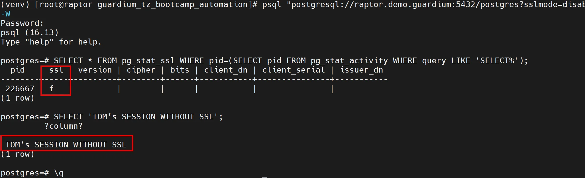{ width="99%" }](../images/atap4.webp) 
 
1.	Open **Full SQL (Training)** report in *Training* dashboard on **coll1**.
[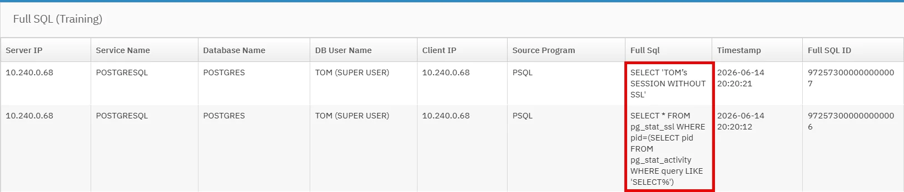{ width="99%" }](../images/atap5.webp) 
 
1.	Connect to *Postgres* instance as a **jerry** using encrypted connection.
```bash
psql "postgresql://raptor.demo.guardium:5432/postgres?sslmode=require" -U jerry -W
```

1.	Check connection parameters and execute dummy SQL.
```sql linenums="1"
SELECT * FROM pg_stat_ssl WHERE pid=(SELECT pid FROM pg_stat_activity WHERE query LIKE 'SELECT%');

SELECT 'JERRY’s SESSION USING SSL';

\q
```
[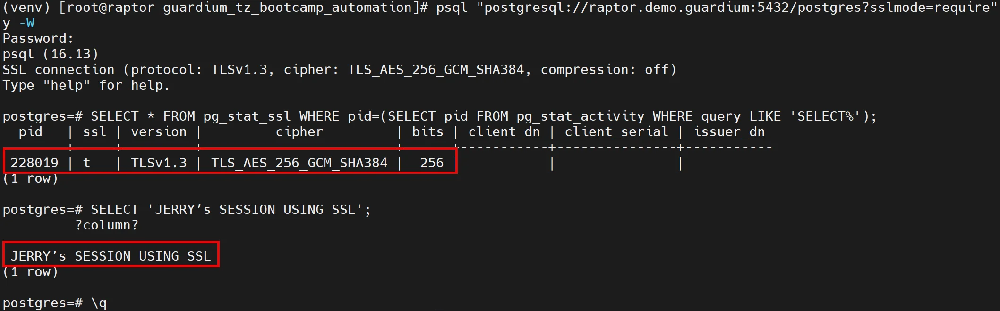{ width="99%" }](../images/atap6.webp)

1.	Check **Full SQL (Training)** report again and notice that traffic related for encrypted session did not appear there. In case of encrypted connections the traffic visibility requires *ATAP* configuration (if available).

## ATAP setup

1.	As a **root** user on **raptor** execute these commands to configure *ATAP for Postgres* instance (`guardctl` command requires full path specification during execution).
```bash linenums="1"
/opt/guardium/modules/ATAP/current/files/bin/guardctl --db-user=postgres --db-home=/usr --db-user-dir=/var/lib/pgsql --db-type=postgres --db-instance=postgres --db-version=16 store-conf

/opt/guardium/modules/ATAP/current/files/bin/guardctl authorize-user postgres
```

1.	Stop *Postgres* database engine.
```bash
systemctl stop postgresql
```

1.	Activate *ATAP*.
```bash
/opt/guardium/modules/ATAP/current/files/bin/guardctl --db-instance=postgres activate
```
[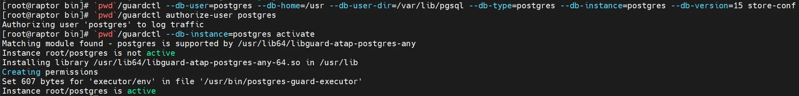{ width="99%" }](../images/atap7.webp)

1.	Start *Postgres*.
```bash
systemctl start postgresql
```

1.	Connect to database with SSL using a **jerry** account again.
```bash
psql "postgresql://raptor.demo.guardium:5432/postgres?sslmode=require" -U jerry -W
```
1.	Execute again SQL’s inside encrypted session.
```sql linenums="1"
SELECT * FROM pg_stat_ssl WHERE pid=(SELECT pid FROM pg_stat_activity WHERE query LIKE 'SELECT%');

SELECT 'A NEW JERRY’s SESSION USING SSL';

\q
```

1.	Check activity in **Full SQL (Training)** report and confirm that this time jerry’s session is correctly monitored.
[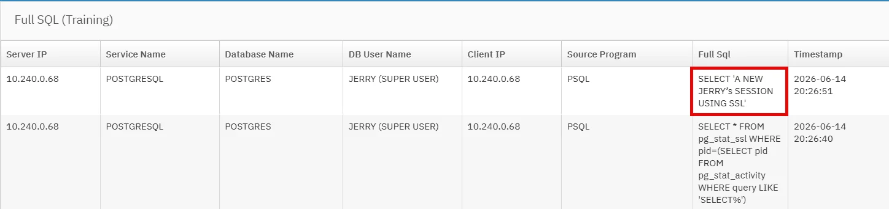{ width="99%" }](../images/atap8.webp)

##	ATAP upgrade

1.	In **cm** UI open **Setup by Client** view and configure *STAP* upgrade from **12.2.1.1** to **12.2.2.0**.
[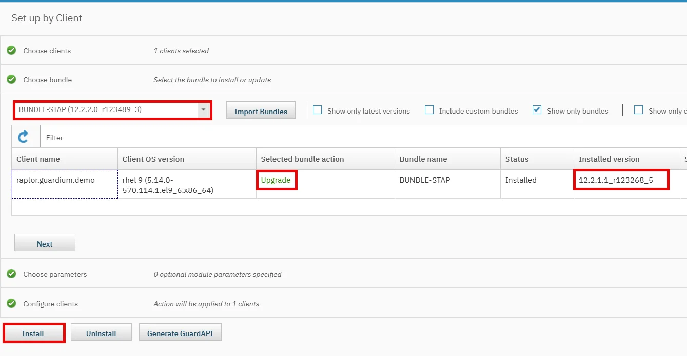{ width="99%" }](../images/atap9.webp)
  
1.	Monitor upgrade process and it should finish with success. This behaviour is expected from release **12.2** and up. Before **12.2** the agent upgrade required the *ATAP* deactivation. Now process of *ATAP* upgrade works in live.
[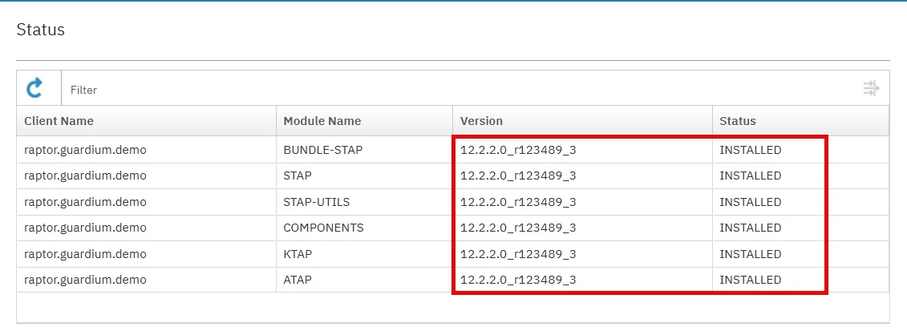{ width="99%" }](../images/atap10.webp)
 
1.	Login to *Postgres* as a tom using SSL channel on **raptor**.
```bash
psql "postgresql://raptor.demo.guardium:5432/postgres?sslmode=require" -U tom -W
```

1.	Execute some SQL’s.
```sql linenums="1"
SELECT * FROM pg_stat_ssl WHERE pid=(SELECT pid FROM pg_stat_activity WHERE query LIKE 'SELECT%');

SELECT 'TOM’s SESSION USING SSL AFTER STAP UPGRADE';

\q
```

1.	Check **Full SQL (Training)** report on **coll1** and confirm that just executed activity is correctly audited.
[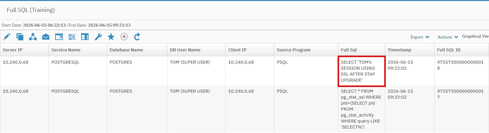{ width="99%" }](../images/atap11.webp)

##	STAP settings

1.	Check on **raptor** connection to **coll1**.
```bash
netstat -an | grep <coll1_ip>
```
[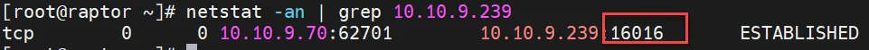{ width="99%" }](../images/atap12.webp)
Only one connection on port *16016* is established between *STAP* and **coll1**. This port is used for clear text comunication (NO TLS communication)


1.	Check SSL settings on port *16016* to confirm that there is no SSL handshake possible on this port
```bash
openssl s_client -connect <coll1_ip>:16016
```
[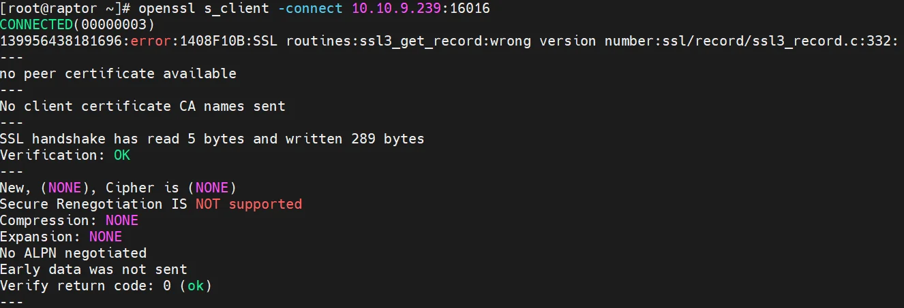{ width="99%" }](../images/atap13.webp)

1.	Using **Set up by Client** view on **cm** modify *STAP module* parameters.

    !!! note "Set parameters:"
        - *STAP_USE_TLS*: **1**
        - *STAP_STATISTICS*: **-3**
        - *STAP_CONNECTION_POOL_SIZE*: **2**

    Select currently installed version of STAP (12.2.2.0). Confirm that changes are applied.

    [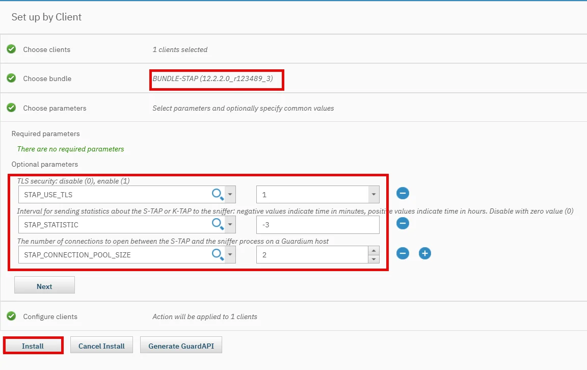{ width="99%" }](../images/atap14.webp)
 
1.	Then check again connections list to **coll1** from **raptor**.
```bash
netstat -an | grep <coll1_ip>
``` 
[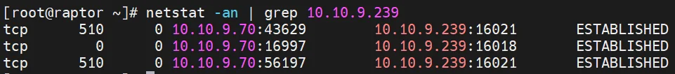{ width="99%" }](../images/atap15.webp)
You should now see three connections. Notice that the connection on port *16016* is no longer available, as communication has switched to the encrypted channel between the agent and the **coll1** (*16018*). The two additional connections on port *16021* are also in use, corresponding to the two extra threads we configured.

1.	Test encryption status on these two ports (16018 and 16021)
```bash linenums="1"
openssl s_client -connect <collector_ip>:16018 < /dev/null

openssl s_client -connect <collector_ip>:16021 < /dev/null
```
[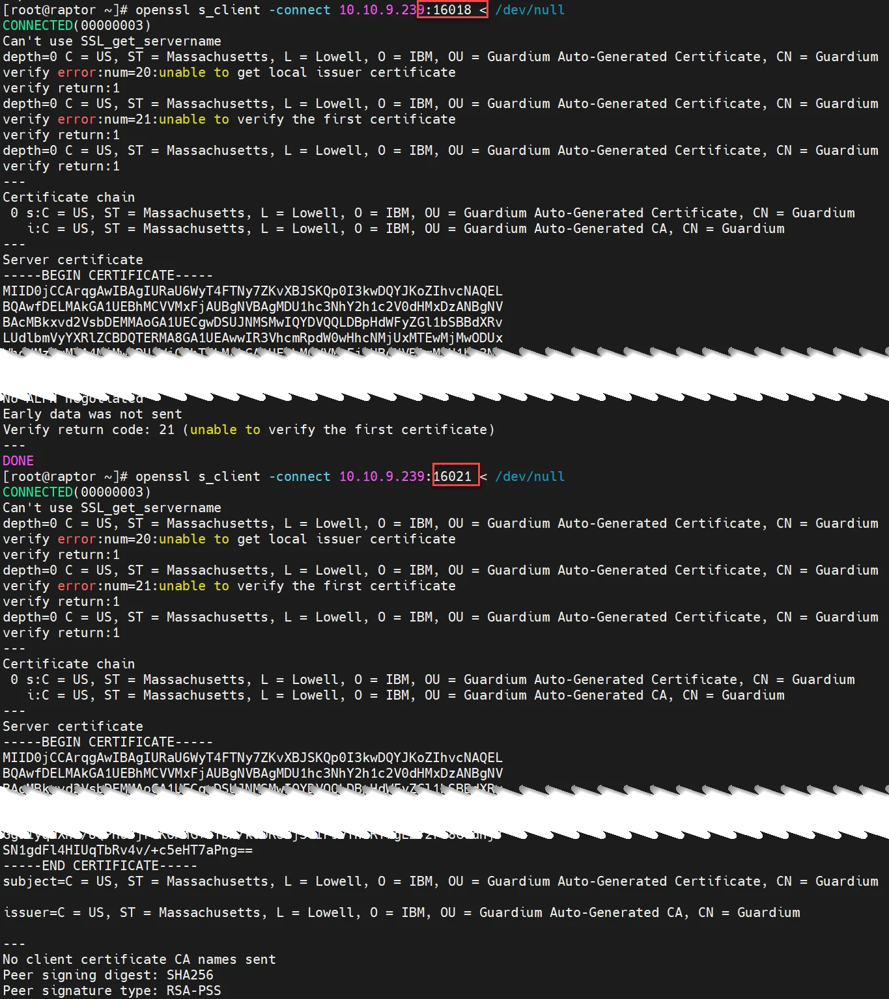{ width="99%" }](../images/atap16.webp) 
*STAP_STATISTIC* parameter set to value **-3** we will check later on. On heavily loaded systems you can consider use additional port to manage more connection between *STAP* and *collector*. In this case you must change value of *STAP_CONNECTION_POOL_SIZE* parameter from **0** to *positive value*.

1.	To stop *STAP* from *GIM server* set parameter *STAP_ENABLED* to **0**. Notice that value **2** will force *STAP* restart.
[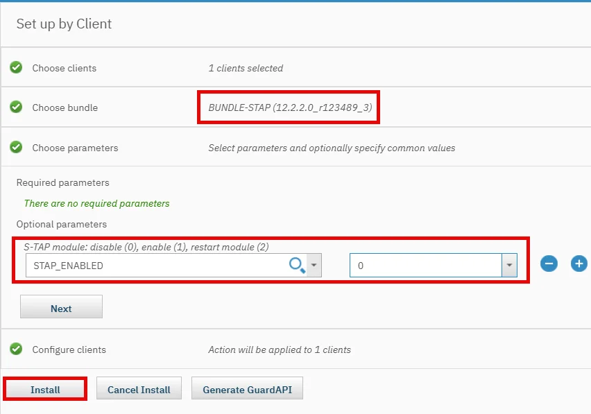{ width="99%" }](../images/atap17.webp) 

1.	Then check *STAP* status in **S-TAP Control** in the **coll1** UI and confirm that *STAP* is stopped.
[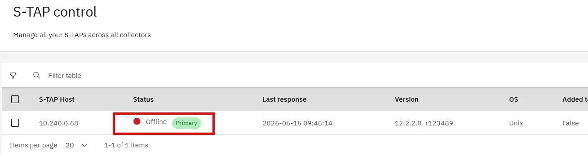{ width="99%" }](../images/atap18.webp)

1.	Start *STAP* from command line on raptor.
```bash
/opt/guardium/modules/STAP/current/guard-config-update --enable stap
```

1.	Then when *STAP* will be again operating, edit a **raptor** *STAP* configuration in **S-TAP Control** view on **coll1** – press { width="14" } icon to select **Edit** option. It opens *STAP* configuration pop-up. Select *Inspection engines* from left menu and select all of them then delete all using **Delete Inspection Engine** in the options bar. It opens a warning window to **Confirm** desired changes.
[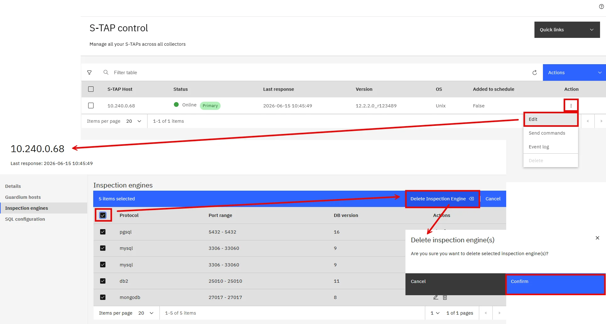{ width="99%" }](../images/atap19.webp)
 
1.	Now list of the *Inspection engines* should be empty. **Save** the changes.
[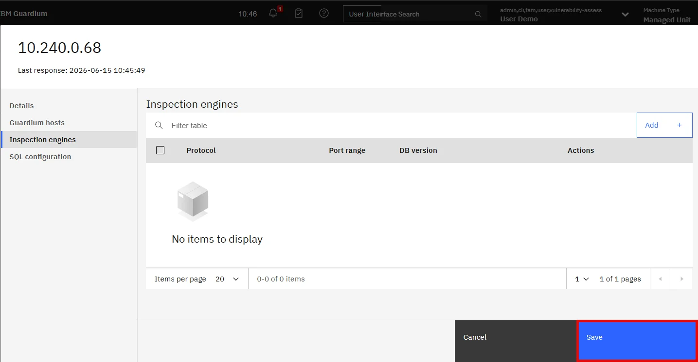{ width="99%" }](../images/atap20.webp)
 
1.	The *STAP* will be in *Not synchronized* state (yellow) because requested change is not yet consumed by STAP.
[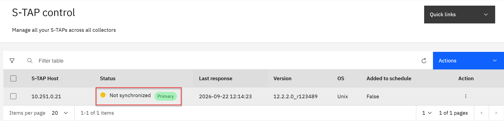{ width="99%" }](../images/atap52.webp)

1. If you refresh the status after a while the status should change to *Configuration error* state (pink) because lack of inspection engine definitions. To rediscover them open again menu using { width="14" } icon and select **Send** commands option. It opens pop-up where one of the commands is **Run database instance discovery**. Select it and check the **Replace Inspection Engines** option. Then **Apply** changes.
[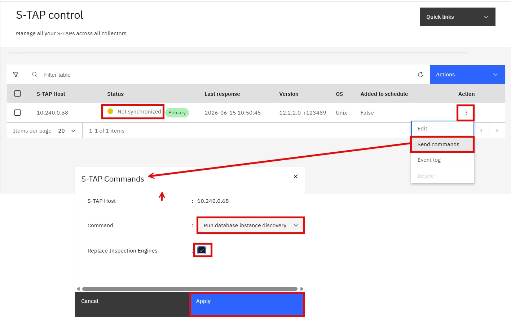{ width="99%" }](../images/atap21.webp)
 
1.	You back to **S-TAP Control** view and after a while (use refresh icon) the *STAP status* should change to *Online* because all IE’s has been rediscovered.
[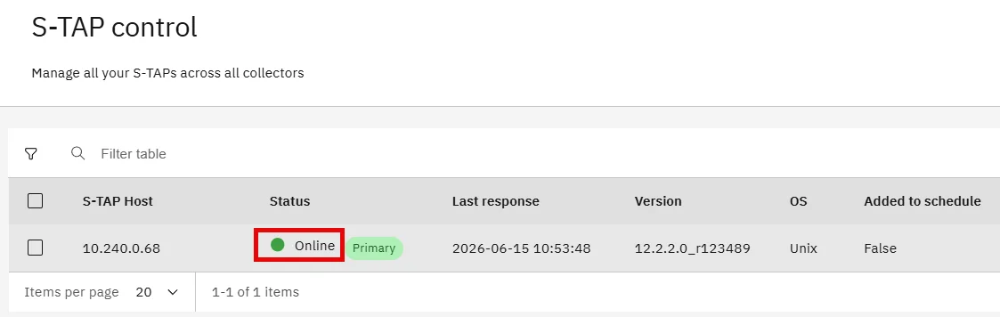{ width="99%" }](../images/atap22.webp)
[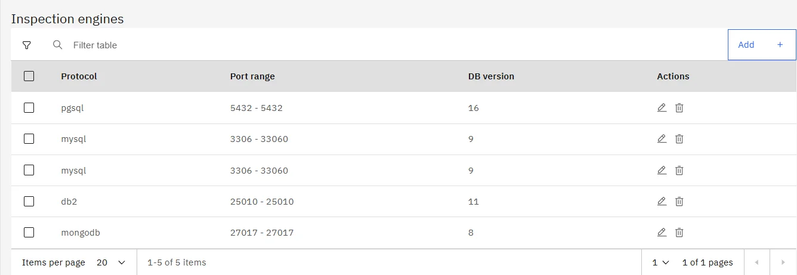{ width="99%" }](../images/atap23.webp)
 
1.	We can do this same from command line on monitored machine what provides us also better understanding what is or is not discovered correctly. To re-discover inspection instances execute on **raptor** machine.
```bash
/opt/guardium/modules/STAP/current/guard_discovery /opt/guardium/modules/STAP/current/guard_tap.ini --print_output 
```
[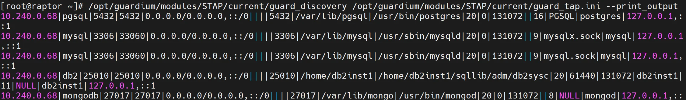{ width="99%" }](../images/atap24.webp)

1.	Previous command produces list of identified *DB instances* on **raptor** and can modify the *STAP* configuration stored in `guard_tap.ini` file. Review the content of this file to identify *DB_[X]* sections.
Each of them describes *database instance* which is monitored by *STAP agent* on **raptor** machine.
```bash
cat /opt/guardium/modules/STAP/current/guard_tap.ini
```
[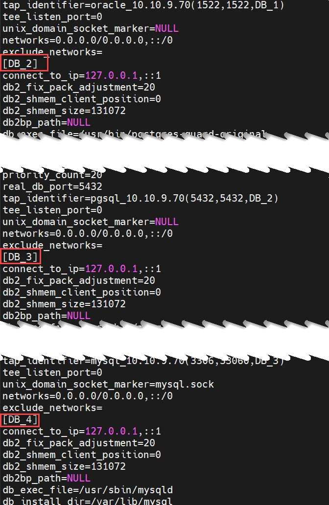{ width="69%" }](../images/atap25.webp)

## More STAP features	

1.	Review the content of *S-TAP and External S-TAP Statistics* report in *Dashboard* on **coll1**, check columns *S-TAP Total Packets Dropped*, *S-TAP Total Bytes Dropped*, *Stap CPU percent*, *Buffer recycled* (if for some reasons the report will be empty try again change *STAP_STATISTICS* flag form **-3** to **-5** for example, continue the lab and check result in the meantime).
[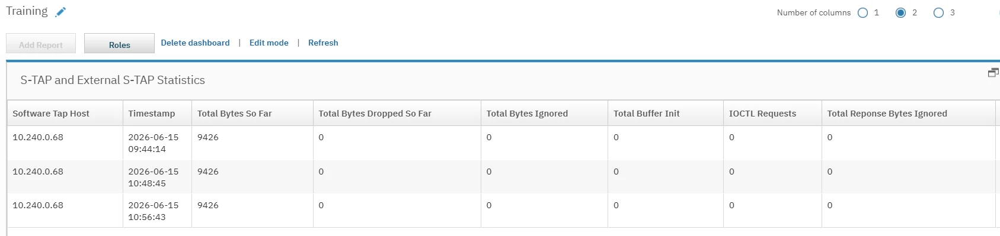{ width="99%" }](../images/atap26.webp)
 
1.	Spend a while on statistics documentation to understand what mentioned in report above
<https://www.ibm.com/docs/en/guardium/12.x?topic=performance-linux-unix-s-tap-statistics>

1.	From **cm** UI change **raptor** *STAP* settings and set *STAP-UTILS_START_MONITOR* value to **Y**.
[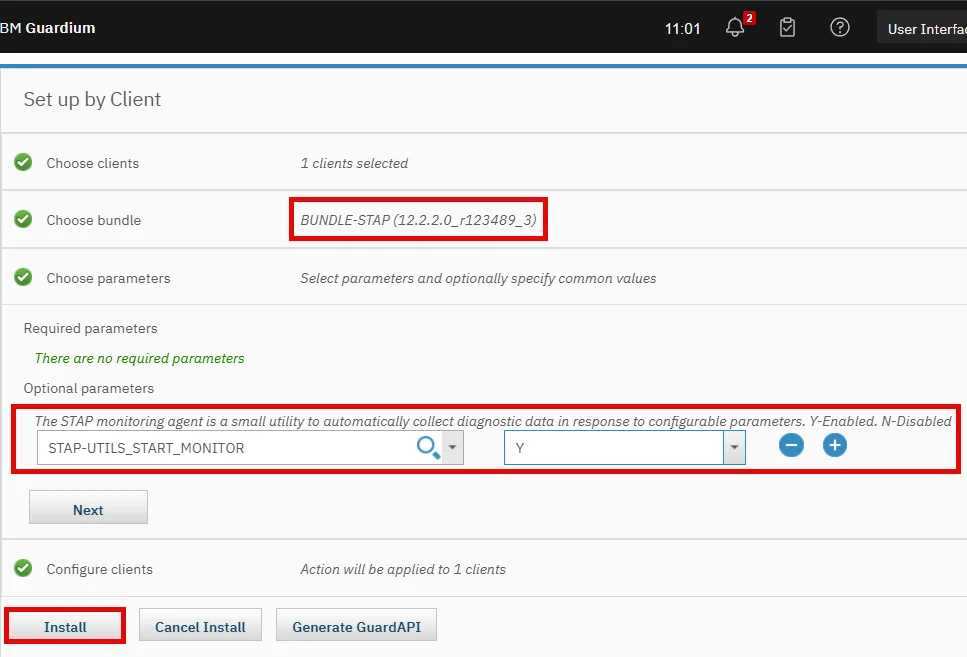{ width="99%" }](../images/atap27.webp)
 
1.	Check `/var/tmp/monitor` directory on raptor and notice that `guard_monitor.log` has been created there.
```bash
cat /var/tmp/monitor/guard_monitor.log
```

1.	Check location of *STAP* logs by searching for `tap_log_dir` parameter in `/opt/guardium/modules/STAP/current/guard_tap.ini` file on **raptor**.
```bash
grep tap_log_dir /opt/guardium/modules/STAP/current/guard_tap.ini
```
[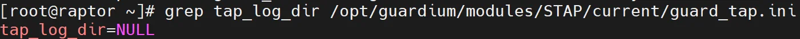{ width="99%" }](../images/atap28.webp)

1.	Notice that value is set to *NULL*, what means that `/tmp` directory is used to store main log file `guard_stap.stderr.txt`. Display log content.
```bash
cat /tmp/guard_stap.stderr.txt
```

1.	Create new directory where logs should be stored.
```bash
mkdir -p /root/glogs
```

1.	Modify `/opt/guardium/modules/STAP/current/guard_tap.ini` file and set variables.

    !!! info "Set variables:"
        - *tap_debug_output_level*: **1**
        - *tap_log_dir*: `**/root/glogs**`
    [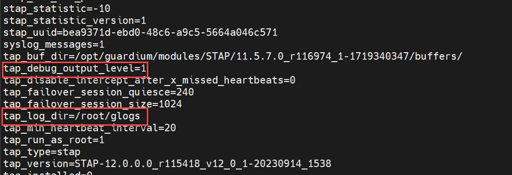{ width="99%" }](../images/atap29.webp)
 
1.	Restart *STAP*.
```bash
/opt/guardium/modules/STAP/current/guard-config-update --restart stap
```

1.	Check content of `/root/glogs` directory and notice that logs are now created there.
```bash
ls /root/glogs
```
[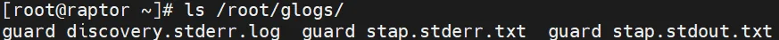{ width="89%" }](../images/atap30.webp)

1.	Check also *S-TAP Events* report on **coll1** and notice that events are there (sort report using *Timestamp* column, click column name).
[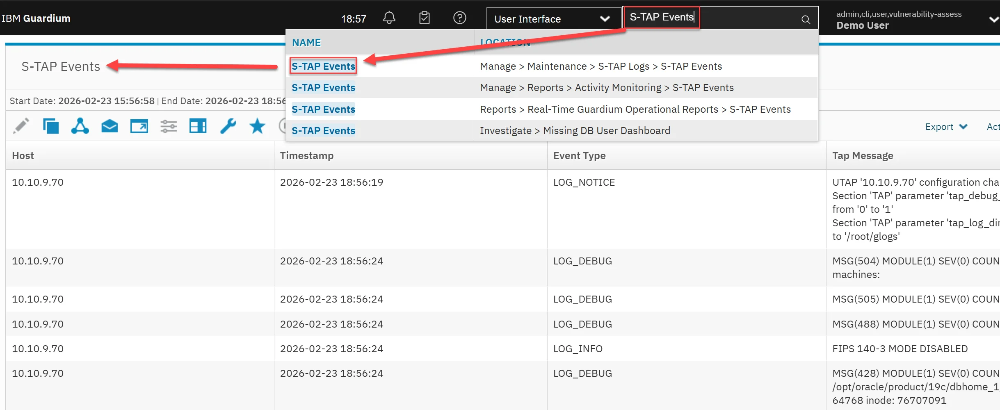{ width="99%" }](../images/atap31.webp)
 
1.	Change debug logging level on **raptor** using `guard-config-update` back to value **0**.
```bash
/opt/guardium/modules/STAP/current/guard-config-update --modify-tap tap_debug_output_level 0
```

1.	We can create *STAP diagnostics* from **coll1** UI. In the **S-TAP Control** view press { width="14" } icon and select **Send** commands option. Then – in the pop-up - select **Run diagnostics** command and set *Debugging Level* to **4** and **Apply** request.
[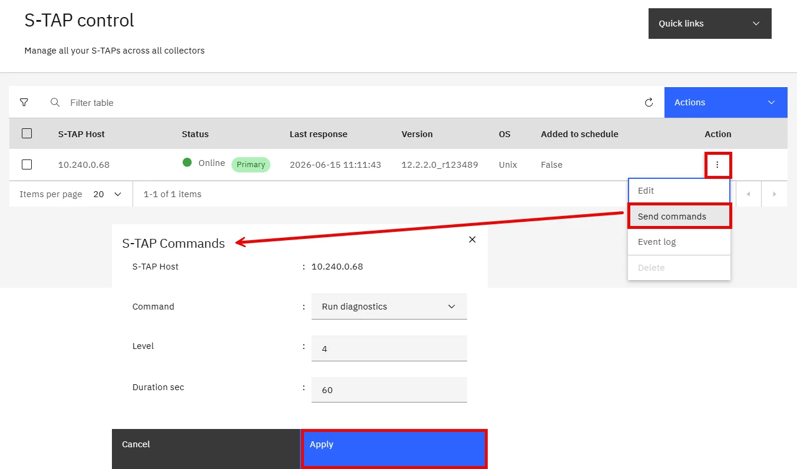{ width="99%" }](../images/atap32.webp) 

1.	After 2-3 minutes go to **Support information gathering** view and download requested *diag* file.
[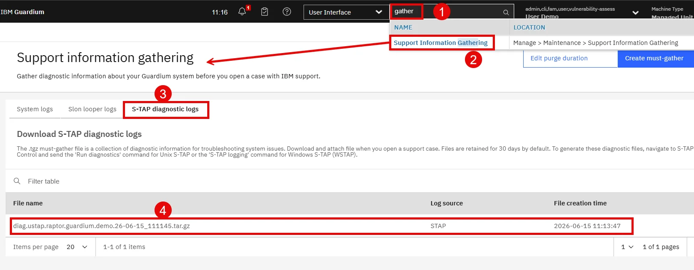{ width="99%" }](../images/atap33.webp)

1.	Try to uninstall *GIM client* on **raptor** using `uninstall.pl` and notice that *GIM client* is aware that *ATAP* is actived and will ignore request.
```bash
/opt/guardium/modules/GIM/current/uninstall.pl
```
[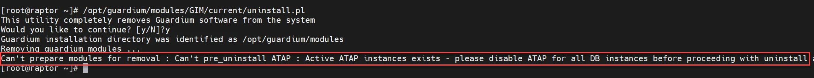{ width="99%" }](../images/atap34.webp)

##  Simple Inspection Engine Verification (optional)	

1.	From **cli** on **coll1** set the *inspection engine verification timeout* to **10** seconds.
```bash
store stap network_latency 10
```

1.	In the **coll1** UI, locate and open the **S-TAP Status Monitor** view. This view displays the list of *S-TAP agents* connected to the **coll1**. In our case, it shows the agent installed on the **raptor** machine. Click the row containing the agent information.
[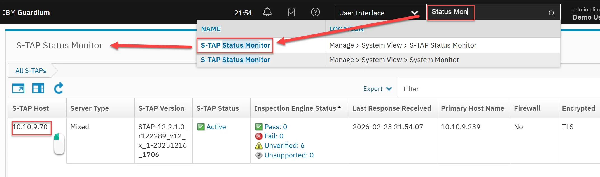{ width="99%" }](../images/atap35.webp)
 
1.	A list of *Inspection Engines* should appear. Select the one that corresponds to the *pgsql* on port **5432** (*postgres*) database. This will activate the list of available actions. Choose **Verify**. After a moment, you should receive a message indicating that the verification completed successfully. If the result is different, try running the verification again. 
[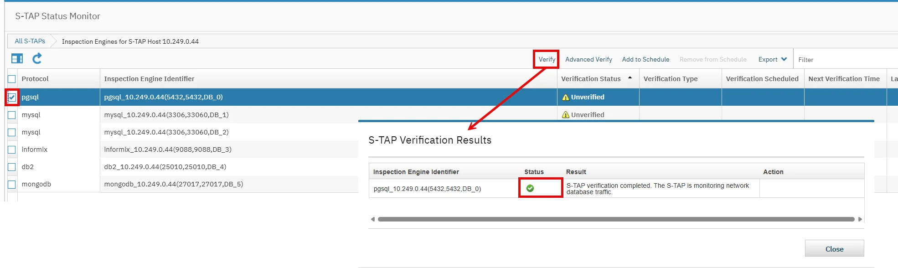{ width="99%" }](../images/atap36.webp)

1.	Let’s now stop the *postgres* instance on **raptor**.
```bash
systemctl stop postgresql
```

1.	Try running the verification again.
[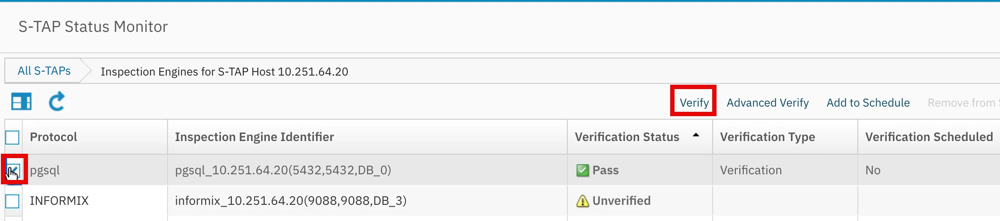{ width="99%" }](../images/atap37.webp)
 
1.	This time, the verification failed, and you can analyze the cause by using the **Run Diagnostics** option.
[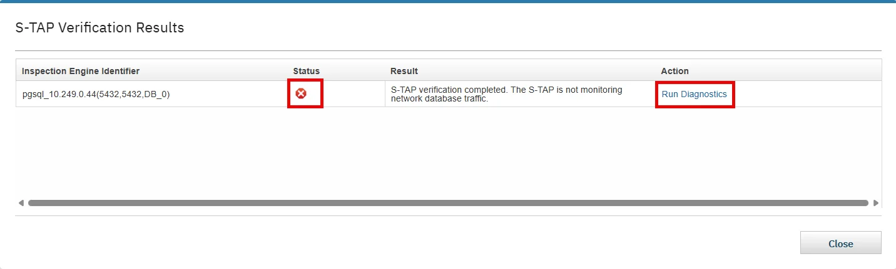{ width="99%" }](../images/atap38.webp)
 
1.	After a moment, information about the possible causes of the failure will be displayed. As you can see, the *STAP* agent is running and the **coll1** can communicate with it, but the issue is related to the lack of connection to the database. This is expected, since we previously stopped the database instance.
[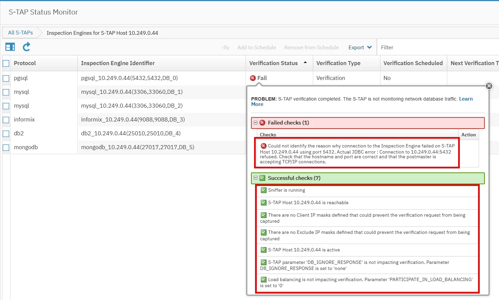{ width="99%" }](../images/atap39.webp)

1.	Start *postgres* again on **raptor**.
```bash
systemctl start postgresql
```

1.	Run verification again and confirm that it works. Sometimes manually executed process of verification can fail without visible reasons. Try running diagnostics and probably will finish successfully. It should not happen if you schedule verification process.


1.	Check **Failed Login Attempts** view to realize that simple verification process uses the **RESULTFD** fake account to generate exception error.
[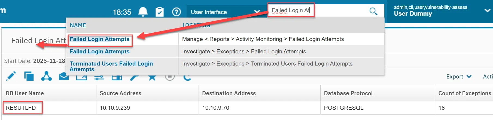{ width="99%" }](../images/atap40.webp)
 
1.	To configure the advances verification select *pgsql* instance again in **S-TAP Status Monitor** and press **Advanced Verify**. In pop-up window use plus icon to add data source definition.
[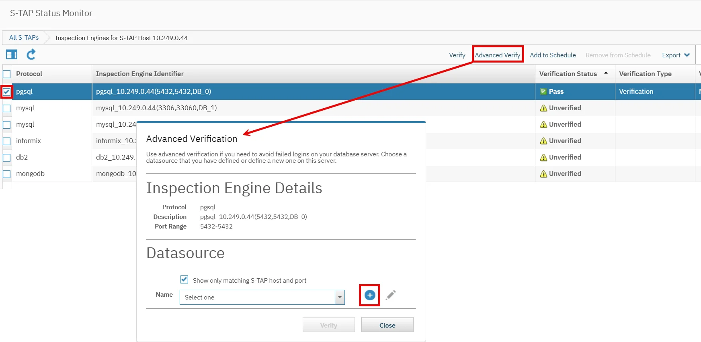{ width="99%" }](../images/atap41.webp)
 
1.	Configure access to *postgres* database.

    !!! note "Form values:"
       - *Name*: postgres verification (raptor)
       - *Database type*: PostgreSQL
       - *User name*: tom
       - *Password*: &lt;default password>
       - *Host name/IP*: raptor.demo.guardium
       - *Port number*: 5432
       - *Database*: postgres
    
    Then use **Save**, **Test connection** and **Close** buttons to store new definition and do the verification.
    
    [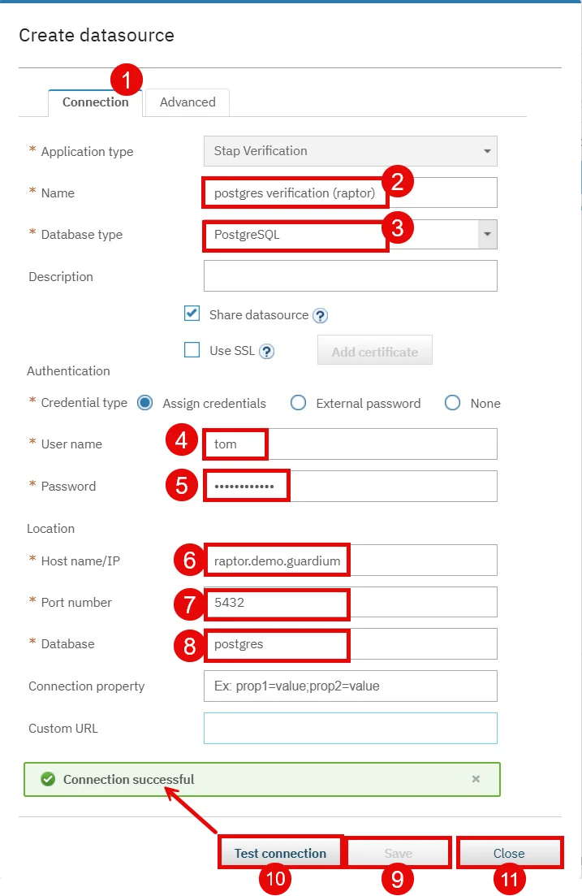{ width="79%" }](../images/atap42.webp)

1.	You should return to the **Advanced Verification** window with the name of the newly created data source already populated. Click **Verify** and wait for confirmation that traffic is visible on the monitored system.
[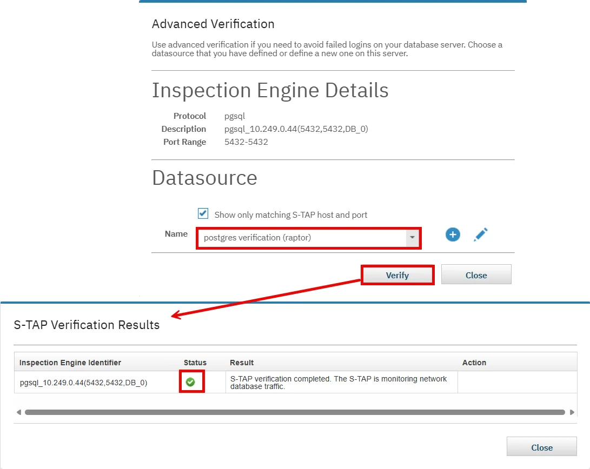{ width="99%" }](../images/atap43.webp)
 
1.	Finally, verify that this time the instance validation generated an *SQL error* by executing a query against a non-existent table. Check the *Full SQL (Training)* and *SQL Errors* reports on the dashboard.
[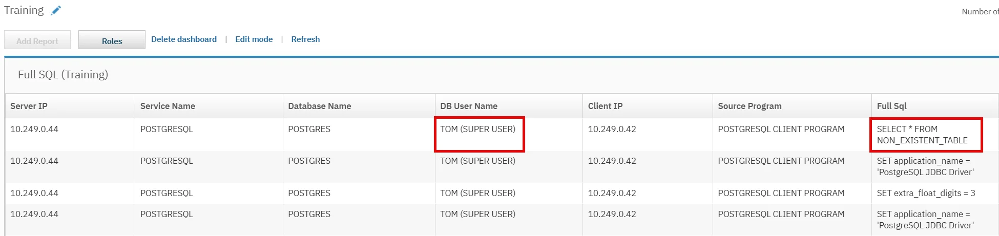{ width="99%" }](../images/atap44.webp)
[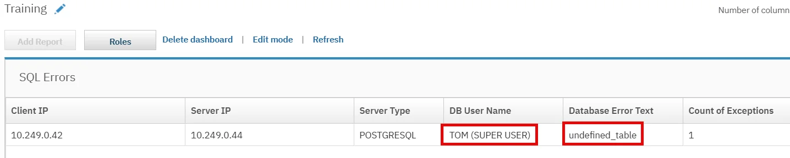{ width="99%" }](../images/atap45.webp) 
 
##  ATAP for Mongo (optional)	

1.	On the **raptor** machine, a *MongoDB* database is running and listening on port **27017**.
```bash
lsof -i -P -n | grep 27017
```

1.	Let’s manage some configuration tasks from cli instead of UI. In the **coll1 cli** session list the inspection engines on **raptor**.
```bash
grdapi list_inspection_engines stapHost=raptor.demo.guardium
```
[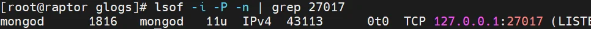{ width="99%" }](../images/atap46.webp) 

1.	Notice that the current inpection engine definitions for *MySQL* uses the port range **3306–33060**, which unintentionally includes the port designated for the mongo instance (**27017**). To avoid this conflict, the *MySQL* inspection engine definitions should be adjusted to target only the specific ports required, instead of relying on a range. 
[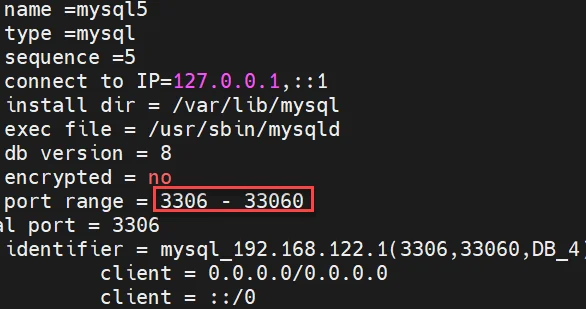{ width="59%" }](../images/atap47.webp)

1. So, execute from **coll1 cli**:
```bash linenums="1"
grdapi delete_stap_inspection_engine type=mysql stapHost=raptor.demo.guardium

grdapi create_stap_inspection_engine dbUser=mysqld dbVersion=8 client=0.0.0.0/0.0.0.0 ktapDbPort=3306 portMin=3306 portMax=3306 protocol=mysql procName=/usr/sbin/mysqld dbInstallDir=/var/lib/mysql unixSocketMarker=mysql.sock stapHost=raptor.demo.guardium

grdapi create_stap_inspection_engine dbUser=mysqld dbVersion=8 client=0.0.0.0/0.0.0.0 ktapDbPort=33060 portMin=33060 portMax=33060 protocol=mysql procName=/usr/sbin/mysqld dbInstallDir=/var/lib/mysql unixSocketMarker=mysql.sock stapHost=raptor.demo.guardium

grdapi create_stap_inspection_engine dbUser=mysqld dbVersion=8 client=0.0.0.0/0.0.0.0 ktapDbPort=3306 portMin=3306 portMax=3306 protocol=mysql procName=/usr/sbin/mysqld dbInstallDir=/var/lib/mysql unixSocketMarker=mysqlx.sock stapHost=raptor.demo.guardium

grdapi create_stap_inspection_engine dbUser=mysqld dbVersion=8 client=0.0.0.0/0.0.0.0 ktapDbPort=33060 portMin=33060 portMax=33060 protocol=mysql procName=/usr/sbin/mysqld dbInstallDir=/var/lib/mysql unixSocketMarker=mysqlx.sock stapHost=raptor.demo.guardium

grdapi list_inspection_engines stapHost=raptor.demo.guardium
```
[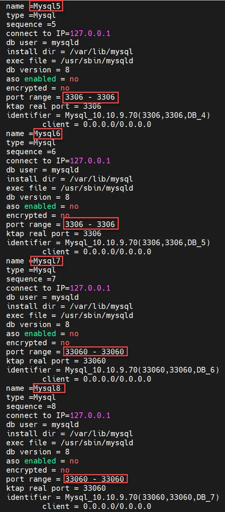{ width="59%" }](../images/atap48.webp)<BR>
We have recreated the *mysql’s* inspection engines to point one port per instance.

1.	Generate *mongo* traffic on **raptor** and check *Full SQL (Training)* report on **coll1**. Activity should be audited correctly.
```sql linenums="1"
mongosh $MONGO_URI

show dbs

use sample_mflix

show tables

db.movies.find()

exit
``` 
[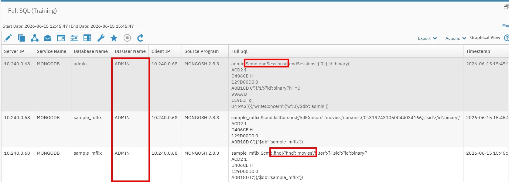{ width="99%" }](../images/atap49.webp)

1.	The *MongoDB* instance is configured to use encrypted connections. Connect using this method, execute a few queries, and then verify that the activity is not captured for this session.
```sql linenums="1"
mongosh --tls --tlsAllowInvalidCertificates $MONGO_URI

show dbs

use sample_mflix

show tables

db.theaters.find()

exit
```

1.	Configure *ATAP* for *mongo*.
```bash linenums="1"
/opt/guardium/modules/ATAP/current/files/bin/guardctl authorize-user mongod

/opt/guardium/modules/ATAP/current/files/bin/guardctl --db-type=mongodb --db-instance=mongo4 --db-user=mongod --db-home=/usr --db-base=/var/lib/mongo store-conf

systemctl stop mongod

/opt/guardium/modules/ATAP/current/files/bin/guardctl --db-instance=mongo4 activate

systemctl start mongod
```

1.	Generate traffic again in the encrypted connection and confirm that *mongo* traffic is audited correctly.
```sql linenums="1"
mongosh --tls --tlsAllowInvalidCertificates $MONGO_URI

show dbs

use sample_mflix

show tables

db.theaters.find()

exit
``` 
[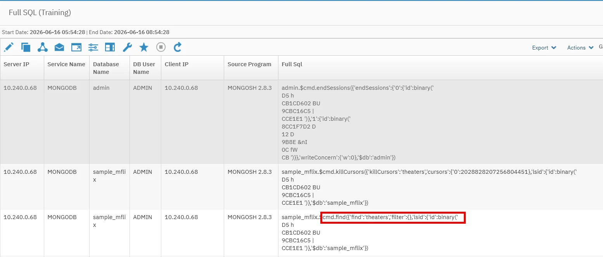{ width="99%" }](../images/atap50.webp)

1.	To avoid the deleted *inspection engine* recreation by *STAP* let us disable this functionality on **raptor**. From **cm** UI in **Setup by client** select installed agent (**12.2.2.0_r123489_3**) and set these parameters:

    !!! note "STAP parameters:"
        - *STAP_DISCOVERY_ENABLED*: **0**
        - *STAP_DISCOVERY_DBS*: **oracle:db2:informix:postgres:sybase:teradata:netezza:memsql:mariadb:verticadb:mongodb**

    [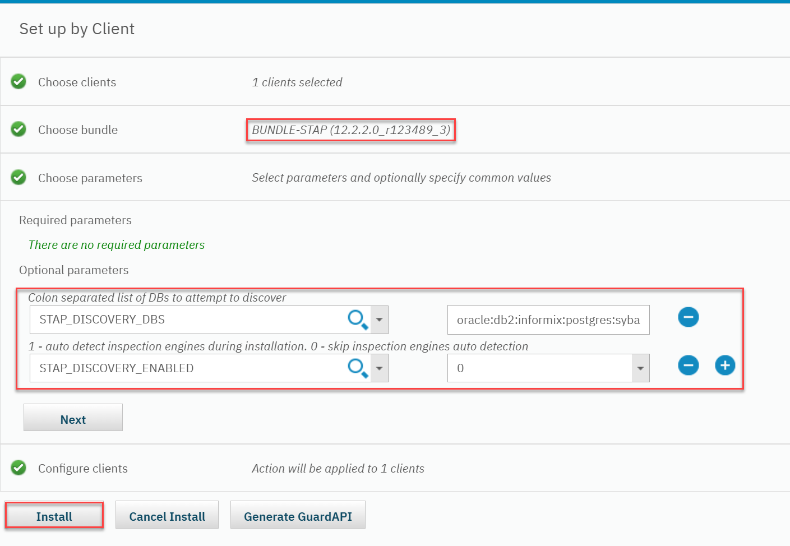{ width="99%" }](../images/atap51.webp)

## Appendix

!!! note "Dependencies:"
    It is crucial to finish all non-optional parts to be able continue.

!!! note "Resources:"
    1. ATAP documentation    
    <https://www.ibm.com/docs/en/gdp/12.x?topic=management-linux-unix-database-specific-guardctl-parameters>

!!! note "Instructor notes:"

