# External S-TAP configuration

## MYSQL Traffic visibility

1.	One of the databases working on **raptor** machine is *MySQL*. Let’s check connectivity and confirm *MySQL* session audibility. Login to the **raptor** and execute command:
```bash
mysql
```
1.	Inside *MySQL* session execute (first command reveal information that session is not encrypted):
```sql linenums="1"
SHOW SESSION STATUS LIKE 'Ssl_cipher';

SELECT 'PLAINTEXT SESSION';

exit;
```
[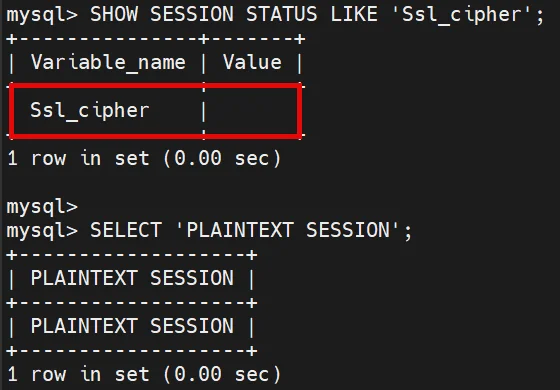{ width="59%" }](../images/etap2.webp) 

1.	Login again  but this time refer to IP address of **raptor** machine.
```bash
mysql -h raptor.demo.guardium
```

1.	Execute these commands in the session (notice, that session is encrypted):
```sql linenums="1"
SHOW SESSION STATUS LIKE 'Ssl_cipher';

SELECT 'ENCRYPTED SESSION SESSION';

exit;
``` 
[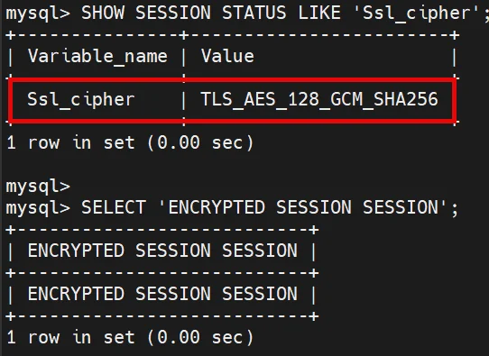{ width="59%" }](../images/etap3.webp)

1.	Go to *Full SQL (Training)* report in **coll1** dashboard and notice that only SQL’s related to plaintext session have been audited.
[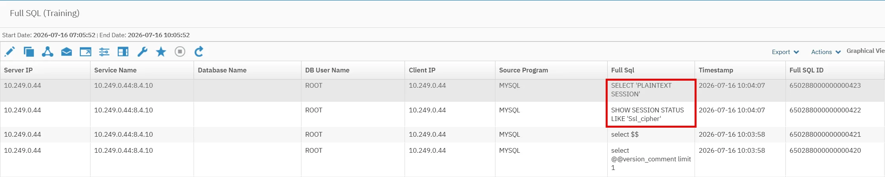{ width="99%" }](../images/etap4.webp)
 
1.	There is no *ATAP* or *EXIT* for *MySQL*. In case of encrypted traffic for *MySQL* we need to use different method of monitoring which is not based on *STAP*.


## Docker preparation

1.	Install `podman-docker` and `skopeo` packages.
```bash
dnf -y install podman-docker skopeo
```

1.	To check the latest available tag of *External S-TAP* image execute:
```bash
skopeo list-tags docker://icr.io/guardium/guardium_external_s-tap
```
[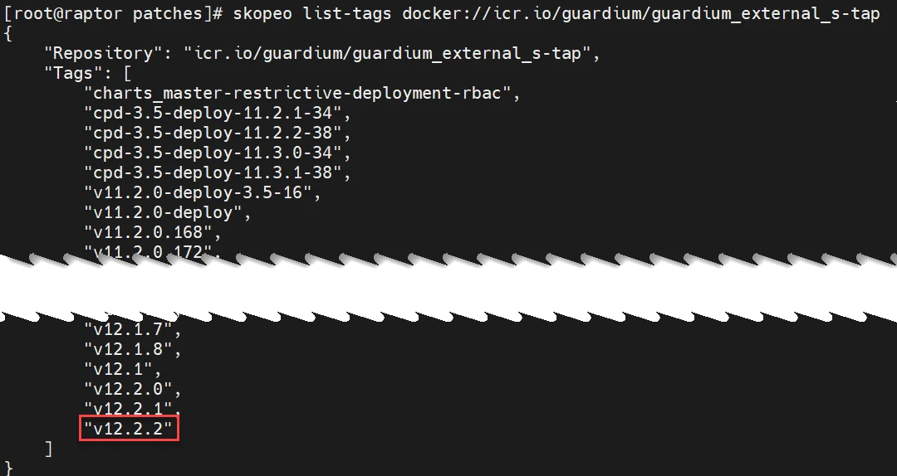{ width="99%" }](../images/etap5.webp)
 
1.	Pull *External S-TAP* image with the **latest** tag for Guardium 12.2 (screenshots presents example, use the latest image version).
```bash
docker pull icr.io/guardium/guardium_external_s-tap:v<latest_12.2>
```
[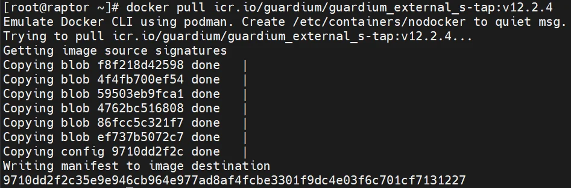{ width="99%" }](../images/etap6.webp)

1.	List local images and write in notebook **container name** and **tag**
```bash
podman images
```
[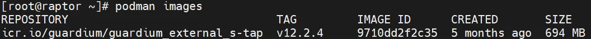{ width="99%" }](../images/etap7.webp)

## SSL certificate setup	

1.	On **raptor** create directory for CA, which we will deploy to serve *External S-TAP (ETAP)* demands.
```bash
mkdir -p /opt/ETAP/ca
```

1.	Login to **coll1** **cli** and request certificate for *ETAP* instance (*CSR request*) using command:
    ```bash
    create csr external_stap
    ```

    !!! note "Insert certificate request parameters:"
        - *unique alias*: raptor-mysql-etap
        - *etap certificate common name*: mysqlcoll1.demo.guardium
        - *organization unit name*: Demo
        - *add additional OU*: n
        - *organization name*: Guardium
        - *city*: &lt;your city name>
        - *province*: &lt;your province name>
        - *country code*: &lt;your 2-digits country code>
        - *email of collector certificate owner, can be fake*: &lt;email_address>
        - *accept default algorithm*: ++enter++
        - *accept default key length*: ++enter++
        - *insert FQDN of your collector for SAN #1*: coll1.demo.guardium
        - *press ++enter++ for SAN #2*: ++enter++
 
    [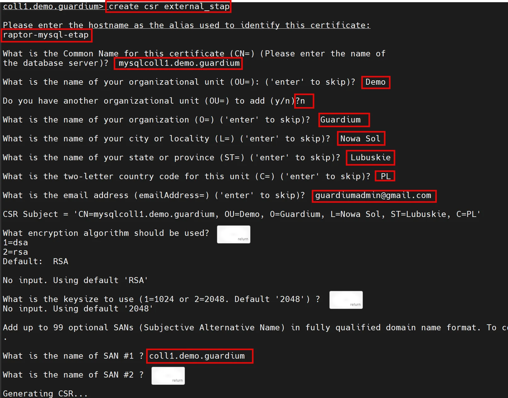{ width="99%" }](../images/etap8.webp)

    Then certificate request will be created and displayed
    
    [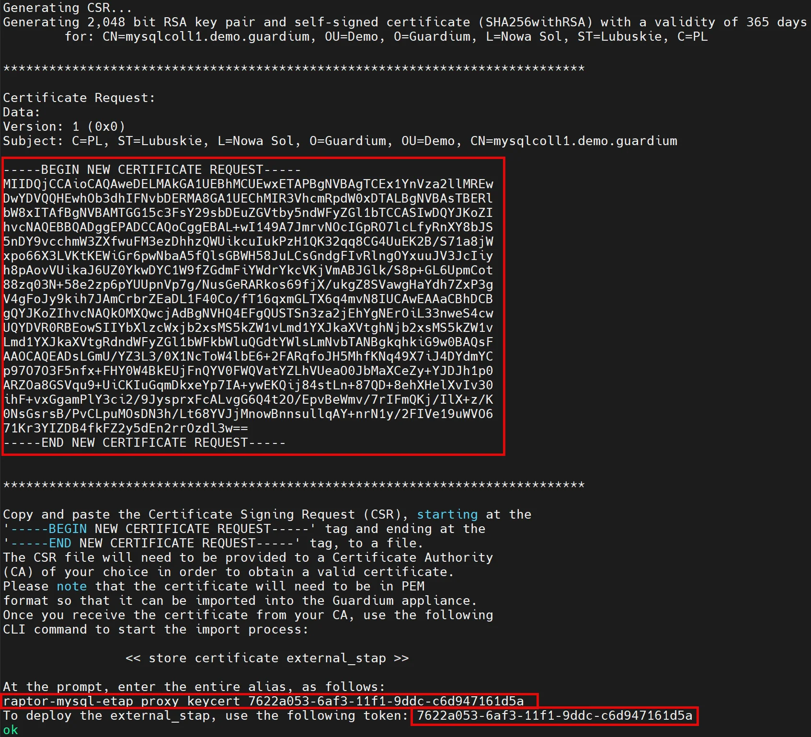{ width="99%" }](../images/etap9.webp)

1.	Then copy displayed *Certificate Request* to file on raptor - `/opt/ETAP/ca/etap.csr` 
    [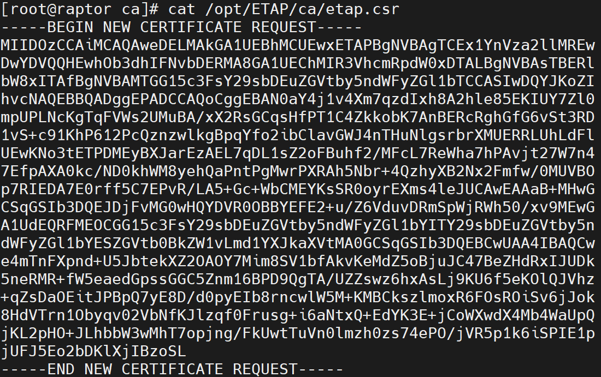{ width="79%" }](../images/etap10.webp)
    <BR>and write down in notepad entire alias and related to it token (two bottom lines)
    [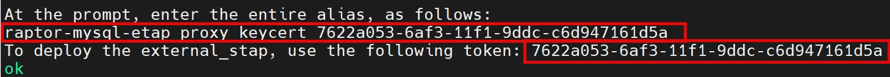{ width="99%" }](../images/etap11.webp)

1.	Now we will create new *certification authority (CA)* on **raptor**. Go to directory `/opt/ETAP/ca` (where you saved `etap.csr` file) and create *RSA key*.
```bash linenums="1"
cd /opt/ETAP/ca

openssl genrsa -out ca.key 2048
```
[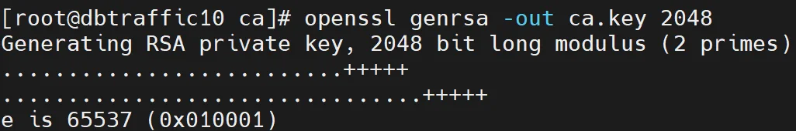{ width="79%" }](../images/etap12.webp)

1.	Create *CA certificate*, insert required certificate parameters

    ```bash
    openssl req -x509 -sha256 -new -key ca.key -days 3650 -out ca.pem
    ```
    !!! note "Insert these values:"
        - *Country Name*: &lt;your 2-digits country code>
        - *Province*: &lt;your province name>
        - *City*: &lt;your city name>
        - *Organization*: Guardium
        - *Organization Unit*: Demo
        - *Common name*: etap_ca
        - *e-mail of CA owner, can be fake one*: &lt;email_address>

    [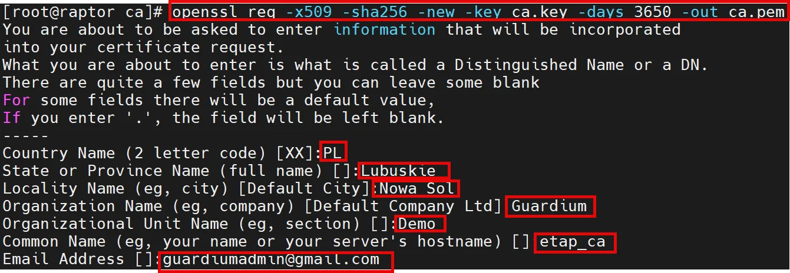{ width="99%" }](../images/etap13.webp)
    
    In the current directory `ca.pem` certificate file will appear.

1.	Sign *certificate request* from **coll1** using just created *CA certificate*.
```bash
openssl x509 -sha256 -req -days 3650 -CA ca.pem -CAkey ca.key -CAcreateserial -CAserial serial -in etap.csr -out etap.pem
``` 
[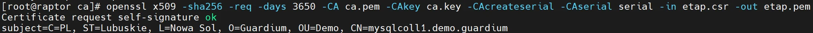{ width="99%" }](../images/etap14.webp)
In the current directory certificate based on *CSR* generated on **coll1** will appear in `etap.pem` file.

1.	Install *CA certificate* on **coll1**. Provide unique name for *CA* (for example: **etap_ca**) and then insert content of `ca.pem` file from `/opt/ETAP/ca` directory. Open two SSH sessions to **raptor**, one to get access to certificates and second where you are logged to **coll1**, it will simplify certificate injection.
```bash
store certificate keystore_external_stap
```
[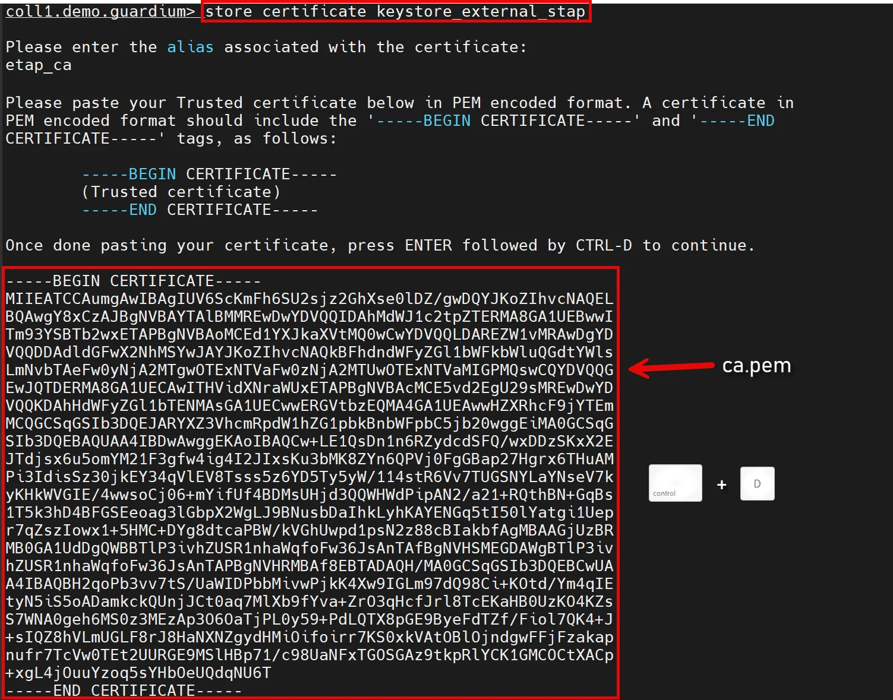{ width="99%" }](../images/etap15.webp) 
Then insert ++ctrl+d++ keystroke.

1.	You should receive confirmation that *CA cert* has been imported.
[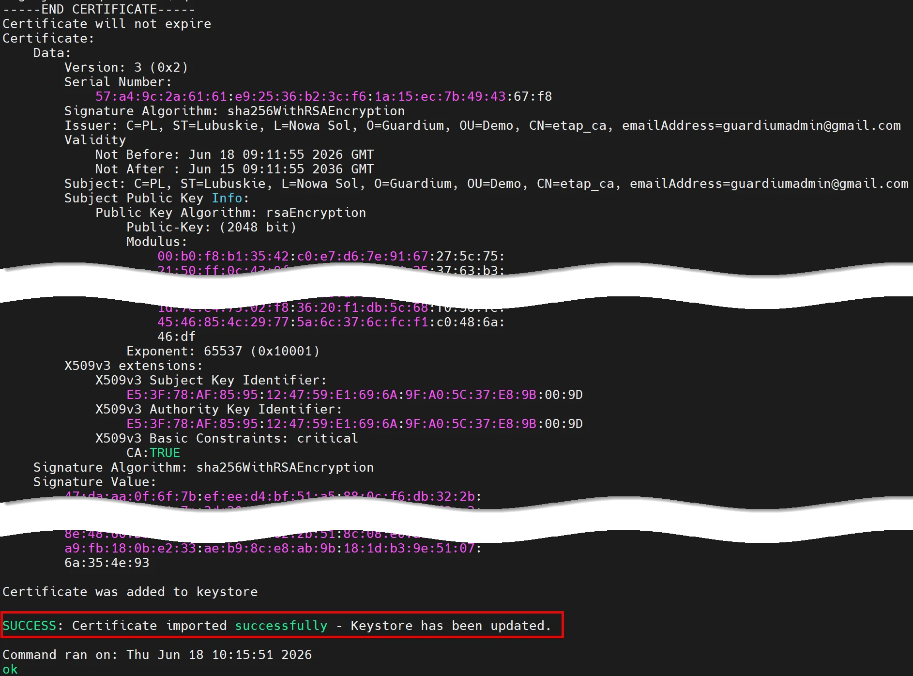{ width="99%" }](../images/etap16.webp) 
 
1.	Now we will import to the **coll1** the *External S-TAP certificate* - `etap.pem` file stored in `/opt/ETAP/ca`. You must provide as an alias the one generated during CSR request in point **3**.
```bash
store certificate external_stap
```
[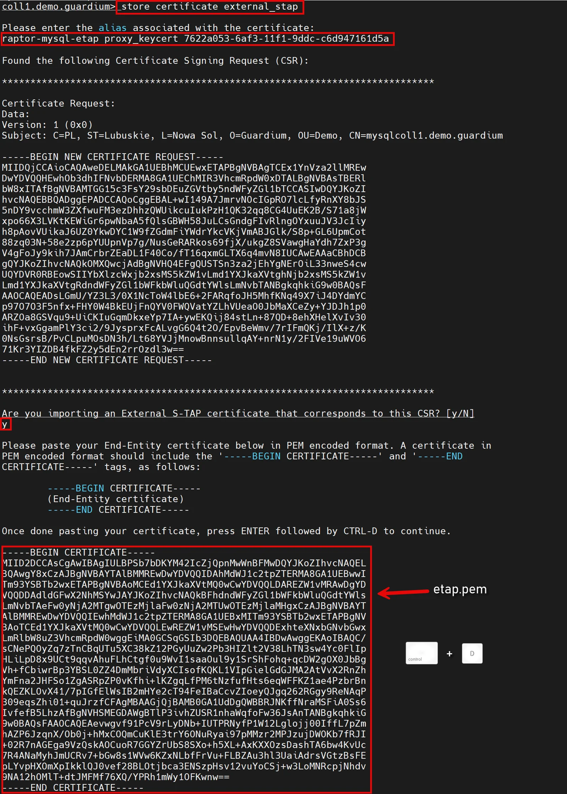{ width="99%" }](../images/etap17.webp)  

1.	Confirm that import finished with success.
[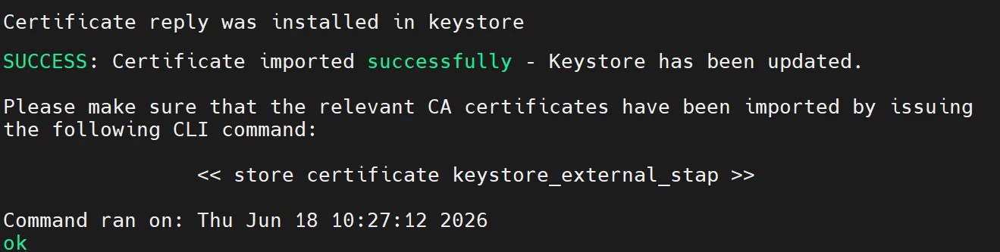{ width="99%" }](../images/etap18.webp) 
 
1.	Execute command below to list *ETAP* certs stored on **coll1**. Confirm installation of *CA and ETAP cert*.
```bash
show certificate external_stap
```
[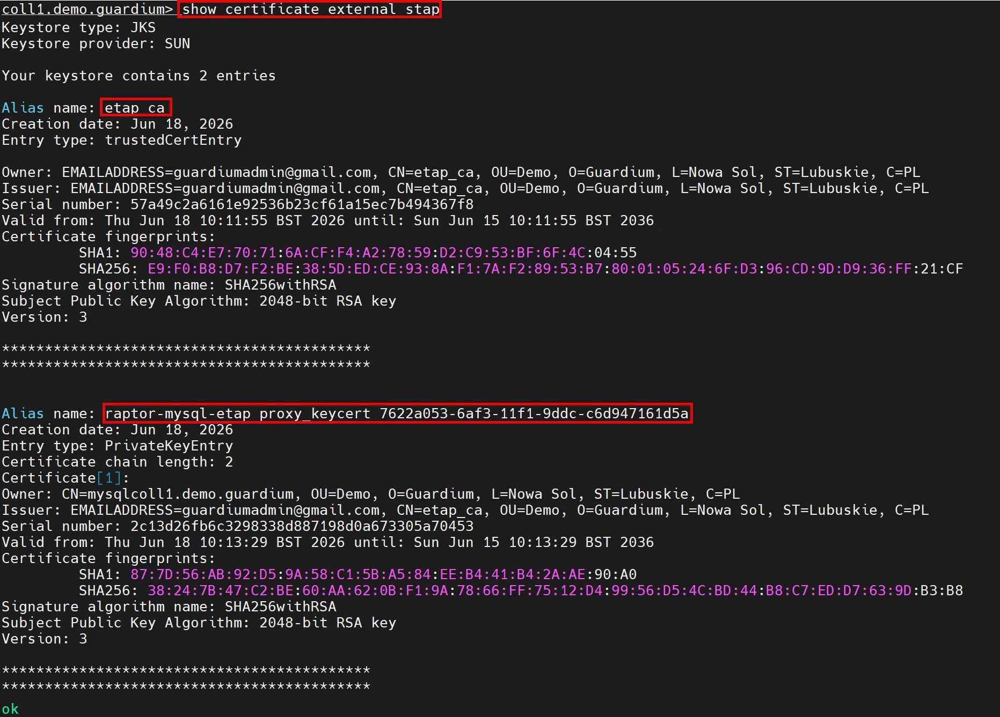{ width="99%" }](../images/etap19.webp)

## Deploy ETAP

1.	On **raptor** go to *ETAP* lab directory and clone *External S-TAP* gitgub project.
```bash linenums="1"
cd /opt/ETAP

git clone https://github.com/IBM/Guardium_External_S-TAP.git
```
[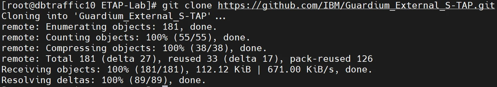{ width="99%" }](../images/etap20.webp)

1.	The script used to create the container unfortunately does not support usage of SSH on port other than 22, so temporarily add this port to the sshd service on raptor. Edit `/etc/ssh/ssh_config.d/99-cluster-hosts.conf` and add an additional entry **Port 22** below the existing **Port 2223** for line describing the *Host* with **raptor** IP address. And below add one more section which will describe the **localhost** as well.<BR>
```txt
Host <your_raptor_ip>
    Port 2223
    Port 22
    StrictHostKeyChecking no
    UserKnownHostsFile /dev/null
    ForwardAgent yes

Host localhost
    Port 2223
    Port 22
    StrictHostKeyChecking no
    UserKnownHostsFile /dev/null
    ForwardAgent yes
```
[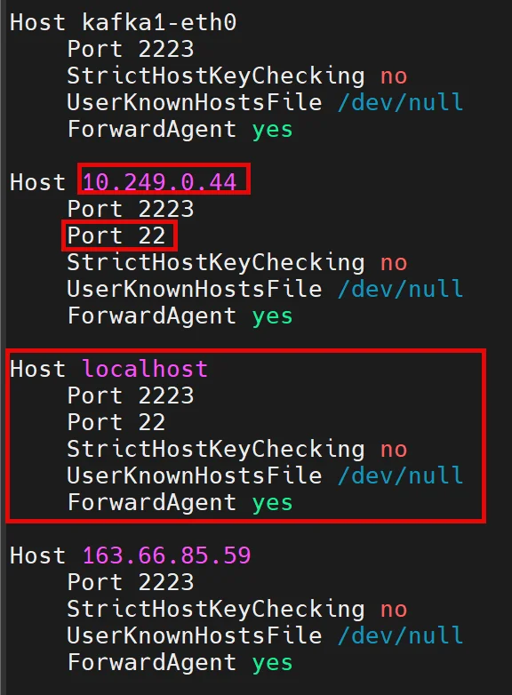{ width="39%" }](../images/etap21.webp)
 
1.	Restart **sshd** service.
```bash
systemctl restart sshd
```

1.	Set some variables to deploy *ETAP* silenty and minimize mistakes in the container setup.
```bash linenums="1"
STATE_FILE=mysql_etap_state

DB_HOST=<raptor_ip>

COLLECTOR=<coll1_ip>

IMAGE='icr.io/guardium/guardium_external_s-tap:v<latest_12.2>'

TOKEN=<token displayed in point 3 of SSL certificate setup section>

DB_PORT=3306

DB_TYPE=mysql

PROXY_WORKERS=1

PROXY_PROTOCOL=0

PORT_RANGE='63333-63333'

TENANT=MYSQLETAP

LBMODE=0
```
[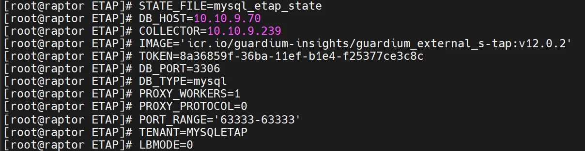{ width="99%" }](../images/etap22.webp)

1.	Go to `Guardium_External_S-TAP` directory and start *ETAP* deployment script. The command will generate a long output, but the key point is to confirm at the end that the new container has started successfully.
```bash linenums="1"
cd /opt/ETAP/Guardium_External_S-TAP

./container_mgmt.sh --state-file $STATE_FILE --db-host $DB_HOST --proxy-num-workers $PROXY_WORKERS --proxy-protocol $PROXY_PROTOCOL --db-port $DB_PORT --proxy-secret $TOKEN --db-type $DB_TYPE --sqlguard-ip $COLLECTOR --participate-in-load-balancing $LBMODE --tenant-id $TENANT --svc-image $IMAGE --svc-port-range $PORT_RANGE --ni --c
```
[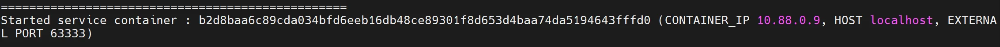{ width="99%" }](../images/etap23.webp) 

1.	Check container instance status
```bash
podman ps
```
[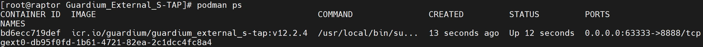{ width="99%" }](../images/etap24.webp)  

1.	Login to **coll1** UI and open **External S-TAP Instances** view and confirm that just deployed instance is correctly registered on **coll1**.
[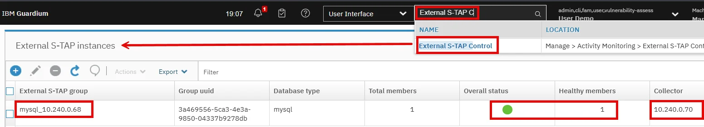{ width="99%" }](../images/etap25.webp)  

## Check traffic visibility

1.	Login to MySQL using External S-TAP proxy port and execute some SQL’s
```bash
mysql -P 63333 -h raptor.demo.guardium
```

1.	Execute some SQL’s
```sql linenums="1"
SHOW SESSION STATUS LIKE 'Ssl_cipher';

SELECT 'ENCRYPTED SESSION ON ETAP PORT 63333';

exit
```
[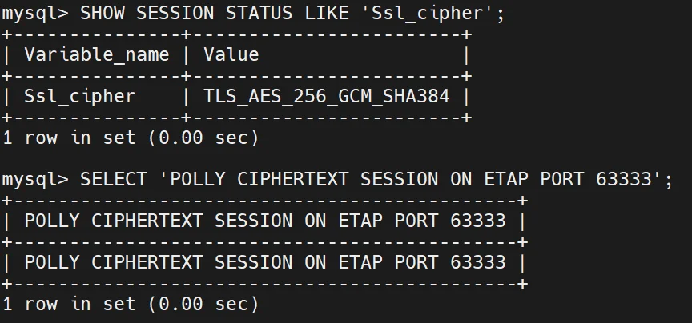{ width="69%" }](../images/etap26.webp) 

1.	Check activity in *Full SQL (Training)* report on **coll1**. 
[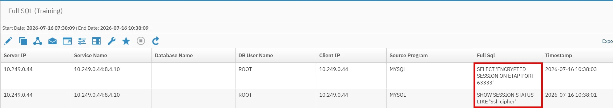{ width="99%" }](../images/etap27.webp) 

## Automatic start of ETAP instance (optional)

1.	We used the script to create the *ETAP* container, but it will not start automatically the ETAP after a system reboot. Use the *quadlet* mechanism available in **podman** to ensure the *ETAP* container is persistently available and easily manageable using standard **Linux** system services.
<BR>Before starting *ETAP* using system services, remove the currently running instance. Display the container details and record its *ID*.
```bash
podman ps
```
[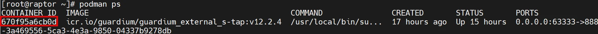{ width="99%" }](../images/etap28.webp) 

1.	Stop the container and remove it.
```bash linenums="1"
podman stop <container_id>

podman rm <container_id>
```

1.	Copy the service template from the helper directory to the Podman services directory.
```bash
cp /opt/guardium_tz_bootcamp_automation/upload/source_files/mysql/mysql_external_stap.container /etc/containers/systemd/mysql_etap.container
```

1.	Edit just copied file - `/etc/containers/systemd/mysql_etap.container` and set some values.

    !!! note "Values to modify:"
        &lt;latest_etap_release>: defined in Docker preparation point 2<BR>
        &lt;proxy_secret>: token displayed in point 3 od SSL certificate setup<BR>
        &lt;coll1_IP_address>: **coll1** IP address<BR>
        &lt;raptor_IP_address>: **raptor** IP address

    [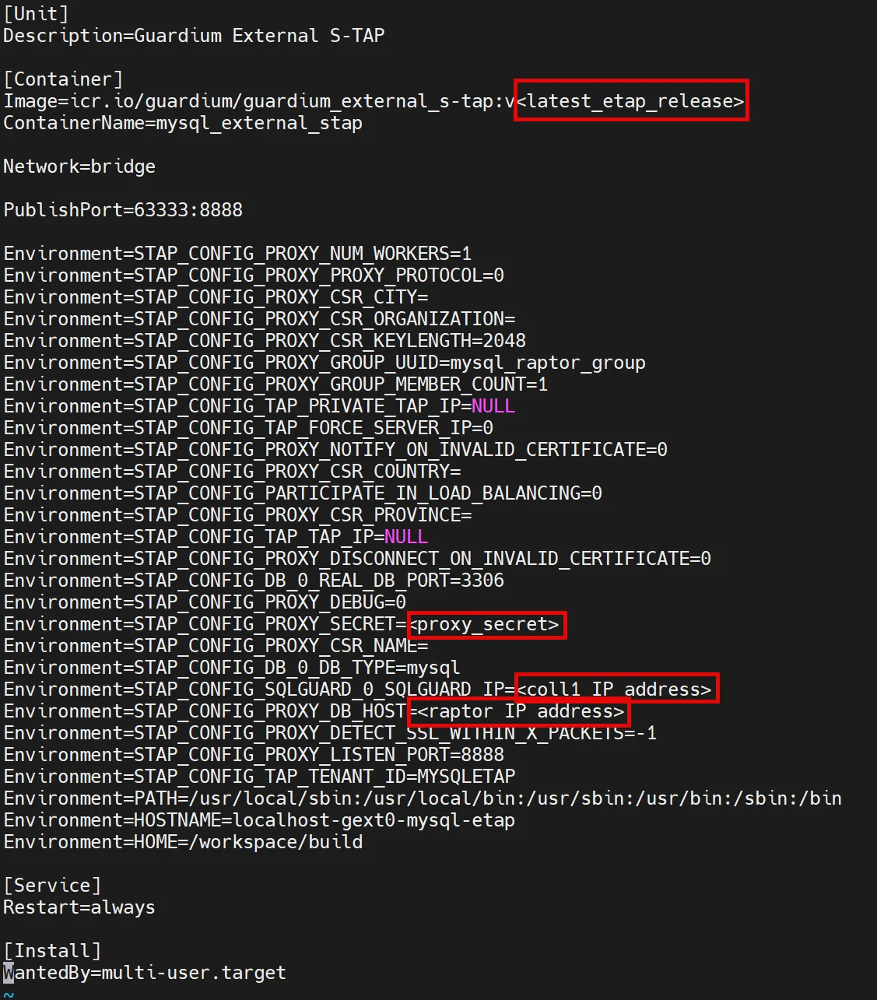{ width="89%" }](../images/etap29.webp) 
 
1.	Reload the network services configuration.
```bash
systemctl daemon-reload
```

1.	Start *ETAP* service.
```bash
systemctl start mysql_etap
```

1.	Check whether the container is running.
```bash
podman ps
```
[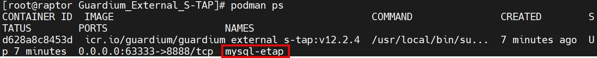{ width="99%" }](../images/etap30.webp) 

1.	Finally, connect to the database through ETAP and verify that the activity is being monitored.
```bash
mysql -P 63333 -h raptor.demo.guardium
```

1.	Execute some SQL’s
```sql linenums="1"
SHOW SESSION STATUS LIKE 'Ssl_cipher';

SELECT 'ENCRYPTED SESSION ON ETAP PORT 63333 – QUADLET SERVICE';

exit
``` 
[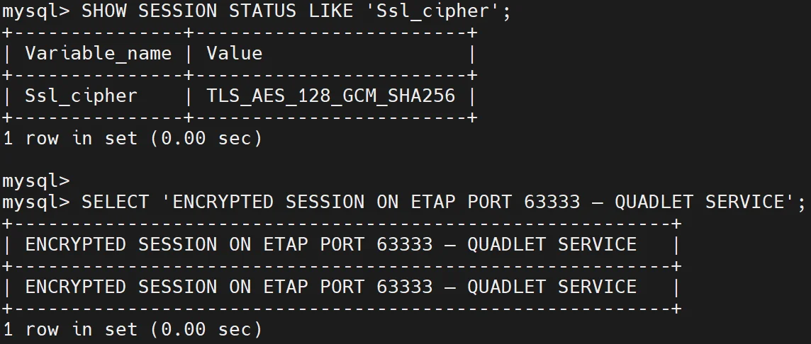{ width="79%" }](../images/etap31.webp)  
[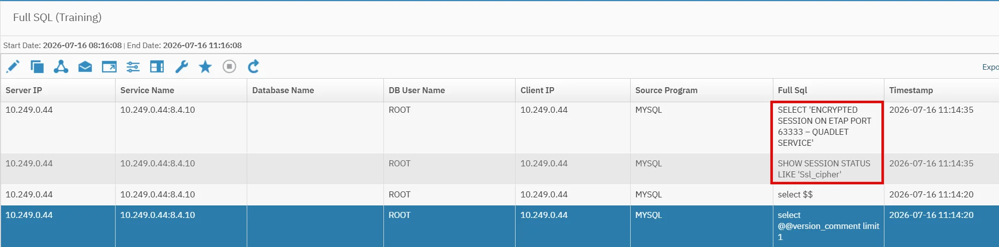{ width="99%" }](../images/etap32.webp)  

## Appendix

!!! note "Dependencies:"
    This lab is required for the Oracle lab and should be completed.

!!! note "Resources:"
    
!!! note "Instructor notes:"


