# EXIT configuration

## DB2 traffic visibility with KTAP

1.	One of databases deployed on **raptor** is *DB2*. It is not configured to support encrypted connections. However for some databases the *KTAP* is not enough to sniff non-TCP/IP stack based connections. Let’s check this kind of case. Change context to **db2inst1** user on **raptor**.
```bash
su - db2inst1
```

1.	List configured connections types can be displayed using command
```sql
db2 list database directory
``` 
[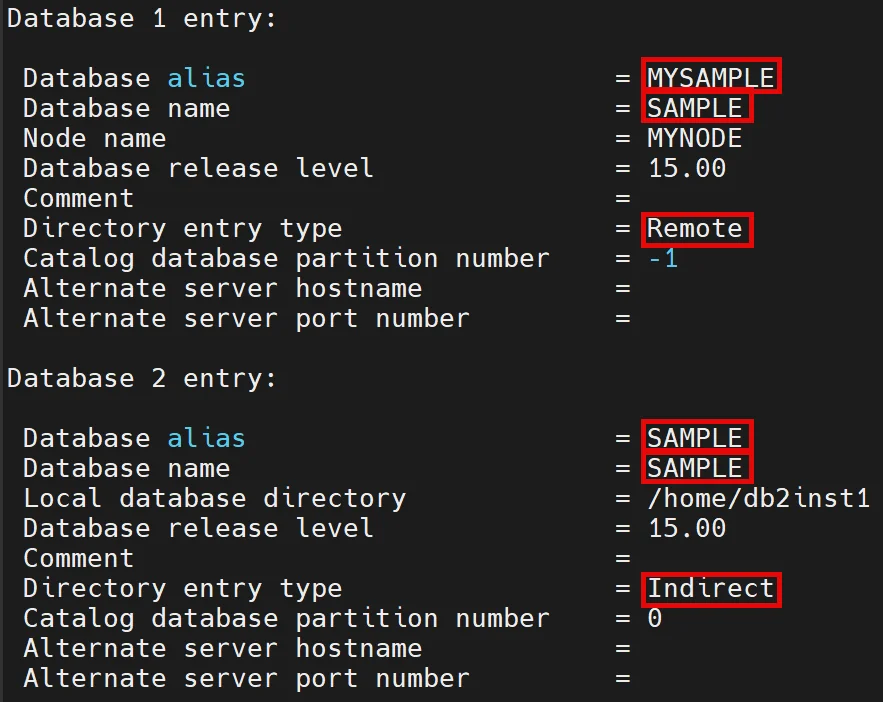{ width="69%" }](../images/exit1.webp)
<BR>Notice that database SAMPLE can be referred (connected) using Remote (TCP/IP, mysample) or Indirect (Shared Memory, sample) alias.

1.	Let’s connect to *sample* database as a **db2inst1** user usinng *TCP* connection (*sampledb* alias)
```sql linenums="1"
db2 connect to mysample user db2inst1 

db2 "SELECT 'TCP/IP connection test' FROM sysibm.sysdummy1"
```

1.	Then, connect to **sample** using *Shared Memory* connection (*sample* alias)
```sql linenums="1"
db2 connect to sample user db2inst1 

db2 "SELECT 'Shared Memory connection test' FROM sysibm.sysdummy1"

exit
```

1.	Check traffic visibility in *Full SQL (Training)* report on **coll1**. Notice that activity from shared memory connection is not audited.
[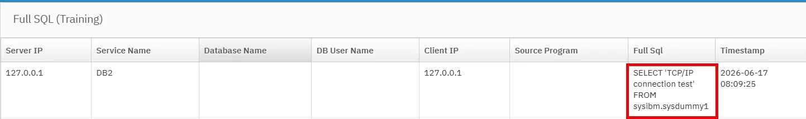{ width="99%" }](../images/exit2.webp) 

## Configure DB2 system with EXIT

1.	As a **root** user on **raptor** authorize **db2inst1** user to send events to *STAP*.
```bash
/opt/guardium/modules/ATAP/current/files/bin/guardctl authorize-user db2inst1
```

1.	As a **db2inst1** user on **raptor** stop *DB2* instance.
```bash linenums="1"
su - db2inst1

db2stop
```

1.	If command will not work you can force it using this one.
```bash
db2stop force
```

1.	Create directory for *EXIT* plugin in *DB2* home directory.
```bash
mkdir -p /home/db2inst1/sqllib/security64/plugin/commexit
```

1.	Link *EXIT* plugin to *DB2* directory.
```bash
ln -fs /usr/lib64/libguard_db2_exit_64.so /home/db2inst1/sqllib/security64/plugin/commexit/libguard_db2_exit_64.so
```

1.	Update *DB2* configuration to load **Guardium** *EXIT* library during engine start.
```bash
db2 update dbm cfg using comm_exit_list libguard_db2_exit_64
```

1.	Check that plugin has been correctly registered using command below. The interesting us line should be at the end of command output.
```bash
db2 get database manager configuration
```
[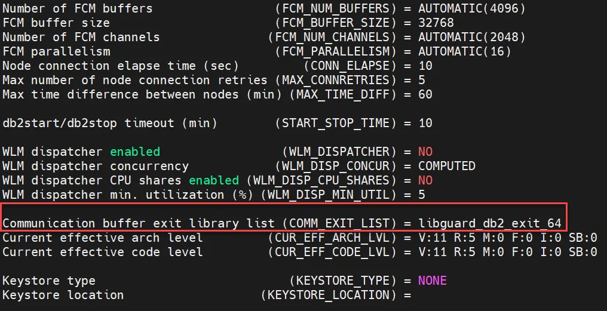{ width="99%" }](../images/exit3.webp) 

1.	Start *DB2* engine.
```bash linenums="1"
db2start

exit
```
1.	Now we must re-create existing *Inspection Engine* for *DB2* to adapt it to using *EXIT* data stream instead of *KTAP* one. We can do it directly from UI by removing old IE definition and adding a new one in **S-TAP Control** or execute API call. There is also possibility to execute `setup_exit.sh` script on machine where database and *STAP* is installed. Let's use a script. Execute on **raptor** as a **root**.
```bash
/opt/guardium/modules/STAP/current/setup_exit.sh db2
```
Script will require two answers – Y and N respectively.

    [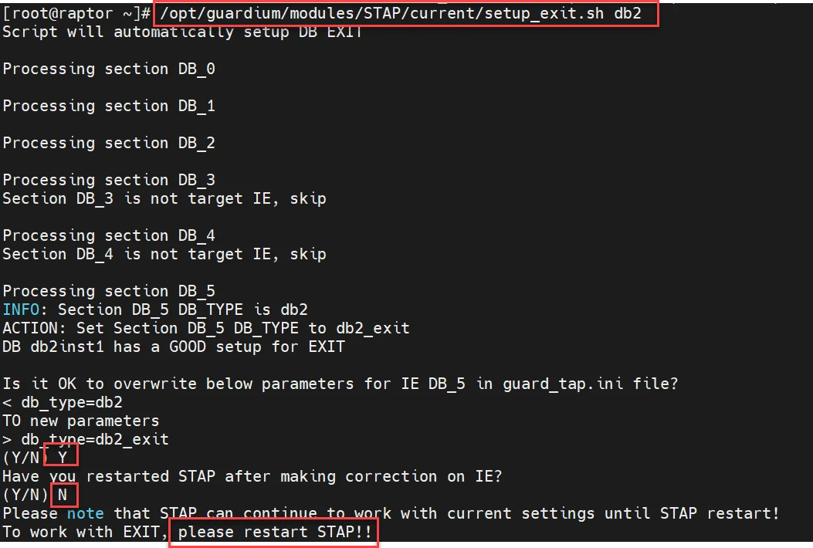{ width="99%" }](../images/exit4.webp)  

1.	Restart *STAP*.
```bash
/opt/guardium/modules/STAP/current/guard-config-update --restart stap
```
1.	Now, *DB2* is configured to use *EXIT*. We should even disable *KTAP* to avoid loading it to kernel space. However, we have on **raptor** many different databases that is why we do not want to disable *KTAP* and *ATAP* functionality for now.

## DB2 traffic visibility with EXIT

1.	Login to **raptor** as *db2inst1* user and connect to *DB2* using shared memory connection
```bash  linenums="1"
su - db2inst1

db2 connect to sample user db2inst1 

db2 "SELECT 'Shared Memory SECOND connection test with EXIT' FROM sysibm.sysdummy1"

exit
```

1.	Check *Full SQL (Training)* report and notice **db2inst1** user command has been sniffed.
[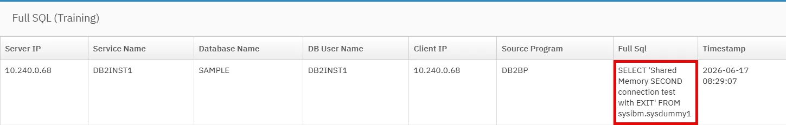{ width="99%" }](../images/exit5.webp)

## Informix monitoring with EXIT (optional)

1.	Start *informix* instance on **raptor** machine as a **root** user.
```bash
systemctl start informix-ifxserver
```

1.	Change context to **informix** user.
```bash
su - informix
```

1.	Connect to the database instance as a super admin. Notice that the session is established using a *soctcp* connection, which indicates plain, unencrypted communication without SSL/TLS.
```sql linenums="1"
dbaccess sysmaster -

SELECT sid, TRIM(net_client_name) AS client_protocol, net_client_type, net_protocol, net_options, net_read_cnt, net_write_cnt FROM sysnetworkio WHERE sid = DBINFO('sessionid');

SELECT 'INFORMIX session without SSL';
```
Close database session inserting ++ctrl+d++
[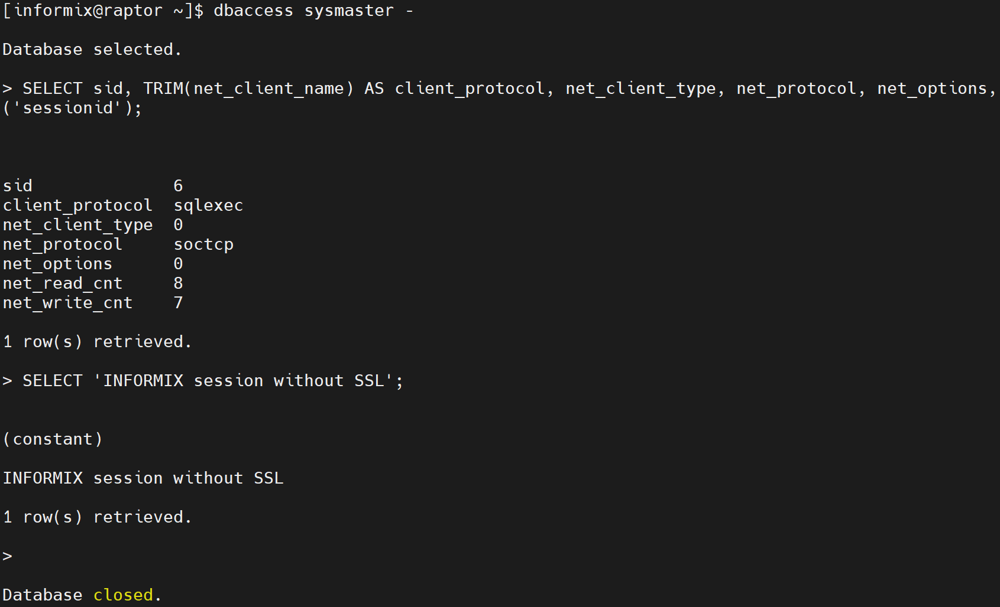{ width="99%" }](../images/exit6.webp)

1.	Confirm traffic visibility in *Full SQL (Training)* report on **coll1**.
[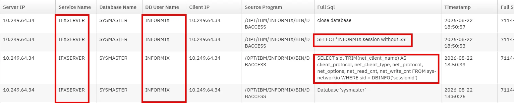{ width="99%" }](../images/exit7.webp)

1.	Connect to *Informix* again but this time using encrypted channel. The first `SELECT` indicates that the connection is using the *socssl* protocol, which means the communication is encrypted using SSL/TLS. As expected, activity from this session will not be reported, because *EXIT* must be enabled to monitor encrypted connections.
```bash linenums="1"
export INFORMIXSERVER=ifxserver_ssl

dbaccess sysmaster -

SELECT sid, TRIM(net_client_name) AS client_protocol, net_client_type, net_protocol, net_options, net_read_cnt, net_write_cnt FROM sysnetworkio WHERE sid = DBINFO('sessionid');

SELECT 'INFORMIX session with SSL';
```
Close database session inserting ++ctrl+d++ and `exit` from the **informix** user session.
[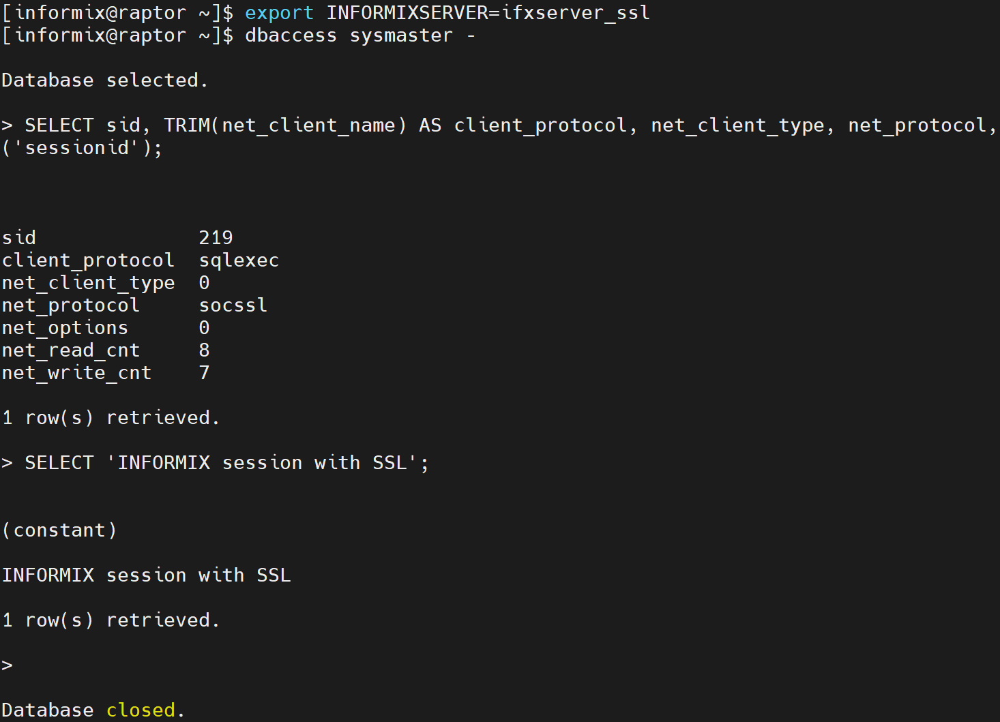{ width="99%" }](../images/exit8.webp) 

1.	To configure *EXIT*, first switch to the **root** user and add the **informix** user to the guardium group.
```bash
/opt/guardium/modules/ATAP/current/files/bin/guardctl authorize-user informix
```

1.	Execute the following commands in the context of the **informix** user. Create a symbolic link to the library in the database instance's `lib` directory.
```bash  linenums="1"
su - informix

ln -fs /usr/lib64/libguard_informix_exit_64.so $INFORMIXDIR/lib/libguard_informix_exit_64.so
```

1.	An then you must enable **EXIT** manually because recent *Informix* versions contain a *defect* that prevents the use of the script previously used for the *DB2* database. First, as a informix user context, create a configuration file - `$INFORMIXDIR/etc/ifxguard.ifxserver` - for standard unencrypted TCP connections and populate it with the following contents:
```txt
NAME   ifxguard.ifxserver
WORKERS   6
LIBPATH   /opt/ibm/informix/lib/libguard_informix_exit_64.so
DEBUG   2
LOGFILE   /tmp/ifxserver.log
```
[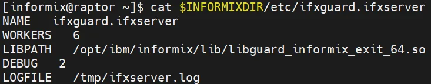{ width="82%" }](../images/exit9.webp) 

1.	Next, create a configuration file for encrypted connections - `$INFORMIXDIR/etc/ifxguard.ifxserver_ssl` and populate it with the following contents:
```text
NAME   ifxguard.ifxserver_ssl
WORKERS   6
LIBPATH   /opt/ibm/informix/lib/libguard_informix_exit_64.so
DEBUG   2
LOGFILE   /tmp/ifxserver_ssl.log
```
[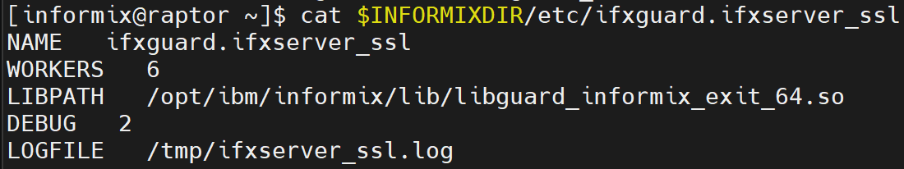{ width="82%" }](../images/exit12.webp) 
 
1.	You can now start the *EXIT* services for each configuration (still in the **informix** user context).
```bash linenums="1"
ifxguard -c $INFORMIXDIR/etc/ifxguard.ifxserver

ifxguard -c $INFORMIXDIR/etc/ifxguard.ifxserver_ssl
```
[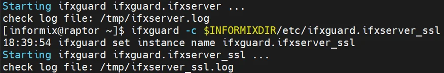{ width="99%" }](../images/exit10.webp) 

1.	You must remove the *Informix KTAP-based* inspection engine definition from the *STAP* and add the correct configuration required for *EXIT* monitoring. To do this, use the API. From the **cli** session on **coll1**, execute the following command:
```bash linenums="1"
grdapi delete_stap_inspection_engine type=informix stapHost=raptor.demo.guardium

grdapi create_stap_inspection_engine dbUser=informix dbVersion=15 client=0.0.0.0/0.0.0.0 protocol="Informix Exit" procName=/opt/ibm/informix/bin/oninit dbInstallDir=/home/informix stapHost=raptor.demo.guardium
```

1.	Once again, switch to the **informix** user on **raptor**, connect to the instance using SSL, and execute a query. This time, the activity should be properly audited and visible in **Guardium**.
```bash linenums="1"
export INFORMIXSERVER=ifxserver_ssl

dbaccess sysmaster -

SELECT sid, TRIM(net_client_name) AS client_protocol, net_client_type, net_protocol, net_options, net_read_cnt, net_write_cnt FROM sysnetworkio WHERE sid = DBINFO('sessionid');

SELECT 'Second try of INFORMIX session with SSL';
```
Close database session inserting ++ctrl+d++ and `exit` from **informix** user session.
[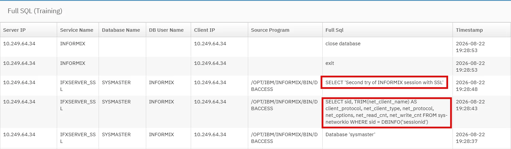{ width="99%" }](../images/exit11.webp) 
 
1.	Stop *Informix* instance at the end of lab to free a **raptor** resources. As a **root** execute:
```bash
systemctl stop informix-ifxserver
```

## Appendix

!!! note "Dependencies:"
    This lab deliverables are not referred in the other labs. So you can ignore it if needed.

!!! note "Resources:"
    
!!! note "Instructor notes:"

