# GIM

## GIM minimum installation and de-installation

1. Because this is a freshly installed environment, the **raptor** machine must be rebooted. Once the reboot is complete, sign in to the system again.
```bash
shutdown -r now
```
1.	On **raptor** using ssh, jump to directory `/opt/guardium_tz_bootcamp_automation/upload/source_files/agents/shell/`
```bash
cd /opt/guardium_tz_bootcamp_automation/upload/source_files/agents/shell/
```
1.	Set all files as a executable
```bash
chmod +x *.sh
```
1.	Execute *GIM* client installer without parameters to see available installation parameters
```bash
./guard-bundle-GIM-12.2.1.1_r123268_v12_x_1-rhel-9-linux-x86_64.gim.sh 
```
[{ width="99%" }](../images/gim1.webp)
1.	Install *GIM* client in the listener mode
```bash
./guard-bundle-GIM-12.2.1.1_r123268_v12_x_1-rhel-9-linux-x86_64.gim.sh -- --dir /opt/guardium --tapip <raptor_ip>
```
[{ width="99%" }](../images/gim2.webp)
1.	Open port **8445** on **raptor** and check socket availability of this port.
```bash linenums="1"
firewall-cmd --zone=public --add-port=8445/tcp

firewall-cmd --reload

nc -zv <raptor_ip> 8445
```
[{ width="59%" }](../images/gim3.webp)
1.	You can also list *GIM* client processes on **raptor** machine and notice that it is listening on port **8445**.
```bash
ps -ef | grep gim
```
[{ width="99%" }](../images/gim4.webp)

1.	On **cm**, using UI check the absence of *GIM* clients currently registered to (**GIM Process Monitor** form).
[{ width="99%" }](../images/gim5.webp)

1.	Then register installed gim_client using **GIM Remote Activation** form. Put the **raptor** *IP address* and listener default port (**8445**) and press **Submit** button. The pop-up window should confim that gim client has been successfully registered to *GIM* server.
[{ width="99%" }](../images/gim6.webp)

1.	Check again **GIM Process Monitor** view and notice that **raptor** *GIM* client is registered.
[{ width="99%" }](../images/gim7.webp)

1.	In most cases, *GIM client* will not be installed in *listener mode*; instead, the connection to the *GIM server* will be configured during installation. To proceed, first uninstall the *GIM client*. Run the uninstallation command on the **raptor** machine. 
```bash
/opt/guardium/modules/GIM/current/uninstall.pl
```
[{ width="99%" }](../images/gim8.webp)

1.	Check **GIM Process Monitor** and notice that list of *GIM clients* is empty.

1.	Then install *GIM client* again on **raptor** with automatic registration to **GIM server** located on your **cm**.
```bash linenums="1"
cd /opt/guardium_tz_bootcamp_automation/upload/source_files/agents/shell/

./guard-bundle-GIM-12.2.1.1_r123268_v12_x_1-rhel-9-linux-x86_64.gim.sh -- --dir /opt/guardium --tapip <raptor_ip> --sqlguardip <cm_ip>
```
[{ width="99%" }](../images/gim9.webp)

1.	Switch to **cm** UI (your *GIM server*) and check view – **GIM Processes Monitor** to confirm that *GIM client* has been registered successfully again.
[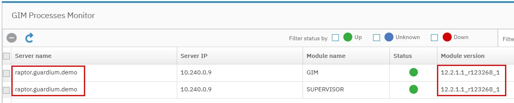{ width="99%" }](../images/gim10.webp)

## GIM modules upload

1.	Now we need to download *GIM modules* to *GIM server*. They are unpacked on *ceratops*. On *ceratops* machine (*RDP* connection) open Edge browser and ignore browser personalization (remember to open *RDP tunnel*)
[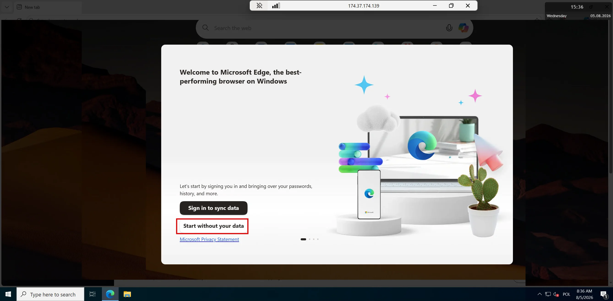{ width="99%" }](../images/gim11.webp)

1. Login to **cm** UI from **ceratops** (you should have **cm** bookmark in favourites inside *Guardium* group) then open **Upload Modules** view
[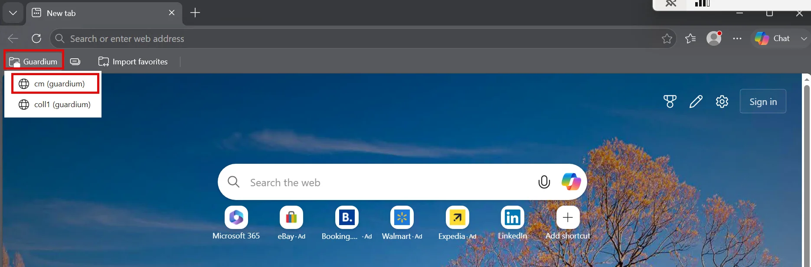{ width="99%" }](../images/gim12.webp)
[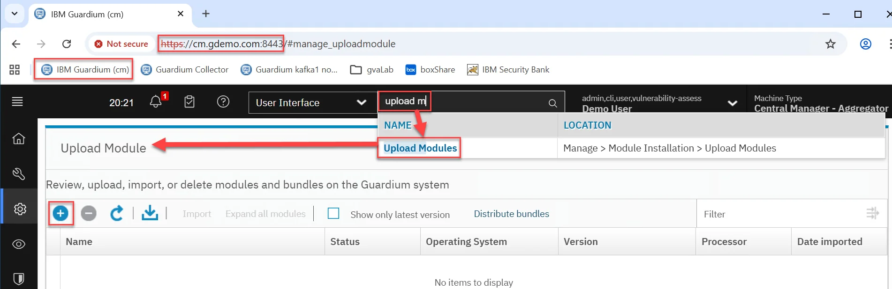{ width="99%" }](../images/gim13.webp)

1.	Click plus { width="2.5%" } button to upload the modules `c:\bootcamp\gim` directory. Select the first file. Once selected, click **Upload**.

    !!! warning "Important"
        Do not refresh the window. Wait patiently till the import confirmation will appear. When it does, click **Import Now** and wait until you see a message confirming that the import completed successfully.

    [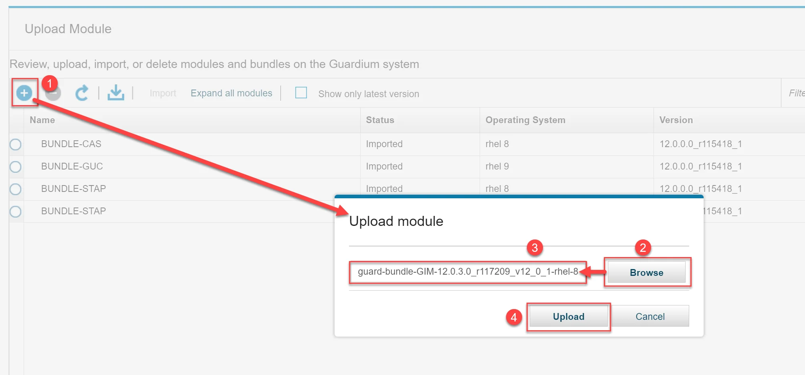{ width="99%" }](../images/gim15.webp)
    [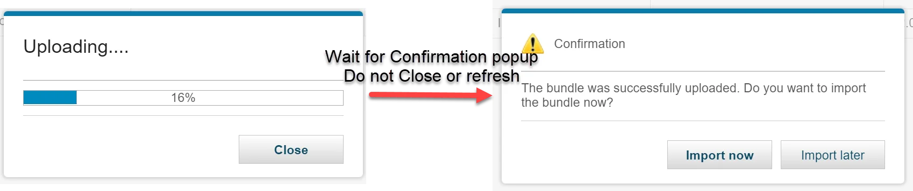{ width="99%" }](../images/gim16.webp)
1.	Import module
[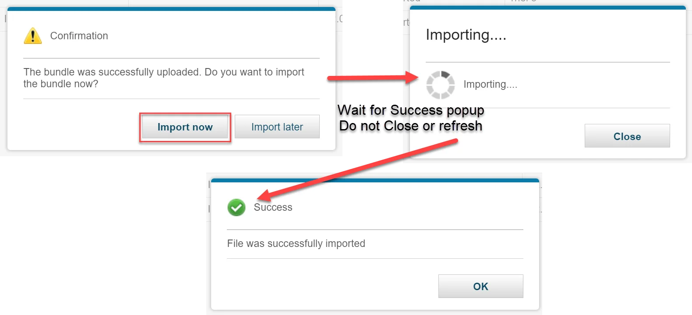{ width="99%" }](../images/gim17.webp)

1.	Confirm that *GIM module* has been uploaded
[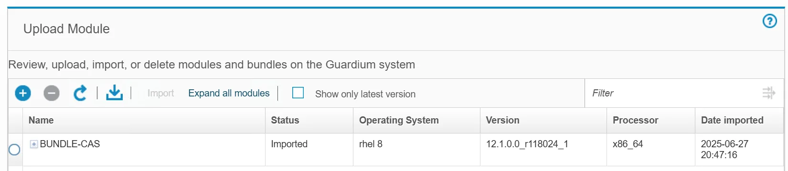{ width="99%" }](../images/gim18.webp)

1.	Repeat steps 2-4 for all files in `c:\bootcamp\gim` directory!

    !!! info
        Your *GIM modules* list can be different than presented on screenshot.

    [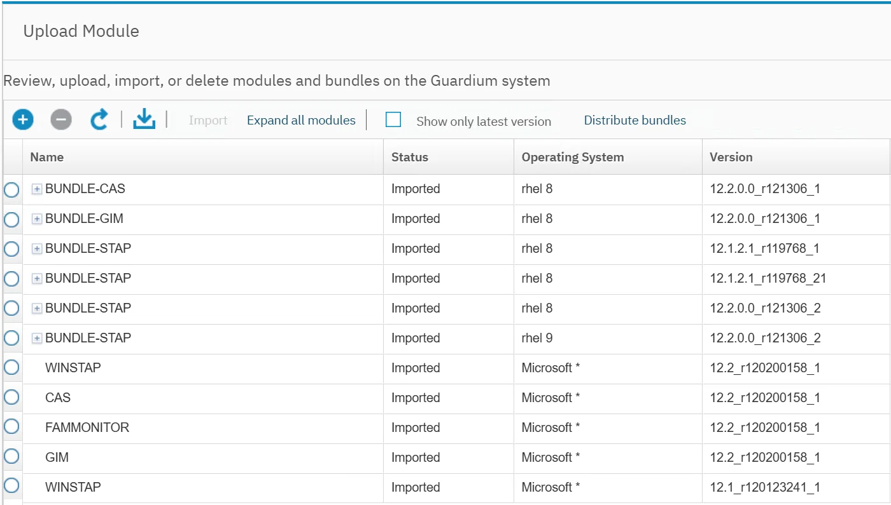{ width="99%" }](../images/gim19.webp)

## GIM upgrade

1.	Go to **Set up by Client** in **cm** UI and select your **raptor** *GIM client*. Switch to next section by pressing **Next** button
[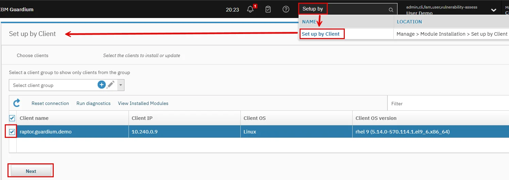{ width="99%" }](../images/gim20.webp)

1.	Expand list of modules and select from the list *BUNDLE-GIM* module. Notice that the installed version of *GIM client* is for **Guardium** *release 12.1* and the latest available *GIM client module* on *GIM Server* is released for version *12.2.2* (just uploaded `12.2.2.0_r123489_1`). That is why the *Upgrade* action is displayed on view. Press **Next** and then **Install** button because we do not need modify any parameters for GIM client this time and we can start upgrade immediately. 
[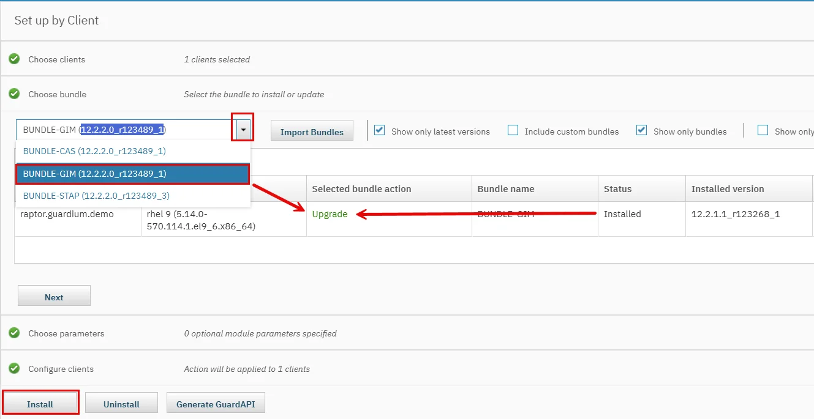{ width="99%" }](../images/gim21.webp)

1.	Press **OK** button to send upgrade request.
[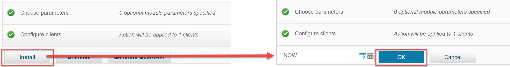{ width="99%" }](../images/gim22.webp)

1.	Select **Show Status** link to monitor upgrade progress. After a while all *GIM Bundle modules* should be successfully updated.
[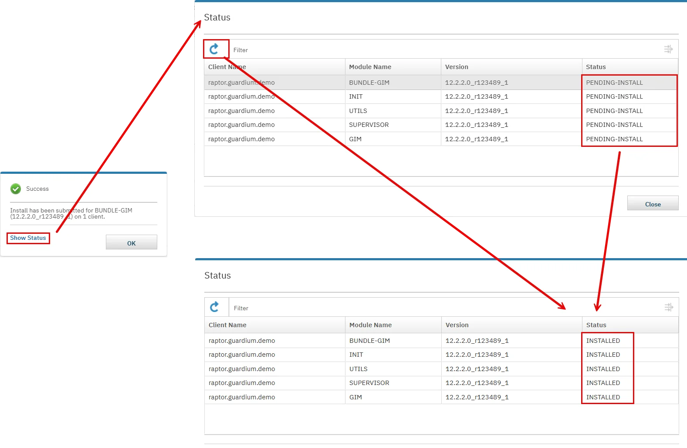{ width="99%" }](../images/gim23.webp)

1.	Go to *GIM Processes Monitor* view again and check that new release of *GIM client* is running on raptor
[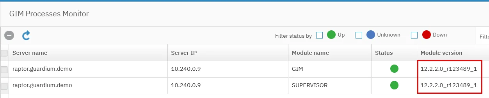{ width="99%" }](../images/gim24.webp)

## Module configuration

1.	Go to **Set up by Client** in **cm** GUI and select your **raptor** *GIM client* again and press **Next**.
[{ width="99%" }](../images/gim20.webp)

1.	Notice that *GIM client* is updated to the latest release on *GIM server* and parameter updates are possible only. Press **Next** button.
[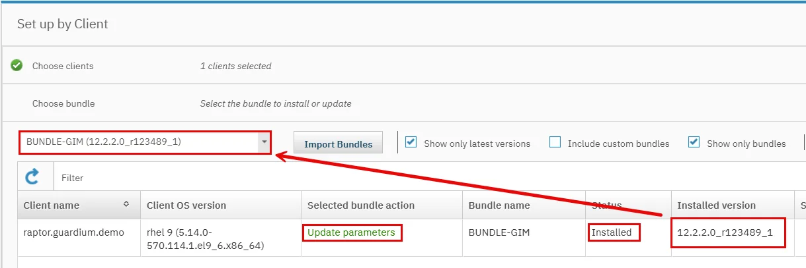{ width="99%" }](../images/gim25.webp)

1.	Select from parameters list **GIM_DEBUG** and change value to **1**. Then push request using **Install** and **OK** buttons.
[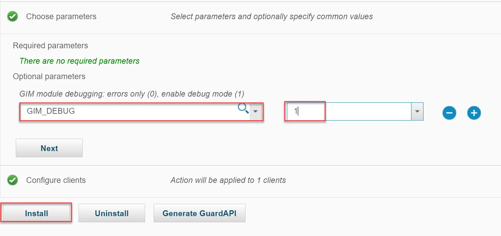{ width="99%" }](../images/gim26.webp)

1.	In Status pop-up window notice that only some modules requires update.
[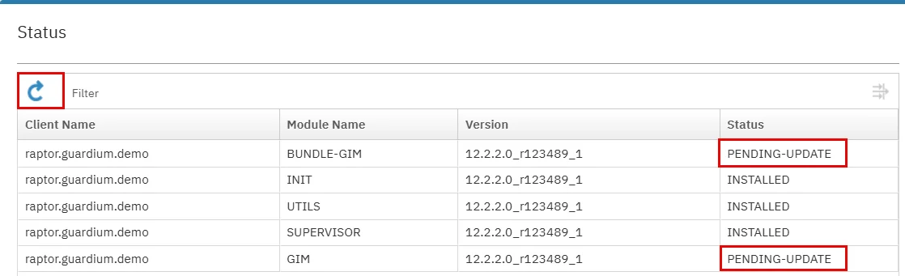{ width="99%" }](../images/gim27.webp)

1.	Refresh view, to get confirmation that changes have been successfully deployed.
[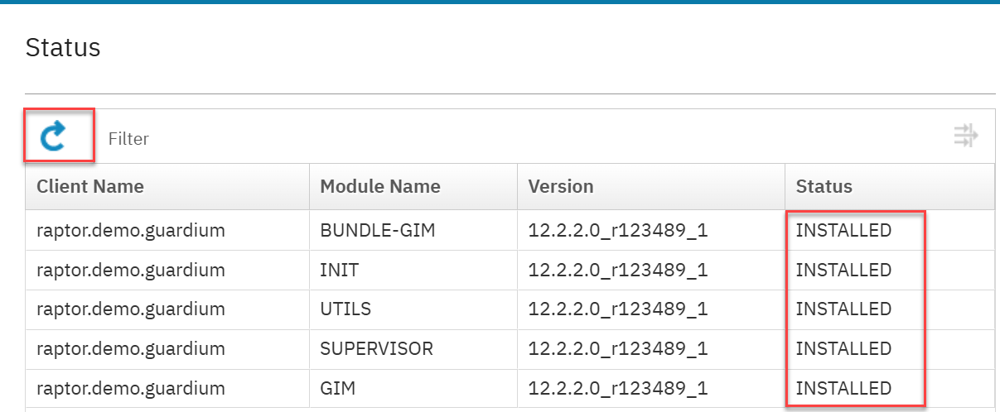{ width="79%" }](../images/gim39.webp)

1.	Login to **raptor** and list installed *GIM client modules* using `configurator.sh` tool
```bash
/opt/guardium/modules/UTILS/current/files/bin/configurator.sh --list
```
[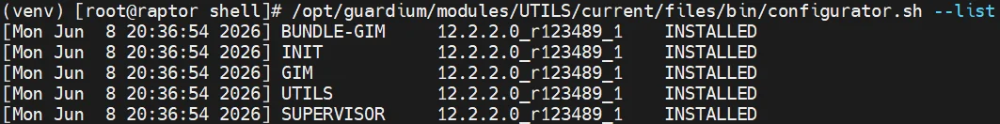{ width="99%" }](../images/gim28.webp)

1.	Check that **GIM_DEBUG** parameter in *GIM module* is set to **1**.
```bash
/opt/guardium/modules/UTILS/current/files/bin/configurator.sh --get GIM
```
[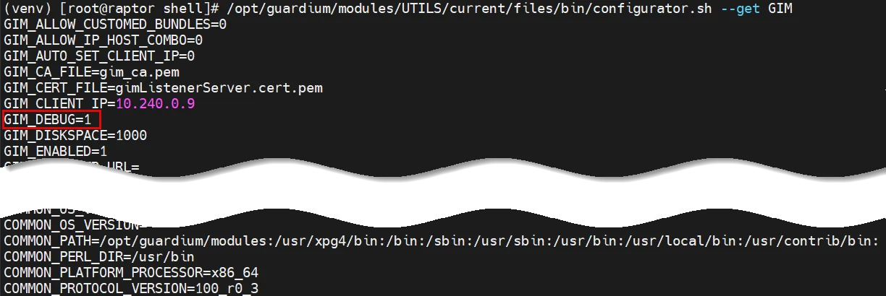{ width="99%" }](../images/gim29.webp)

1.	Change **GIM_DEBUG** value to **0** and confirm change (this time from command line instead from *GIM server*).
```bash linenums="1"
/opt/guardium/modules/UTILS/current/files/bin/configurator.sh --set GIM_DEBUG 0

/opt/guardium/modules/UTILS/current/files/bin/configurator.sh --get GIM
```
[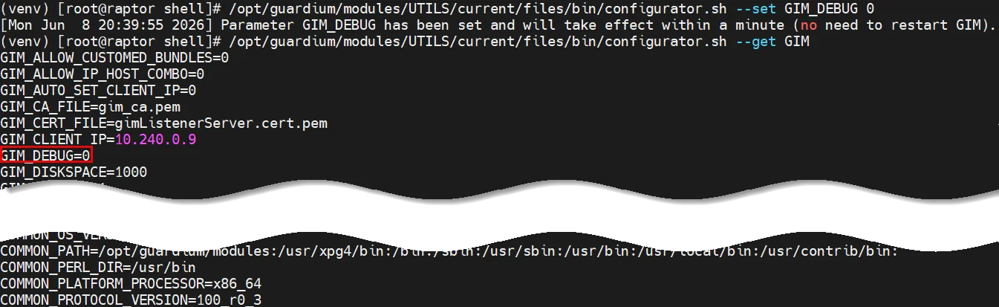{ width="99%" }](../images/gim30.webp)

1.	Uninstall *GIM client*.
```bash
/opt/guardium/modules/GIM/current/uninstall.pl
```

## GIM module management with API (optional)

1.	Go to *gim installers* directory on **raptor**.
```bash
cd /opt/guardium_tz_bootcamp_automation/upload/source_files/agents/shell
```

1.	Install again *GIM client* version **12.2.1**.
```bash
./guard-bundle-GIM-12.2.1.1_r123268_v12_x_1-rhel-9-linux-x86_64.gim.sh -- --dir /opt/guardium --tapip <raptor_ip> --sqlguardip <cm_ip>
```

1.	In **cm** cli session list the installed *modules* on **raptor** machine. All `grdapi` commands are run from *cm cli session*.
```bash
grdapi gim_list_client_modules clientIP=<raptor_ip>
```
[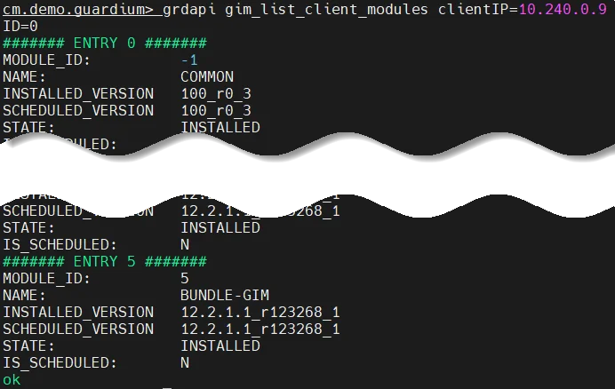{ width="75%" }](../images/gim31.webp)

1.	Then list of *bundles* available on *GIM server* (*windows modules* are filtered out because client is *linux* based).
```bash
grdapi gim_list_bundles
```
[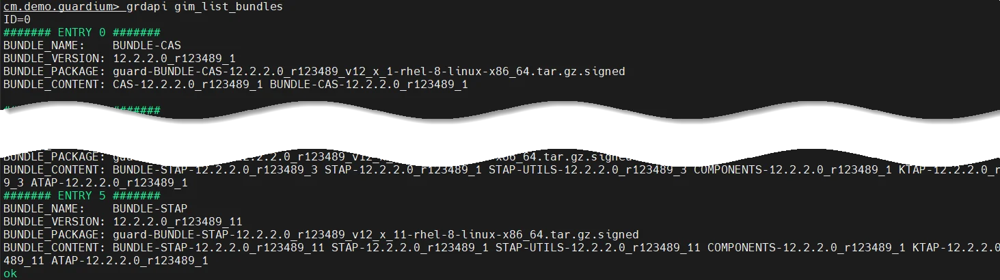{ width="99%" }](../images/gim32.webp)

1.	Assign to *GIM client* the update of *GIM-BUNDLE* to the latest version and check module list.

    ```bash linenums="1"
    grdapi gim_assign_latest_bundle_or_module_to_client module=BUNDLE-GIM clientIP=<raptor_ip>

    grdapi gim_list_client_modules clientIP=<raptor_ip>
    ```

    !!! notice
        Notice that GIM client 12.2 version has been set as scheduled but schedule time is not set yet.

    [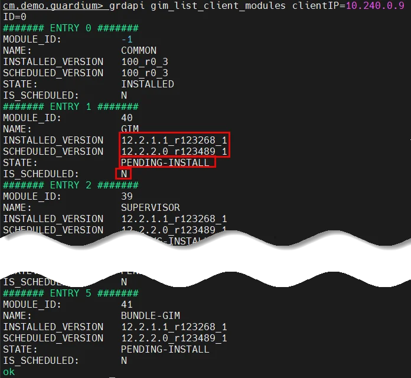{ width="75%" }](../images/gim33.webp)

1.	Set update schedule.
```bash
grdapi gim_schedule_install date=now clientIP=<raptor_ip>
```

1.	Monitor the upgrade process.
    ```bash
    grdapi gim_list_client_modules clientIP=<raptor_ip>
    ```

    [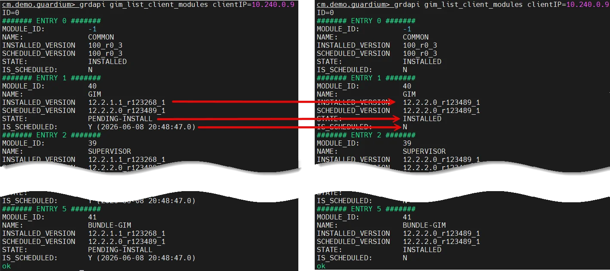{ width="99%" }](../images/gim34.webp)

    !!! note
        After few minutes the command will provide the output change. It should confirm that *GIM client* has been updated to the latest version available on *GIM server*.

1.	Now set **GIM_DEBUG** to **1**.
```bash
grdapi gim_update_client_params paramName=GIM_DEBUG paramValue=1 clientIP=<raptor_ip>
```

1.	You should notice that change is notified but is not scheduled.
```bash
grdapi gim_list_client_modules clientIP=<raptor_ip>
```
[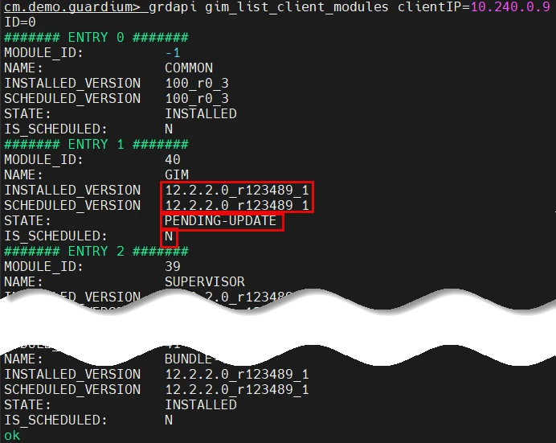{ width="75%" }](../images/gim35.webp)

1.	Schedule update.
```bash
grdapi gim_schedule_install date=now clientIP=<raptor_ip>
```

1.	Then monitor *GIM client* state to confirm that schedule is started and finally applied.
```bash
grdapi gim_list_client_modules clientIP=<raptor_ip>
```
[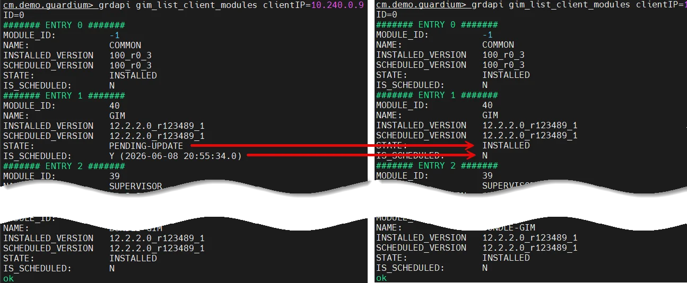{ width="99%" }](../images/gim36.webp)

1.	Finally uninstall *GIM client* from **raptor**. Monitor list of modules on raptor and confirm uninstallation process.
```bash
grdapi gim_uninstall_module module=BUNDLE-GIM clientIP=<raptor_ip>

grdapi gim_schedule_uninstall date=now clientIP=<raptor_ip>

grdapi gim_list_client_modules clientIP=<raptor_ip> 
```
[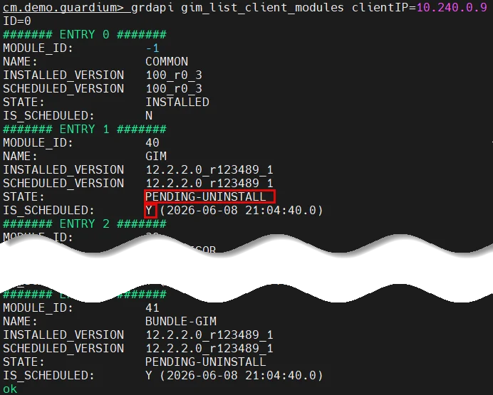{ width="75%" }](../images/gim37.webp)

1.	After a while list of modules assigned to *GIM client* should be empty.
```bash
grdapi gim_list_client_modules clientIP=<raptor_ip>
```
[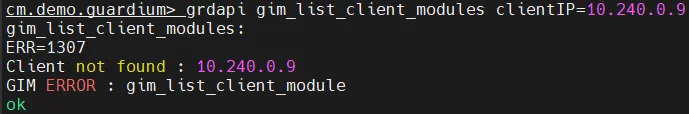{ width="75%" }](../images/gim38.webp)

1.	The list of *GIM clients* registered to *GIM server* on **cm** should be empty as well
```bash
grdapi gim_list_registered_clients
```

1.	Because of *GIM client* issue during uninstallation from API, execute these commands on **raptor** to clean system
```bash
systemctl disable guard_gim

rm -f /etc/systemd/system/guard_gim.service

rm -rf /usr/local/guardium

rm -rf /var/log/guard
```

## Appendix

!!! note "Dependencies:"
    It is crucial to have modules uploaded on cm for the other agent related labs. So ensure that you finished all non optional taska from this lab.

!!! note "Resources:"
    1. List all GIM API functions    
    <https://www.ibm.com/docs/en/guardium/12.x?topic=commands-guardium-installation-manager-gim-apis>

    1. Certificate management
    <https://www.ibm.com/docs/en/guardium/12.x?topic=management-creating-managing-custom-gim-certificates>

!!! note "Instructor notes:"
