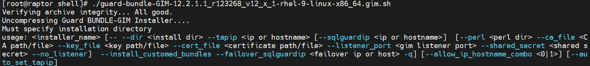
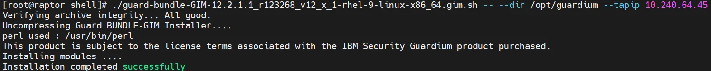
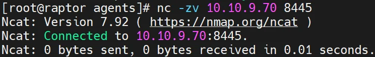
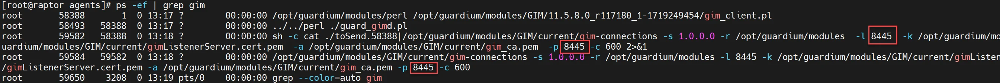
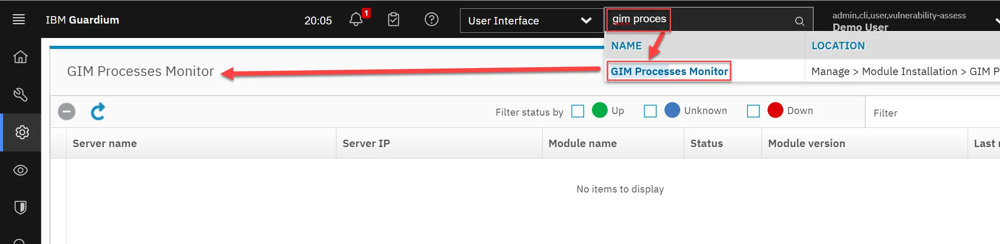
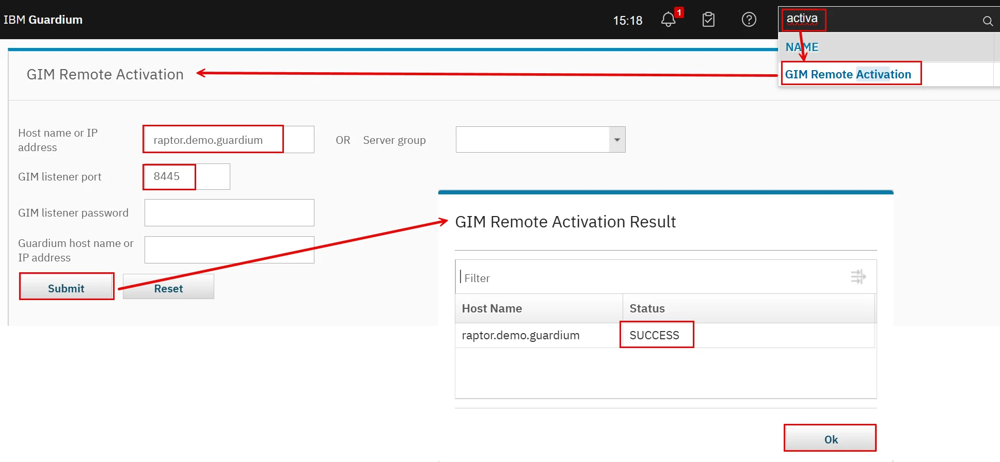
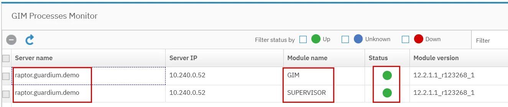
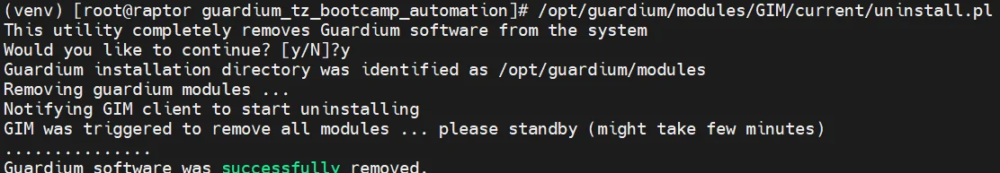
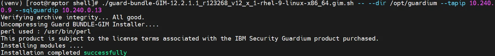

# GIM

## GIM minimum installation and de-installation

1.	On **raptor** using ssh, jump to directory `/opt/guardium_tz_bootcamp_automation/upload/source_files/agents/shell/`
```bash
cd /opt/guardium_tz_bootcamp_automation/upload/source_files/agents/shell/
```
1.	Set all files as a executable
```bash
chmod +x *.sh
```
1.	Execute *GIM* client installer without parameters to see available installation parameters
```bash
./guard-bundle-GIM-12.2.1.1_r123268_v12_x_1-rhel-9-linux-x86_64.gim.sh 
```
[{ width="99%" }](../images/gim1.webp)
1.	Install *GIM* client in the listener mode
```bash
./guard-bundle-GIM-12.2.1.1_r123268_v12_x_1-rhel-9-linux-x86_64.gim.sh -- --dir /opt/guardium --tapip <raptor_ip>
```
[{ width="99%" }](../images/gim2.webp)
1.	Open port **8445** on **raptor** and check socket availability of this port.
```bash linenums="1"
firewall-cmd --zone=public --add-port=8445/tcp

firewall-cmd --reload

nc -zv <raptor_ip> 8445
```
[{ width="59%" }](../images/gim3.webp)
1.	You can also list *GIM* client processes on **raptor** machine and notice that it is listening on port **8445**.
```bash
ps -ef | grep gim
```
[{ width="99%" }](../images/gim4.webp)
1.	On **cm**, using UI check the absence of *GIM* clients currently registered to (**GIM Process Monitor** form).
[{ width="99%" }](../images/gim5.webp)
1.	Then register installed gim_client using **GIM Remote Activation** form. Put the **raptor** *IP address* and listener default port (**8445**) and press **Submit** button. The pop-up window should confim that gim client has been successfully registered to *GIM* server.
[{ width="99%" }](../images/gim6.webp)
1.	Check again GIM Process Monitor view and notice that raptor GIM client is registered.
[{ width="85%" }](../images/gim7.webp)
1.	In most cases, GIM client will not be installed in listener mode; instead, the connection to the GIM server will be configured during installation. To proceed, first uninstall the GIM client. Run the uninstallation command on the raptor machine. You can verify that the GIM Process Monitor list is empty again.
/opt/guardium/modules/GIM/current/uninstall.pl
[{ width="85%" }](../images/gim7.webp)
1.	Check GIM Process Monitor and notice that list of GIM clients is empty.
1.	Then install GIM client again on raptor with automatic registration to GIM server located on your CM
cd /opt/guardium_tz_bootcamp_automation/upload/source_files/agents/shell/

./guard-bundle-GIM-12.2.1.1_r123268_v12_x_1-rhel-9-linux-x86_64.gim.sh -- --dir /opt/guardium --tapip <raptor_ip> --sqlguardip <cm_ip>
[{ width="85%" }](../images/gim8.webp)
1.	Switch to cm UI (your GIM server) and check view – GIM Processes Monitor to confirm that GIM client has been registered successfully again.
[{ width="85%" }](../images/gim9.webp)

## GIM modules upload

