# KTAP Deployment

## Kernel downgrade

1.	In this lab, the goal is to handle various issues related to *KTAP* installation. To achieve this, you will install several different kernels on the raptor machine to analyze these scenarios in detail.

1.	Check the current **raptor** kernel level using command. Your default kernel can differ from presented on screenshot.
```bash
uname -r
```
[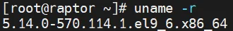{ width="35%" }](../images/ktap1.webp)

1.	Now we will downgrade kernel to version **5.14.0-570.16.1.el9_6.x86_64**.
```bash
dnf install kernel-5.14.0-570.16.1.el9_6.x86_64 -y
```

1.	Check the list of available bootable kernels. The newly installed kernel is set as **index 0** in the grubby configuration.
```bash
grubby --info=ALL
```
[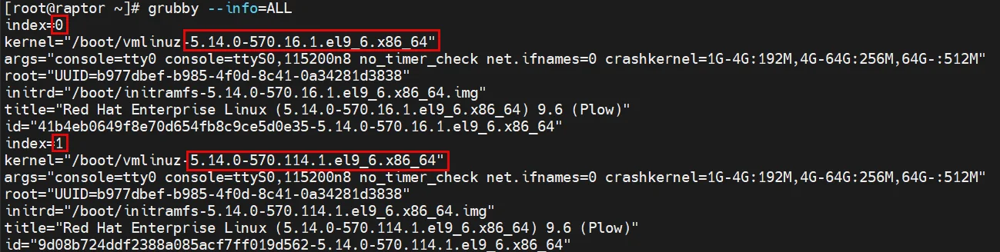{ width="99%" }](../images/ktap2.webp)

1.	Let’s also confirm that the installed kernel is now set as the default and reboot system.
```bash linenums="1"
grubby --default-kernel

shutdown -r now
```
[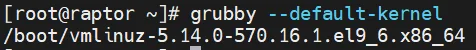{ width="55%" }](../images/ktap3.webp)

1.	Sign back in to **raptor** and confirm that the kernel has been downgraded to version **5.14.0-570.16.1**.
```bash
uname -r
```
[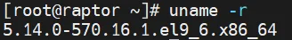{ width="35%" }](../images/ktap4.webp)

## STAP installation

1.	Install *GIM client 12.2.2* on **raptor**.
```bash
cd /opt/guardium_tz_bootcamp_automation/upload/source_files/agents/shell/

./guard-bundle-GIM-12.2.2.0_r123489_v12_x_1-rhel-9-linux-x86_64.gim.sh -- --dir /opt/guardium --tapip <raptor_ip> --sqlguardip <cm_ip>
```

1.	To install **STAP** open **Setup by Client** view in **cm** UI, select *raptor GIM client* and push **Next** button. Uncheck option *Show only latest versions* and select from available bundles the **BUNDLE-STAP 12.0.6.0_r120251_1** one and push **Next**. Then in the *Choose parameters* section set the values for the two parameters and confirm by clicking **Next**.

    !!! note "Insert:"
        - *STAP_SQLGUARD_IP*: **&lt;coll1_ip_address>**
        - *KTAP_ENABLED*: **1**

    then press **Install** button and finally request deployment using **OK** button in *Configure clients* section and track progress of installation by opening **Show Status** pop-up window

    [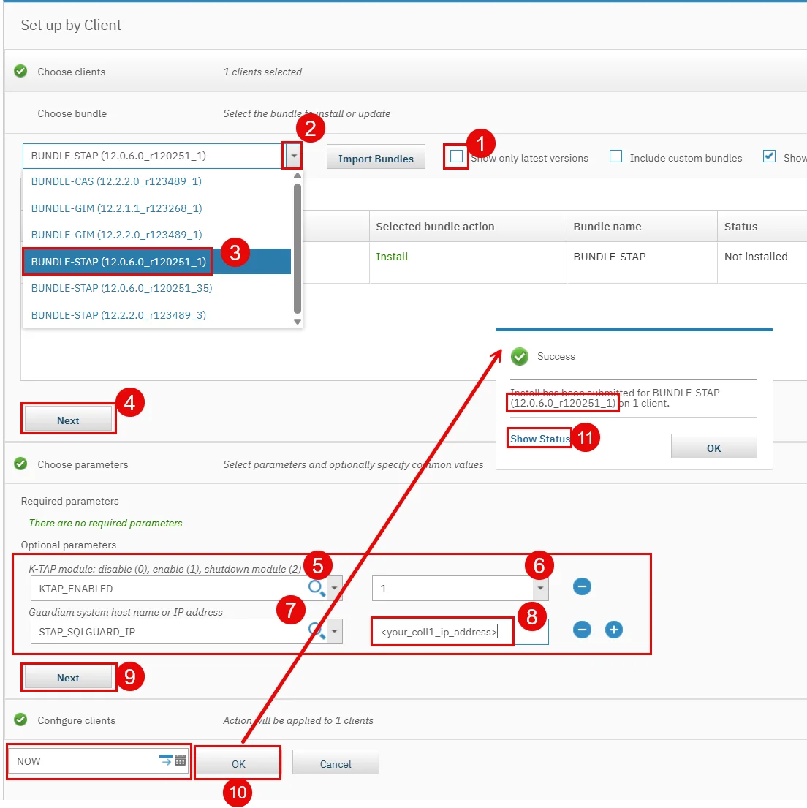{ width="99%" }](../images/ktap5.webp)
 
1.	Refresh the view till all components installation status will be changed to *INSTALLED* and then **Close** pop-up’s
[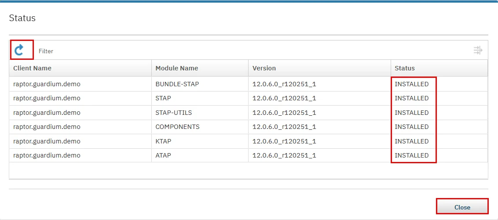{ width="99%" }](../images/ktap6.webp)
 
1.	In the **coll1** UI check the *STAP agent* status. Open **S-TAP control** view and expand using { width="20" } icon the agent menu and select **Event log**. The pop-up **S-TAP Events** report shows that kernel module for currently installed on **raptor** is available an installed.
[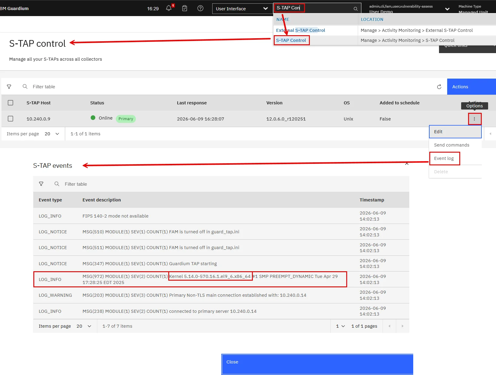{ width="99%" }](../images/ktap8.webp)

1.	To confirm *KTAP* installation on the **collector** the **S-TAP Status** view and notice that *KTAP module* is installed.
[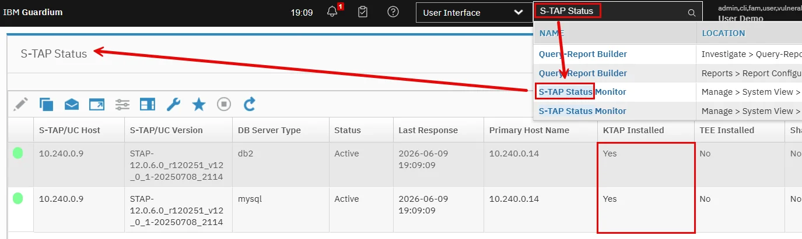{ width="99%" }](../images/ktap9.webp)
 
1.	Execute on **raptor** the commands to confirm that *KTAP module* is loaded into kernel.
```bash linenums="1"
lsmod | grep ktap

modinfo ktap
```
[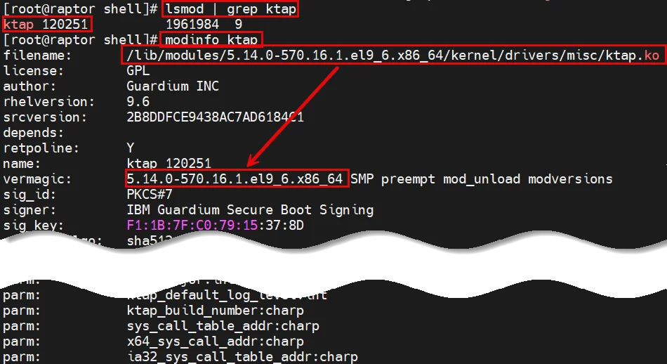{ width="99%" }](../images/ktap10.webp)
 
1.	Get the details from `/var/log/ktap_install.log`. Log clearly indicates that the installed agent version includes a module compiled specifically for the current kernel version (*Exact match*). 
```bash
cat /var/log/ktap_install.log
```
[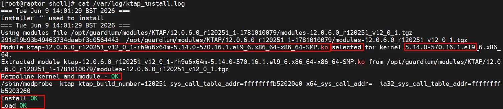{ width="99%" }](../images/ktap11.webp)

1.	Generate some database activity on raptor and verify whether it is captured by the agent. Switch the session context to the postgres user and use the native *PostgreSQL* client to execute a dummy query.
```bash linenums="1"
su - postgres

psql
```
```sql linenums="1"
SELECT 'activity with kernel 5.14.0-570.16.1.el9_6 and STAP 12.0.6.0_r120251_1';

\q

exit
```

1.	In the **coll1** UI, open the *Training* dashboard and verify whether the recently executed query is visible in the *Full SQL (Training)* report.
[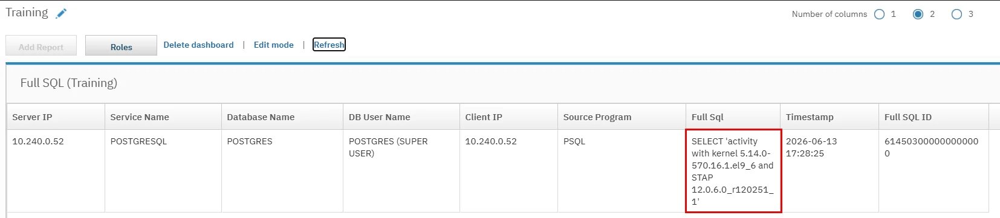{ width="99%" }](../images/ktap12.webp)

## Kernel upgrade, STAP revisions

