# KTAP Deployment

## Kernel downgrade

1.	In this lab, the goal is to handle various issues related to *KTAP* installation. To achieve this, you will install several different kernels on the raptor machine to analyze these scenarios in detail.

1.	Check the current **raptor** kernel level using command. Your default kernel can differ from presented on screenshot.
```bash
uname -r
```
[{ width="35%" }](../images/ktap1.webp)

1.	Now we will downgrade kernel to version **5.14.0-570.16.1.el9_6.x86_64**.
```bash
dnf install kernel-5.14.0-570.16.1.el9_6.x86_64 -y
```

1.	Check the list of available bootable kernels. The newly installed kernel is set as **index 0** in the grubby configuration.
```bash
grubby --info=ALL
```
[{ width="99%" }](../images/ktap2.webp)

1.	Let’s also confirm that the installed kernel is now set as the default and reboot system.
```bash linenums="1"
grubby --default-kernel

shutdown -r now
```
[{ width="55%" }](../images/ktap3.webp)

1.	Sign back in to **raptor** and confirm that the kernel has been downgraded to version **5.14.0-570.16.1**.
```bash
uname -r
```
[{ width="35%" }](../images/ktap4.webp)

## STAP installation

1.	Install *GIM client 12.2.2* on **raptor**.
```bash
cd /opt/guardium_tz_bootcamp_automation/upload/source_files/agents/shell/

./guard-bundle-GIM-12.2.2.0_r123489_v12_x_1-rhel-9-linux-x86_64.gim.sh -- --dir /opt/guardium --tapip <raptor_ip> --sqlguardip <cm_ip>
```

1.	To install **STAP** open **Setup by Client** view in **cm** UI, select *raptor GIM client* and push **Next** button. Uncheck option *Show only latest versions* and select from available bundles the **BUNDLE-STAP 12.0.6.0_r120251_1** one and push **Next**. Then in the *Choose parameters* section set the values for the two parameters and confirm by clicking **Next**.

    !!! note "Insert:"
        - *STAP_SQLGUARD_IP*: **&lt;coll1_ip_address>**
        - *KTAP_ENABLED*: **1**

    then press **Install** button and finally request deployment using **OK** button in *Configure clients* section and track progress of installation by opening **Show Status** pop-up window

    [{ width="99%" }](../images/ktap5.webp)
 
1.	Refresh the view till all components installation status will be changed to *INSTALLED* and then **Close** pop-up’s
[{ width="99%" }](../images/ktap6.webp)
 
1.	In the **coll1** UI check the *STAP agent* status. Open **S-TAP control** view and expand using { width="20" } icon the agent menu and select **Event log**. The pop-up **S-TAP Events** report shows that kernel module for currently installed on **raptor** is available an installed.
[{ width="99%" }](../images/ktap8.webp)

1.	To confirm *KTAP* installation on the **collector** the **S-TAP Status** view and notice that *KTAP module* is installed.
[{ width="99%" }](../images/ktap9.webp)
 
1.	Execute on **raptor** the commands to confirm that *KTAP module* is loaded into kernel.
```bash linenums="1"
lsmod | grep ktap

modinfo ktap
```
[{ width="99%" }](../images/ktap10.webp)
 
1.	Get the details from `/var/log/ktap_install.log`. Log clearly indicates that the installed agent version includes a module compiled specifically for the current kernel version (*Exact match*). 
```bash
cat /var/log/ktap_install.log
```
[{ width="99%" }](../images/ktap11.webp)

1.	Generate some database activity on **raptor** and verify whether it is captured by the agent. Switch the session context to the **postgres** user and use the native *PostgreSQL* client to execute a dummy query.
```bash linenums="1"
su - postgres

psql
```
```sql linenums="1"
SELECT 'activity with kernel 5.14.0-570.16.1.el9_6 and STAP 12.0.6.0_r120251_1';

\q

exit
```

1.	In the **coll1** UI, open the *Training* dashboard and verify whether the recently executed query is visible in the *Full SQL (Training)* report.
[{ width="99%" }](../images/ktap12.webp)

## Kernel upgrade, STAP revisions

1.	Now upgrade the kernel on **raptor** from **5.14.0-570.16.1.el9_6** to **5.14.0-570.24.1.el9_6** and observe what happens.
```bash linenums="1"
dnf install kernel-5.14.0-570.24.1.el9_6.x86_64 -y

shutdown -r now
```

1.	After reboot, confirm that the system is running kernel **5.14.0-570.24.1.el9_6.x86_64**.
```bash
uname -r
```

1.	Verify that *KTAP* is not loaded.
```bash
modinfo ktap
```
[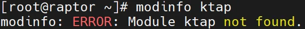{ width="49%" }](../images/ktap13.webp)

1.	A file named `ktap_install_fail.txt` has appeared in the `/tmp` directory. Review its contents, as it indicates a kernel support issue with the currently running system version.
```bash
cat /tmp/ktap_install_fail.txt
```
[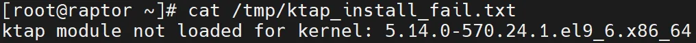{ width="79%" }](../images/ktap14.webp)

1.	The logs indicate that *STAP* failed to compile the module and did not attempt to locate a *flex module*. Since no prebuilt module was available, the installation failed.
```bash
cat /var/log/ktap_install.log
```
[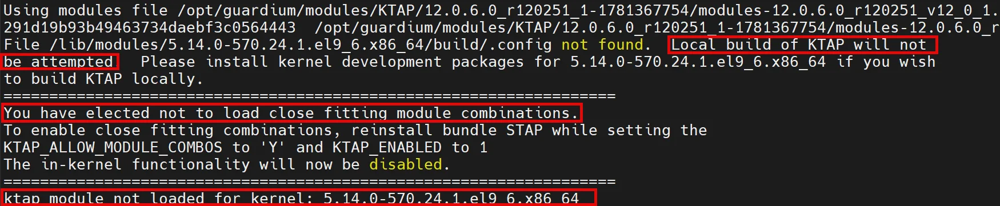{ width="99%" }](../images/ktap15.webp)

1.	You can also check **S-TAP Events** and **S-TAP Status** in the **coll1** UI to clearly confirm that the module-related issue is reported there.
[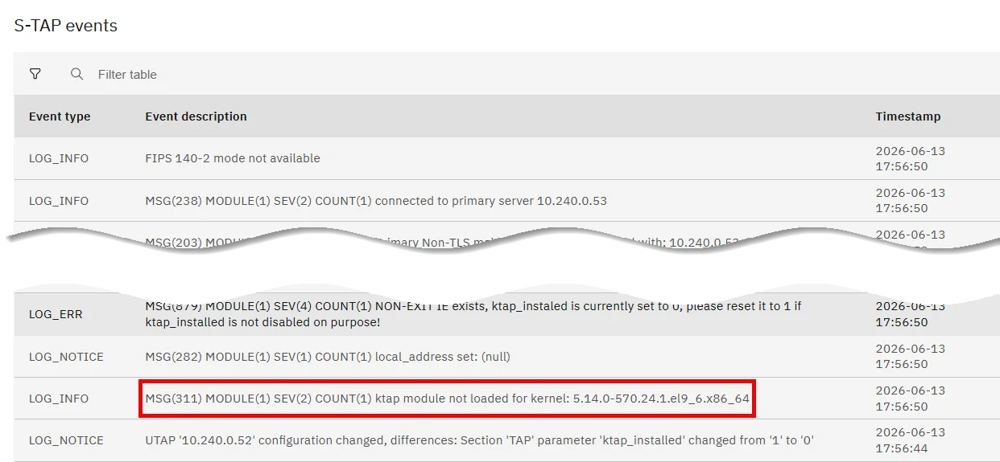{ width="99%" }](../images/ktap16.webp)
[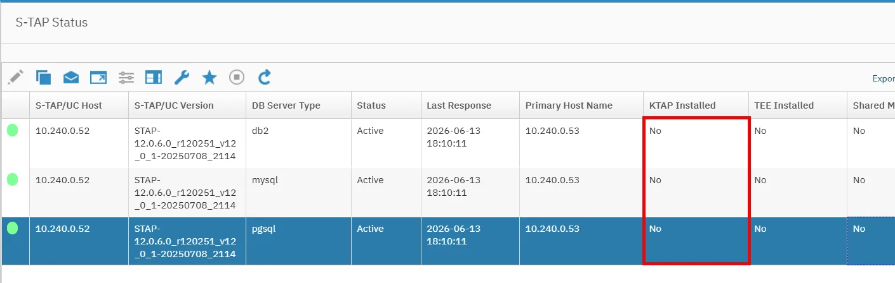{ width="99%" }](../images/ktap17.webp)
 
1.	It is also worth checking the modules archive in the *KTAP* installation directory. A simple search of its contents confirms that no module is available for the current kernel version.
```bash linenums="1"
cd /opt/guardium/modules/KTAP/current

tar tvf modules-12.0.6.0_r120251_v12_0_1.tgz | grep 5.14.0-570.24.1.el9_6.x86_64
```

1.	To verify whether your kernel is supported, visit <https://ibm.github.io/guardium-ktap/>. It turns out that kernel **5.14.0-570.24.1.el9_6** is supported by *EXACT* precompiled modules for agent **12.0**. Support became available with later revision. There is no information about *FLEX* support ☹
[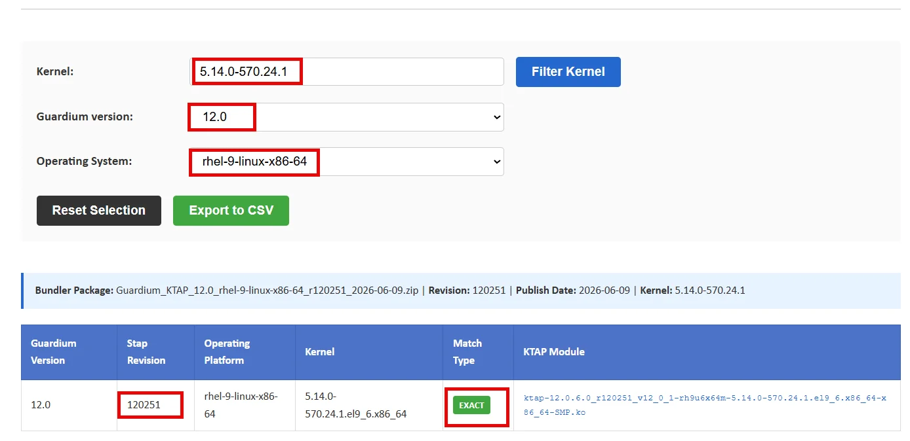{ width="99%" }](../images/ktap18.webp)
 
1.	Let's install the fresher revision of agent *12.0.6*. In the **cm** UI, go again to **Setup by Client**. After selecting **raptor**, you will notice that two revisions of the **12.0.6.0_r120251** agent are available in the modules list—revision **1** (currently installed) and revision **35**.
[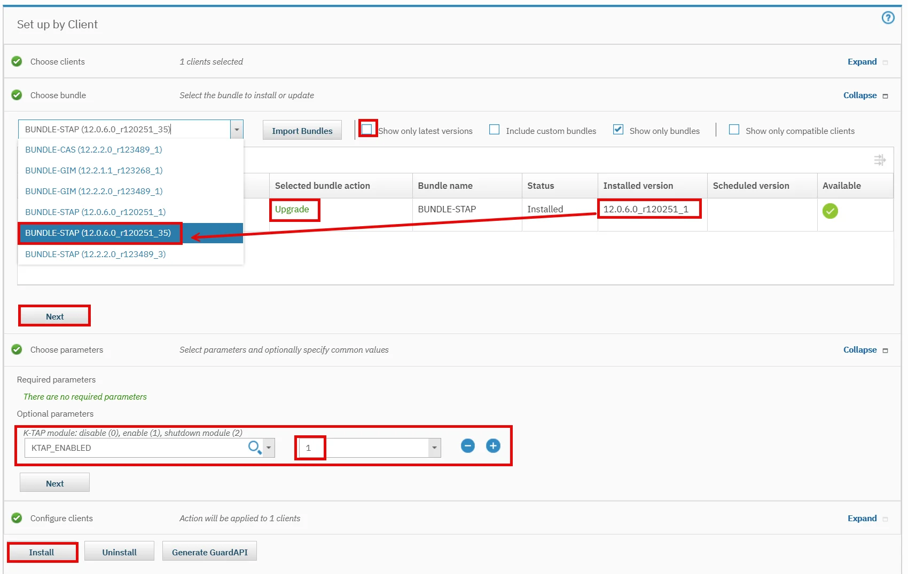{ width="99%" }](../images/ktap20.webp)
 
1.	Confirm that the task has been successfully completed.
[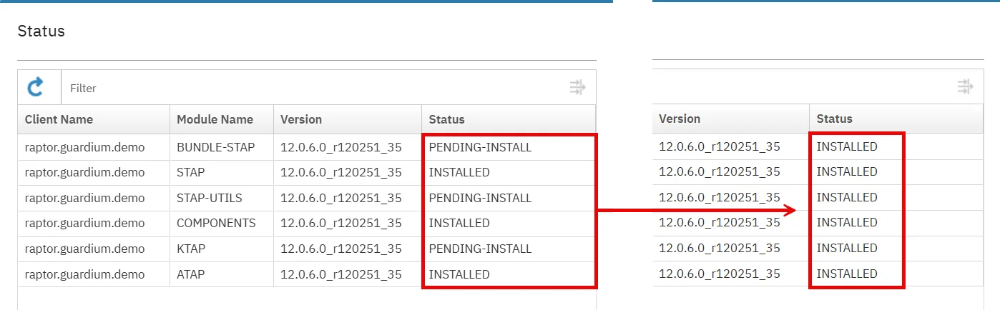{ width="99%" }](../images/ktap21.webp)

1.	As expected, the agent revision included a precompiled module, which was successfully loaded.
```bash linenums="1"
lsmod | grep ktap

modinfo ktap
```
[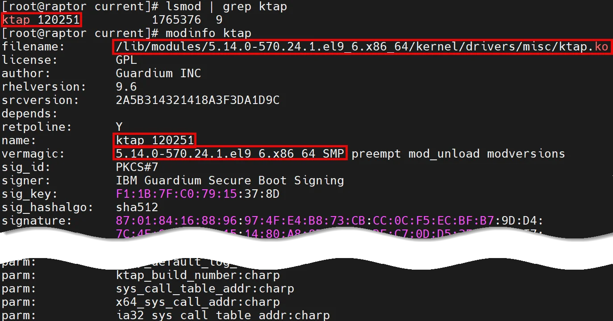{ width="99%" }](../images/ktap22.webp)

1.	Also confirm that the new modules archive file contains the required module.
```bash linenums="1"
cd /opt/guardium/modules/KTAP/current

tar tvf modules-12.0.6.0_r120251_v12_0_35.tgz | grep 5.14.0-570.24.1.el9_6.x86_64
```
[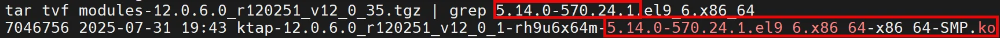{ width="99%" }](../images/ktap23.webp) 

1. Generate some database activity on **raptor** and verify whether it is captured by the agent. Switch the session context to the **postgres** user and use the native *PostgreSQL* client to execute a dummy query. Check Full SQL (Training) report to confirm that traffic is visible.
```bash linenums="1"
su - postgres

psql
```
```sql linenums="1"
SELECT 'activity with kernel 5.14.0-570.24.1.el9_6 and STAP 12.0.6.0_r120251_35';

\q

exit
```
[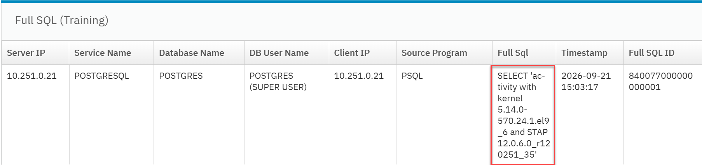{ width="99%" }](../images/ktap57.webp) 

## KTAP with flex module

1.	This time, you will switch to kernel **5.14.0-570.62.1.el9_6.x86_64**, but before doing so, verify on <https://ibm.github.io/guardium-ktap/> the support for this version for **12.0** agent.
It turns out there is no precompiled module available for this kernel version, but you can use the *Flex* (EXACT-LIKE) mechanism, which allows loading a module built for a kernel version close to the target one.
[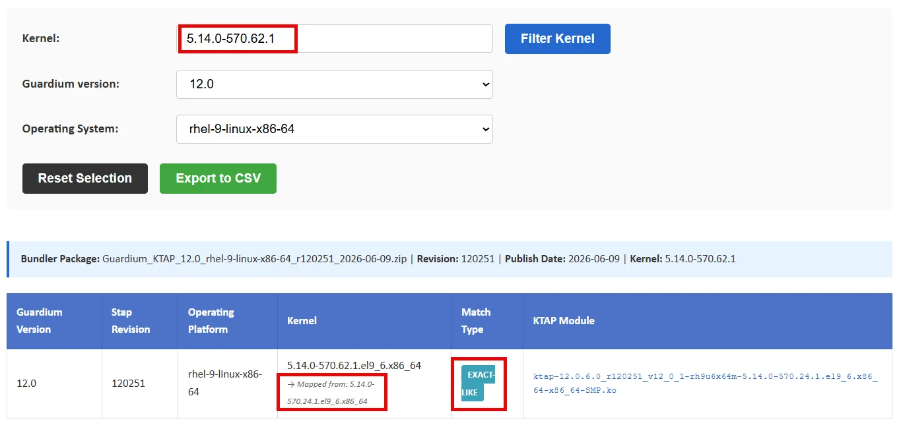{ width="99%" }](../images/ktap24.webp) 

1.	You can also verify exactly which compiled modules can be used as *Flex* (EXACT LIKE) for the target kernel. The file `ktap-combos.txt` contains their list. In this case, the currently installed *revision 35* includes three modules that can be used with kernel **5.14.0-570.62.1.el9_6**.
```sql linenums="1"
cd /opt/guardium/modules/KTAP/current

cat ktap-combos.txt | grep 5.14.0-570.62.1.el9_6
```
[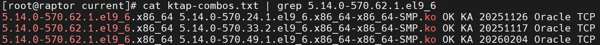{ width="99%" }](../images/ktap25.webp) 

1.	Before upgrading the kernel, enable support for *Flex* modules. In the **cm** UI, go to **Setup by Client**, and for *revision 35*, add the additional parameter **KTAP_ALLOW_MODULE_COMBOS** with the value **Y**.
[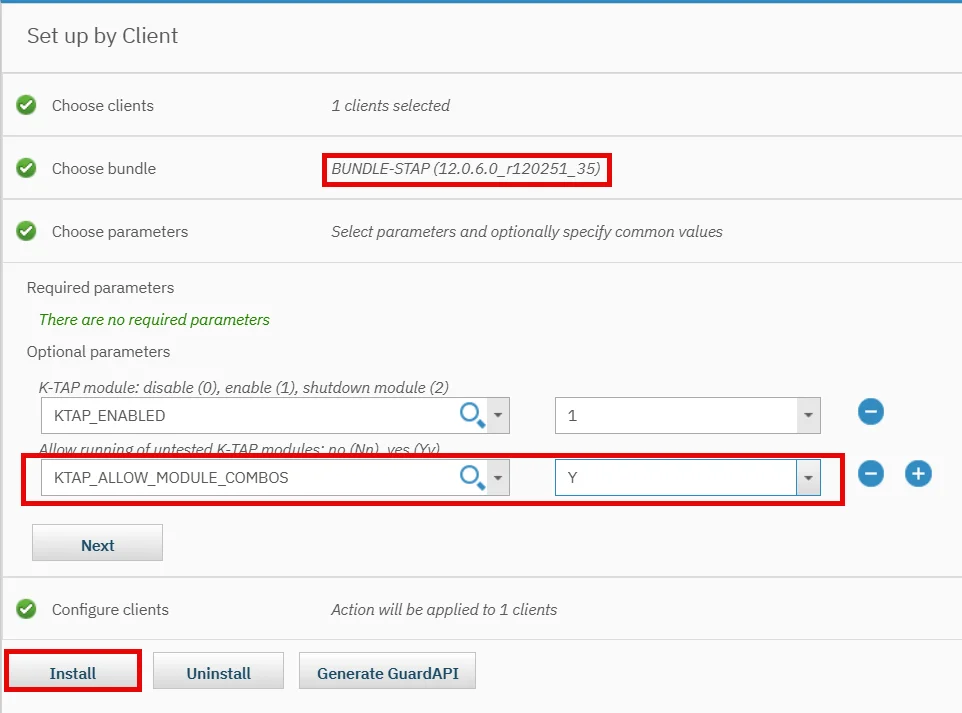{ width="99%" }](../images/ktap26.webp) 
 
1.	Now upgrade the kernel and reboot the system.
```bash linenums="1"
dnf install kernel-5.14.0-570.62.1.el9_6.x86_64 -y

shutdown -r now
```
1.	Check again whether the *KTAP* module is available and notice that it is still using the module built for version **5.14.0-570.24.1**, which is compatible with kernel **5.14.0-570.62.1**.
```bash linenums="1"
lsmod | grep ktap

modinfo ktap
```
[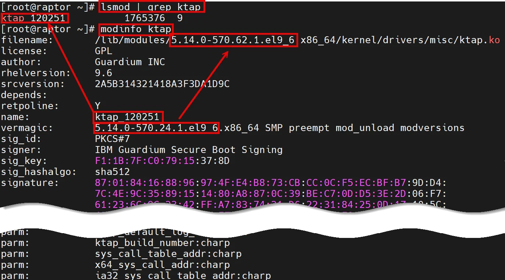{ width="99%" }](../images/ktap27.webp) 

1.	Additionally check `/var/log/ktap_install.log` and notice that module compiled for kernel **5.14.0-570.24.1.el9_6** has been selected as flexible to cover currently installed.
```bash
cat /var/log/ktap_install.log
```
[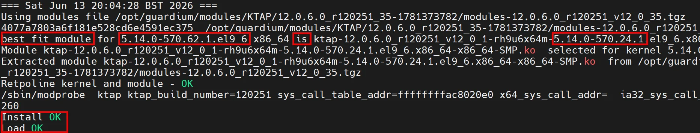{ width="99%" }](../images/ktap28.webp) 

1.	Generate some database activity on **raptor** and verify whether it is captured by the agent. Switch the session context to the **postgres** user and use the native *PostgreSQL* client to execute a dummy query.
```bash linenums="1"
su - postgres

psql
```
```sql linenums="1"
SELECT 'activity with FLEX module on kernel 5.14.0-570.62.1.el9_6 and STAP 12.0.6.0_r120251_35';

\q

exit
``` 
[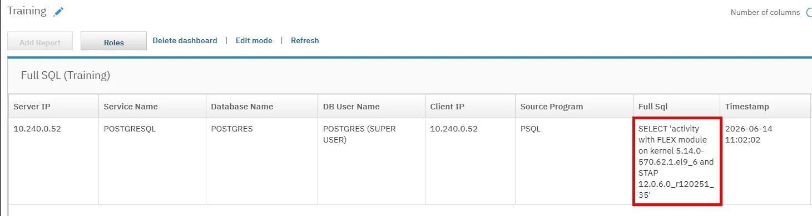{ width="99%" }](../images/ktap29.webp) 

## Uninstall STAP

1.	Now simulate a common troubleshooting mistake—attempting to reinstall the agent while the *KTAP* module is still loaded. First, uninstall the *STAP* agent. In **Setup by Client**, select the currently installed *STAP* version (**12.0.6.0_r120251_35**) and click **Uninstall**. Confirm that the agent has been successfully removed.
[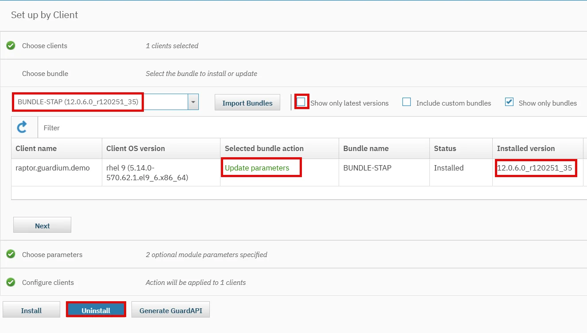{ width="99%" }](../images/ktap30.webp) 
 
1.	Refresh **Status** pop-up till message that *BUNDLE-STAP is NOT_INSTALLED* will appear.
[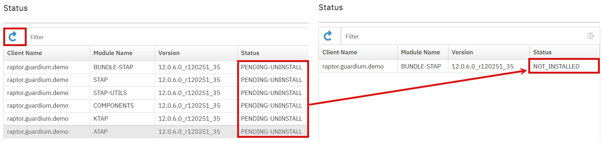{ width="99%" }](../images/ktap31.webp) 
 
1.	Try again install **BUNDLE-STAP 12.0.6.0_r120251_35** again.

    !!! note "Set parameters:"
        - *KTAP_ALLOW_MODULE_COMBOS*: **Y**
        - *KTAP_ENABLED*: **1**
        - *STAP_SQLGUARD_IP*: **&lt;coll1.demo.guardium>**

    [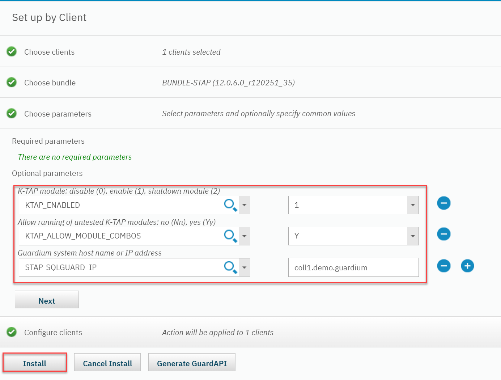{ width="99%" }](../images/ktap32.webp) 
 
1.	This time the installation will fail because previously installed kernel module was not unloaded
[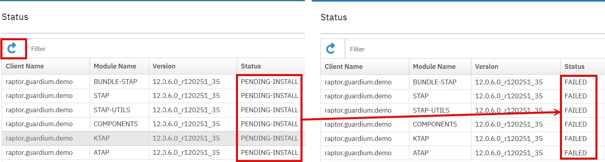{ width="99%" }](../images/ktap33.webp) 
 
1.	Uninstallation process does not include the kernel module unload (what is very dangerous command on heavily used production systems). That is why the module will disappear only after system reboot. Because of that, any try to install *STAP* again will fail because of old *KTAP* appearance in kernel space. Check `ktap_install.log` to on **raptor** to confirm this situation.
```bash
cat /var/log/ktap_install.log
```
[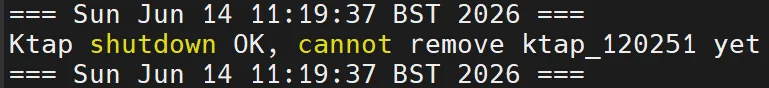{ width="59%" }](../images/ktap34.webp) 
 
1.	Also `lsmod` command provides information that *KTAP* module from previous installation is still loaded and `modinfo` will point that module file has been removed from filesystem
```bash linenums="1"
lsmod | grep ktap

modinfo ktap
```
[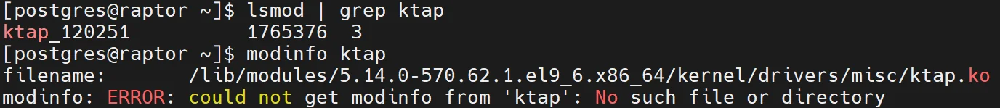{ width="99%" }](../images/ktap35.webp) 

1.	Restart **raptor** machine to clean up kernel space
```bash
shutdown -r now
```

## STAP upgrade

1.	Install again **BUNDLE-STAP 12.0.6.0_r120251_35**.

    !!! note "Set parameters:"
        - *KTAP_ALLOW_MODULE_COMBOS*: **Y**
        - *KTAP_ENABLED*: **1**
        - *STAP_SQLGUARD_IP*: **&lt;coll1.demo.guardium>**

    [{ width="99%" }](../images/ktap32.webp) 

1.	This time, the installation succeeded because the raptor system was rebooted and the previously loaded module was unloaded. 
```bash
lsmod | grep ktap
```
[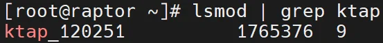{ width="43%" }](../images/ktap36.webp) 

1.	To upgrade *STAP* from **12.0.6** to **12.2.2.0** select in **cm** UI in the **Set up by Client** select *raptor GIM client* and choose **BUNDLE-STAP 12.2.2.0_r123489_3**.
[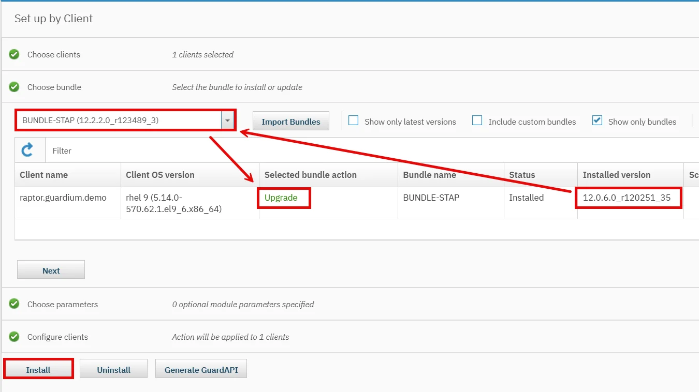{ width="99%" }](../images/ktap37.webp) 
 
1.	Upgrade *STAP* by pressing **Install** button and confirm that it was successful.
[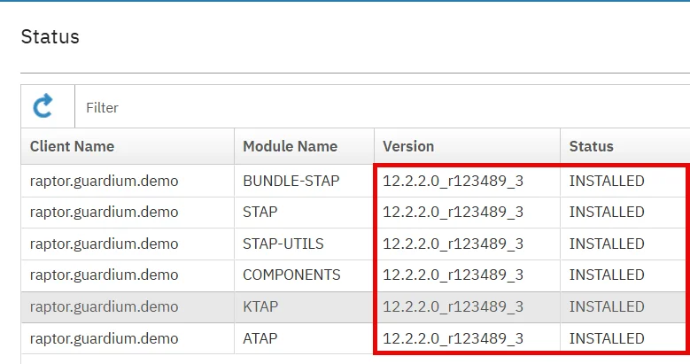{ width="79%" }](../images/ktap38.webp) 
 
1.	Check *KTAP* modules loaded on **raptor** machine and noticed that we have two of them for builds **120251** (*12.0.6*) and **123489** (*12.2.2.0*). The older one will be unloaded after next system reboot
```bash
lsmod | grep ktap
```
[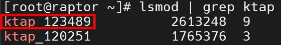{ width="43%" }](../images/ktap39.webp)  

1.	Confirm that **12.2.2** has precompiled module for **5.14.0-570.62.1.el9_6**.
```bash
modinfo ktap
```
[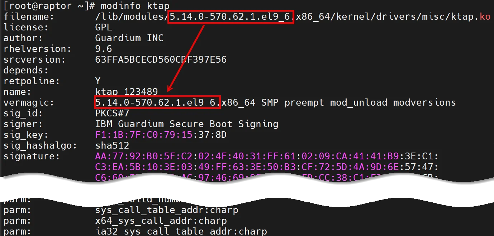{ width="99%" }](../images/ktap40.webp)

1.	Generate some database activity on **raptor** and verify whether it is captured by the agent. Switch the session context to the **postgres** user and use the native *PostgreSQL* client to execute a dummy query.
```bash linenums="1"
su - postgres

psql
```
```sql linenums="1"
SELECT 'activity with EXACT module on kernel 5.14.0-570.62.1.el9_6 and STAP 12.2.2.0_r123489_3 after upgrade';

\q

exit
```
[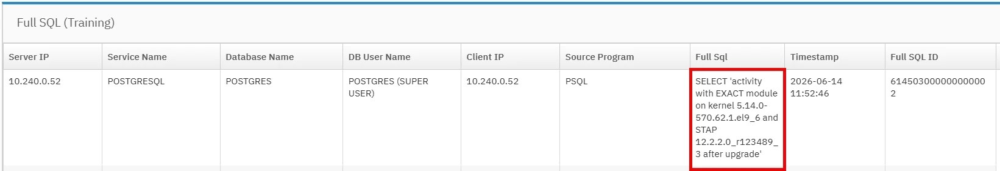{ width="99%" }](../images/ktap41.webp)

1.	Restart **raptor** machine.
```bash
shutdown -r now
```

1.	And then check that only the latest module (*12.2.2.0*) is now loaded only into kernel.
```bash
lsmod|grep ktap
```
[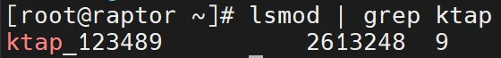{ width="39%" }](../images/ktap42.webp)

1.	To disable *Flex* module support we must uninstall STAP agent because flag **STAP_ALLOW_MODULE_COMBO** cannot be switched off if is set to **Y** before. Reboot **raptor** system again.
```bash linenums="1"
/opt/guardium/modules/GIM/current/uninstall.pl

shutdown -r now
```

## Self compiled kernel module

1.	Install *GIM client* again on **raptor**.
```bash linenums="1"
cd /opt/guardium_tz_bootcamp_automation/upload/source_files/agents/shell/

./guard-bundle-GIM-12.2.2.0_r123489_v12_x_1-rhel-9-linux-x86_64.gim.sh -- --dir /opt/guardium --tapip <raptor_ip> --sqlguardip <cm_ip>
```

1.	Then install **STAP 12.2.2.0_r123489_3** without *Flex* module support.

    !!! note "Set parameters:"
        - *KTAP_ALLOW_MODULE_COMBOS*: **N**
        - *KTAP_ENABLED*: **1**
        - *STAP_SQLGUARD_IP*: **&lt;coll1.demo.guardium>**
        - *KTAP_PREVENT_EXACT_MATCH_BUILD*: **N**
    
    Also note that variable **KTAP_PREVENT_EXACT_MATCH_BUILD** is set to **N** as a default, which means the system will attempt to compile the module if it is not available in the distribution. This variable cannot be changed after the agent is installed. If you want the agent to skip compilation attempts, it must be set to **Y** during the agent installation.

    [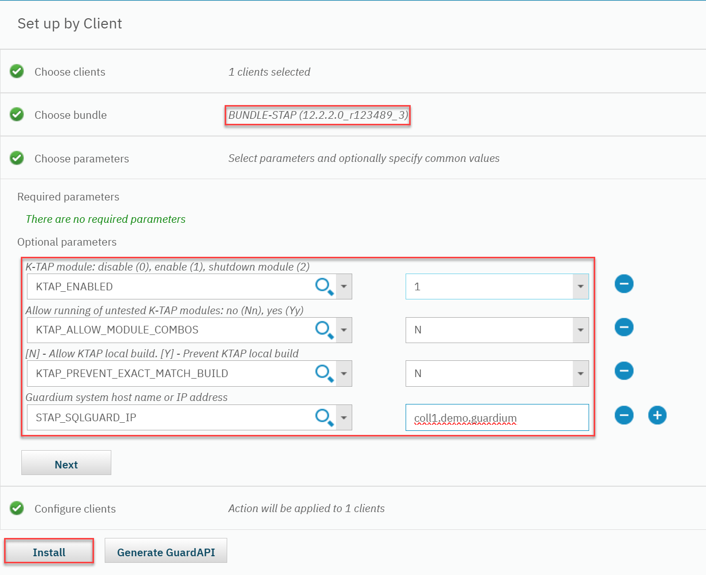{ width="99%" }](../images/ktap43.webp)
 
1.	Check the version of initially installed kernel on **raptor** machine. Your kernel version may be newer than the one shown in the screenshot, as the cloud environment is automatically updated with important kernel releases. 
```bash
grubby --info=ALL
```
[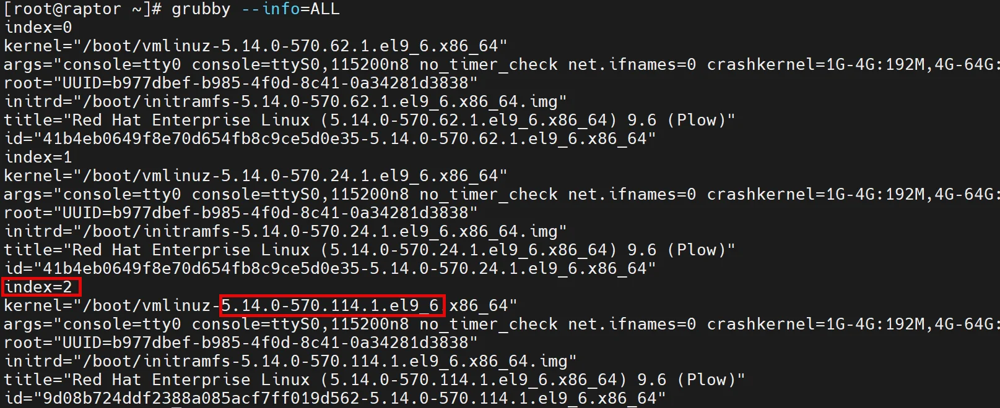{ width="99%" }](../images/ktap44.webp)
 
1.	Regardless of which kernel version is currently the latest, it is not supported by the currently installed agent **12.2.2.0_r123489_3** using precompiled module.
1.	Set the latest available kernel as active and reboot the system.
```bash linenums="1"
grubby --set-default-index=2

grubby --default-kernel

shutdown -r now
```
[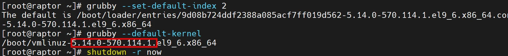{ width="99%" }](../images/ktap45.webp)

1.	After the reboot, it is not surprising that *KTAP* was not installed.
```bash linenums="1"
uname -r

modinfo ktap
```
[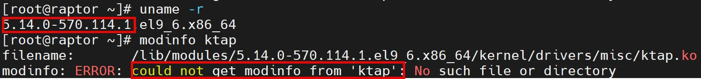{ width="99%" }](../images/ktap46.webp)

1.	The `/var/log/ktap_install.log` clearly shows that the *Flex* module was not loaded because the feature was disabled, and no compilation attempt was made since the required kernel development environment is missing.
```bash
cat /var/log/ktap_install.log
```
[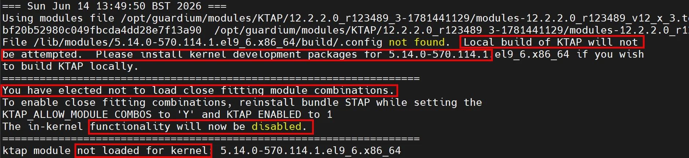{ width="99%" }](../images/ktap47.webp)
 
1.	To make kernel module compilable install `kernel-devel` for current kernel version
```bash
dnf install -y kernel-devel-$(uname -r)
```

1.	Go back to the agent configuration on **raptor**, set *KTAP_ENABLED* from **0** to **1**, and confirm the change.
[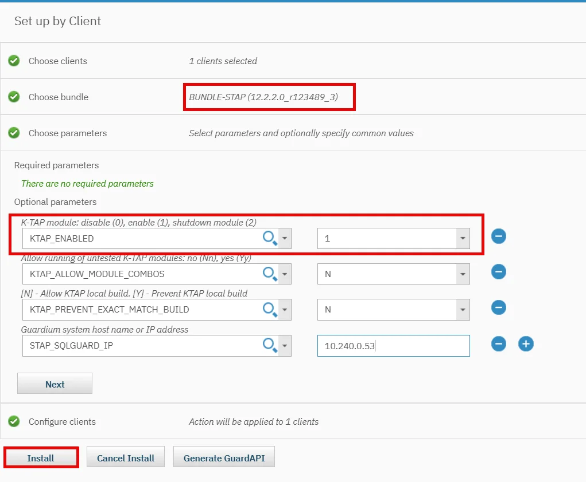{ width="89%" }](../images/ktap48.webp)

1.	Check `/var/log/ktap_install.log` again and notice that kernel module has been compiled this time.
```bash linenums="1"
cat /var/log/ktap_install.log
``` 
[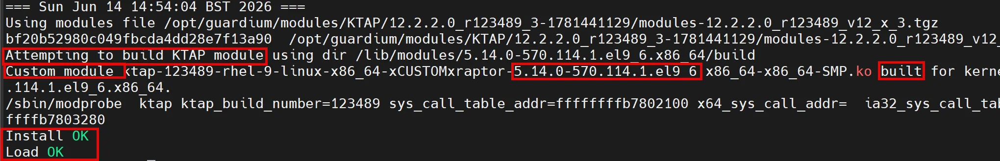{ width="99%" }](../images/ktap49.webp)

1.	Check if the module has been loaded
```bash
modinfo ktap
``` 
[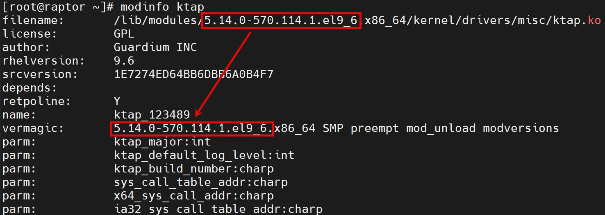{ width="99%" }](../images/ktap50.webp)

1.	Generate some database activity on **raptor** and verify whether it is captured by the agent. Switch the session context to the **postgres** user and use the native *PostgreSQL* client to execute a dummy query.
```bash linenums="1"
su - postgres

psql
```
```sql linenums="1"
SELECT 'activity with CUSTOM module on kernel 5.14.0-570.114.1.el9_6 and STAP 12.2.2.0_r123489_3';

\q

exit
```
[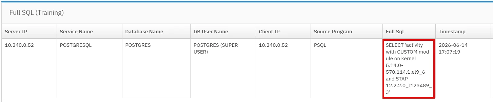{ width="99%" }](../images/ktap51.webp)

## Practical custom modules usage

1.	Compiling modules appears to be the most effective approach for managing agents in environments with frequent Linux kernel updates. However, the main drawback of this approach is the requirement to have development tools available on monitored/production systems, which in most cases violates security policies.

    In practice, kernel modules are therefore compiled in advance in a local development/test environment and then transferred to production, where they are loaded at the time of a kernel change.

1. Verify that the module compiled in the previous section is physically present in `/opt/guardium/modules/KTAP/current` and that its filename contains the xCUSTOMX label as well as the kernel version for which it was compiled.
```bash linenums="1"
cd /opt/guardium/modules/KTAP/current

ls
```
[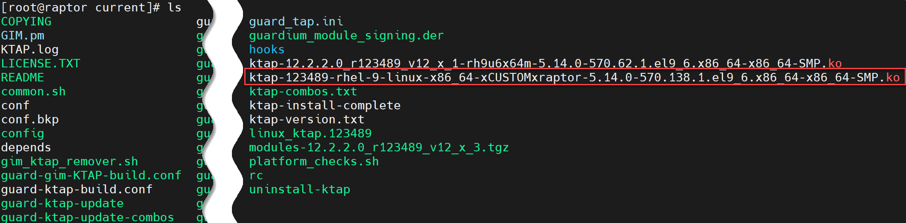{ width="99%" }](../images/ktap58.webp)

1.	There are two methods to manage this process: manual and using a *GIM server*. Let’s start by reviewing the manual process. The first method provides the possibility to add just compiled kernel module in `/opt/guardium/modules/KTAP/current` to modules archive (`modules-<agent_build_number>.tgz`) and manually copy it on target machine.
```bash linenums="1"
./guard_ktap_append_modules

tar tvf modules-12.2.2.0_r123489_v12_x_3.tgz | grep 5.14.0-570.114.1
```
[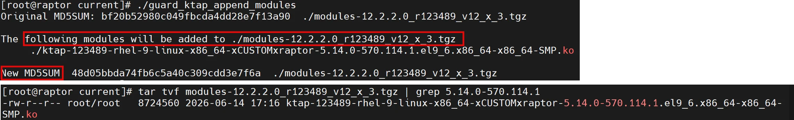{ width="99%" }](../images/ktap52.webp)

1.	Now simply copy the modules archive to a machine with the same agent version. After upgrading the kernel and rebooting, the module should be loaded automatically.

    However, remember that the decision to allow loading custom (externally provided) modules must be made during the *GIM agent* installation, which will be covered next.

1.	The second method involves installing a new agent revision using *GIM*, which should automatically appear on the *GIM server* after module compilation. This is the default behavior and can be controlled using the *STAP_UPLOAD_FEATURE* variable on source module agent.
	In the cm UI, open the **Upload Module** view. At the end of the list, a new entry should appear with revision *800* for **STAP 12.2.2.0_r123489**. This is the version uploaded by **raptor** after compiling the custom module in the previous section.
    [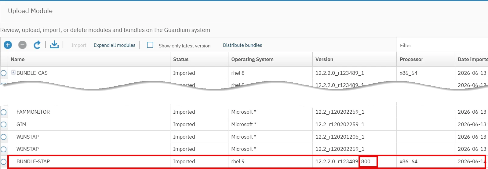{ width="99%" }](../images/ktap53.webp)

1.	However, to use this module, the *GIM client* must be installed with an additional option enabled.
To simulate installing a self-compiled module on a production machine, first completely uninstall *STAP* and *GIM*, and then reboot the **raptor** machine.
```bash linenums="1"
cd

/opt/guardium/modules/GIM/current/uninstall.pl

shutdown -r now
```

1.	Login to the **raptor** again. We must uninstall `kernel-devel` package to avoid module compilation during installation.
```bash
dnf -y remove kernel-devel-$(uname -r)
```

1.	Reinstall the *GIM client* with the additional option `install_customed_bundles`, which allows *STAP* to install custom modules provided from a lab/test environment.
```bash linenums="1"
cd /opt/guardium_tz_bootcamp_automation/upload/source_files/agents/shell/

./guard-bundle-GIM-12.2.2.0_r123489_v12_x_1-rhel-9-linux-x86_64.gim.sh -- --dir /opt/guardium --install_customed_bundles --tapip <raptor_ip> --sqlguardip <cm_ip>
```

1.	Then, install *STAP* on **raptor** using an agent with the compiled and packaged *CUSTOM KTAP* before - **12.2.2.0_r123489_800** (wait for raptor gim client appearance). You must unselect *Show only latest version* option and choose *Include custom bundles* to see the custom one.
Ensure that you disabled the *Flex* option. You will also need to confirm that you want to install the *custom module*. Finally, verify that the installation completed successfully.

    !!! note "Set parameters:"
        - *KTAP_ALLOW_MODULE_COMBOS*: **N**
        - *KTAP_ENABLED*: **1**
        - *STAP_SQLGUARD_IP*: **&lt;coll1.demo.guardium>**

    [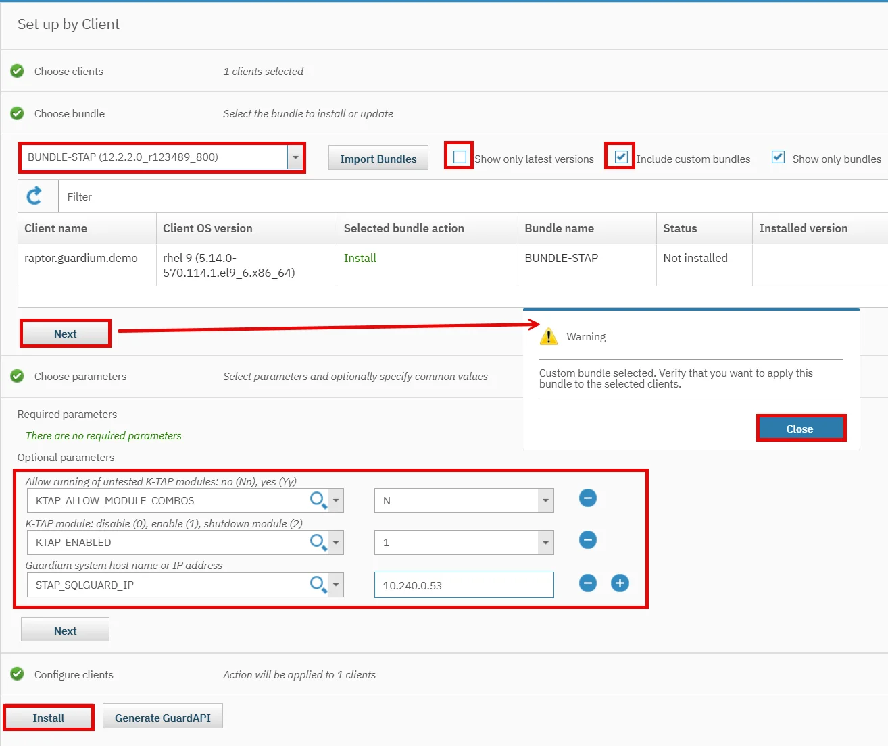{ width="99%" }](../images/ktap54.webp)
    [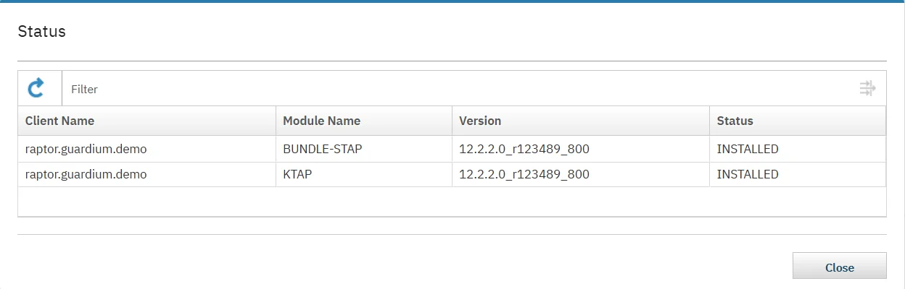{ width="99%" }](../images/ktap55.webp)
 
1.	Confirm that custom compiled and distributed by *GIM* kernel module was used
```bash linenums="1"
cat /var/log/ktap_install.log

modinfo ktap
```
[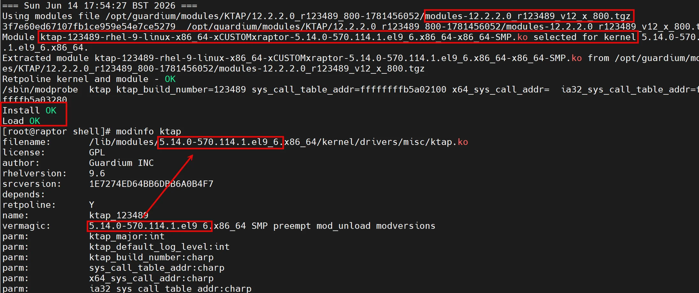{ width="99%" }](../images/ktap56.webp)

1.	To prepare the environment for the next lab, uninstall *STAP* and *GIM* on the **raptor** machine.
```bash linenums="1"
cd

/opt/guardium/modules/GIM/current/uninstall.pl

shutdown -r now
```

## Appendix

!!! note "Dependencies:"
    This chapter can be omitted if you are not interested in KTAP management on Linux machines. You can jump to ATAP lab.

!!! note "Resources:"
    1. Kernel modules locator    
    <https://ibm.github.io/guardium-ktap/index.html>

!!! note "Instructor notes:"