# Universal connector 1.0 - logstash based
	
## Cassandra configuration check

1.	On **sauropod** machine as a **root** confirm that *Cassandra* cluster is up.
```bash
nodetool status
```
[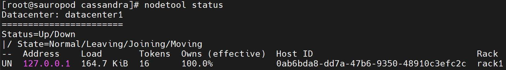{ width="99%" }](../images/logstash1.webp)

 
1.	Confirm that `audit.log` file appeared in `/var/log/cassandra/audit/`.
```bash
ls /var/log/cassandra/audit/audit.log
```
[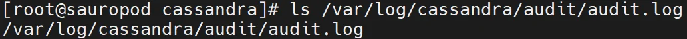{ width="99%" }](../images/logstash2.webp)

1.	Login to *Cassandra* on **sauropod** and generate some events.
```sql linenums="1"
cqlsh

CREATE KEYSPACE movies WITH REPLICATION = { 'class' : 'SimpleStrategy',     'replication_factor' : 1 };

use movies;

CREATE TABLE movie (id UUID PRIMARY KEY, m_title text, m_release int);

INSERT INTO movie (id, m_title, m_release) VALUES (uuid(), 'Alien', 1979);

select * from movie;

exit
```

1.	Check audit log to confirm that events are stored in.
```bash
cat /var/log/cassandra/audit/audit.log
```
[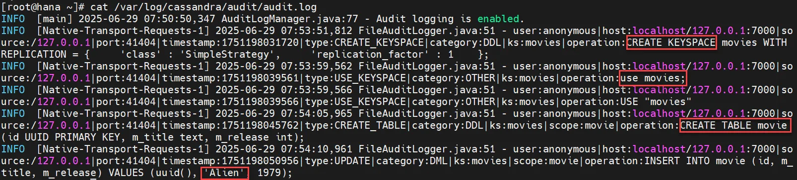{ width="99%" }](../images/logstash3.webp)

## Filebeat installation and setup

1.	Check the latest version of `filebeat` on *Elastic* web page - <https://www.elastic.co/downloads/beats/filebeat> 
[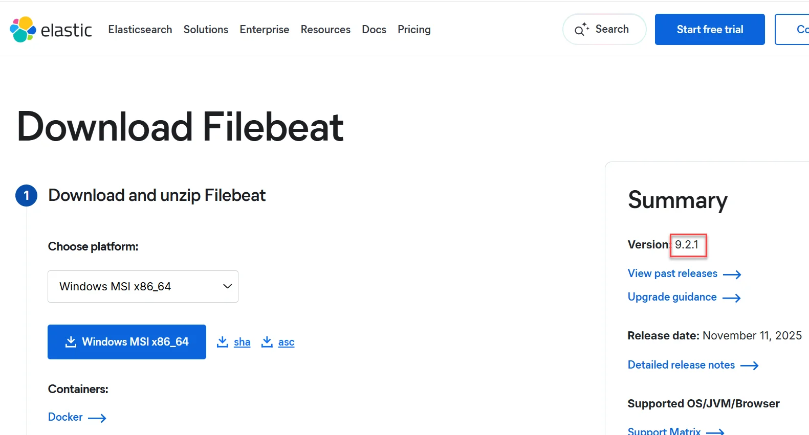{ width="99%" }](../images/logstash4.webp)
 
1.	Download the `filebeat` rpm (replace *filebeat_version* variable to the latest one) - on sauropod machine:
```bash linenums="1"
mkdir -p /root/lab_files

cd /root/lab_files

curl -L -O https://artifacts.elastic.co/downloads/beats/filebeat/filebeat-<filebeat_version>-x86_64.rpm
```

1.	Install `filebeat`.
```bash
dnf -y install /root/lab_files/filebeat-<filebeat_version>-x86_64.rpm
```

4.	Edit `/etc/filebeat/filebeat.yml`. Modify *filebeat.inputs* section to form below (use spaces in the indendation, it is *YAML* file, format is indentation aware!):
```yaml
- type: filestream
  id: "cassandra"
  enabled: true
  paths:
      - /var/log/cassandra/audit/audit.log
  exclude_lines: ['AuditLogManager']
  tags: ["cassandra"]
  multiline.type: pattern
  multiline.pattern: '^INFO'
  multiline.negate: true
  multiline.match: after
``` 
[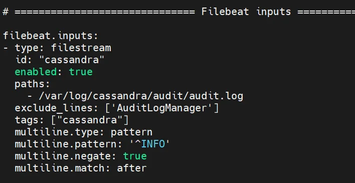{ width="69%" }](../images/logstash5.webp)
<BR>Comment or remove the entire section *output.elasticsearch*<BR>
[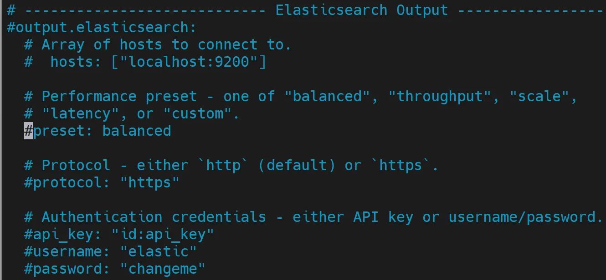{ width="79%" }](../images/logstash6.webp)
<BR>Modify *output.logstash* section to form below, it is important to use **coll1.demo.guardium** name because we will later set the encrypted connection between `filebeat` and **coll1**. Do not forget to uncomment *output.logstash* section row as well.
```yaml
# ------------------------------ Logstash Output ---------------------------
output.logstash:
  # The Logstash hosts
  hosts: ["coll1.gdemo.com:5047"]
```
[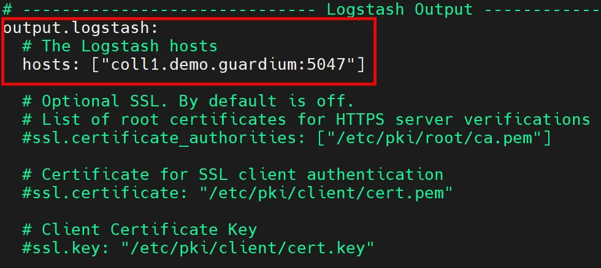{ width="69%" }](../images/logstash7.webp)

1.	Start *filebat* on **sauropod**.
```bash linenums="1"
systemctl start filebeat

systemctl status filebeat

systemctl enable filebeat
```

## Install and configure UC plugin

1.	Starting from **Guardium 12.1** the new architecture of *universal connectors* with *Kafka Connect* consumer was introduced. In this case the *UC* can be managed from Central Manager only. Still the legacy configuration workflow with logstash can be enabled and it will be used in this lab. To enable old configuration approach we must enable legacy workflow by executing this command on **coll1** (from **cli** session)
```bash
grdapi modify_guard_param paramName=LEGACY_UC_CONFIG_ENABLED paramValue=1
```

1.	Run *universal connector* engine on **coll1**.
```bash
grdapi run_universal_connector
```

1.	There is only one *Cassandra* filter plugin version – **1.0.1** and it is preinstalled on **coll1**.
You can check a list of all actually available *universal connector plugins* on appliance by execution command below on coll1:
```bash
grdapi show_universal_connector_plugins
``` 
[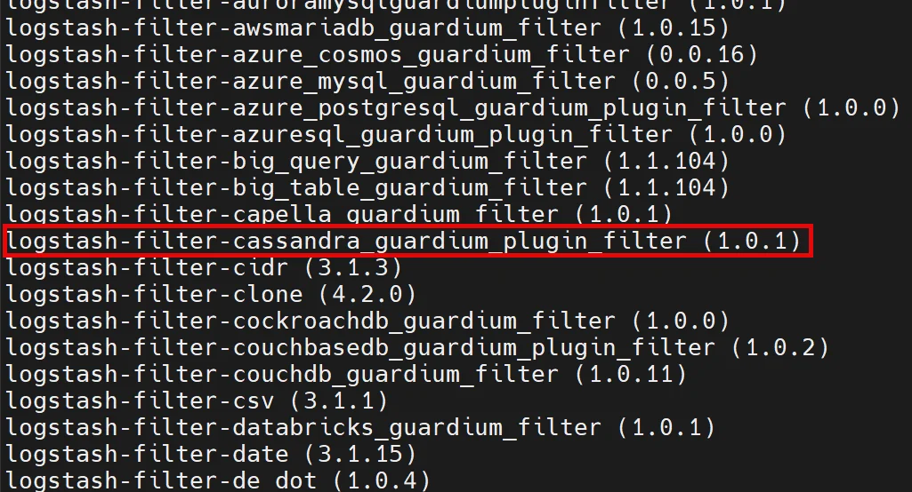{ width="79%" }](../images/logstash8.webp)
<BR>One on the list is `cassandra_guardium_plugin_filter` – revision **1.0.1**.
If new *universal connector plugin* version will be released and it is not preloaded on your collector you should upload it on appliance (it is not our case).

1.	Login to **coll1** UI, confirm that there is no *universal connectors* configured (**Configure Universal Connector** view), the *universal connector engine* is running and add new instance using icon { width="18" }.
[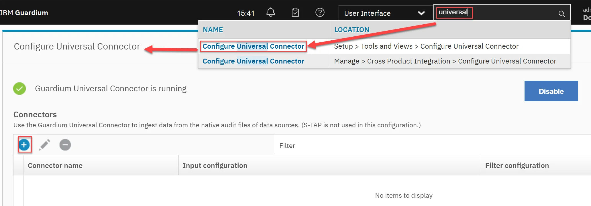{ width="99%" }](../images/logstash10.webp)

1.	Configure *universal connector* instance for *Cassandra* with *Connector name* set to **cassandra**.
[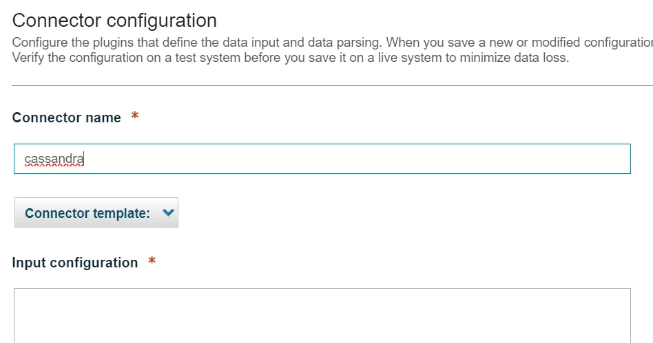{ width="99%" }](../images/logstash11.webp)
In the Input configuration section modify port used in filebeat configuration (select appropriate port). Use spaces for indentation:
```yaml
beats {
  port => "5047"
  type => "filebeat"
}
```
[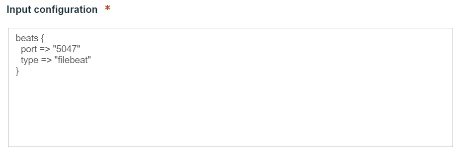{ width="99%" }](../images/logstash12.webp)
In the Filter configuration section replace content by configuration below:
```yaml
if [type] == "filebeat" {
  mutate { add_field => { "serverIP" => "%{[@metadata][ip_address]}" } add_field   => { "serverHostname" => "%{[host][name]}" } }
  cassandra_guardium_plugin_filter{}
  mutate { remove_field => ["serverHostname","@version","@timestamp","type","sequence","message","host","tags","input","log","ecs","agent","serverIP"]}
}
```
[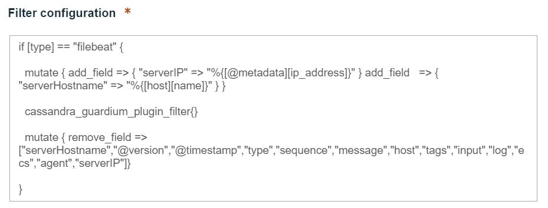{ width="99%" }](../images/logstash13.webp)

1.	Save configuration and wait a while for success confirmation (takes a while).
[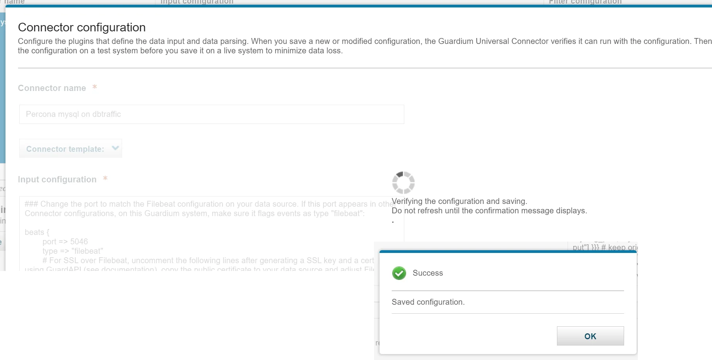{ width="99%" }](../images/logstash14.webp)
 
1.	Confirm that new instance is displayed on the list
[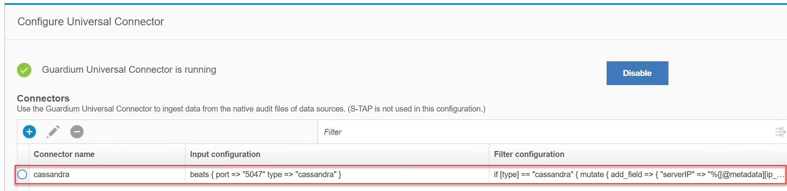{ width="99%" }](../images/logstash15.webp)

1.	Open **S-TAP Status** view. You should see a new *Cassandra* universal connector instance listed. If the status will be *Inactive* it means that there is no currently traffic processes but our configuration but universal connector is set correctly.
[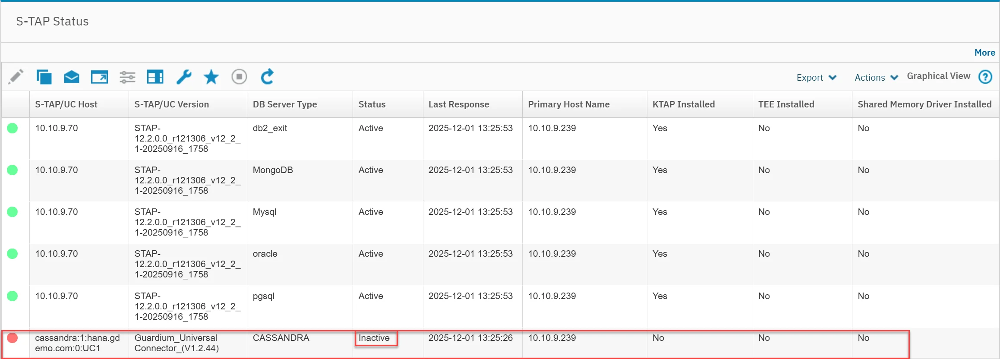{ width="99%" }](../images/logstash16.webp)

## Check traffic visibility

1.	Execute some activity in *Cassandra* instance on *sauropod*.
```sql linenums="1"
cqlsh

use movies;

INSERT INTO movie (id, m_title, m_release) VALUES (uuid(), 'Aliens', 1986);

INSERT INTO movie (id, m_title, m_release) VALUES (uuid(), 'Alien 3', 1992);

INSERT INTO movie (id, m_title, m_release) VALUES (uuid(), 'Alien: Resurrection', 1997);

INSERT INTO movie (id, m_title, m_release) VALUES (uuid(), 'Alien: Romulus', 2024);

INSERT INTO movie (id, m_title, m_release) VALUES (uuid(), 'Alien: Earth', 2025);

select * from movie;

exit;
```
[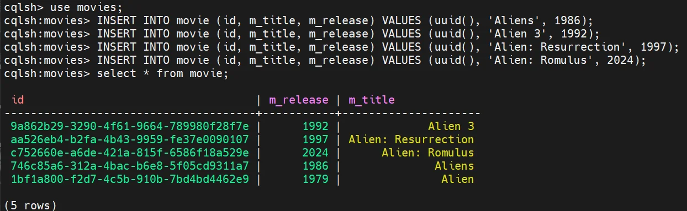{ width="99%" }](../images/logstash17.webp)
 
1.	Check *Full SQL (Training)* report on **coll1**.
[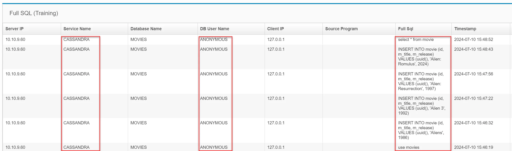{ width="99%" }](../images/logstash18.webp)
 
1.	In the **coll1** UI open **S-TAP Status** view. Just installed universal connector instance should be now *Active*. 
[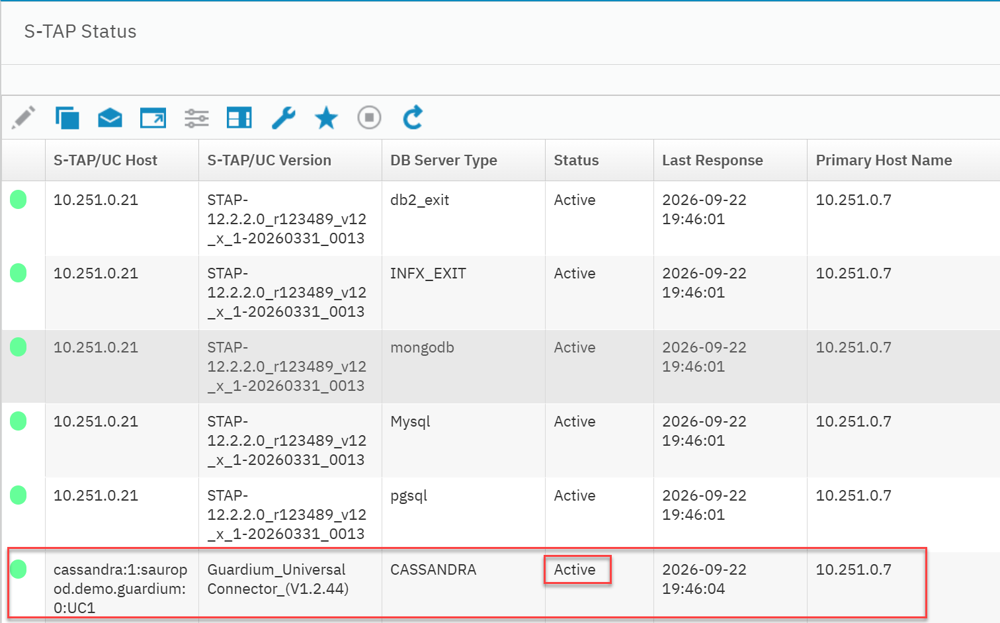{ width="99%" }](../images/logstash19.webp)

## Set TLS connection between filebeat and logstash (optional)

1.	On **coll1** regenerate self-signed certificate for universal connector and copy public certificate to buffer (domain is **demo.guardium**)
```bash
grdapi generate_ssl_key_universal_connector overwrite=1 hostname=*.demo.guardium
```
[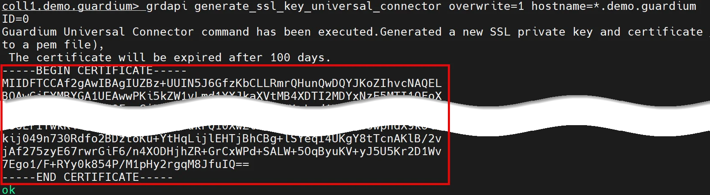{ width="99%" }](../images/logstash20.webp)
 
1.	Save just created above certificate into the file `/etc/filebeat/guardium.pem` on **sauropod** machine.<BR>
[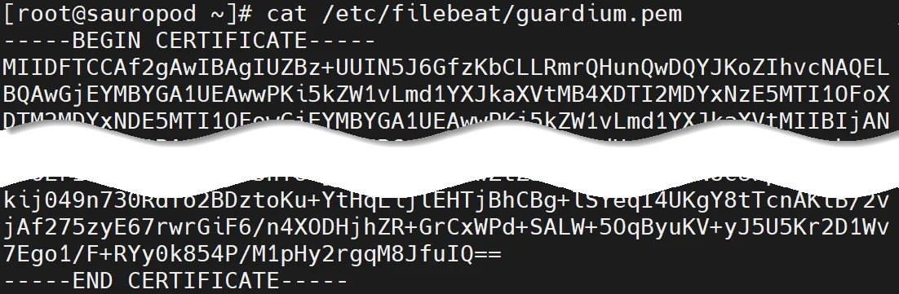{ width="79%" }](../images/logstash21.webp) 

1.	Check *logstash* TLS support on the **coll1** by checking the server port and notice that TLS is not available.
```bash
openssl s_client -connect coll1.demo.guardium:5047
```
[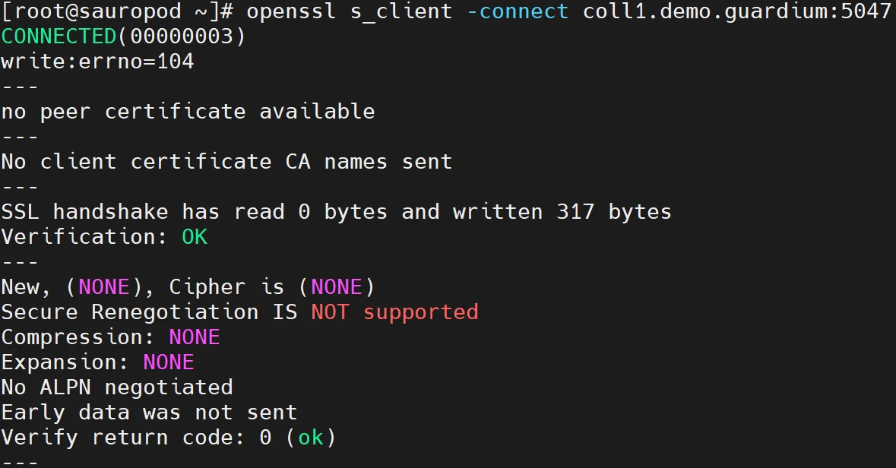{ width="79%" }](../images/logstash22.webp) 

1.	Login to **coll1** UI and edit *universal connector* instance definition (**Configure Universal Connector** view). Add some lines related to use encrypted communication between filebeat and logstash in the *Input configuration* section (remember about correct indentation):
```yaml
  ssl => true
  ssl_certificate => "${SSL_DIR}/cert.pem"
  ssl_key => "${SSL_DIR}/key.pem"
```
[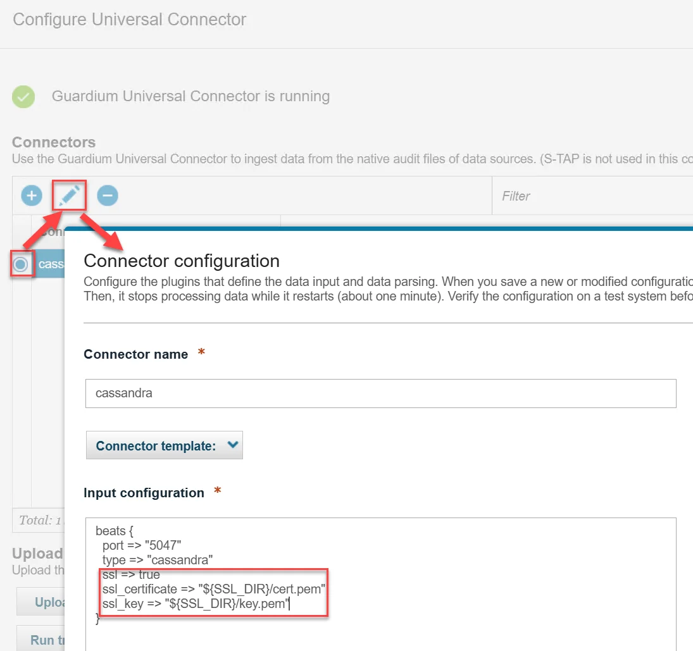{ width="79%" }](../images/logstash23.webp) 
 
1.	Check TLS *logstash* readiness on **coll1** from **sauropod** machine
```bash
openssl s_client -connect coll1.demo.guardium:5047 < /dev/null
```
[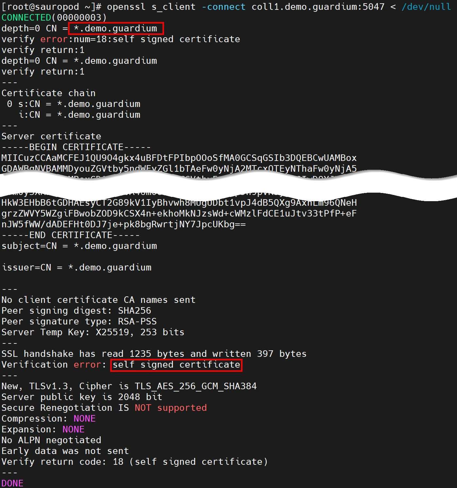{ width="89%" }](../images/logstash24.webp) 

1.	Modify *output.logstash* section in `/etc/filebeat/filebeat.yml` store on **sauropod** machine by enabling *ssl.certificate_authorities* parameter with path to file created in point 2 (`/etc/filebeat/guardium.pem`)
[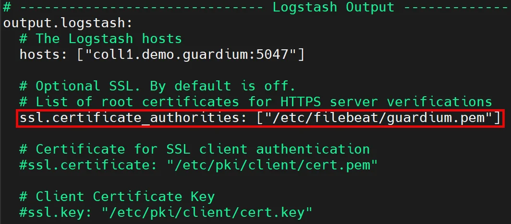{ width="75%" }](../images/logstash25.webp)  

1.	Restart filebeat service on sauropod machine
```bash linenums="1"
systemctl restart filebeat

systemctl status filebeat
```

1.	Execute again some SQL’s
```sql linenums="1"
cqlsh

use movies;

SELECT * FROM movie;

select * from movie where m_release > 2000 ALLOW FILTERING;

exit;
```
[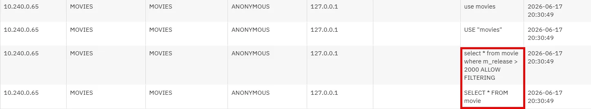{ width="99%" }](../images/logstash26.webp) 

## Appendix

!!! note "Dependencies:"
    If your goal is not related to practicing universal connectors based on *logstash*, you may skip this lab, with the understanding that some of the other labs may refer to a non existent instance of the Cassandra universal connector in your environment.
    I suggest do not deploy *logstash* and later kafka based traffic to **coll1**, so do not join these two labs one after another.

!!! note "Resources:"
    - Universal Connector documentation <https://www.ibm.com/docs/en/guardium/12.x?topic=guardium-universal-connector>
    - Filebeat logstash output documentation <https://www.elastic.co/guide/en/beats/filebeat/current/logstash-output.html>
    - Available UC plugins <https://github.com/IBM/universal-connectors/blob/main/docs/available_plugins.md>
    - Cassandra audit logging configuration <https://cassandra.apache.org/doc/stable/cassandra/operating/audit_logging.html#view-the-contents-of-auditlog-files>
    
!!! note "Instructor notes:"
