# Long Term Retention

## Generate background traffic

1.	On the **raptor** machine, navigate to the directory where the traffic generator is located.
```bash
cd /opt/guardium_tz_bootcamp_automation/upload/guardium_notes_dbtraffic
```

1.	Initiate traffic tool schema
```bash linenums="1"
source venv/bin/activate

guardium-notes-dbtraffic --config config/pgsql.yaml run --duration 600
```
[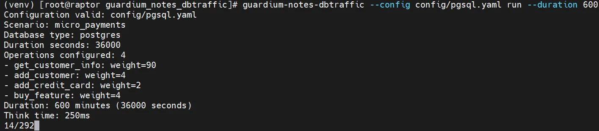{ width="99%" }](../images/ltr3.webp) 
1.	Confirm that traffic is visible in the *Full SQL (Training)* report on the Training dashboard on the **coll1**. Keep this session opened to generate traffic in the background.
[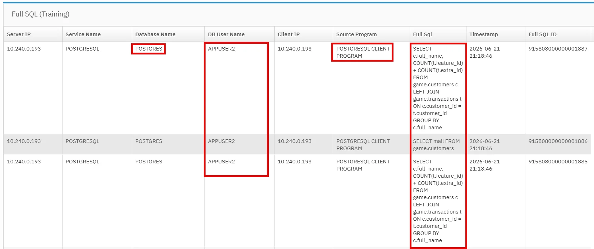{ width="99%" }](../images/ltr4.webp) 
	
## Setup S3 bucket for LTR (seaweedFS)

1.	First, on the **raptor**, we will create certificates that will be used by the *seaweedFS* service. We start with the directory structure.
```bash linenums="1"
mkdir -p /opt/seaweedfs/{data,certs,nginx}

mkdir -p /opt/seaweedfs/certs/ca

```

1.	Create the *CA* certificate and copy it to the `/home/seaweedfs` subdirectory
```bash linenums="1"
openssl genrsa -out /opt/seaweedfs/certs/ca/ca.key 4096

openssl req -x509 -new -nodes -key /opt/seaweedfs/certs/ca/ca.key -sha256 -days 3650 -subj "/CN=seaweedFS-Root-CA" -out /opt/seaweedfs/certs/ca/ca.crt

```

1.	Add the new *CA* certificate to the trusted certificates on the **raptor**.
```bash linenums="1"
cp /opt/seaweedfs/certs/ca/ca.crt /etc/pki/ca-trust/source/anchors/

update-ca-trust
```

1.	Create the private key for the *seaweedFS* service certificate and then generate the *CSR*.
```bash linenums="1"
openssl genrsa -out /opt/seaweedfs/certs/tls.key 4096 && chmod 600 /opt/seaweedfs/certs/tls.key

openssl req -new -key /opt/seaweedfs/certs/tls.key -out /opt/seaweedfs/seaweedfs.csr -subj "/CN=seaweedfs.demo.guardium" -addext "subjectAltName=DNS:raptor.demo.guardium,IP:<raptor_IP_address>"
```

1.	Create the *seaweedFS* certificate based on the new *CA* and the *CSR*. Insert the correct IP address of **raptor** machine!
```bash
openssl x509 -req -in /opt/seaweedfs/seaweedfs.csr -CA /opt/seaweedfs/certs/ca/ca.crt -CAkey /opt/seaweedfs/certs/ca/ca.key -CAcreateserial -out /opt/seaweedfs/certs/tls.crt -days 3600 -sha256 -copy_extensions copy
```

1. Create file with full certificate chain and set the correct access to files in `seaweedfs` directory.
```bash linenums="1"
cat /opt/seaweedfs/certs/tls.crt /opt/seaweedfs/certs/ca/ca.crt > /opt/seaweedfs/certs/fullchain.crt

chmod 644 /opt/seaweedfs/certs/*

chmod 600 /opt/seaweedfs/certs/tls.key /opt/seaweedfs/certs/ca/ca.key

chcon -Rt container_file_t /opt/seaweedfs
```

1. Create **nginx** configuration file `/opt/seaweedfs/nginx/nginx.conf`.
```nginx
events {
    worker_connections 1024;
}

http {
    upstream seaweedfs_s3 {
        server 127.0.0.1:8332;
    }

    server {
        listen 8333 ssl;
        server_name raptor.demo.guardium _;

        ssl_certificate /etc/nginx/certs/fullchain.crt;
        ssl_certificate_key /etc/nginx/certs/tls.key;

        # Zwiększenie limitu uploadu dla S3
        client_max_body_size 0;

        location / {
            proxy_pass http://seaweedfs_s3;
            proxy_set_header Host $http_host;
            proxy_set_header X-Real-IP $remote_addr;
            proxy_set_header X-Forwarded-For $proxy_add_x_forwarded_for;
            proxy_set_header X-Forwarded-Proto $scheme;

            # Wymagane dla streamingu dużych plików S3
            proxy_http_version 1.1;
            proxy_request_buffering off;
        }
    }
}
```

1. Create file to define **s3admin** user - `/opt/seaweedfs/s3.json`. Set you own *secret key* value.
```json
{
  "identities": [
    {
      "name": "s3admin",
      "credentials": [
        {
          "accessKey": "s3admin",
          "secretKey": "<your s3 secret>"
        }
      ],
      "actions": [
        "Admin",
        "Read",
        "Write",
        "List"
      ]
    }
  ]
}
```

1. Create `/opt/seaweedfs/security.toml` file with key. As a key used random value, for example generate by command:
```bash
openssl rand -hex 32
```
`/opt/seaweedfs/security.toml` content:
```toml
[jwt.filer_signing]
key = "<random hex value>"

[jwt.filer_signing.read]
key = "<random hex value>"
```

1. Set correct rights to **nginx** config file.
```bash linenums="1"
chmod 644 /opt/seaweedfs/nginx/nginx.conf
chmod 644 /opt/seaweedfs/s3.json
chmod 644 /opt/seaweedfs/security.toml
chcon -t container_file_t /opt/seaweedfs/nginx/nginx.conf
chcon -t container_file_t /opt/seaweedfs/s3.json
chcon -t container_file_t /opt/seaweedfs/security.toml
```

1. Create *quadlet* file for *seaweedfs* service - `/etc/systemd/system/seaweedfs-stack.service`.
```toml
[Unit]
Description=SeaweedFS S3 + Nginx TLS Proxy Stack
After=network-online.target
Wants=network-online.target

[Service]
Restart=always
TimeoutStartSec=120

ExecStartPre=-/usr/bin/podman pod rm -f seaweedfs-pod
ExecStartPre=/usr/bin/podman pod create --name seaweedfs-pod -p 8333:8333 -p 9333:9333

ExecStartPre=/usr/bin/podman run -d --pod seaweedfs-pod --name seaweedfs-server \
  -v /opt/seaweedfs/data:/data:z \
  -v /opt/seaweedfs/s3.json:/etc/seaweedfs/s3.json:ro,z \
  -v /opt/seaweedfs/security.toml:/etc/seaweedfs/security.toml:ro,z \
  chrislusf/seaweedfs:latest server -dir=/data -filer -s3 -s3.port=8332 -s3.iam.config=/etc/seaweedfs/s3.json

ExecStartPre=/usr/bin/sleep 2

ExecStart=/usr/bin/podman run --rm --pod seaweedfs-pod --name seaweedfs-proxy \
  -v /opt/seaweedfs/nginx/nginx.conf:/etc/nginx/nginx.conf:ro,z \
  -v /opt/seaweedfs/certs:/etc/nginx/certs:ro,z \
  docker.io/library/nginx:alpine nginx -g "daemon off;"

ExecStop=/usr/bin/podman pod stop seaweedfs-pod
ExecStopPost=/usr/bin/podman pod rm -f seaweedfs-pod

[Install]
WantedBy=multi-user.target
```

1.	Open the *TLS* port (8333).
```bash linenums="1"
firewall-cmd --permanent --add-port=8333/tcp

firewall-cmd --reload
```

1. Now we can start the seaweedFS container.
```bash linenums="1"
systemctl daemon-reload

systemctl enable --now seaweedfs-stack

systemctl start --now seaweedfs-stack
```

1. Check *TLS* connection to service.
```bash
openssl s_client -connect raptor.demo.guardium:8333 -servername raptor.demo.guardium </dev/null 2>/dev/null | openssl x509 -noout -text | grep -E "(Issuer:|Subject:|Not After|DNS:|IP Address:)"
```
[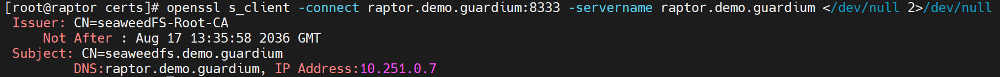{ width="99%" }](../images/ltr1.webp)

1.	Install the **AWS** client.
```bash
cd

curl "https://awscli.amazonaws.com/awscli-exe-linux-x86_64.zip" -o "awscliv2.zip"

unzip awscliv2.zip

./aws/install

aws --version
```
[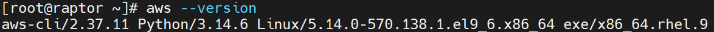{ width="99%" }](../images/ltr2.webp)

1.	Configure access to *seaweedFS*.

    !!! note "profile parameters:"
        - AWS Access Key ID: s3admin
        - AWS Secret Access Key: &lt;secret key defined in point 8>
        - Default region name: us-east-1
        - Default output format: json

    ```bash linenums="1"
    aws configure --profile seaweed

    aws configure set profile.seaweed.ca_bundle /opt/seaweedfs/certs/ca/ca.crt
    ```

    [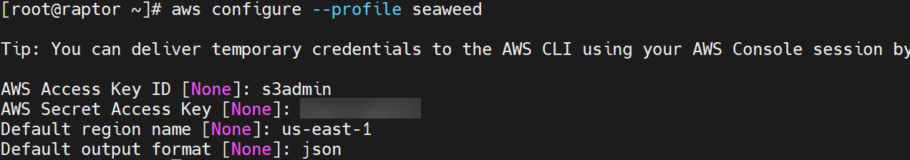{ width="99%" }](../images/ltr38.webp)

1. Create an *S3* bucket for *LTR* purposes (name it **guardium-ltr**)
```bash
aws --profile seaweed --endpoint-url https://raptor.demo.guardium:8333 s3 mb s3://guardium-ltr

aws --profile seaweed --endpoint-url https://raptor.demo.guardium:8333 s3 ls
```
[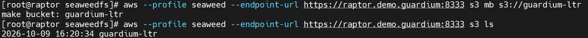{ width="99%" }](../images/ltr5.webp)

## Setup LTR node

1.	Although the *LTR* functionality does not require activation via a specific feature flag, the mechanism itself must be enabled.
In the **cm** UI, navigate to the **License** view and verify that the extensions appropriate for your **Guardium** version are available.
[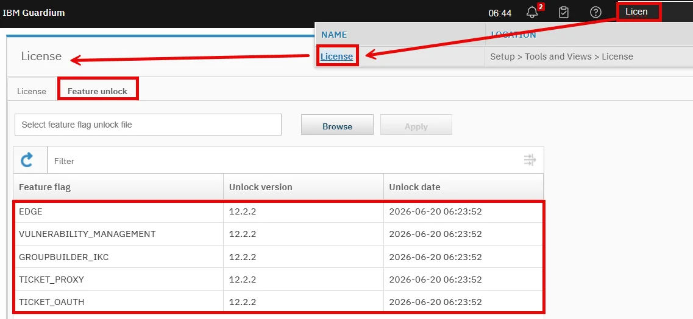{ width="99%" }](../images/ltr8.webp)
 
1.	Check the unit type on **appnode1**. As a **cli** user execute:
```bash
show unit type
```
[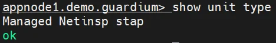{ width="49%" }](../images/ltr9.webp)

1.	If the appliance is still of type *Managed Netinsp stap*, change it to **app-node** using command below. The command requires a system restart—confirm by entering `y`.
```bash
store unit type app-node
``` 
[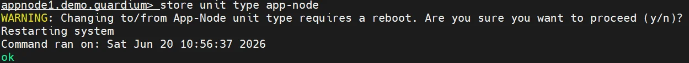{ width="99%" }](../images/ltr10.webp)

1.	Re-login and confirm that the appliance is now set as Managed App-Node.
```bash
show unit type
```
[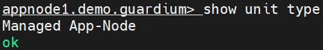{ width="49%" }](../images/ltr11.webp)

1.	Now install on **appnode1** as a **cli** user the patch that enables the *LTR* functionality.

    !!! note "patch installation values:"
        - Host: raptor.demo.guardium
        - User: root 
        - Path: /opt/guardium_tz_bootcamp_automation/upload/source_files/appliances/extensions/SqlGuard-12.0p90230_datalake_Jun_15_2026.tgz.enc.sig
        - Port: press 2223
        - Password: &lt;root password on raptor>
     
    After downloading the patch file, the command will prompt its installation. Enter the patch number – **1** – and confirm with ++enter++.
    
    ```bash
    store system patch install scp
    ```
    [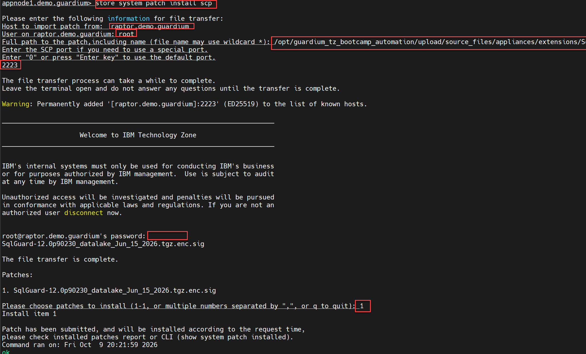{ width="99%" }](../images/ltr12.webp)

1.	Monitor the installation using the command below until the patch installation is confirmed.
```bash
show system patch install 
```
[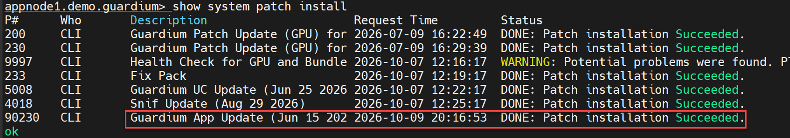{ width="99%" }](../images/ltr13.webp)

1.	Install the *LTR* services on **appnode1** (restart **cli** session).
```bash
store datalake install
```
[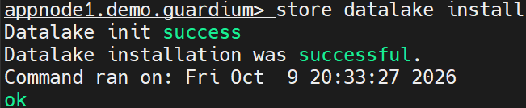{ width="49%" }](../images/ltr14.webp)

1.	Set the size of the *LTR* services.
```bash
store datalake all_in_one xxsmall
```
[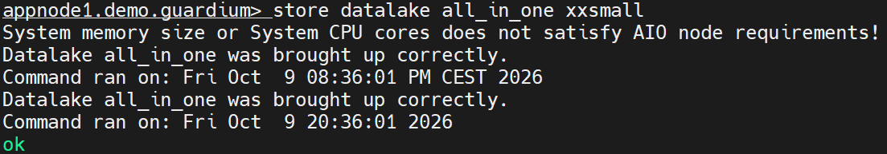{ width="89%" }](../images/ltr15.webp)

1.	Start LTR services
```bash
store datalake service start
``` 
[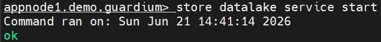{ width="59%" }](../images/ltr16.webp)

1.	Check the status of the services, we expect status 0
```bash
show datalake status
```
[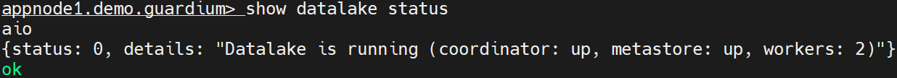{ width="99%" }](../images/ltr17.webp)

## Central Manager setup

1.	First, we need to import the *CA* certificate used by *seaweedFS*. To do this, on the **cm** run the command below and paste the certificate located on the appnode in the file `/opt/seaweedfs/certs/ca/ca.crt`.
```bash
store certificate application datalake s3 console
```
[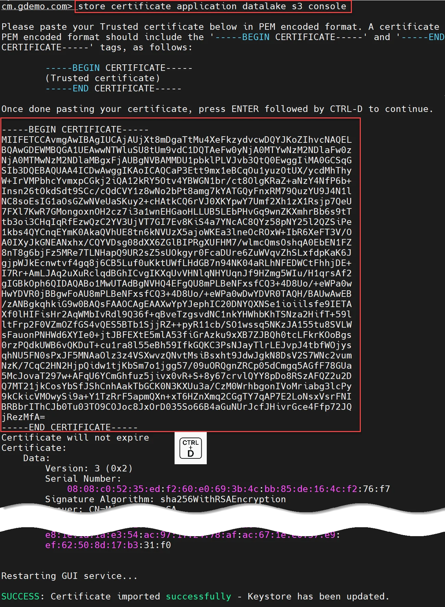{ width="99%" }](../images/ltr18.webp)

1.	Verify that the certificate is visible
```bash
show certificate application datalake s3
```
[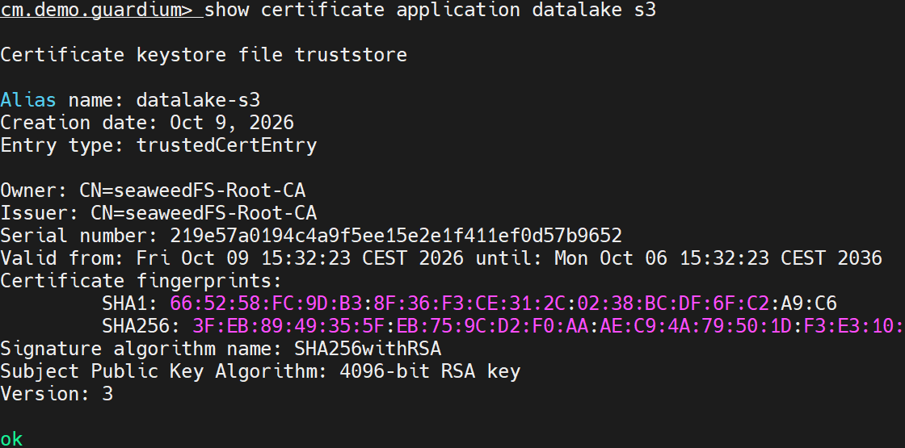{ width="89%" }](../images/ltr6.webp)

1.	We now need to distribute the certificate used by the *cm* and *LTR* to all appliances in the environment.
```bash
distribute application certificate datalake all_managed --metastore_unit=appnode1.demo.guardium
```
[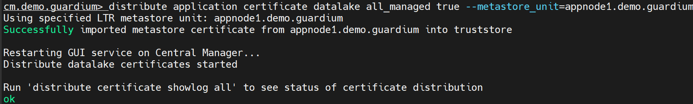{ width="99%" }](../images/ltr7.webp)

1.	This takes some time, so you need to monitor the synchronization process with the command below (we expect the toolnode to have both certificates downloaded).
```bash
distribute certificate showlog all
```
[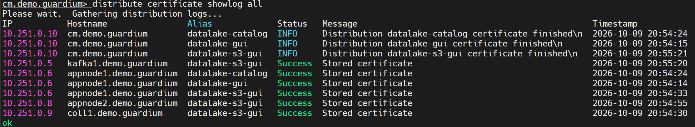{ width="99%" }](../images/ltr19.webp) 


1.	Configure the connection to the S3 bucket. You need to enter the seaweeFS keystore password used when configuring the S3 service. The command requires some time to complete.
```bash
grdapi configure_complete_cold_storage protocol="CUSTOM" objectStorageEndpoint="https://raptor.demo.guardium:8333" accessKey=s3admin secretKey="<strong_admin_password>" dataBucket=guardium-ltr resultSchema="datalake_reports" region="US_EAST_1" coldCatalogEndpoint="https://appnode1.demo.guardium:8443" coldCatalogSchema="datalake" coldStorageName="datalake" queryEngineHost="appnode1.demo.guardium" debug=3
```
[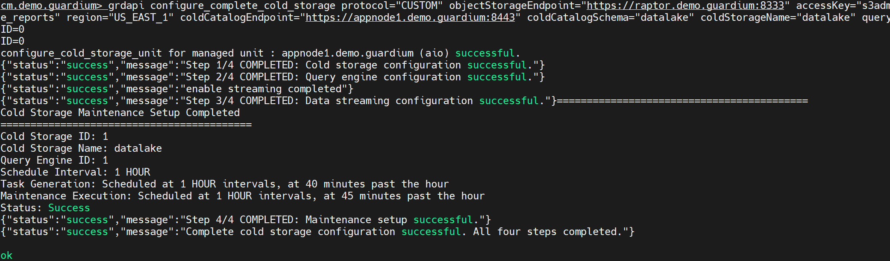{ width="99%" }](../images/ltr20.webp) 

1.	Finally, check list of ltr nodes and cold storages.
```bash linenums="1"
grdapi get_cold_storage_app_nodes

grdapi list_cold_storages
```
[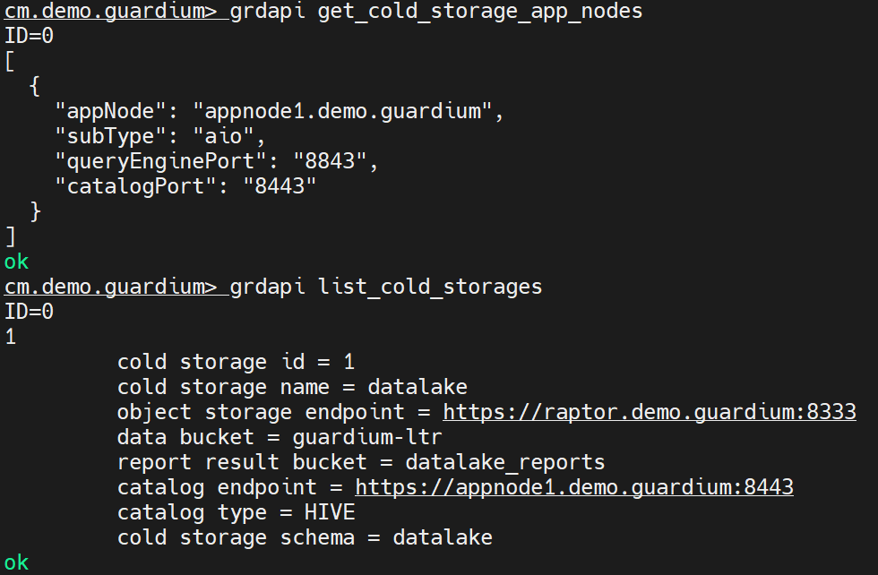{ width="79%" }](../images/ltr21.webp)

## Configuring system to use LTR data

1.	To monitor the process of transferring data from collectors to *LTR*, create a copy of the default *Datamart Extraction Log* report. Open on the **cm** UI the standard report and use the edit icon :material-pencil:. Choose the option to create a copy of the report.
[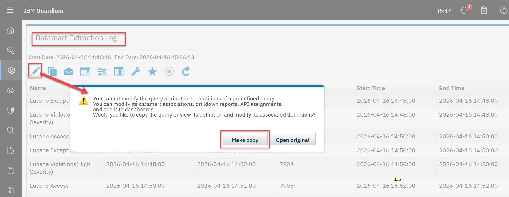{ width="99%" }](../images/ltr22.webp)
 
1.	Name the report *LTR Datamart Extraction*, then add sorting by *Datamart Run Id* and add an additional condition so that only *Datamart Name* containing the word *Export* in the name are displayed. **Save** the modified report.
[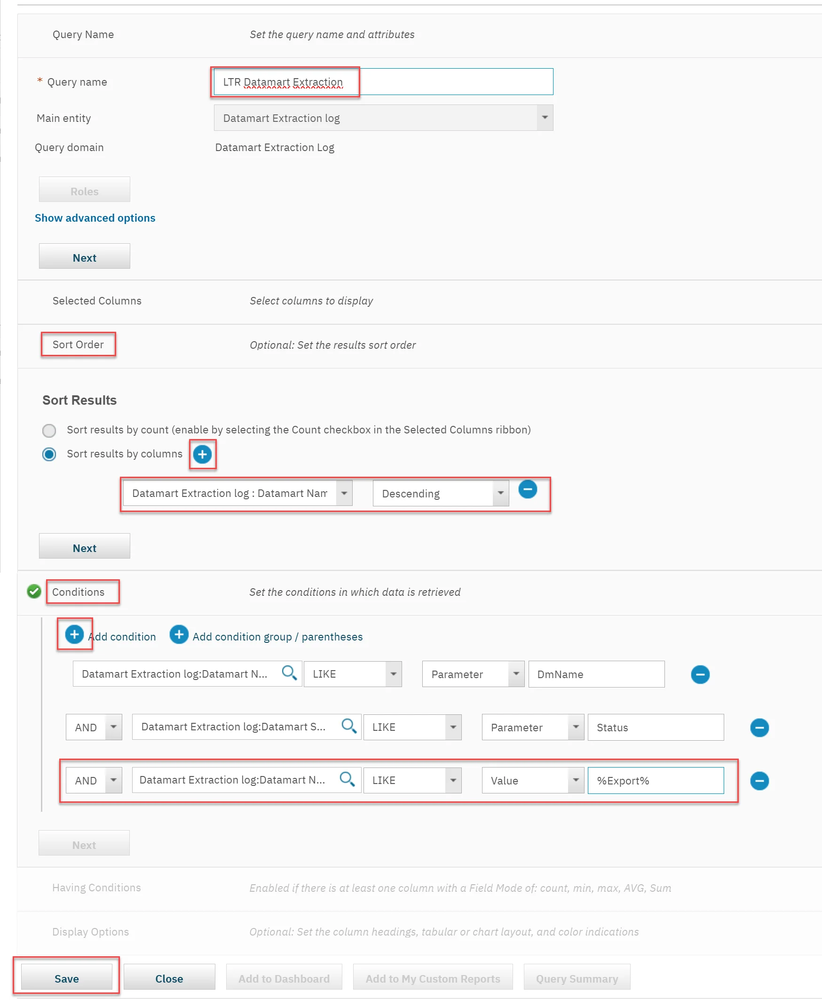{ width="99%" }](../images/ltr23.webp)
 
1.	Next, create a new dashboard named *LTR* and add to it the report we just created – *LTR Datamart Extraction*,
[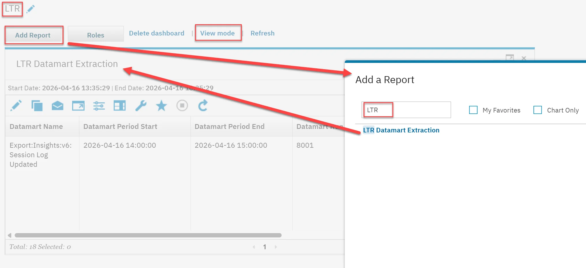{ width="99%" }](../images/ltr24.webp)

1.	Add to *LTR* dashboard three more reports: *Cold Storage Ingestion Logs*, *Cold Storage Maintenance Logs* and *Scheduled Jobs*
[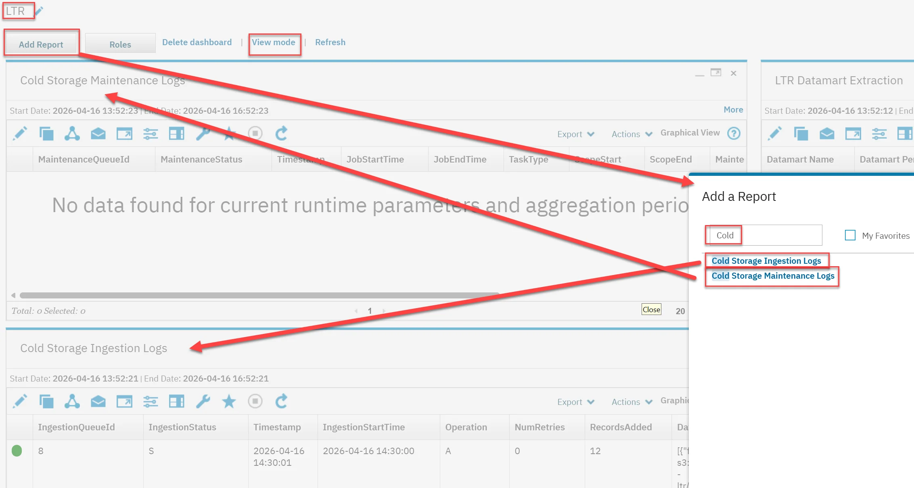{ width="99%" }](../images/ltr25.webp)
 
1.	Open the *Scheduled Jobs* report in the dashboard and edit the *Runtime Parameters*. Select the **coll1** as the data source.
[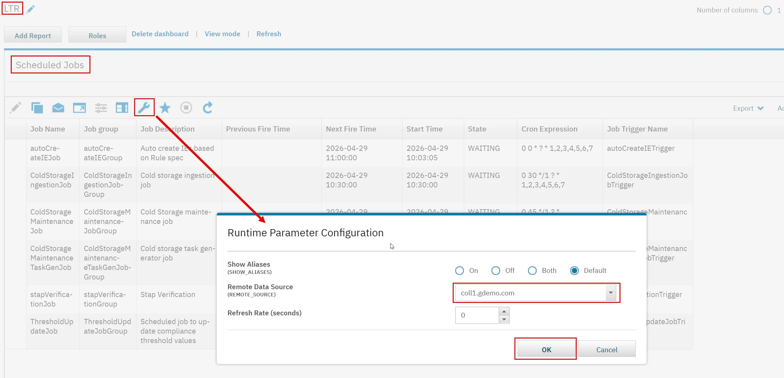{ width="99%" }](../images/ltr26.webp)

1.	A list of batch jobs running on the **coll1** will be displayed in the report. Among them, there will be activities related to data extraction and transferring the data to the seaweedFS server. The job names will start with *Export:Insights:v6*. The *Next Fire Time* column indicates when the data will be prepared and when we should expect the data to appear in LTR.
[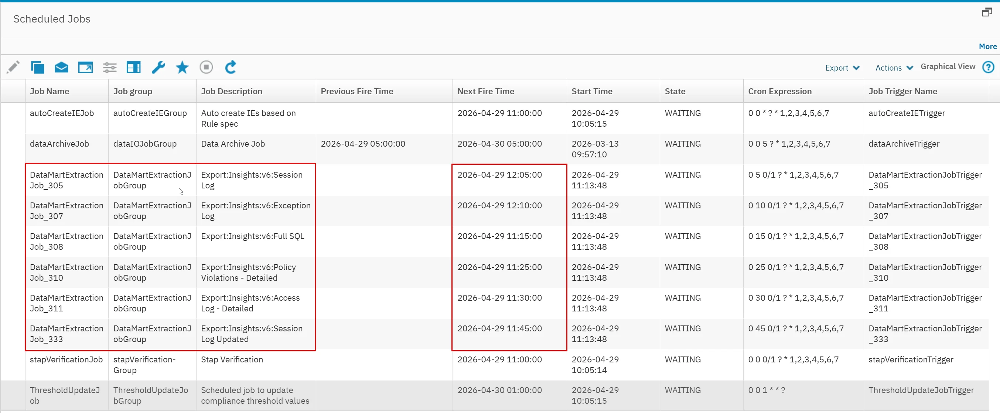{ width="99%" }](../images/ltr27.webp)
 
1.	In the **cli** session on the **coll1**, run the command below and review the datamart definitions. It is executed every hour, and the data is sent to the seaweedFS server.
```bash
grdapi get_datamart_info datamart_name="Export:Insights:v6:Session Log"
``` 
[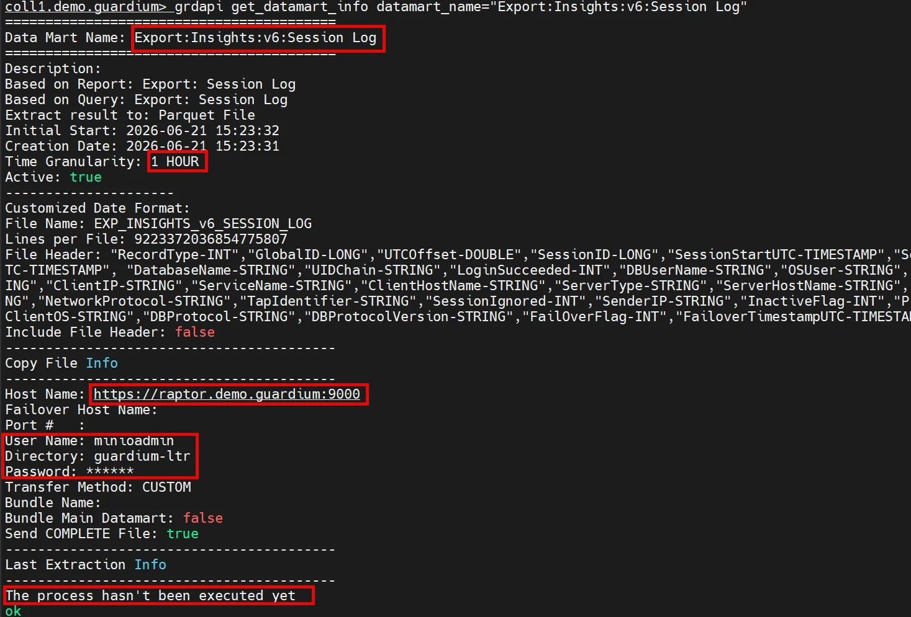{ width="99%" }](../images/ltr28.webp)

## Use LTR data

1.	A few hours after configuring LTR, we should be able to report on the stored data.
1.	First, let’s check the datamart status again from the cli on the coll1. This time, the Extraction Log section should contain information about a file in Parquet format that was sent to the MinIO server.
```bash
grdapi get_datamart_info datamart_name="Export:Insights:v6:Session Log"
```

1.	Open the LTR dashboard on the Central Manager, and within it open the Scheduled Jobs report with reference to the collector data. Observe that the jobs related to the datamarts are being executed according to the scheduler.
 
1.	Switch to the LTR Datamart Extraction in the dashboard and select the coll1 as the data source. Observe that each job execution is recorded in detail and includes information about how many records were transferred.
 
1.	The Cold Storage Ingestion Logs report indicates whether the datamart transferred from the collector has been processed and whether the data is ready for use.
 
1.	Let’s verify whether the data stored in MinIO can be reported from the Central Manager. In the cm UI, select the new view – Data Lake Reports. It contains several predefined reports. Proceed to run the Full SQL Report by selecting it from the list.
 
1.	In the report configuration window, select Custom time range and cover the entire current day by choosing from yesterday to tomorrow. Then select Next.
 
1.	Next page allows to schedule report execution or execute just one time (scheduler is enabled if email address has been specified on the previous screen)
 
1.	The running report instance should appear in the Report Activity section. Use the Refresh option to monitor the job status. After several dozen seconds, the report should be ready, and the Actions column will provide an option to download the report data in CSV format.
 
1.	To view the report select it from Report Activity list 

Appendix	Dependencies:
This lab requires that Oracle lab is fully covered before

Resources:


