# Policies and Reports basics

## New Dashboard for Policies

1.	Because the **raptor** machine is used throughout the bootcamp for multiple purposes, it runs a large number of services while having only minimal available resources. In this exercise, you will be analyzing a significant volume of traffic, which may lead to memory shortages. To avoid potential issues, stop several services on **raptor** before proceeding.
```bash linenums="1"
systemctl stop informix-ifxserver

systemctl stop mongod

systemctl stop mysqld

systemctl stop mysql-etap

systemctl stop oracle-etap

systemctl disable informix-ifxserver

systemctl disable mongod

systemctl disable mysqld

systemctl disable mysql-etap

systemctl disable oracle-etap
```

1.	In this lab do all UI actions on **coll1** unless another access will be requested. Clone *Full SQL (Training)* report from **Training** dashboard. Name clone one as *Full SQL (Policies)* and proceed to the *Selected Columns* section by clicking **Next**.
[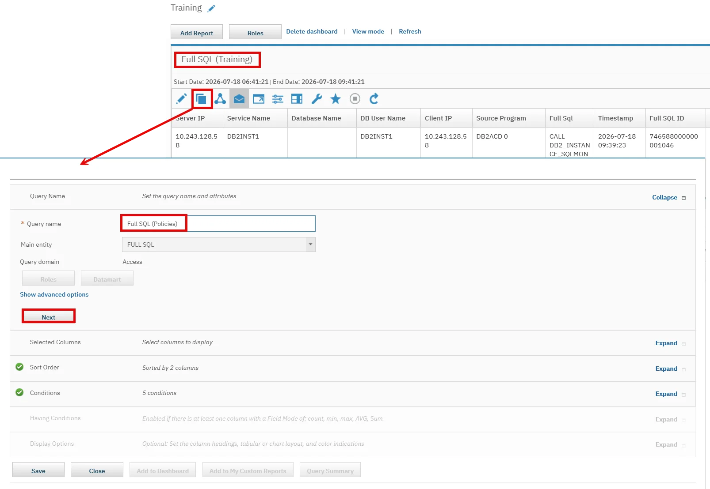{ width="99%" }](../images/polrepbas1.webp)  
 
1.	The area is divided into two main parts. The left one (*Entities and Attributes*) allows you to select an attribute that should appear in the right part (*Selected Columns*). Then drop-down list <span class="mb">1</span> allows you to narrow down the list of attributes contained in a given *Entity*. Select *Client/Server* and then search <span class="mb">2</span> for an attribute with a name containing the string "*Type*". You should see one attribute named **Server Type**. Select it <span class="mb">3</span> and move it to the list on the right <span class="mb">4</span>, and then proceed to the *Conditions* section.
[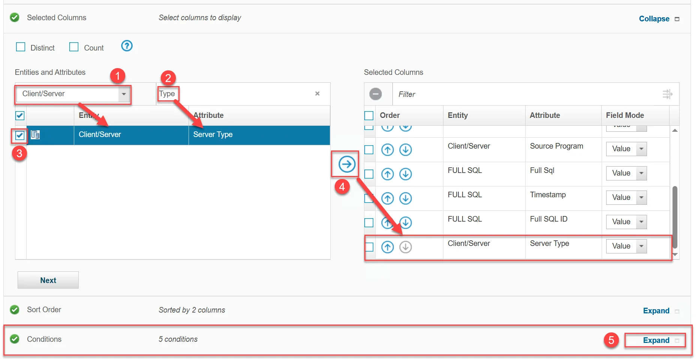{ width="99%" }](../images/polrepbas2.webp)  

1.	This section contains filters that are usually parameters. Add new condition <span class="mb">1</span> based on new parameter, use the *Search* icon <span class="mb">2</span> to select the column we are interested in, by which the results can be filtered. Expand the **Client/Server** Entity <span class="mb">3</span>, then find <span class="mb">4</span> the **Server Type** parameter <span class="mb">5</span> and confirm <span class="mb">6</span>.
[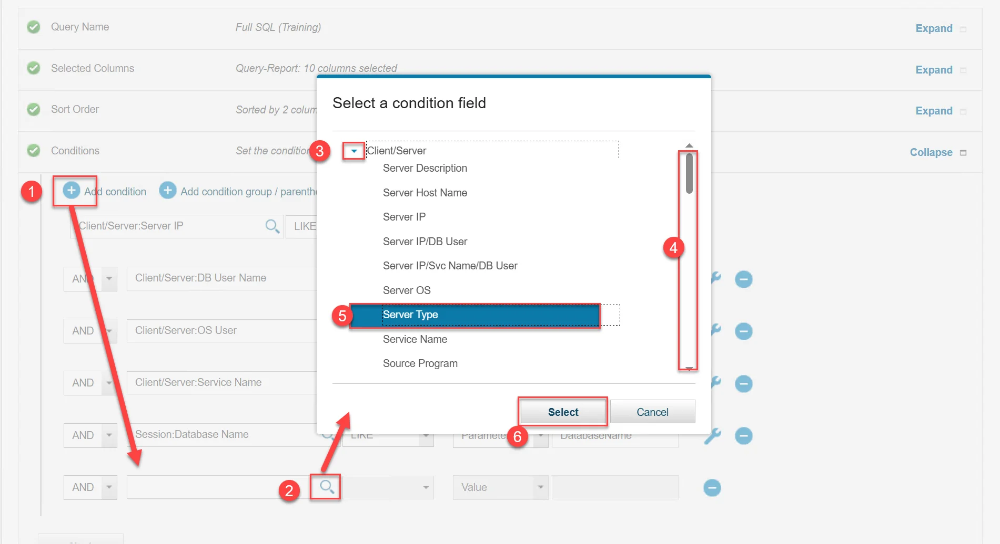{ width="99%" }](../images/polrepbas3.webp)
  
1.	Expand the filtering type list <span class="mb">1</span> and select the *LIKE* option <span class="mb">2</span>, choose from the list <span class="mb">3</span> the filter type as *Parameter* <span class="mb">4</span> and enter its name **ServerType** <span class="mb">5</span> (the name can be any unique string of characters for the report and should not contain spaces). Next, save the changes with the Save button <span class="mb">6</span>.
[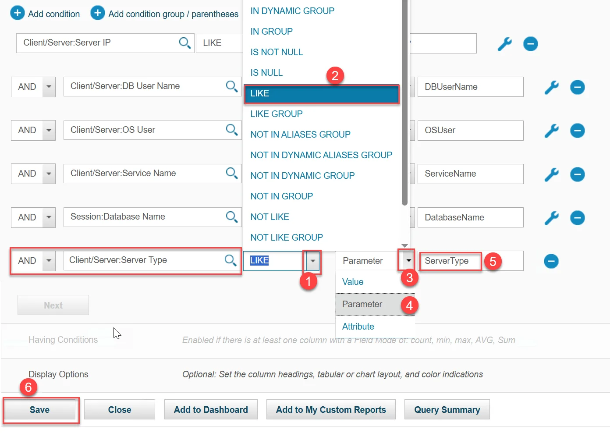{ width="99%" }](../images/polrepbas4.webp)
  
1.	Wait until the report update confirmation appears and **Close** report edition window.
[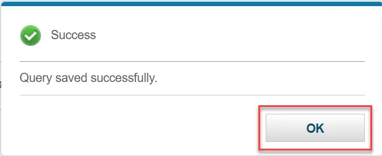{ width="49%" }](../images/polrepbas5.webp)
 
1.	Then **Create New Dashboard** and name it as *Policies and Reports* (edit random generated name) and **Save**. Use **Add Report** button.
[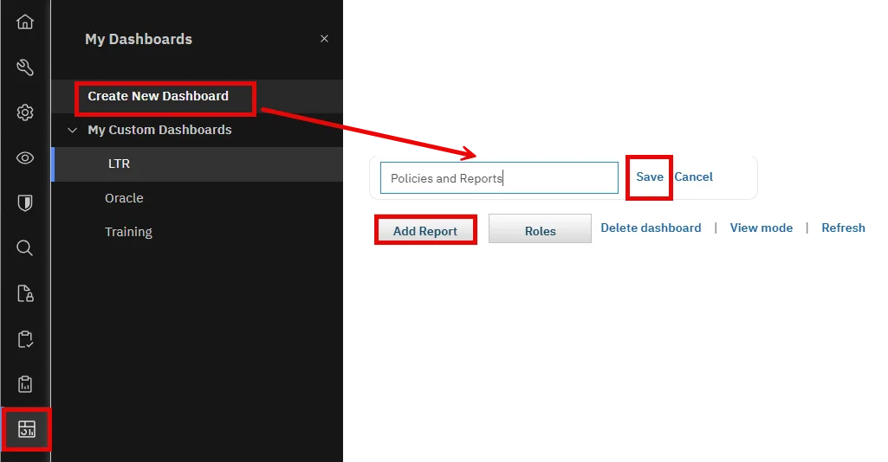{ width="99%" }](../images/polrepbas6.webp)

1.	And add *Full SQL (Policies)* report into dashboard.
[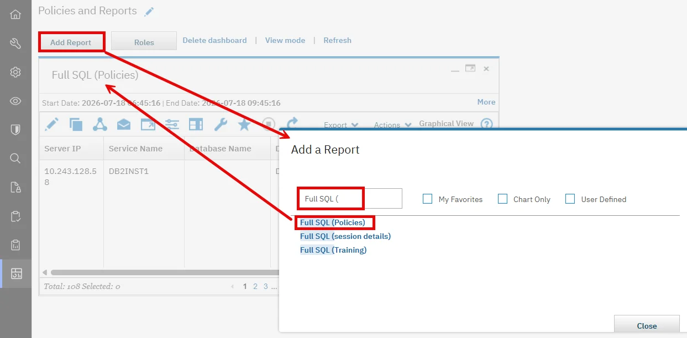{ width="99%" }](../images/polrepbas7.webp)
 
1.	Notice that column *Server Type* appears at the last in the report. Then use the **Parameters** icon and confirm that the *ServerType* parameter appears with a default value of `%` (in Guardium, similar to *SQL*, `%` means any string of characters). **Close** pop-up window.
[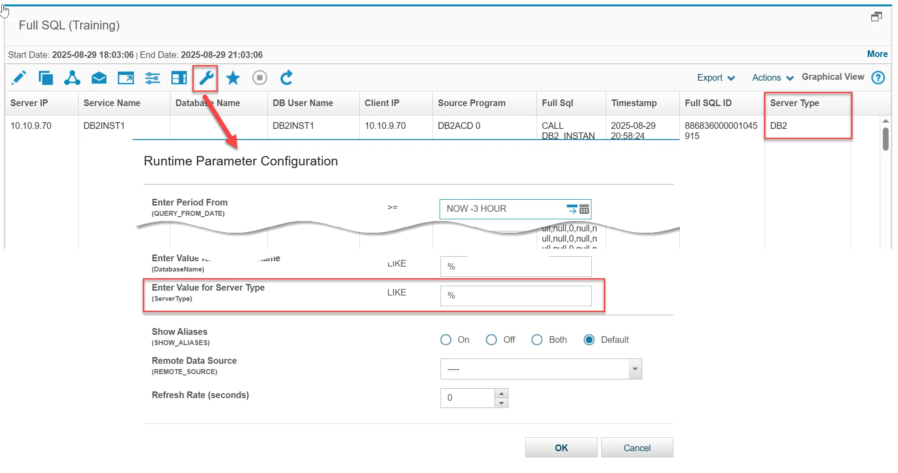{ width="99%" }](../images/polrepbas8.webp)

## Check report changes

1.	Login to raptor. On raptor change the user context to postgres
```bash
su - postgres
```
1.	Connect to postgres instance
```sql
psql
```
1.	Execute the dummy sql
```sql
SELECT 'it is dummy SQL';
```
[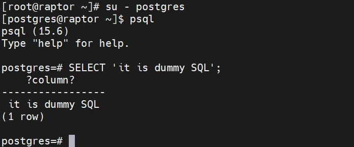{ width="69%" }](../images/polrepbas9.webp)

1.	Return to the browser and refresh the report { width="17" }, then confirm that information about the *SQL* just executed on the *PostgresSQL* database has appeared. Since many databases are running on the **raptor** and generating traffic, to make browsing easier, we will filter the report to show only traffic generated on the PostgresSQL database. To do this, use the **Parameters** icon again and change the **ServerType** value from `%` to `POSTGRESQL`. Confirm with the **OK** button and refresh the report again { width="17" }. Now only one row, last command should appear in the report.
[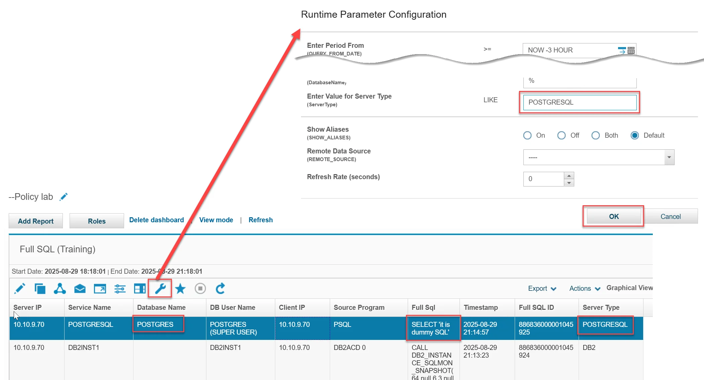{ width="99%" }](../images/polrepbas11.webp)

 
## Create table with sensitive data

1.	Return to the session on the **raptor** where you are logged in to the database as the **postgres** user and run the command:
```sql
SELECT * FROM pg_stat_ssl WHERE pid=(SELECT pid FROM pg_stat_activity WHERE query LIKE 'SELECT%');
```
[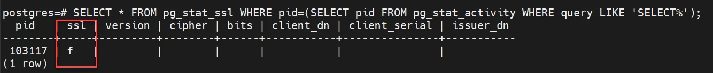{ width="99%" }](../images/polrepbas12.webp)
The *ssl* field indicates that the session is not using an encrypted connection.

1.	Display the list of accounts in the database and notice that accounts for **jerry** and **tom** exist, which have superuser privileges.
```sql
\du
```
[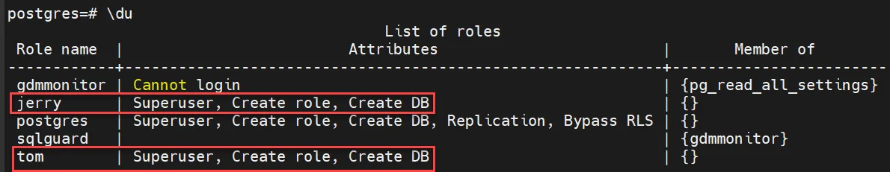{ width="99%" }](../images/polrepbas13.webp)

1.	Open second *ssh* session to **raptor** and run dbtraffic generator.
```bash linenums="1"
cd /opt/guardium_tz_bootcamp_automation/upload/guardium_notes_dbtraffic

source venv/bin/activate

guardium-notes-dbtraffic --config config/pgsql.yaml rebuild

guardium-notes-dbtraffic --config config/pgsql.yaml run
```

1.	Back to *PostgreSQL* session and display list of tables in *game* schema.
```sql
\dt game.*
```
[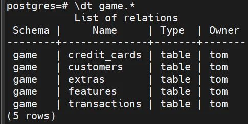{ width="49%" }](../images/polrepbas14.webp)

1.	And then display table content and close database session.
```sql linenums="1"
SELECT * FROM game.customers LIMIT 10;

\q

exit
```
[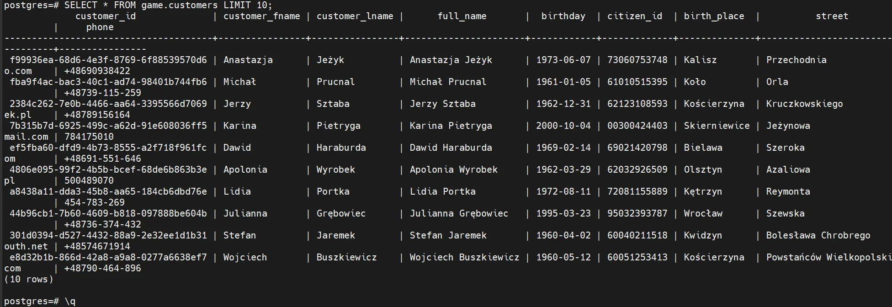{ width="99%" }](../images/polrepbas15.webp)

## Encrypted traffic visibility
1.	The *PostgreSQL* instance has been configured to use encrypted connections between clients and the database. The Guardium agent can monitor encrypted sessions. For this purpose, the ATAP service has been configured on the **raptor**. The following command will confirm that the agent has been configured correctly, and the *ATAP* instance is active.
```bash
/opt/guardium/modules/ATAP/current/files/bin/guardctl list-active
```
[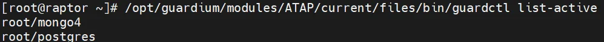{ width="99%" }](../images/polrepbas16.webp)

1.	Let's confirm this by logging into the database as the user **jerry** in *SSL* mode.
```bash
psql "postgresql://raptor.demo.guardium:5432/postgres?sslmode=require" -U jerry -W
```

1.	Execute *SQL* below and confirm that session is encrypted.
```sql
SELECT a.pid,a.usename,a.client_addr,s.ssl,s.version,s.cipher FROM pg_stat_activity a JOIN pg_stat_ssl s USING(pid);
``` 
[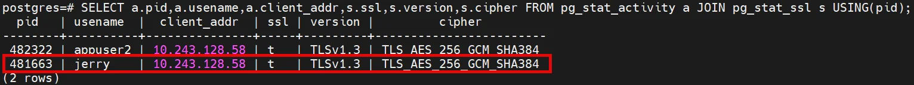{ width="99%" }](../images/polrepbas17.webp)

1.	Confirm that users **jerry** and **tom** can get access to `game.customers` table.
```sql linenums="1"
SELECT * FROM  game.customers LIMIT 10;

\q

psql "postgresql://localhost:5432/postgres?sslmode=require" -U tom -W

SELECT * FROM game.customers LIMIT 10;

\q
```

1.	Back to **coll1** UI and refresh *Full SQL (Policies)* report, you should see activities generated by dbtraffic via encrypted connections
[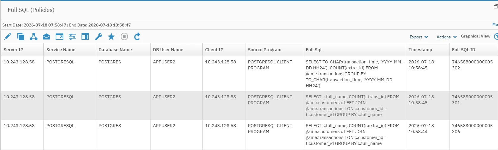{ width="99%" }](../images/polrepbas18.webp)
 
1.	You can filter traffic to check activity executed by **tom** user using report parameter *DBUserName* ((insert `%TOM%`)).
[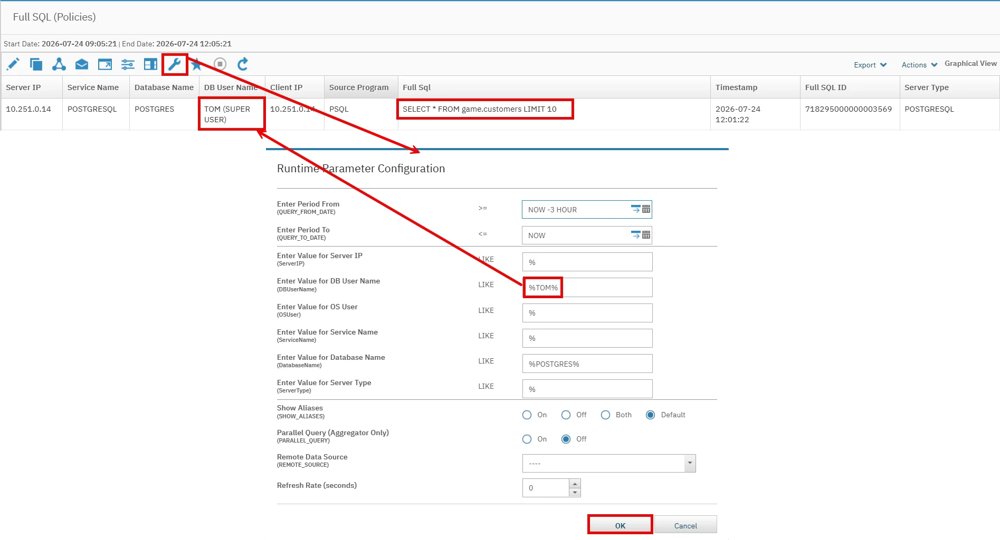{ width="99%" }](../images/polrepbas19.webp)

## Application traffic analysis
1.	Create a new report to analyze *PostgreSQL* database connections. To do this, open **Query-Report Builder**, select the *Access* domain, and click the plus <span class="mb">+</span> icon to create a new query.
[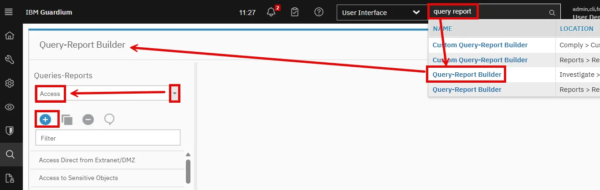{ width="99%" }](../images/polrepbas20.webp)
 
1.	Name it *Application access profiles* set **Main entitiy** to *CLient/Server* and proceed to the **Next** step.
[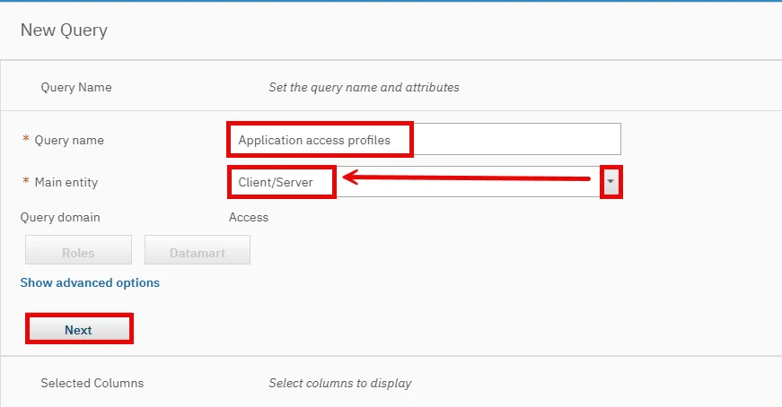{ width="89%" }](../images/polrepbas21.webp)
 
1.	Select the following four fields and add them to the report.

    !!! note "fields:"
        - Client/Server :material-arrow-right: Client IP
        - Client/Server :material-arrow-right: Server IP
        - Client/Server :material-arrow-right: Source Program
        - Client/Server :material-arrow-right: DB User Name
         
    Enable the *Distinct* option and proceed to the next step by clicking **Next**.

    [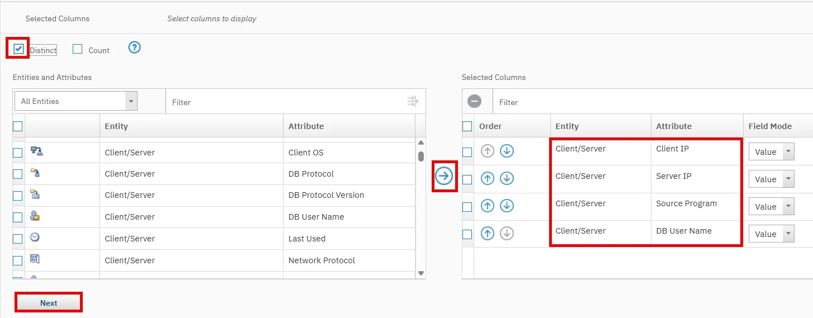{ width="99%" }](../images/polrepbas22.webp)
 
1.	Add an *ascending* sort condition on the *DB User Name* field and proceed to the *Conditions* step.

    [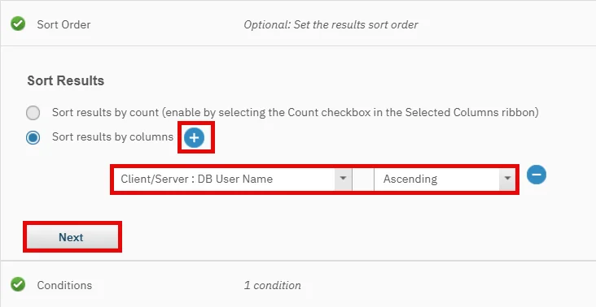{ width="79%" }](../images/polrepbas23.webp)
 
1.	Add a filter parameter for the *Server Type* field, similar to the one created in the *Full SQL (Policies)* report, and **Save** the report.
[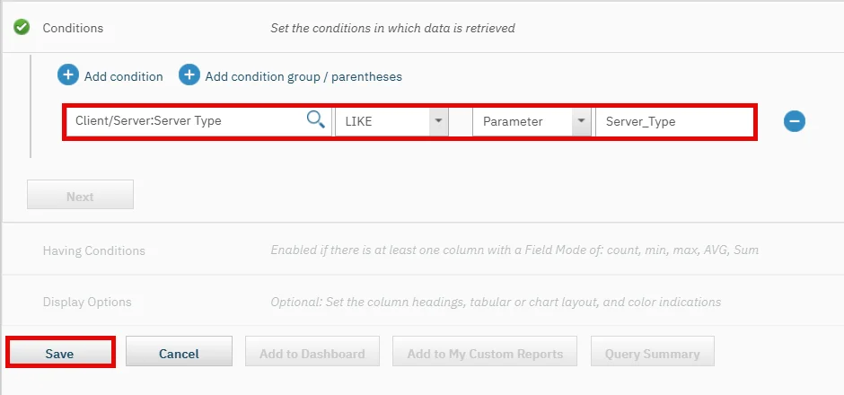{ width="99%" }](../images/polrepbas24.webp)

1.	Add report to *Policies and Reports* dashboard.
[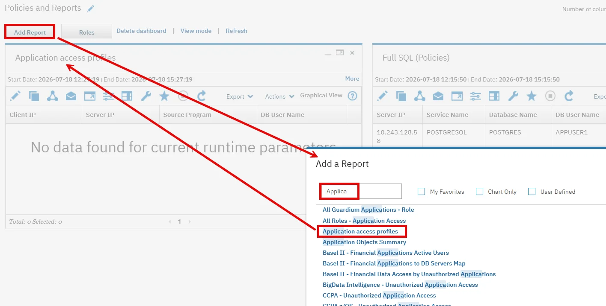{ width="99%" }](../images/polrepbas25.webp)
 
1.	Edit the parameters of the new report and set:
    
    !!! note ""
        - QUERY_FROM_DATE: **NOW -12 MONTH**
        - Server_Type: **POSTGRESQL**

    In the *Client/Server* domain, which serves as the *main entity* for this report, the time range is determined by the **Timestamp** field within that entity and corresponds to the first occurrence of the profile on the **coll1**. We could also build this report using the *Session* domain; however, doing so would significantly increase the query cost, as all sessions within the selected reporting time range would need to be filtered.

    [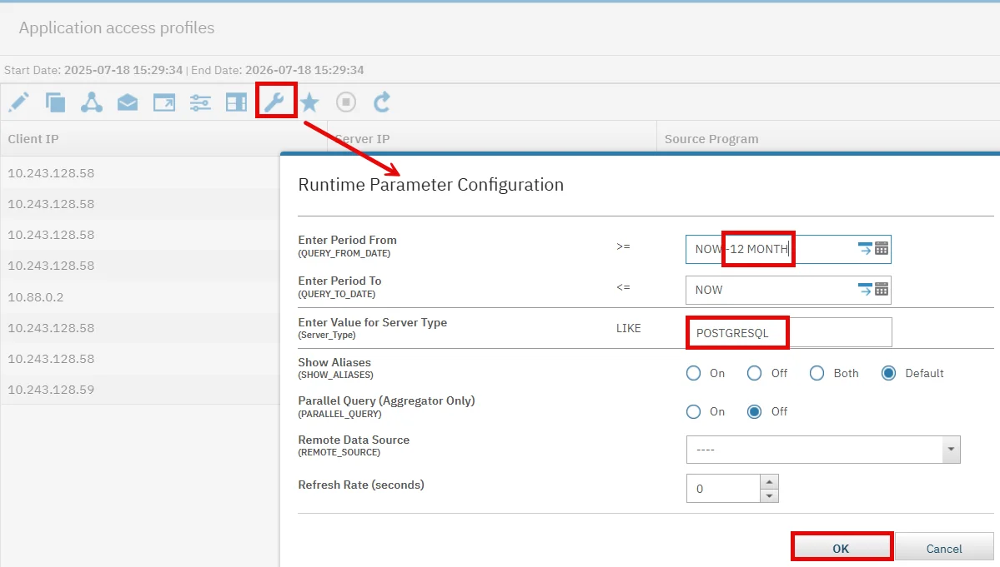{ width="99%" }](../images/polrepbas26.webp)
 
1.	A quick analysis of the report identifies two accounts, **APPUSER1** and **APPUSER2**, that are likely associated with application activity. Both accounts connect from the same IP address and identify themselves as **POSTGRESQL CLIENT PROGRAM**.
[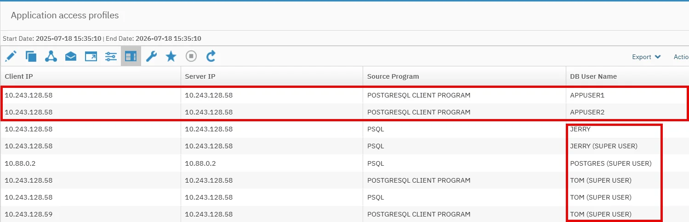{ width="99%" }](../images/polrepbas27.webp)
 
1.	Further refinement of application account identification can be achieved by creating a report that shows the distribution of connections across profiles. Create a new report in the *Access* domain using **Query-Report Builder**. This time, use *Session* as the **Main Entity**. Name the report *Session distribution* and add the same four fields used in the previous report. However, instead of selecting *Distinct*, select *Count*, which will aggregate the number of recurring rows based on the selected fields. As demonstrated in the previous report, these fields uniquely identify a database connection profile. As before, sort the results in ascending order by *DB User Name* and add a filter parameter for *Server Type*.
[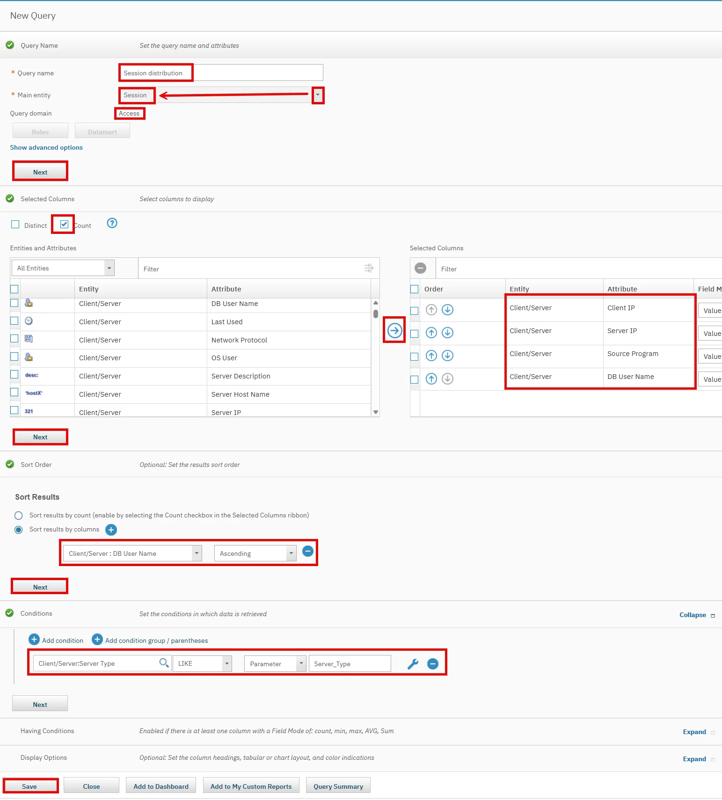{ width="99%" }](../images/polrepbas28.webp)
 
1.	**Save** the report and add it to the *Policies and Reports* dashboard. Then configure the filter to display only *POSTGRESQL* activity.
[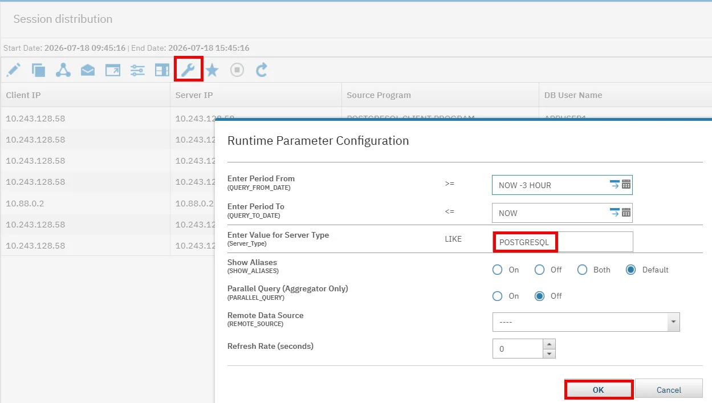{ width="99%" }](../images/polrepbas29.webp)
 
1.	 This time, the **APPUSER1** and **APPUSER2** accounts are responsible for the majority of database sessions. In real-world environments, the number of sessions generated by application accounts can be several orders of magnitude higher than those associated with other types of connections.
[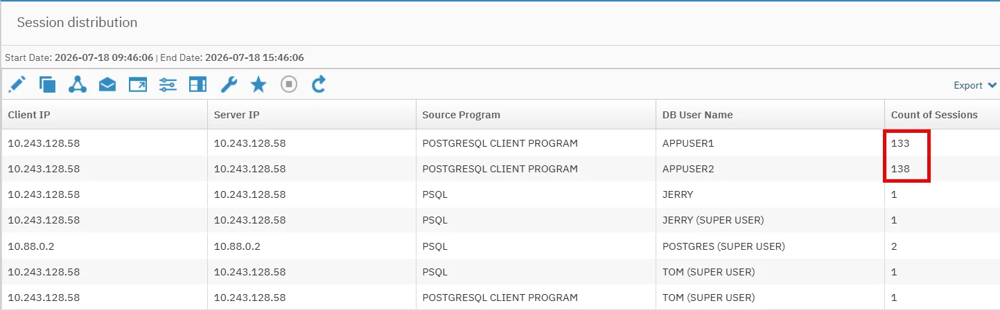{ width="99%" }](../images/polrepbas30.webp)
 
1.	Create one more report named *SQL Distribution* that, similarly to the previous session report, shows how many SQL statements are executed per connection profile. The report configuration should be identical to the previous one, except that the **Main Entity** should be set to *SQL*, allowing you to count the total number of executed SQL statements. Of course, **Save** the report, add it to the *Policies and Reports* dashboard, and configure the filter to display only *POSTGRESQL* activity.
[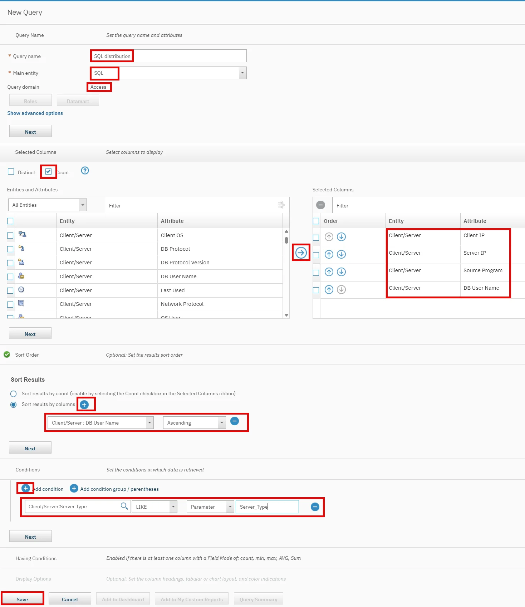{ width="99%" }](../images/polrepbas31.webp)
 
1.	As expected, the vast majority of the activity is associated with two accounts, which can be confidently identified as application accounts.
[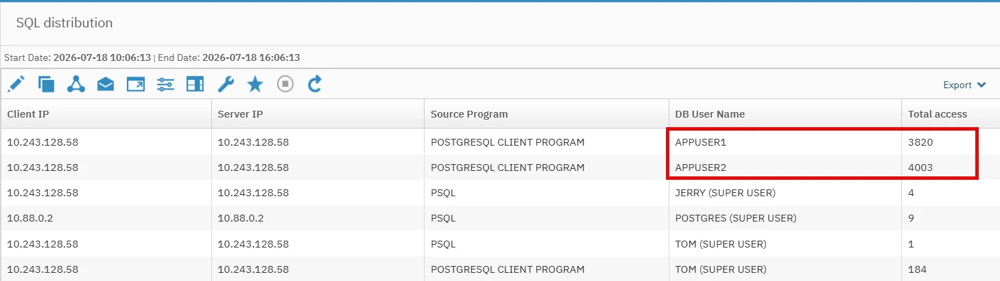{ width="99%" }](../images/polrepbas32.webp)

## Firewall mode on
1.	The *DBF* (database firewall) mode is turned off by default. To activate it, we will use the remote agent administration mechanism - *GIM* (*Guardium Installation Manager*). To do this, in the **cm** UI, use the search field to open the **Set up by Client** view.
For *STAP* on **raptor** select **STAP 12.2.2.0_r123489_3** release and set two parameters:

    !!! note ""
        - STAP_FIREWALL_INSTALLED: **1** 
        - STAP_FIREWALL_DEFAULT_STATE: **1**

    [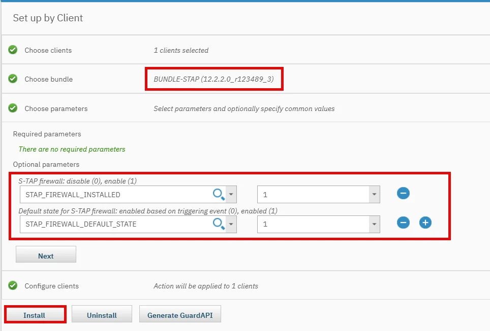{ width="99%" }](../images/polrepbas33.webp)
 
1.	Refresh the status view periodically until all elements have an *INSTALLED* status.
[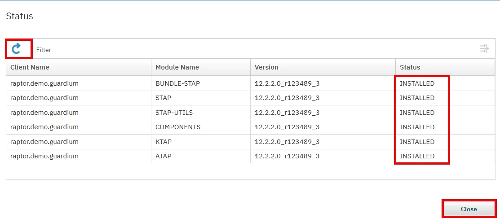{ width="99%" }](../images/polrepbas34.webp)
Close all pop-up’s.

## Block access to application tables

1.	Let's try to configure the system to protect application data. Open **Policy Builder for Data** and click the plus <span class="mb">+</span> button to create a new policy.
[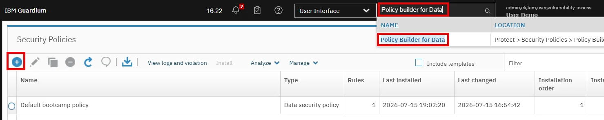{ width="99%" }](../images/polrepbas35.webp)

1.	In this lab, you will work with *standard Data Security Policies*. Although *Session-Level Policies* provide new mechanisms for identifying and handling captured traffic, they are a separate policy type and will be covered in a future lab.

1.	Name the policy *Application data access control* and select the *Rules* section.
[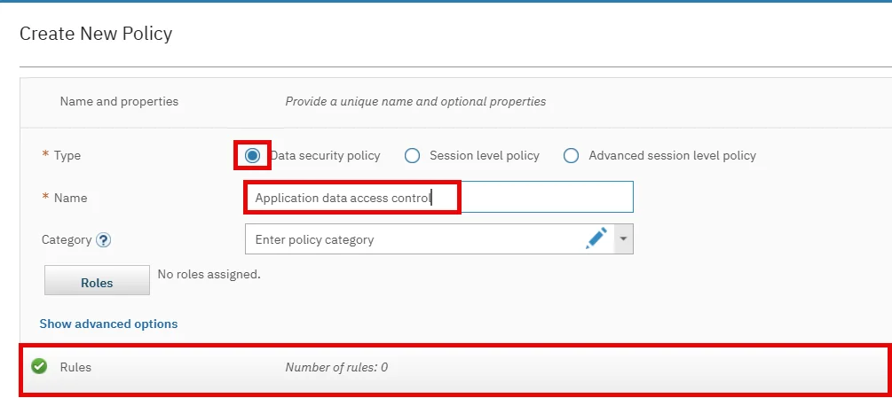{ width="99%" }](../images/polrepbas36.webp)
 
1.	In this section, you can manage the rules that are evaluated from bottom to top. To add the first rule, click the plus <span class="mb">+</span> icon.
[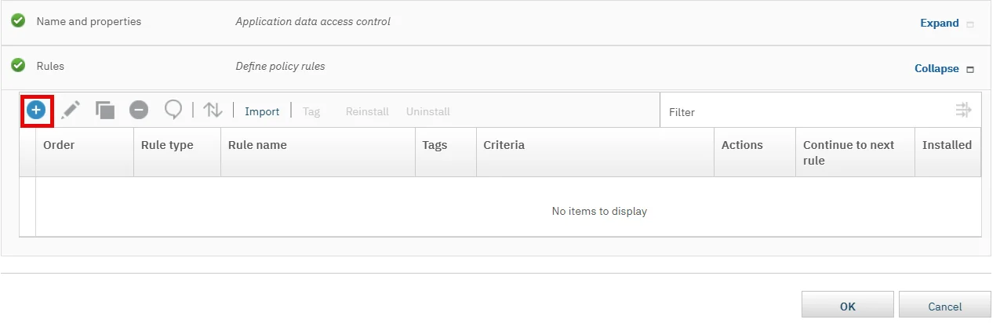{ width="99%" }](../images/polrepbas37.webp)
 
1.	*Rule* creation is divided into three components. In the first section, define the *rule type*. The default type is **Access**, meaning the rule evaluates the *SQL statement* submitted for execution. The system can also analyze *SQL errors* and, to a limited extent, the result set returned by the query.

1.	Name the first rule "*Log and switch to open mode the application connections*" and select *Rule criteria* bar.
In the previous step, you enabled the firewall in closed mode (*FIREWALL_DEFAULT_STATE=1*). This mode introduces additional *SQL* execution latency because the system must obtain a verdict on whether a given statement should be allowed to execute. In general, *DBF* is not intended for application traffic. The recommended approach is to move application traffic to open mode as quickly as possible or stop monitoring it.
[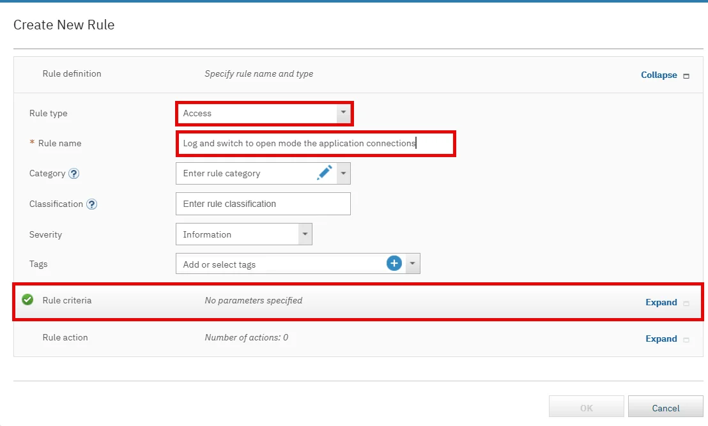{ width="99%" }](../images/polrepbas38.webp)
 
1.	For easier understanding of rule behavior, the criteria for Access rule type are divided into three categories: *Session*, *SQL*, and *Other*. The *Session* category is used to identify sessions/connections and is evaluated only when a new connection is established. The *SQL* category applies to executed *SQL* statements, while *Other* covers additional conditions that can be monitored by the rule, such as the number of *SQL* statements executed within a specific time period.
Add the first condition to limit the analysis to *PostgreSQL* sessions only by selecting *Database Type* = **POSTGRESQL**. And press <span class="mb">+</span> to add one more condition for session.
[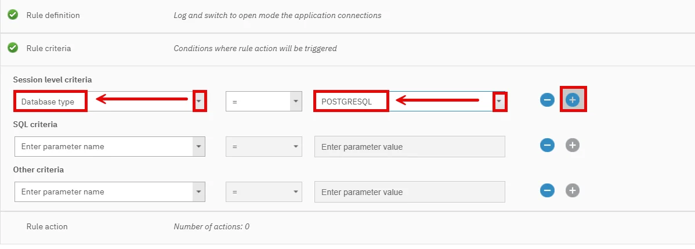{ width="99%" }](../images/polrepbas39.webp)

1.	A very convenient mechanism for identifying sessions is based on grouping a set of session attributes, known in **Guardium** as *tuples*. In the newer policy framework (*Session-Level Policies*), this mechanism is significantly more advanced, allowing custom attribute sets to be defined for purposes beyond session identification. However, in this Standard Policies, you can only use the predefined *5-tuple* and *7-tuple* options. Select the *5-tuple* and leave the reference as a group, which you will create using the plus <span class="mb">+</span> button.
[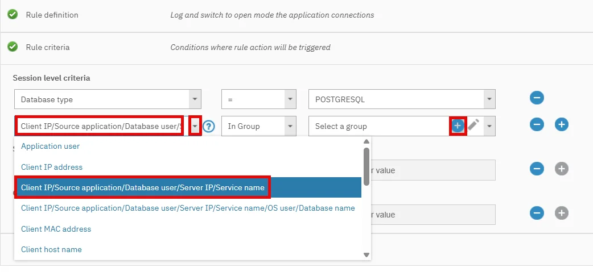{ width="99%" }](../images/polrepbas40.webp)
 
1.	Name the group *Postgres application profiles*, switch to the *Members* tab, and use the plus <span class="mb">+</span> button to add a value for the *5-tuple* profile.
[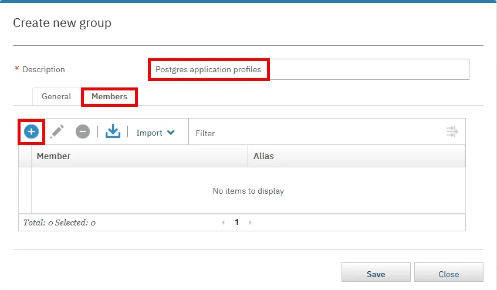{ width="99%" }](../images/polrepbas41.webp)

1.	Enter values and press **OK**.

    !!! note "Tuple values:"
        - Client IP: &lt;raptor_ip_address>
        - Src App.: **POSTGRESQL CLIENT PROGRAM**
        - DB User: **APPUSER%**
        - Server IP: &lt;raptor_ip_address>
        - Svc Name: **%**

    [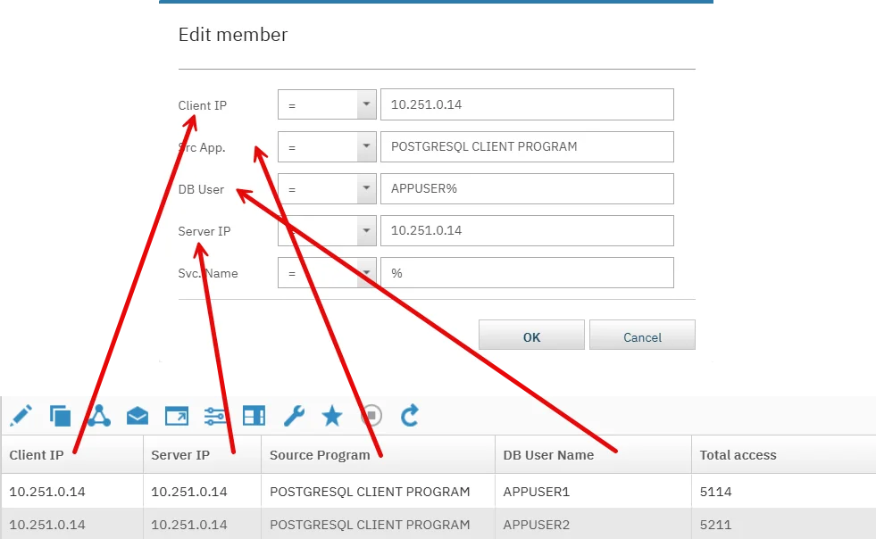{ width="99%" }](../images/polrepbas42.webp)

1. The saved value will appear on the list. **Save** group definition.
[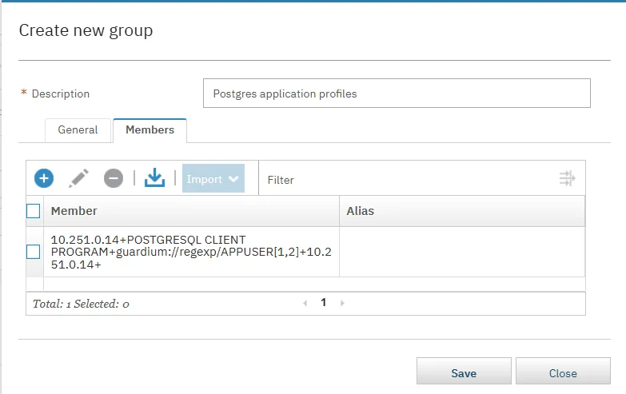{ width="99%" }](../images/polrepbas43.webp) 

1.	As a result, you will return to the rule creation screen, where the newly created group is referenced by the tuple. Now add the actions for the rule by selecting the *Rule Action* section.
[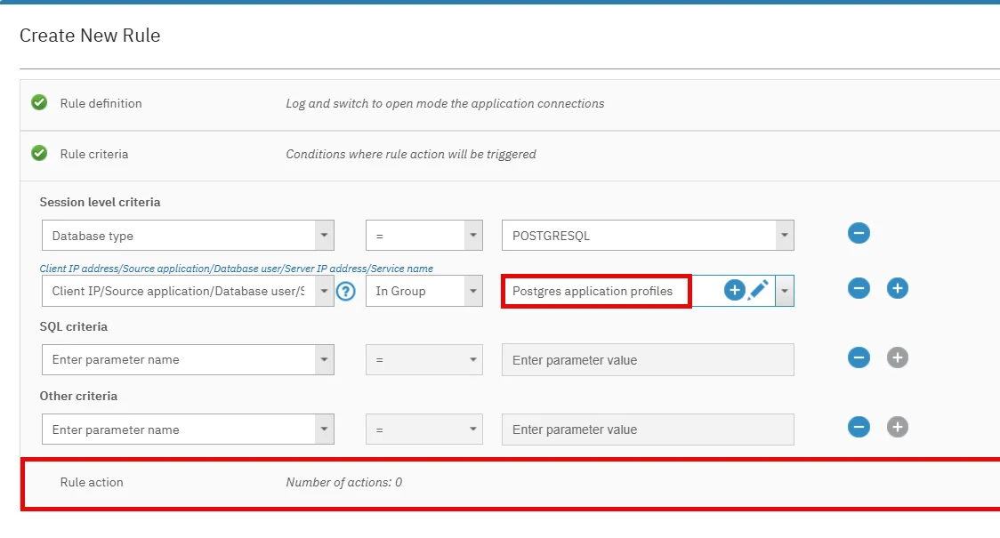{ width="99%" }](../images/polrepbas44.webp)
 
1.	Use the plus <span class="mb">+</span> button to add an *action*. From the *action* list, expand the *S-GATE* action group and select **S-GATE DETACH**, which ensures that all sessions associated with this rule (application traffic) is monitored without latency.
[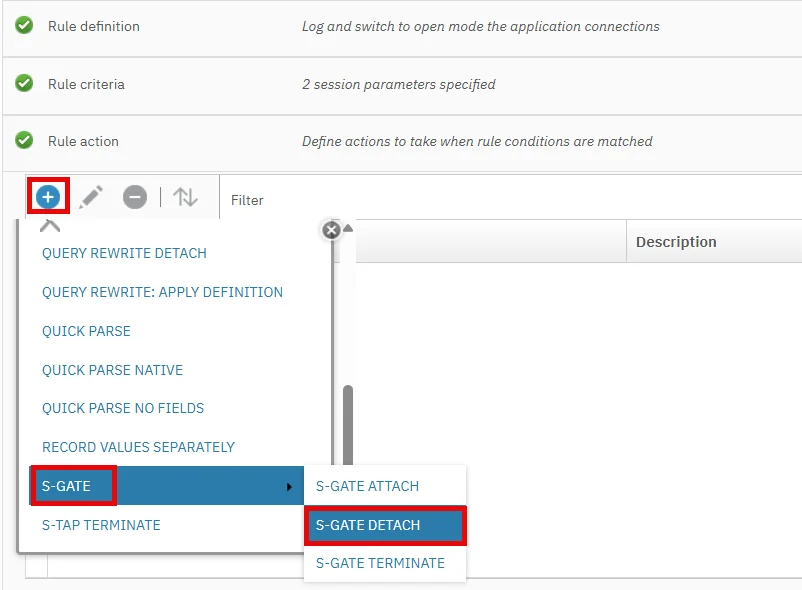{ width="99%" }](../images/polrepbas45.webp)
 
1.	Accept the newly defined policy rule by clicking **OK**.
[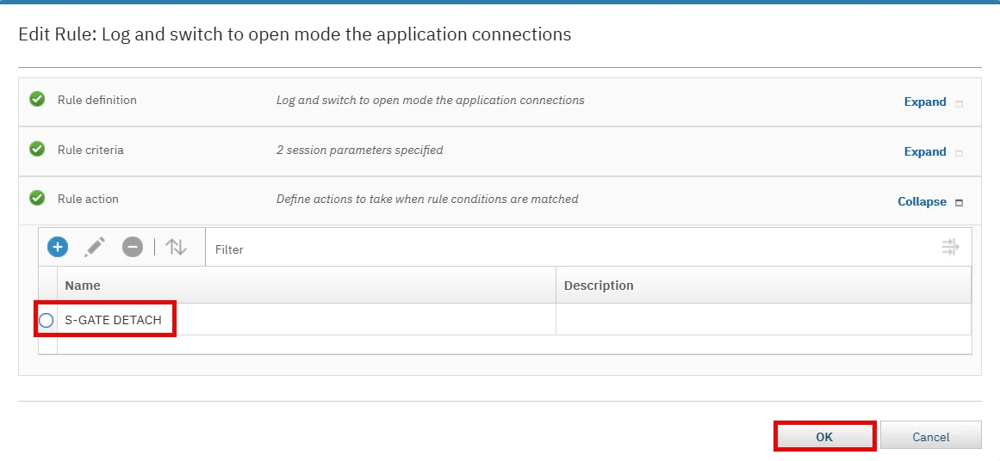{ width="99%" }](../images/polrepbas46.webp)
 
1.	Save the policy with the newly created rule - press **OK**.
[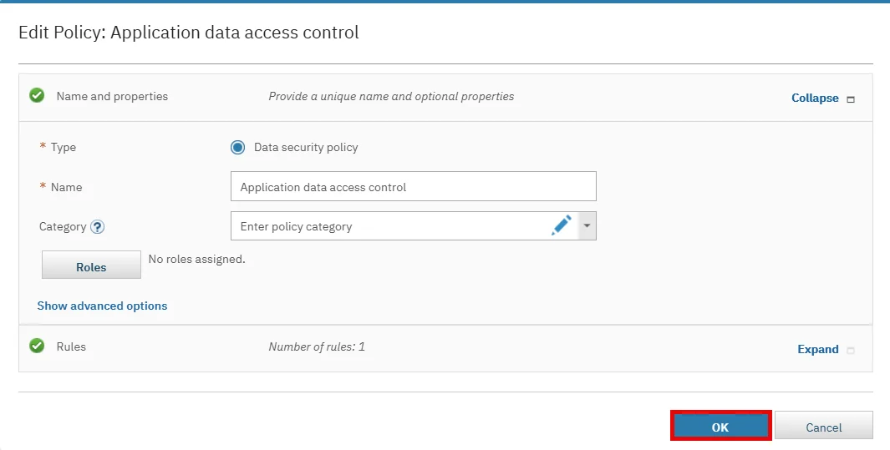{ width="99%" }](../images/polrepbas47.webp)
 
1.	The policy created so far focuses exclusively on application traffic. Your next objective is to extend it so that no users other than the application accounts can access the tables used by the application. To do this, edit the policy. First enable *Continue to next* rule switch. It pushes system to evaluate events by other rules even current one is matched. Use plus <span class="mb">+</span> icon to add new rule.
[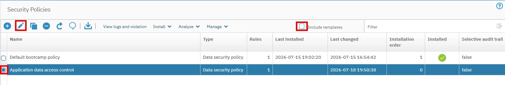{ width="99%" }](../images/polrepbas48.webp) 
[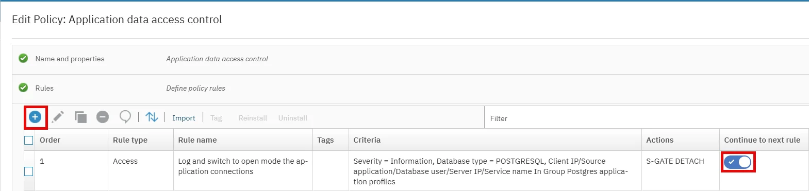{ width="99%" }](../images/polrepbas49.webp) 
1.	Name the rule *Block access for other users* and ensure that no users other than the application accounts can access data stored in the application tables.
[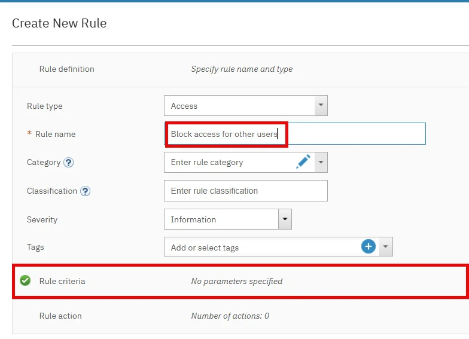{ width="79%" }](../images/polrepbas50.webp)
 
1.	First, add two criteria to ensure that only *PostgreSQL* traffic is evaluated and that the traffic does not belong to application users. To achieve this, use the *Not In Group* operator and reference the previously created *5-tuple* group, which identifies the application accounts.
To limit the scope of the rule to application tables, select the **Object** parameter in the *SQL Criteria* section and create a new group that will contain the list of protected tables.
[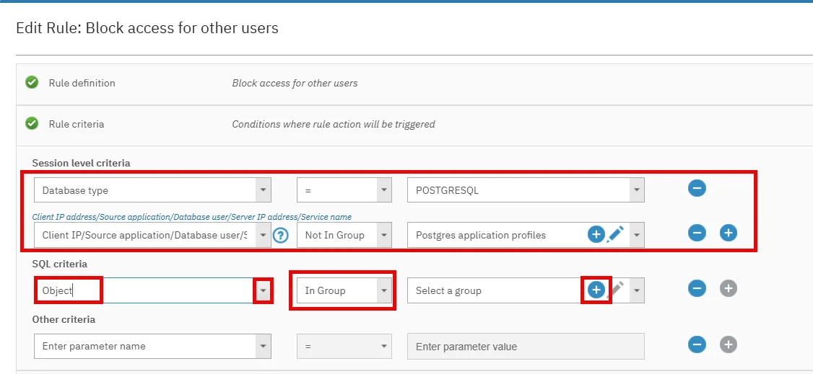{ width="99%" }](../images/polrepbas51.webp)
 
1.	The application uses five tables. In the group named *Application tables on postgres*, switch to the *Members* tab and add the table names using the *schema.table* notation. After entering all protected object names, **Save** the group.
[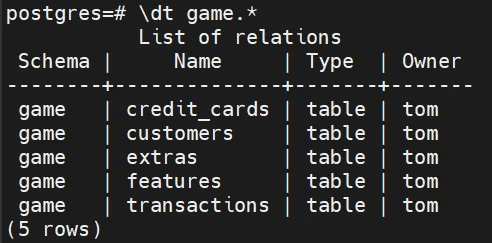{ width="59%" }](../images/polrepbas52.webp)
[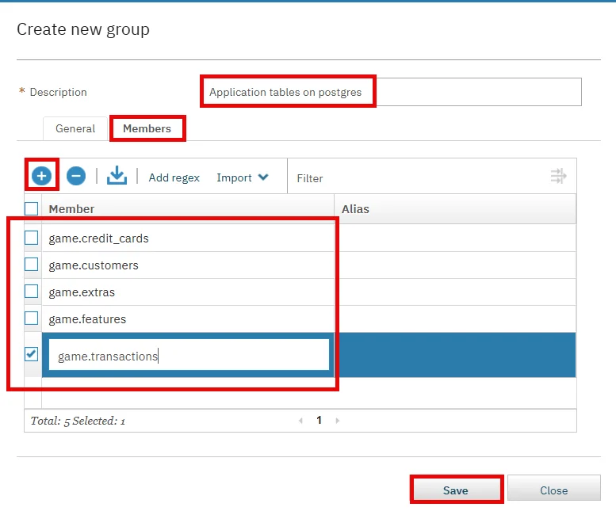{ width="99%" }](../images/polrepbas53.webp)

1.	After returning to the rule definition, the newly created group should be referenced by the *Object* criterion. **Next**, proceed to defining the rule actions.
[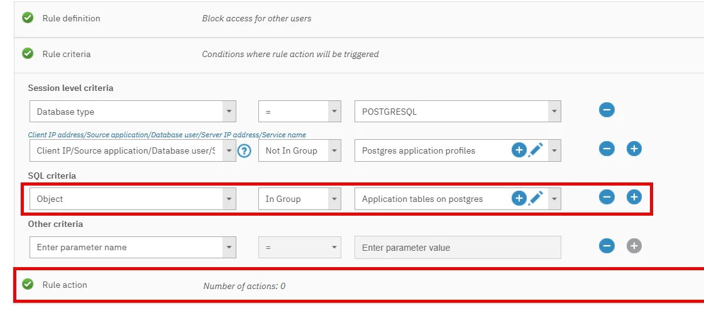{ width="99%" }](../images/polrepbas54.webp)
 
1.	Add two actions to the rule. From the *S-GATE* action group, select **S-GATE TERMINATE** to terminate the session, and from the *LOG* action group, select **LOG FULL DETAILS** to ensure that any unauthorized access attempt is fully audited. Save the rule using **OK** button.
[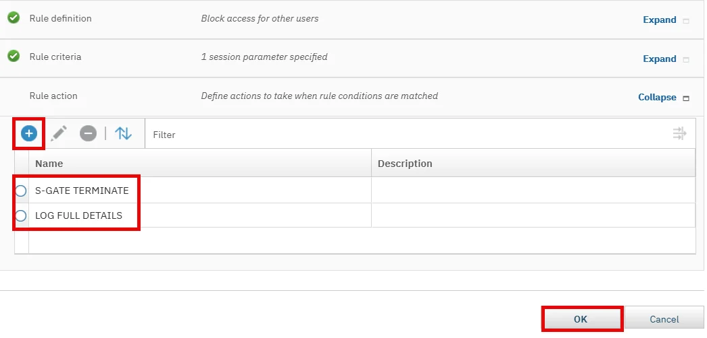{ width="99%" }](../images/polrepbas55.webp)
 
1.	The two rules you created focus on very specific traffic patterns. If neither rule is matched, all remaining traffic will not be logged with full details. Therefore, add a final rule stating that all remaining traffic should also be logged.
[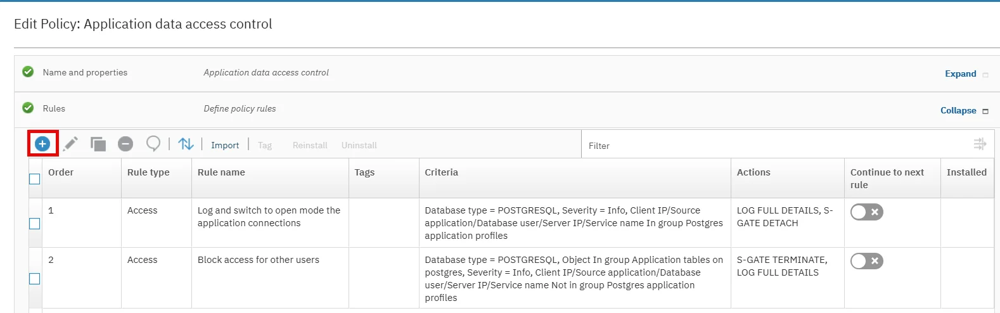{ width="99%" }](../images/polrepbas56.webp)
 
1.	Name the rule *Log the remaining traffic*. Do not define any criteria, which means the rule will always be matched if traffic reaches it during policy evaluation. In the *Actions* section, add **LOG FULL DETAILS**.
[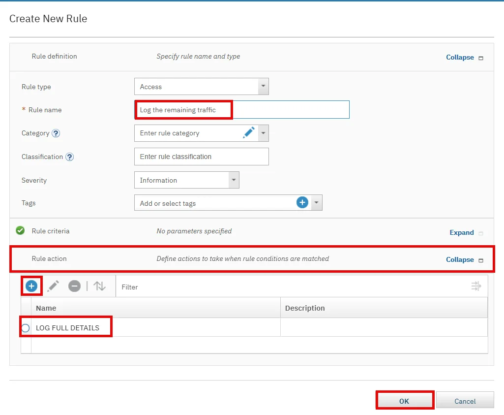{ width="99%" }](../images/polrepbas57.webp) 
 
1.	The policy now contains three rules and is ready for testing. Save it by clicking **OK**.
[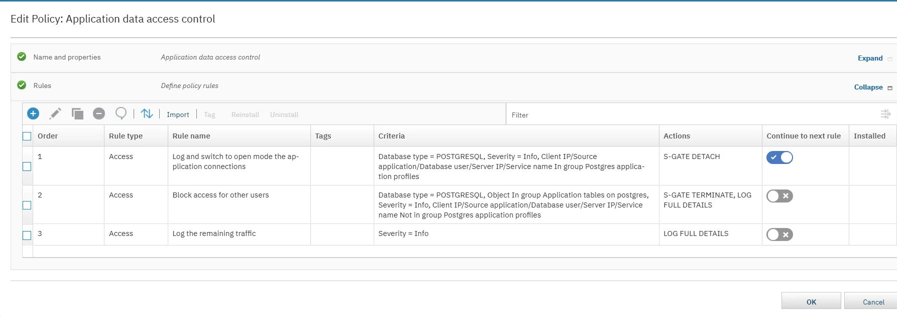{ width="99%" }](../images/polrepbas58.webp)
 
1.	In the **Policies** view, select your newly created policy, expand the menu, and choose **Install** :material-arrow-right: **Install**. This will open the **Install Policy** window. Select *Install and Override*, then confirm the action. You should see a confirmation message indicating that the policy was successfully installed. After this operation, the new policy should be marked as installed on the **coll1**.
[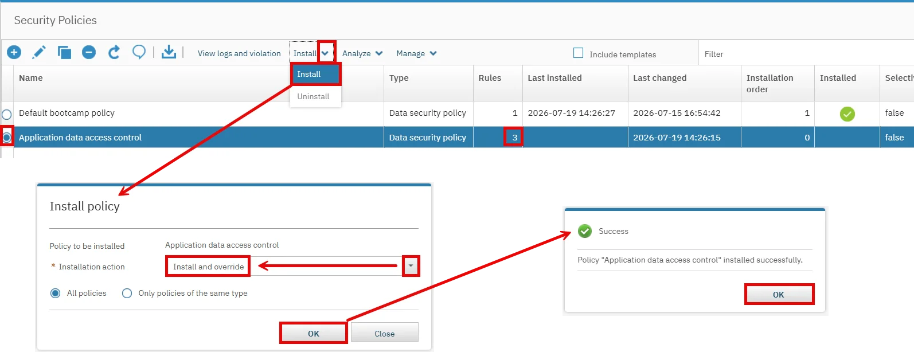{ width="99%" }](../images/polrepbas59.webp)
[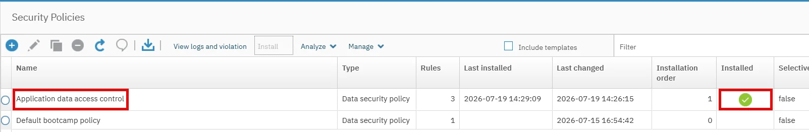{ width="99%" }](../images/polrepbas60.webp)
 
1.	In the session where dbtraffic is running, verify that traffic is still being generated without interruption.
[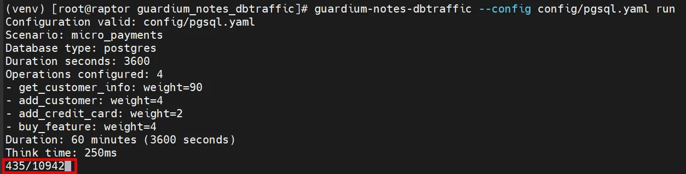{ width="99%" }](../images/polrepbas61.webp)

1.	In the *SSH* session on the **raptor**, re-login to the **postgres** account and notice that you're able to display users, but access to the customers table is now blocked (if for some reasons you will get slow response of `psql` client and blocking will not work, ask instructor for help).
```sql linenums="1"
su - postgres

psql

\du

SELECT * FROM game.customers LIMIT 10;

\q

exit
```
[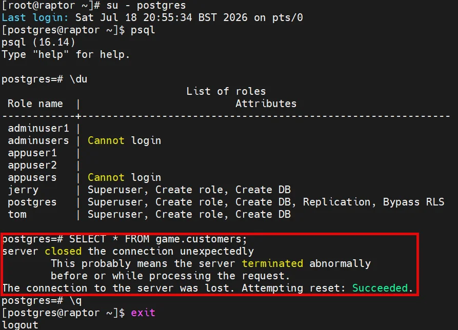{ width="79%" }](../images/polrepbas62.webp)

1.	Do the same for users **tom** and **jerry** and confirm they also cannot get access to application schema.
```sql linenums="1"
psql "postgresql://raptor.demo.guardium:5432/postgres?sslmode=require" -U tom -W

SELECT * FROM game.customers;

\du

\q

psql "postgresql://raptor.demo.guardium:5432/postgres?sslmode=require" -U jerry -W

SELECT * FROM game.customers;

\du

\q
```
[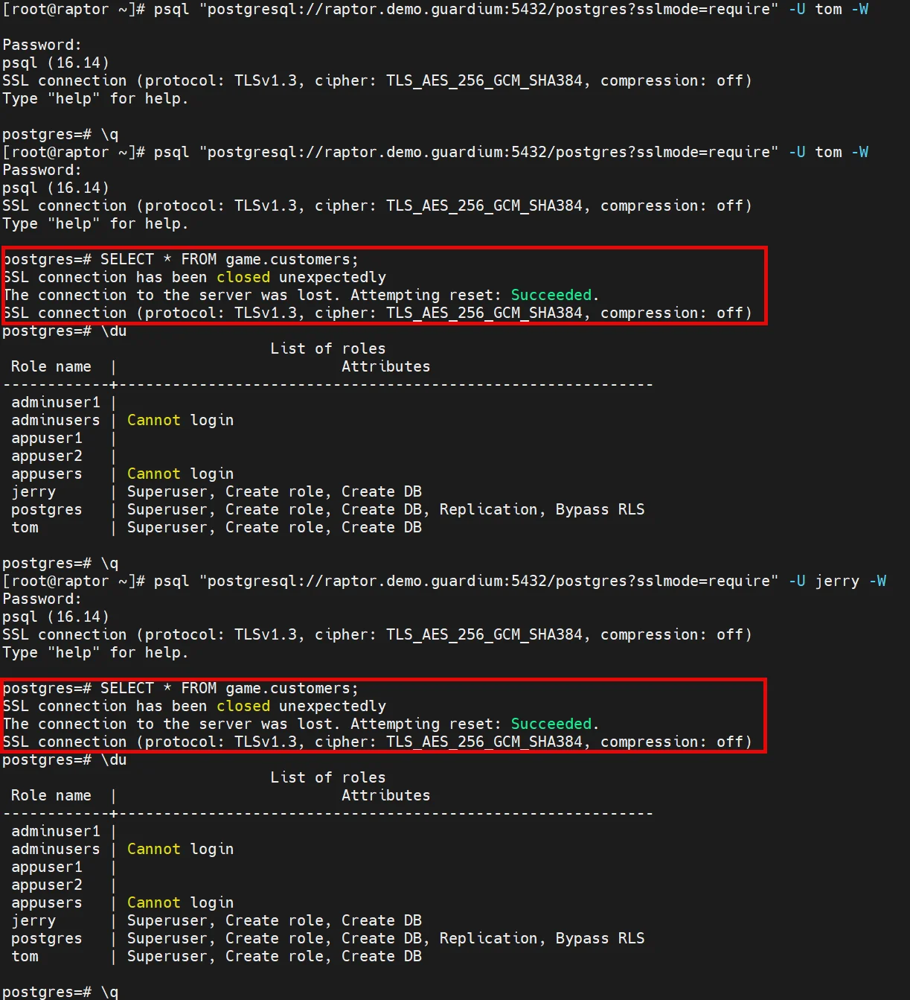{ width="99%" }](../images/polrepbas63.webp)

1.	Find the **Policy Violations Details** view on **coll1** and confirm that the blocked access attempts to the customers table by users postgres, **tom** and **jerry** are listed in the violations list.
[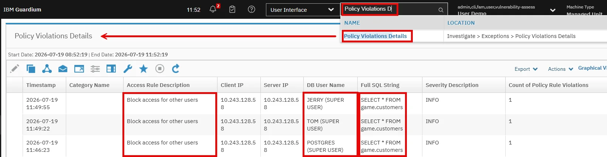{ width="99%" }](../images/polrepbas64.webp)

1.	If you review the *Full SQL (Policies)* report, you'll notice that the blocked *SELECT* commands are displayed on the list. Before continuing, set the report filter to display only administrator activity by filtering on user names that contain *SUPER USER*, which will exclude the application traffic from the results.
[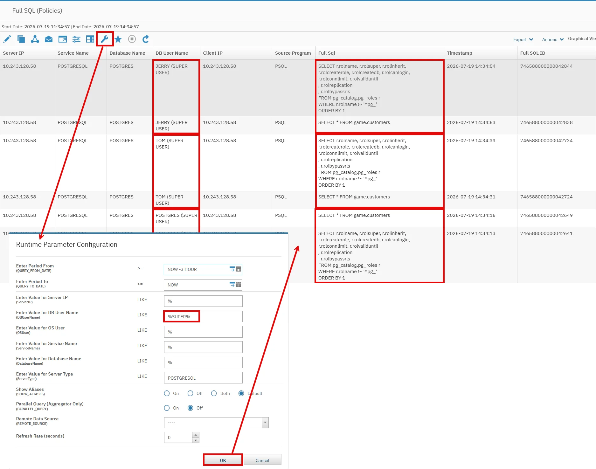{ width="99%" }](../images/polrepbas65.webp) 

1.	Notice, that the report does not indicate which queries were successfully executed and which were not. **Guardium** can collect this information, but first modify the report and add three additional fields:

    !!! note ""
        - Full SQL :material-arrow-right: **Records Affected**
        - Full SQL :material-arrow-right: **Succeeded**
        - Full SQL :material-arrow-right: **Access Rule Description**

    [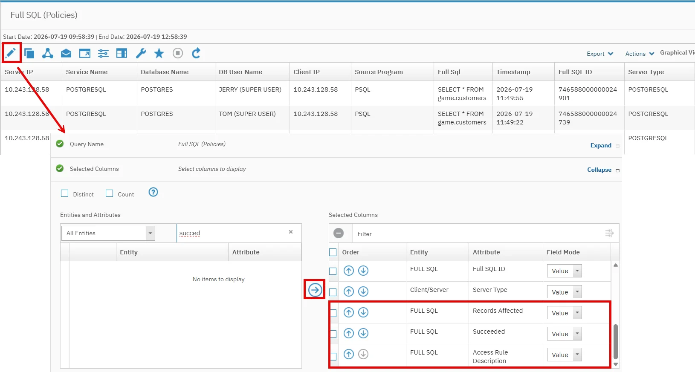{ width="99%" }](../images/polrepbas66.webp)
 
1.	**Save** and **Close** query editor and **Refresh** report. Values of **-1** and **1** in these fields indicate that no records were returned and the queries were successfully executed. Fortunately, we can determine that the event was audited by the blocking rule. Based on this, we can indirectly conclude that the **SQL** statement did not complete successfully. However, an additional mechanism for collecting more detailed information can be enabled. Keep in mind that activating these options increases collector resource consumption. 
[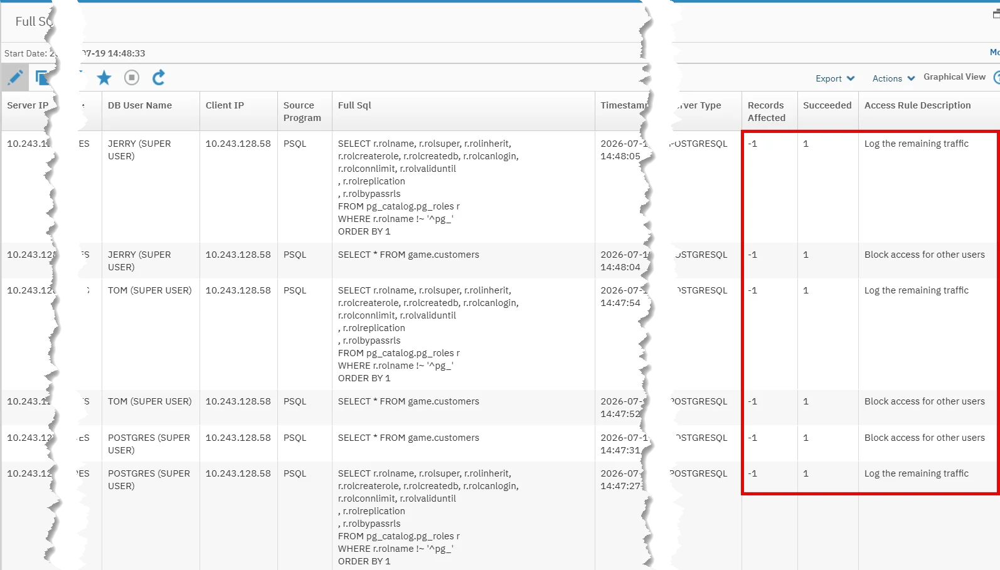{ width="99%" }](../images/polrepbas67.webp)

1.	To enable these functionalities, you must open the **Inspection Engine Configuration** view <span class="mb">1</span>, <span class="mb">2</span>. Then, check the boxes for *Log Records Affected*, *Inspect Returned Data* and *Record Empty Sessions* (<span class="mb">3</span>, <span class="mb">4</span>, <span class="mb">5</span>) and press the **Apply** <span class="mb">6</span> button, followed by the **Restart Inspection Engines** button <span class="mb">7</span>, confirming this operation when prompted <span class="mb">8</span>.
The **raptor** machine has limited resource and it is probable that you will notice issue with SQL execution after change. Ask instructor to solve the issue, *STAP * restart is the best approach.
[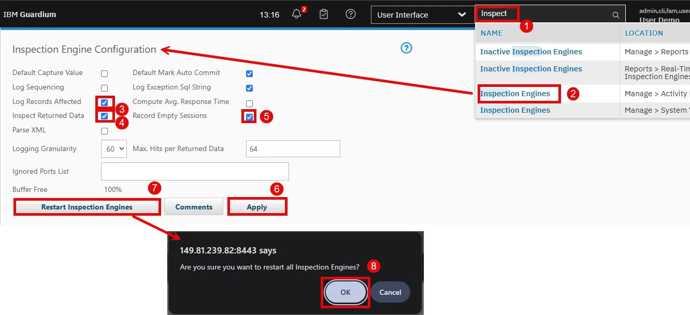{ width="99%" }](../images/polrepbas68.webp)
 
1.	The changes above can also affect the agent, and existing sessions may stop working. Therefore, this inspection engine configuration change should be performed during a maintenance window or before the agent is installed. Switch to the session where dbtraffic is running, stop the program (++ctrl+c++), and then start it again.
```bash
guardium-notes-dbtraffic --config config/pgsql.yaml run
```
1.	Once again, attempt to access the application data as **tom** and **jerry**.
```sql linenums="1"
psql "postgresql://raptor.demo.guardium:5432/postgres?sslmode=require" -U tom -W

SELECT * FROM game.customers LIMIT 10;

\du

SELECT * FROM game.customers1;

\q

psql "postgresql://raptor.demo.guardium:5432/postgres?sslmode=require" -U jerry -W

SELECT * FROM game.customers LIMIT 10;

\du

SELECT * FROM game.customers1;

\q
```

1.	Analyze the returned metadata. For the blocked query against the customers table, you can see that no records were returned and that the blocking rule was triggered. However, the query is still marked as successful. This occurs because the blocking rule terminates the session, and the agent never receives the final execution status of the statement. As a result, it assumes the query completed successfully. This is a known limitation that must be accepted. For the query that returned the list of users, you can see that eight records were returned. When the invalid query against the non-existent customers1 table was executed, the metadata additionally shows that the *SQL* statement did not execute successfully.
[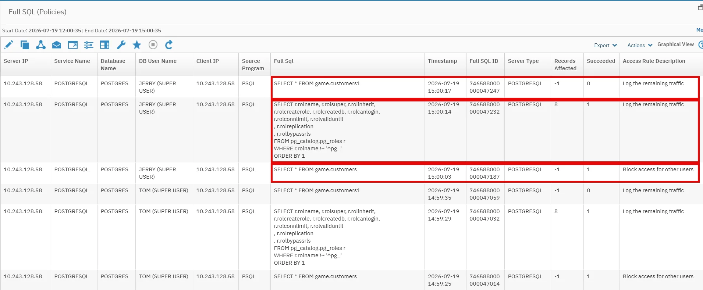{ width="99%" }](../images/polrepbas69.webp)

## Access control on command level

1.	Of course, administrators require access to the application schema. However, due to the sensitivity of the personal data stored there, assume that only the tom and jerry administrator accounts should have access, and that their access should be limited to read-only operations. To enforce this, create another rule by editing the active policy directly from the Installed Policies view.
[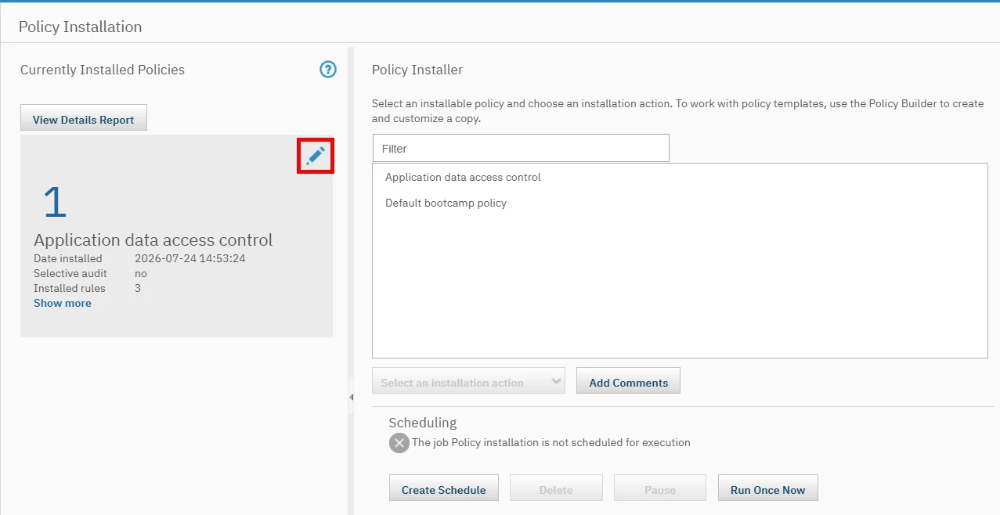{ width="99%" }](../images/polrepbas70.webp) 

1.	Select a Rules pane and add a new rule.
[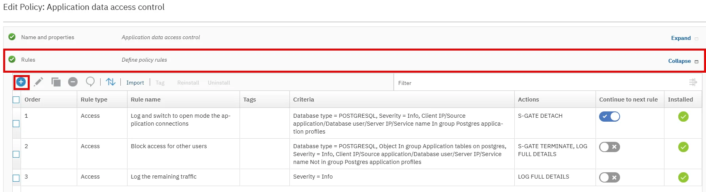{ width="99%" }](../images/polrepbas71.webp)

1.	Name the rule Admin access to application data. Add two Session criteria: Database Type and Database User, the second referencing a new group named Postgres Administrators, whose members are the tom and jerry accounts. To restrict access to SELECT statements only, add an SQL criterion based on Command and reference the existing Select Command group. Limit also rule to Objects from Application tables on postgres. 
[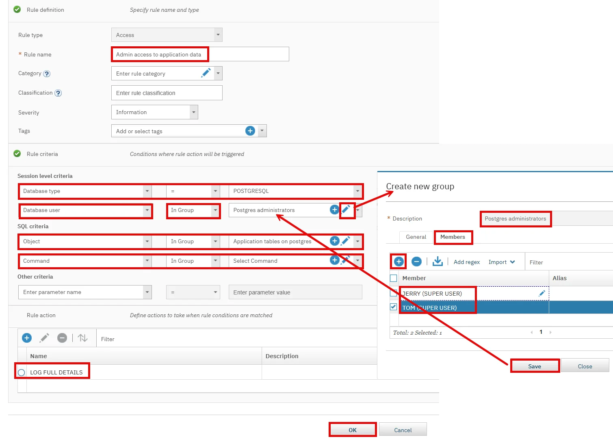{ width="99%" }](../images/polrepbas72.webp) 
Add only the LOG FULL DETAILS action to the rule. This means that any activity matching this rule will be fully logged and allowed to proceed. Press OK button to save rule.

1.	The newly created rule will appear at the bottom of the list. However, to make the policy logic work as intended, it must be moved to the second position. This ensures that administrators’ access to application data is evaluated before the third rule, which blocks all other operations.
To reorder the rule, click the two vertical arrows icon in the policy toolbar. This will display the Order column. Then click the up-arrow icon in the row corresponding to the new rule to move it to the desired position.
[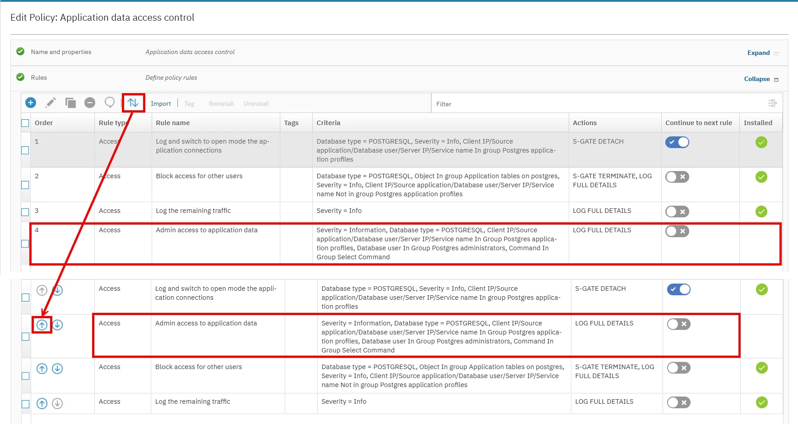{ width="99%" }](../images/polrepbas73.webp) 

1.	After saving the policy, you will return to the Policy Installation window. To refresh (reinstall) the policy, click Run Once Now. You should notice that the number of rules in the installed policy has changed from 3 to 4, and the policy installation timestamp has been updated to the current time.
[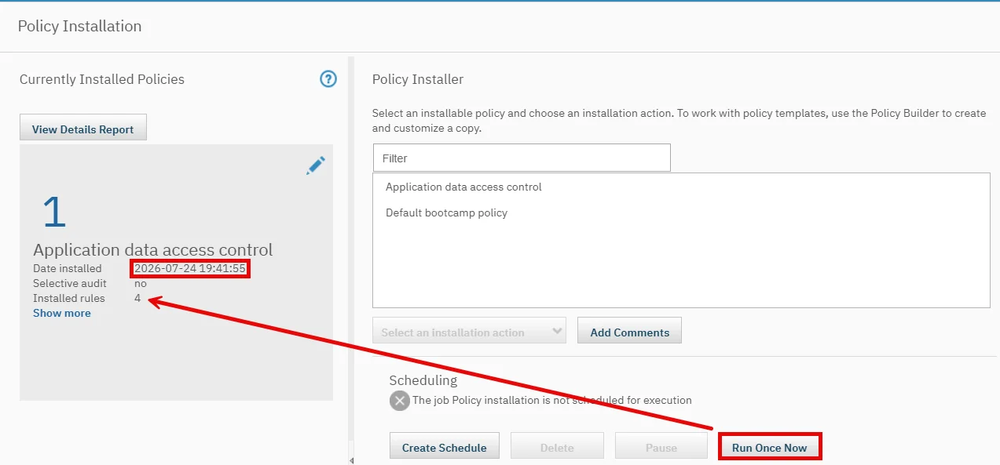{ width="99%" }](../images/polrepbas74.webp) 

1.	Verify the rule behavior by logging in as one of the administrators and attempting to retrieve data from the game.customers table. Then try to delete several records and observe the outcome.
```sql linenums="1"
psql "postgresql://raptor.demo.guardium:5432/postgres?sslmode=require" -U jerry -W

SELECT * FROM  game.customers LIMIT 10;

DELETE FROM game.customers WHERE street='Gliwice';
```
[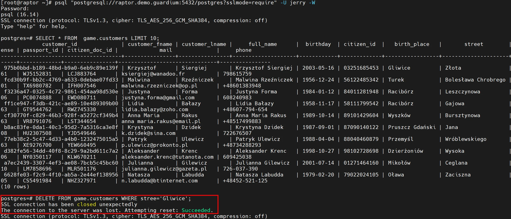{ width="99%" }](../images/polrepbas75.webp) 

As expected, the administrator was able to view customer data, but the attempt to delete records was blocked.

## Object references

1.	Login to database as a postgres and confirm lack of access to game.credit_cards table
su - postgres

psql

SELECT * FROM game.customers;
1.	In the table name game.customers, we use a <schema.table> reference, which allows us to distinguish between objects with the same name in different schemas.
However, it is possible to use a fully qualified table name, which in the case of Postgres has the form <database.schema.table>. The current database name you can gather from command:
SELECT current_database();
1.	Let's now try to retrieve data from the public.customer table in the postgres database.
SELECT * FROM  postgres.game.credit_cards LIMIT 10;
 
1.	As it turns out, this time the agent did not block the query. Within a database session, there's a concept of the current session context, which can be defined to a default value after a user logs in. We can display this context using the command:
SELECT current_schema();
1.	In other words, if we reference an object in the current session without providing a schema, the default one – public - will be assumed. If we change it to game one we will be able to refer tables by their names only. Again data will be leaked. 
SET search_path TO game;

SELECT current_schema();

SELECT * FROM credit_cards LIMIT 10;
 
1.	And once again, data from the customers table was retrieved. The reason for this is that our rule indicates only references to the public.customers object should be blocked, but in a real environment, our table can also be referenced as postgres.public.customer and customers. These three forms can be replaced with two references to the objects: customers and %.customers, where the second element uses a wildcard pattern preceding the table name. Let's try to modify our policy.
1.	Information about the application tables is stored in the Application Tables on Postgres group. You can edit it through the rule definition, but you can also modify it directly from Group Builder. Open the Group Builder view, select the desired group, and click the pencil icon to edit it.
 
1.	To cover all possible object reference formats, enter each of the five tables using both <table> and <%.table> notation. The second format acts as a pattern that matches references made either through the schema name or though the database and schema name.
 
1.	After saving the changes to the group, reopen the Policy Installation view and click Run Once Now to refresh the policy on the collector.
 
1.	Try again access to object using three different object references as a tom user. Confirm that all table references are correctly blocked.
su - postgres

psql

SELECT * FROM game.customers;

SELECT * FROM postgres.public.customers;

SET search_path TO game;

SELECT * FROM customers;

\q
 

## Blocking on column level
1.	Implement an additional rule that restricts access to payment card data to a specific set of users. The credit_cards table contains a card_number column, and this is the data element that requires additional protection. Assume that only the jerry administrator account should be allowed to view this data.
psql "postgresql://raptor.demo.guardium:5432/postgres?sslmode=require" -U tom -W

SELECT * FROM game.credit_cards LIMIT 10;
 
1.	Edit the policy and add a new rule named Access to PCI data on postgres. Add two Session criteria. The first should limit the rule to POSTGRESQL traffic. The second should restrict access to database users not defined in a new group named Administrators with access to PCI data, which initially contains a single member: jerry. Next, add two SQL criteria to limit the activity to SELECT statements and to specific table columns. Use Object / Field Group and create a new group named Postgres PCI fields. This group should contain two-part values consisting of the table name and column name. Add references to the card_number column using all supported table notations (<table> and <%.table>) to ensure that every possible reference format to the protected column is covered.
 
The conditions in this rule identify an unauthorized attempt to access PCI data, so add the following two actions: S-GATE TERMINATE and LOG FULL DETAILS.
1.	After saving the rule, move it to position 2 and save the policy.
 
1.	Reinstall policy and let’s test it as tom user.  Access to the credit_cards table is terminated whenever a SELECT statement directly or indirectly references the card_number column. If a query does not reference this data, it is allowed to be executed successfully.
psql "postgresql://raptor.demo.guardium:5432/postgres?sslmode=require" -U tom -W

SELECT * FROM game.credit_cards LIMIT 10;

SELECT card_number FROM game.credit_cards LIMIT 10;

SELECT card_id FROM postgres.game.credit_cards LIMIT 10;

\q
 
1.	And now, do the same thing as jerry and confirm his access to PCI data.
psql "postgresql://localhost:5432/postgres?sslmode=require" -U jerry -W

SELECT * FROM game.credit_cards LIMIT 10;

SELECT card_number FROM game.credit_cards LIMIT 10;

SELECT card_id FROM postgres.game.credit_cards LIMIT 10;

\q


## Hacker is smarter
1.	Let's assume we are dealing with a security breach where someone with stolen postgres user credentials on the raptor machine wants to retrieve customer data and executes:
su - postgres

psql

\dt *.*

select * from game.credit_cards limit 1;

\d game.credit_cards;
1.	The first command is a simple reconnaissance aimed at finding interesting tables. The name credit_cards should be interesting to the intruder, and he tries to retrieve one row from this table. He specifically limits the data scope so as not to trigger policies controlling massive data extraction. He realizes that some mechanism controls access to this table and decide to check table structure.
 
1.	Knowledge of the table structure opens the possibility for us to reference data indirectly through the mechanism of parameterized functions. A hypothetical bad guy can create a procedure like this one:
SET search_path TO game;

CREATE FUNCTION get_table(tablename text)
RETURNS SETOF record AS $$
BEGIN
    RETURN QUERY EXECUTE format('SELECT * FROM %I', tablename);
END;
$$ LANGUAGE plpgsql;
 
1.	Because the account used for the attack has high privileges, the function was created and can now be easily invoked. Thanks to the knowledge of the data stream returned from the table, the data can be retrieved.
SELECT * FROM get_table('credit_cards') AS t(cid uuid, userid uuid, cc character varying(30), cv character varying(12) ) LIMIT 1;
 
1.	After data extraction, an experienced hacker will try to cover their tracks by deleting the function.
DROP FUNCTION get_table;

\q


## Alert on suspicious activity

1.	Blocking, and preventative actions in general, seem at first glance to be a good mechanism for data protection, but due to the sensitivity of production environments to configuration changes, they are rarely implemented. The previous example also illustrates how deceptive the assumption that we control all data access vectors can be, and that there may always be methods we are not aware of. This makes it even more critical to have full monitoring of privileged user access and the ability to inform the organization's security systems about a situation. Typically, such a solution is a SIEM, which we feed events. Let's try to build a new rule that will send information to an external system about the use of the functions that are of interest to us in this case: CREATE FUNCTION and DROP FUNCTION.
To do this, re-edit our policy and add a new rule with name Alert suspicious commands execution. The session will again narrow its scope to the Postgres database and traffic not belonging to application.
At the SQL criteria level, search for the use of the CREATE FUNCTION and DROP FUNCTION SQL commands. Store the list of suspicious commands in a group named Suspicious commands for non application traffic.
For the rule action, add ALERT ONCE PER SESSION from the ALERT action group. When selecting any alert action, an additional configuration window will appear where you must specify the message template and the delivery method. Select the standard template and Remote SYSLOG.
 
1.	After saving the rule, move it above the Block access for other users rule and save the policy.
 
1.	Don't forget to reinstall the policy.
 
1.	Let's test the new policy functionality.
psql

SET search_path TO game;

CREATE FUNCTION get_table(tablename text)
RETURNS SETOF record AS $$
BEGIN
    RETURN QUERY EXECUTE format('SELECT * FROM %I', tablename);
END;
$$ LANGUAGE plpgsql;

SELECT * FROM get_table('credit_cards') AS t(cid uuid, userid uuid, cc character varying(30), cv character varying(12) ) LIMIT 1;

DROP FUNCTION get_table;

\q
1.	Let's check the violations report. We should be surprised that two records appeared in the report instead of the one we expected, which was related to the ALERT ONCE PER SESSION action. In Guardium, the violations presented in this report are internal events and are always stored unless we explicitly discard them using ALERT ONLY action.
 
1.	To see what events were sent via syslog, we will build a new report. Open Query-Report Builder, select the Alert report domain, and use the plus icon.
 
1.	Enter the report name Sent alerts (Training), and set the main entity to the value Message Sent, and then proceed to the Selected Columns section. Add the Message Date, Message Type, and Message STATUS fields from the Message Sent entity, and the Message Text field from the entity with the same name to the report. Switch to Sort Order section. Set the sorting in descending order for the Message Date column and save the report definition.
 
1.	Add the just created report to our Policies and Reports dashboard.
1.	Review our new report, and you should see only one sent event related to our previous session, which contains a reference to the first monitored command: CREATE FUNCTION.
 
10.	We will now feed the SIEM system with information about suspicious commands executed by privileged users.

## Bad guys will always find a way
1.	Data access languages provide many different methods for referencing data. Even though we block access to an object by name and alert on the attempt to create a function that could lead to data leakage, other possibilities likely still exist.
1.	Let's once again become a hypothetical intruder who, as we remember, was able to learn what the table structure looks like.
psql

\d game.credit_cards
 
1.	It should make us wonder why the command \d game.credit_cards was not blocked, since it refers to a table we are protecting. The answer is simple - \d is not a command, but only a postgres client alias which translates it into a proper SQL command and presents the desired result, which is the table structure.
So what is being executed, and why didn't the system block this activity?
Analyze the list of SQL in the current session of the user postgres in the Full SQL (Policies) report. You will notice many complex queries, and one of them will look as follows:
 
Execute it yourself.
SELECT c.oid, n.nspname, c.relname FROM pg_catalog.pg_class c LEFT JOIN pg_catalog.pg_namespace n ON n.oid = c.relnamespace WHERE c.relname OPERATOR(pg_catalog.~) '^(credit_cards)$' COLLATE pg_catalog.default AND n.nspname OPERATOR(pg_catalog.~) '^(game)$' COLLATE pg_catalog.default ORDER BY 2, 3;
 
1.	It turns out that this SQL translates the table name into its unique ID and does not reference the table directly, but only the information catalog about tables (the OID number is specific to the environment and yours may differ from the one presented in the lab). 
Look closely at the SQLs in the report and you will notice that instead of the table name, the Postgres client uses OID references.
 
1.	An experienced Postgres database administrator knows very well that they can reference a table via OID instead of its name and retrieve data from it, as long as they know the column names (replace <your_customers_OID> by appropriate value retrieved in your lab instance).
DO $$
DECLARE
    t_oid oid := 16418;
    sql text;
    rec record;
BEGIN
    sql := format('SELECT card_id, customer_id, card_number, card_validity FROM %s LIMIT 10', t_oid::regclass);
    FOR rec IN EXECUTE sql
    LOOP
        RAISE NOTICE 'cid = %, cusid = %, cc = %, cv = %', rec.card_id, rec.customer_id, rec.card_number, rec.card_validity;
    END LOOP;
END;
$$;
 


Appendix	Dependencies:
This lab assumes that you finished the ATAP lab and postgres is installed and configured to intercept encrypted traffic.
If you did not cover Oracle lab you can skip step I.6

Resources:


