# Vulnerability Assessement configuration

## VA Feature Flag

1.	Starting with version **12.2**, some **Guardium** features must be enabled through a mechanism called *feature flags*. Activating a *feature flag* is a two-step process. First, the appropriate feature options file must be loaded, which has already been completed in our environment.
[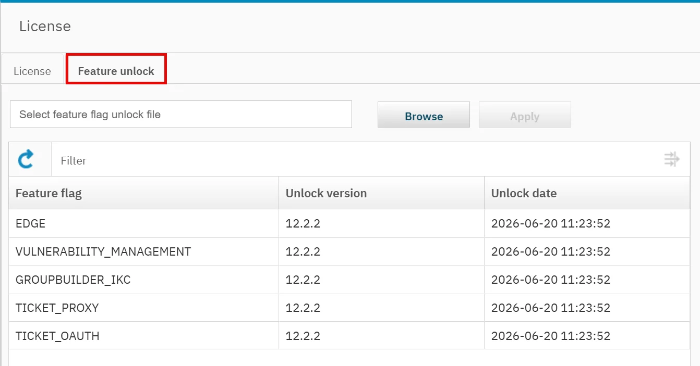{ width="99%" }](../images/va1.webp)
 
1.	To activate the *feature flag*, run the following command from the cm cli. The *VULNERABILITY_MANAGEMENT* flag enables an additional UI view that will be used in the later sections of this lab.
```bash
grdapi enable_disable_feature_flag flagName=VULNERABILITY_MANAGEMENT action=enable
```
1.	And confirm operation
```bash
grdapi list_feature_flags
```
[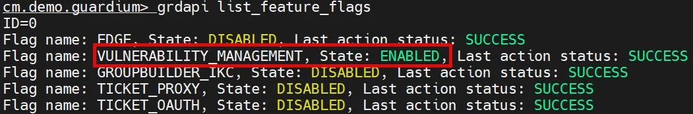{ width="99%" }](../images/va2.webp)

## Update VA tests

1.	From browser go to *Fix Central* (<https://ibm.com/support/fixcentral/>) and look for *DPS* updates for **Guardium 12.2**
[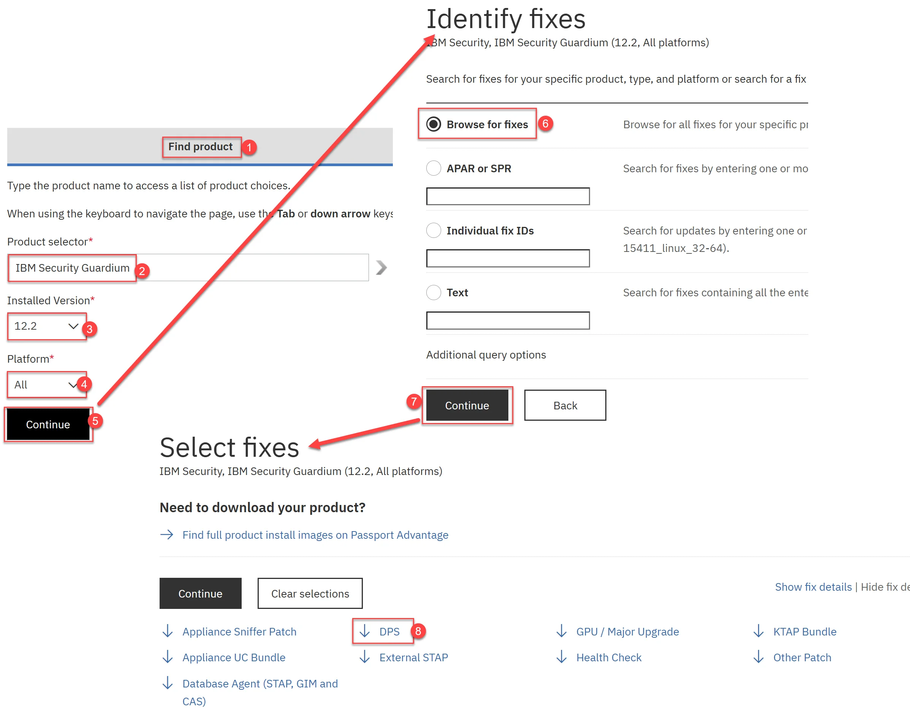{ width="99%" }](../images/va3.webp)
 
1.	In *DPS* section locate the latest quarter update (position 4 in my case, Q4’25 update) and the latest *Rapid Response* update (if exists) related to quarter one (position 1 my case). Download this/these file/files.
[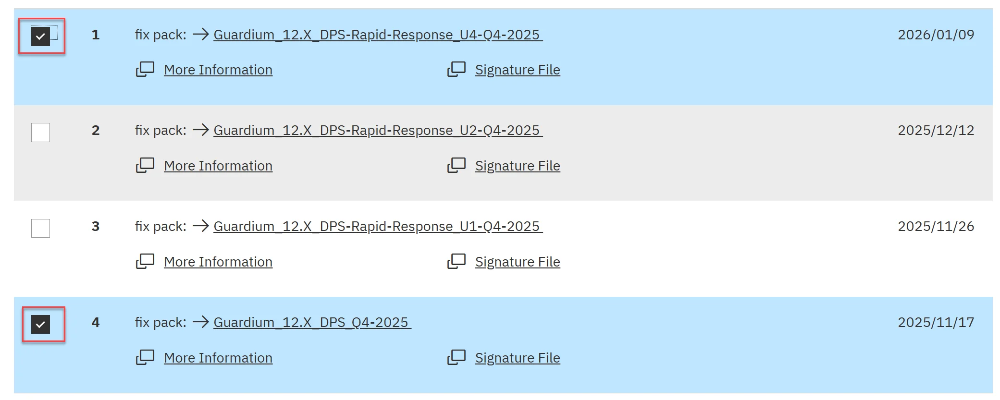{ width="99%" }](../images/va4.webp)

1.	Unpack zip file/files. Inside each archive you should have file with `enc` extension.
[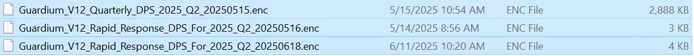{ width="99%" }](../images/va5.webp)

1.	Open **Customer Uploads** view on **cm** and press **Browse** button. Select quartely *DSP* update file and then use **Upload** button to load it to the engine.
[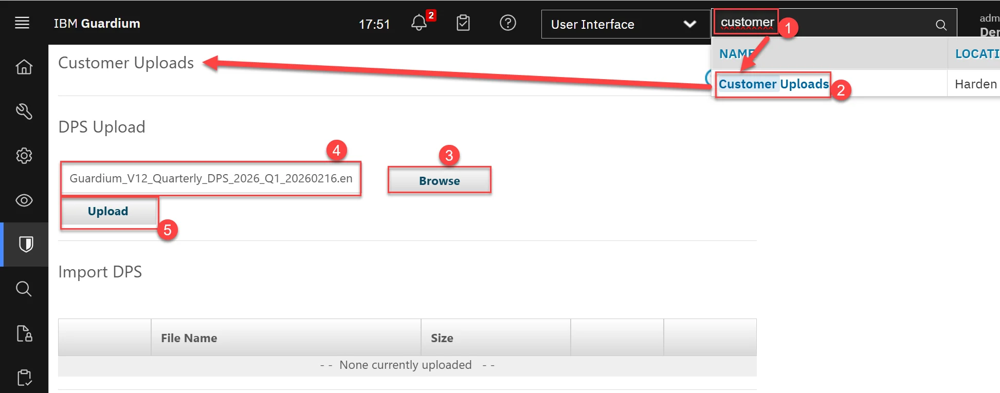{ width="99%" }](../images/va6.webp)

1.	Import *DPS* section will be refreshed and the uploaded file should appear. Press the 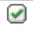{ width="20" } icon to start *DPS* import – popup with message “*Import DPS is in progress …*” should appear (wait a while to get pop-up). Close it and wait for next pop-up. It can takes even few minutes.
[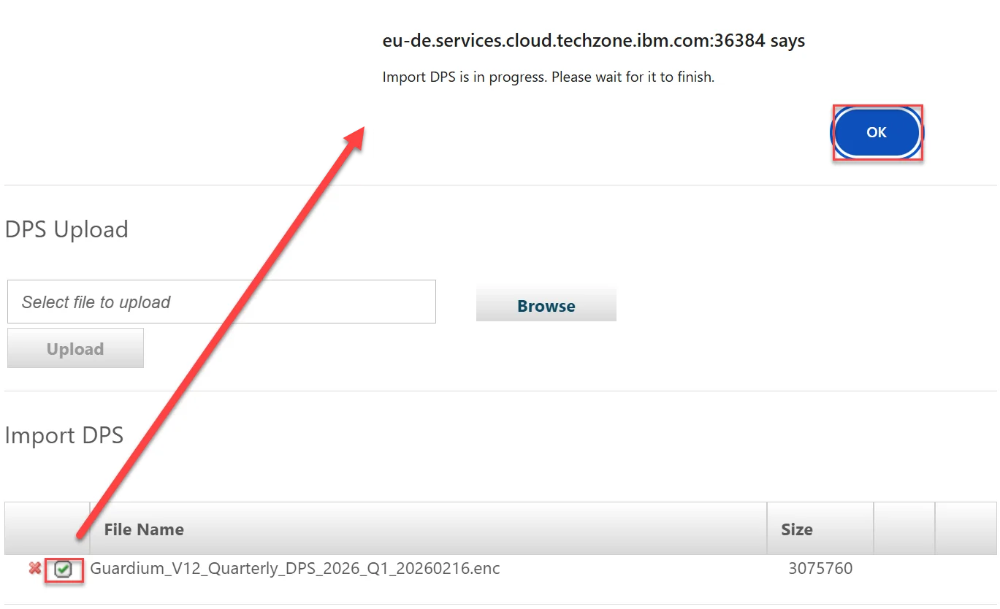{ width="99%" }](../images/va8.webp)
1.	Accept the second pop-up with information that *DPS* import started and notice that message below of *DPS Upload* section is changed and refers to new *DPS* file and informs that process is running. If message will not appear, refresh browser tab and check it again.
[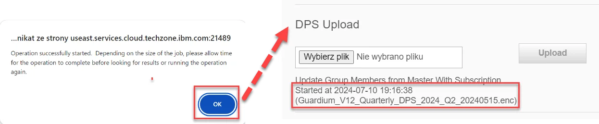{ width="99%" }](../images/va9.webp)

1.	You can go back to **Customer Upload** view after few minutes and notice that *DPS import* process finished successfully. You can continue lab; there is no demand to have the latest updates. Sometimes *DPS import* takes hours.
[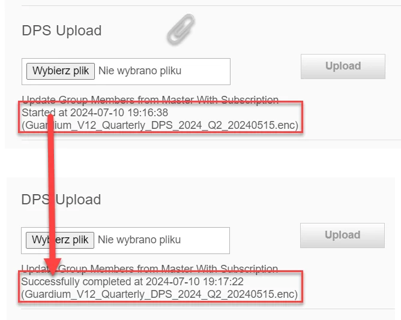{ width="69%" }](../images/va10.webp)
 
1.	If you have Rapid Response update repeat the upload procedure for it according to steps from **4** to **7**. You process the rapid update when quarter one is correctly imported

## ~~VA roles scripts~~

<!-- 1.	Connect to **cm** cli and execute command to start a web based **fileserver** with access to files stored on appliance filesystem. The command parameters are: an *IP address* which points that connection will be possible only from our windows machine and the second one sets that service will be automatically shutdown *after 1 hour*. Do not press ++enter++ when **fileserver** will be started.
```bash
fileserver <ceratops_ip> 3600
```
[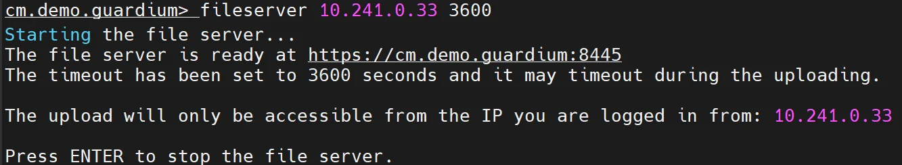{ width="99%" }](../images/va11.webp)
 
1.	In **RDP** session on **ceratops** start browser and go to URL – <https://cm.demo.guardium:8445>
 
1.	Select Access logs and move to log/debug-logs/gdmonitor_scripts directory. This folder contains the scripts to create access role for all supported by VA databases.
 
1.	Download gdmonitor-postgres.sql file ans save it on winsql machine
1.	Back to CM cli session and stop fileserver – press <ENTER> in the ssh session  -->
	
## Configure VA technical account

1.	On **raptor** connect to *PostreSQL* as superuser and create a new user account (**sqlguard**) and a new group (**gdmmonitor**). Assign to the group limited rights to read database configuration only (based on appliance scripts).
```sql linenums="1"
su - postgres

psql

CREATE USER sqlguard WITH ENCRYPTED PASSWORD '<your_password>';

CREATE GROUP gdmmonitor;

ALTER GROUP gdmmonitor ADD USER sqlguard;

GRANT pg_read_all_settings TO gdmmonitor;

GRANT SELECT ON pg_authid TO gdmmonitor;

\q

exit
```

## Configure VA for PostgreSQL

1.	Open **Assessment Builder** view on **cm** and create a new assessment definition (plus icon { width="15" })
[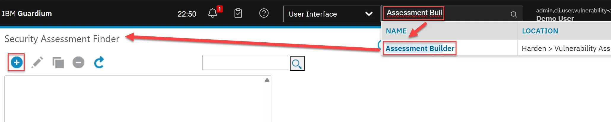{ width="99%" }](../images/va16.webp) 

1.	Insert new assessment name **postgres on raptor** and press **Add Datasource** button
[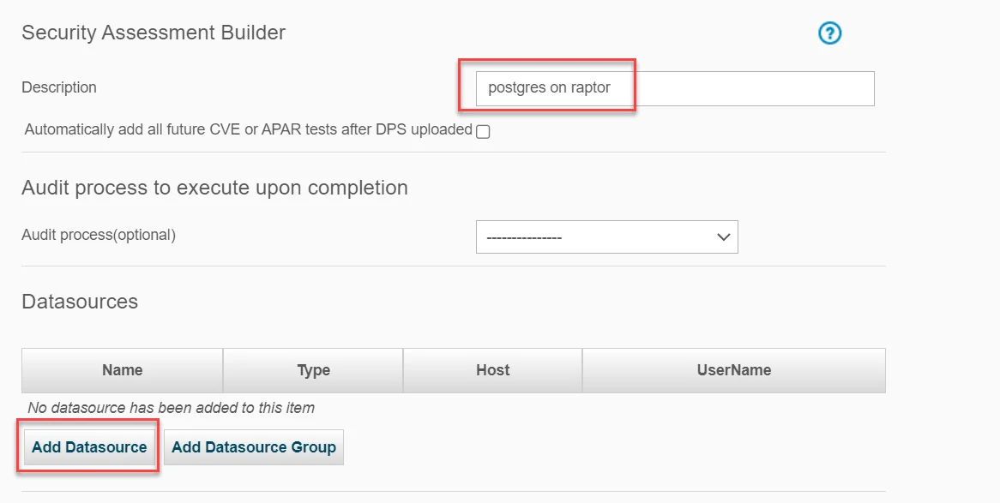{ width="99%" }](../images/va17.webp)
 
1.	In Select datasource list use { width="15" } icon to add new datasource. Insert appropriate valies and **Save**.
    
    !!! note "Insert values:"
        - name: **postgres on raptor**
        - Database type: **PostgreSQL**
        - Shared datasource: :material-check:
        - User name: **sqlguard**
        - Password: &lt;defined in previous chapter>
        - Hostname/IP: **raptor.demo.guardium**
        - Port number: **5432**
        - Database: **postgres**
  
    [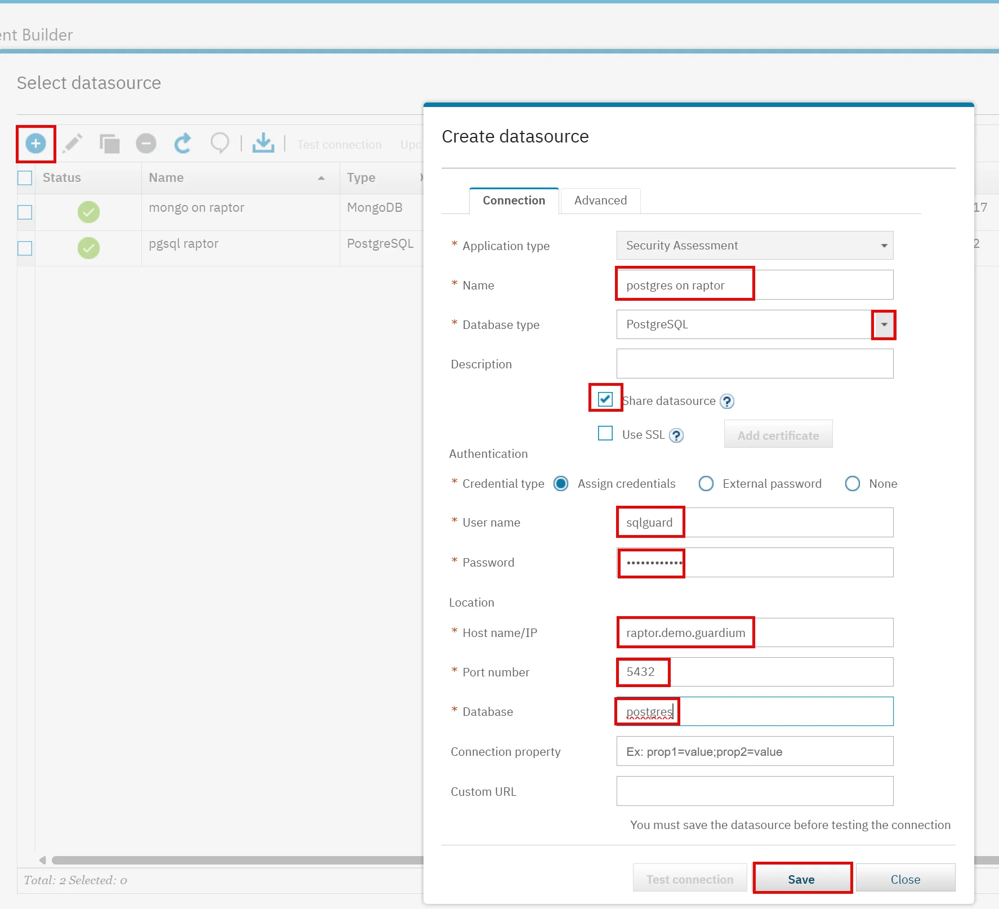{ width="99%" }](../images/va18.webp)
 
1.	Now, **Test connection** button should be active. Press it and confirm that connection to *PostgreSQL* on **raptor** is correctly configured. Then **Close** a *Create datasource* window.
[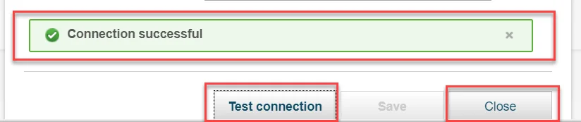{ width="79%" }](../images/va19.webp)
 
1.	Select just created *datasource* and **Save** configuration.
[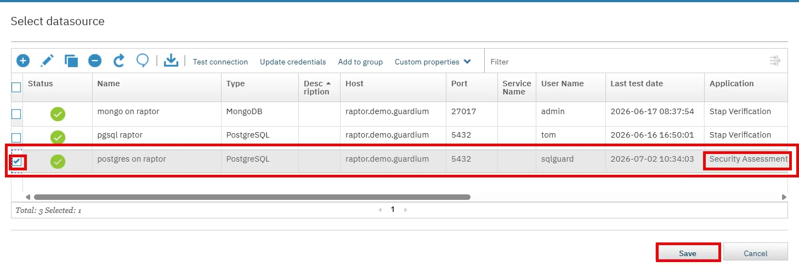{ width="99%" }](../images/va20.webp)
 
1.	You will back to **Security Assessment** builder main view and just created PostgreSQL datasource should be listed in *Datasources* section. **Apply** changes and then **Configure Tests** button will be activated. Use it.
[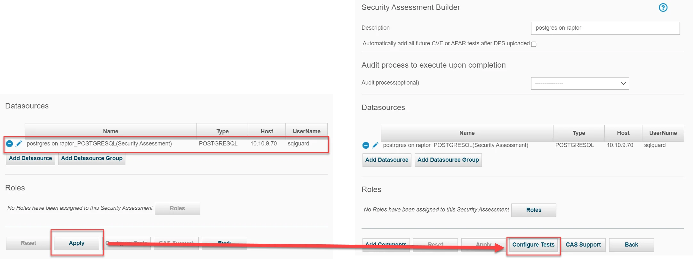{ width="99%" }](../images/va21.webp)
 
1.	The **Assessment Test Selections** window will appear. Navigate to the **POSTGRESQL** tab to display all available *VA tests* for the *PostgresSQL* database.<BR>
Exclude *CAS* tests by unchecking the *Include CAS* option, as we will not configure *CAS* in this lab.
Next, select the first test on the list, then scroll down to the last one and select it while holding the ++shift++ key — this will highlight all tests.<BR>
Finally, click **Add Selections** to add the selected tests to our assessment. Please wait until all tests appear in the selection area.
[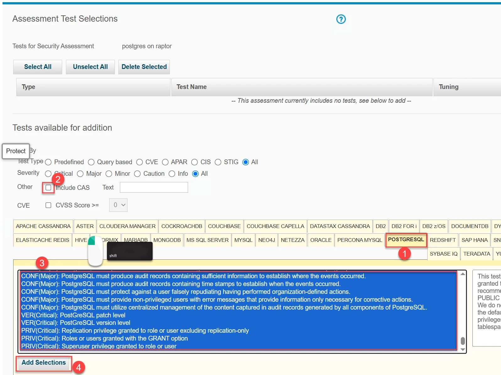{ width="99%" }](../images/va22.webp)
 
1.	As a result all marked tests will be moved to selected tests area. Now we can press **Return** button.
[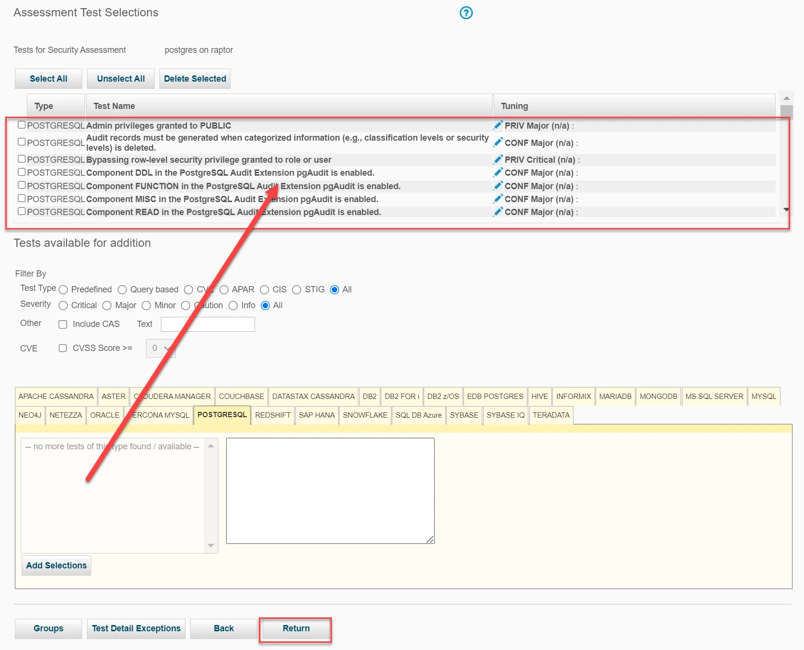{ width="99%" }](../images/va23.webp)

1.	To execute just created *assessment*, select it on a list and press **Run Once Now** button. The pop-up will inform that we just started *assessment instance* and its execution can be monitored in *Guardium Job Queue* report.
[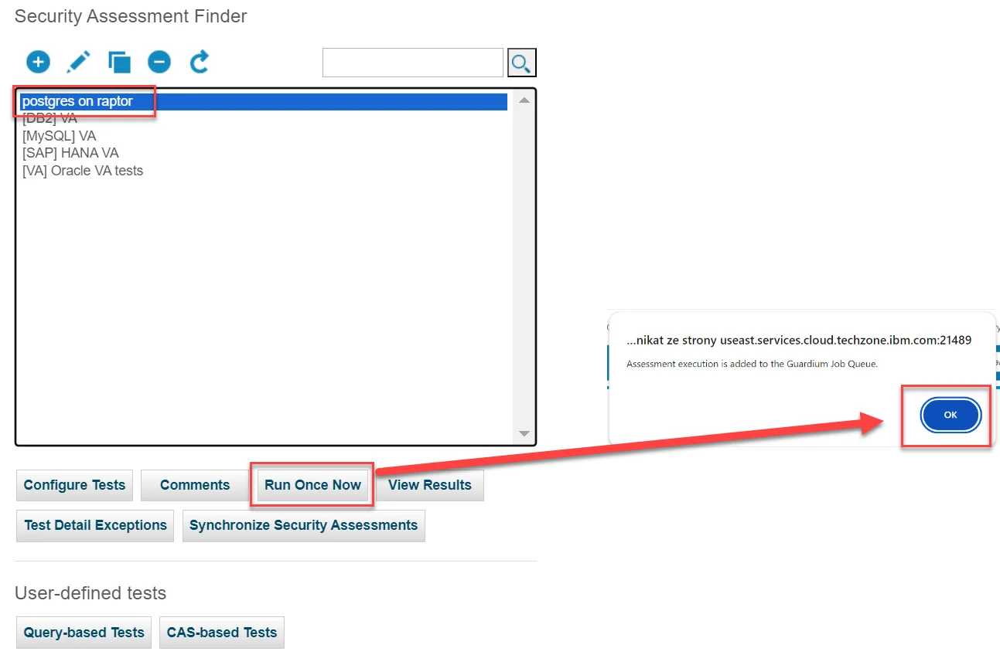{ width="99%" }](../images/va24.webp)
 
1.	Open *Guardium Job Queue* report and refresh it till status will be changed to **COMPLETED** (be patient, sometimes the assessment row can disappear for a while).
[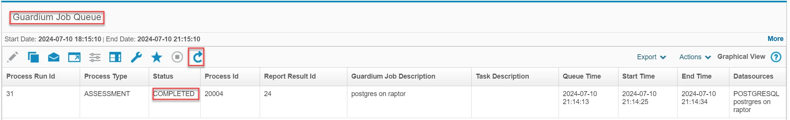{ width="99%" }](../images/va25.webp)

1.	Back to** Security Assessement** builder view and select our *PostgreSQL* assessment. This time press **View Result** button to open interactive *VA* report (you probably need to accept pop-up displayed in the browser).
[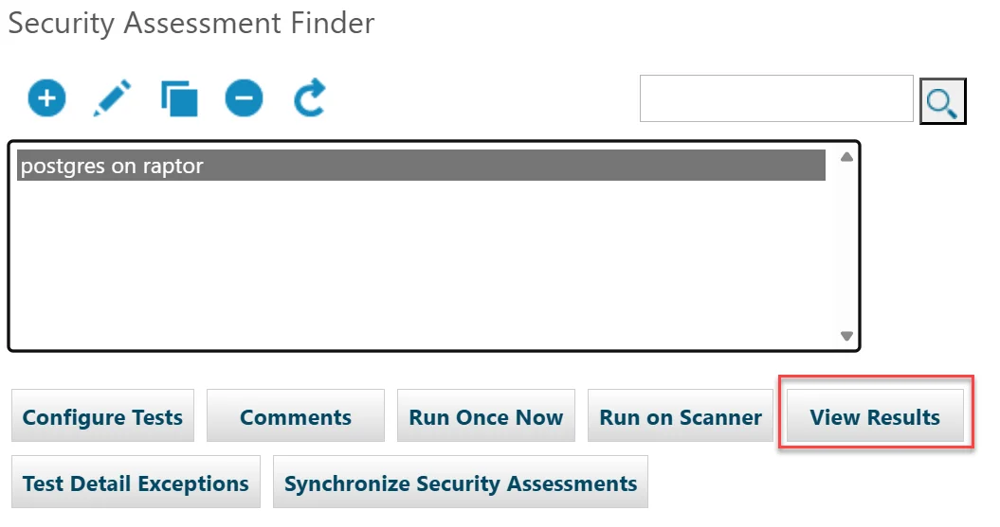{ width="74%" }](../images/va26.webp)

1.	Review *VA assessment* report and close it.
[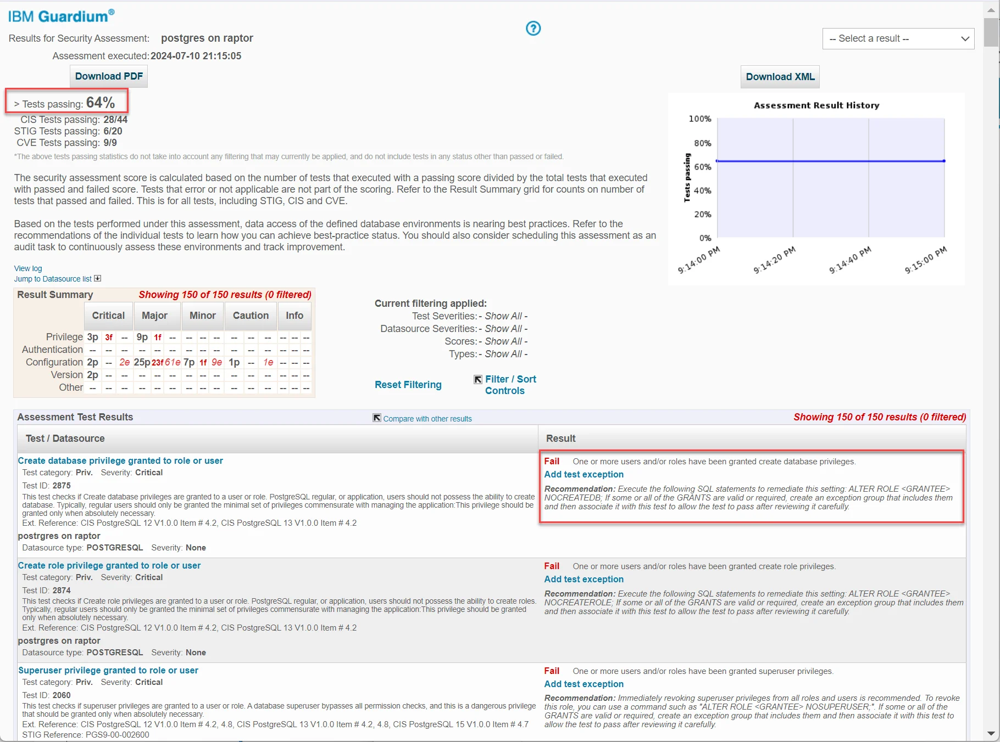{ width="99%" }](../images/va27.webp)

## Findings remediation

1.	In **cm** UI open again the result set from the last *PostgreSQL* assessment. Press **View Result** when vulnerability assessment - **postgres on raport** is selected.
[{ width="74%" }](../images/va26.webp)

1.	Look for test – *Ensure the pgcrypto extension is installed*. This extension allows implement column based data encryption. Unfortunately, it is not enabled in our **raptor** *PostgreSQL instance*.
[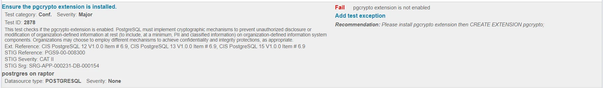{ width="99%" }](../images/va28.webp) 

1.	To enable the functionality mentioned in the test, log in on **raptor** to the database and execute the **CREATE EXTENSION** statement.
```sql
su - postgres

psql

CREATE EXTENSION IF NOT EXISTS pgcrypto;

/q

exit
```

1.	Run again our **postgres on raptor** *VA assessment* and check execution completeness in *Guardium Job Queue* report.
 [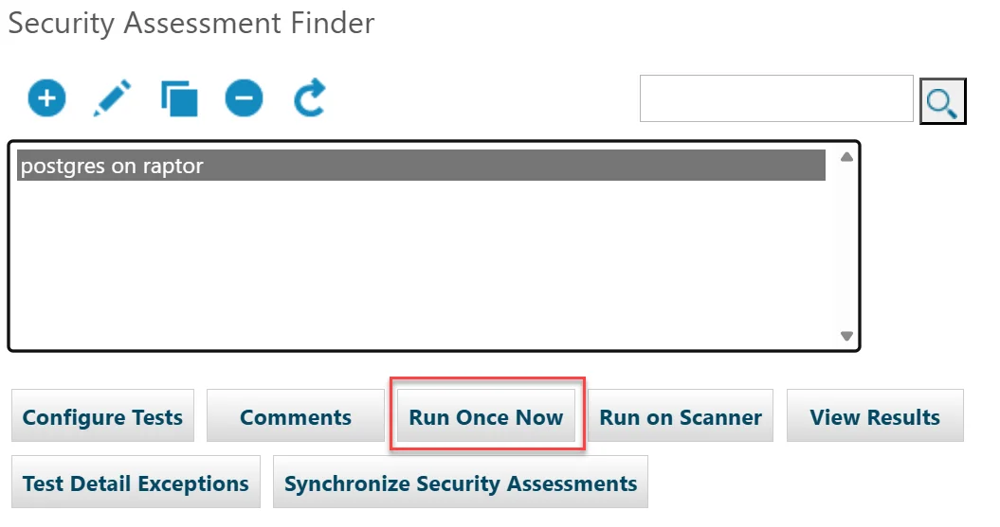{ width="79%" }](../images/va29.webp) 
 [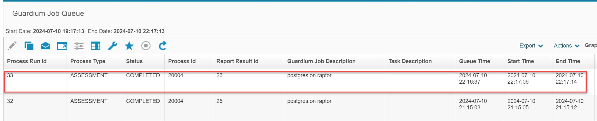{ width="99%" }](../images/va30.webp)
 
1.	Open assessment results and notice that Test passing result has been changed. To find a difference you can press **Compare with other results** link and select previous execution with lower score. Press **Go** button.
[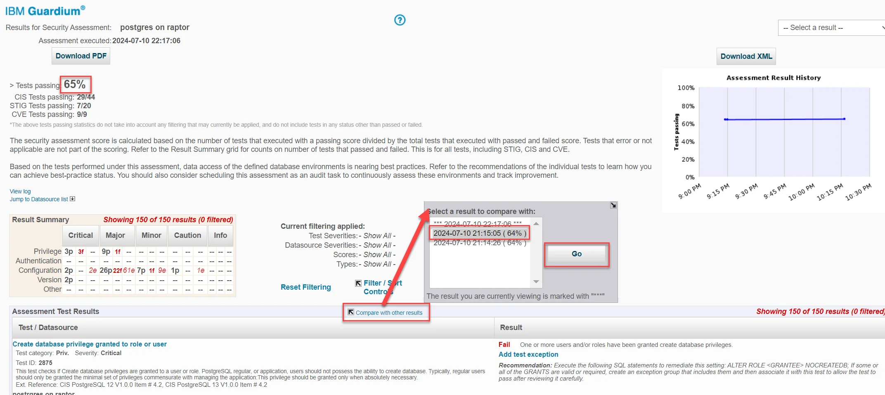{ width="99%" }](../images/va31.webp)

1.	Displayed pop-up report identifies that now *pgcrypto* library test has been passed.
[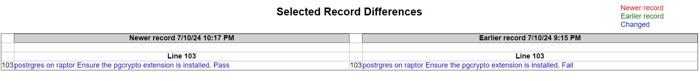{ width="99%" }](../images/va32.webp)
	
## Setup remote VA scanner (optional)

1.	Open again the **VA Assessment** builder and select **postgres on raptor** assessment. Then use the **Run on Scanner** button instead of **Run Once Now**. The pop-up message informs that request is trying to put this task to *va scanners* queue. If you press **OK** you should also get confirmation that task is now there.
[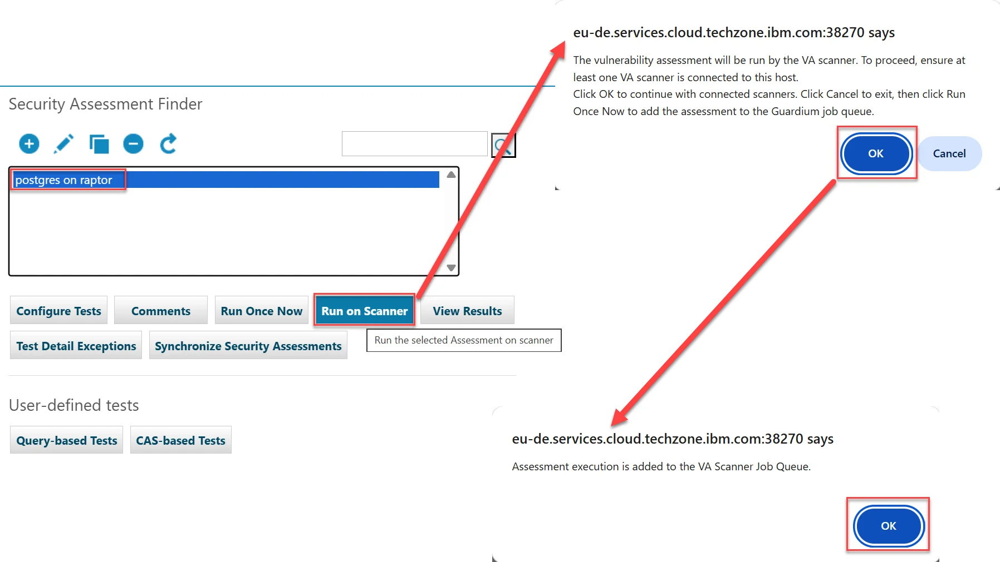{ width="99%" }](../images/va33.webp)
 
1.	Open **VA Scanner Job Queue** view and notice that a new task is scheduled and it is **WAITING** for execution. In this case the task will be served by remote scanner which we must deploy first.
[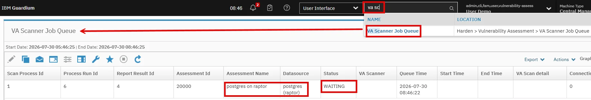{ width="99%" }](../images/va34.webp)
 
1.	We need two pieces of information. First one is *appliance UI certificate*. In our case we are using **cm** for *VA*, so let us get it public certificate. Open **cm** UI in your browser and save the certificate.

1.	Here are the steps for *Chrome*. Select certificate information just at *URL* and then **Certificate details**. Then switch to **Details** tab and **Export** to file.
[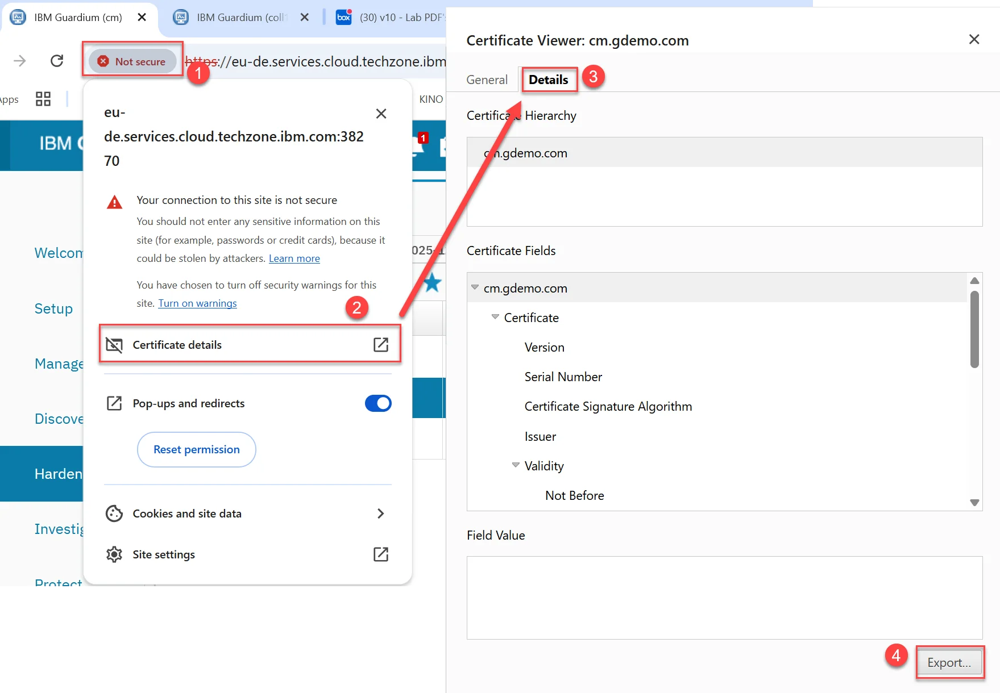{ width="99%" }](../images/va35.webp)
 
1.	Here this same in Microsoft Edge.
[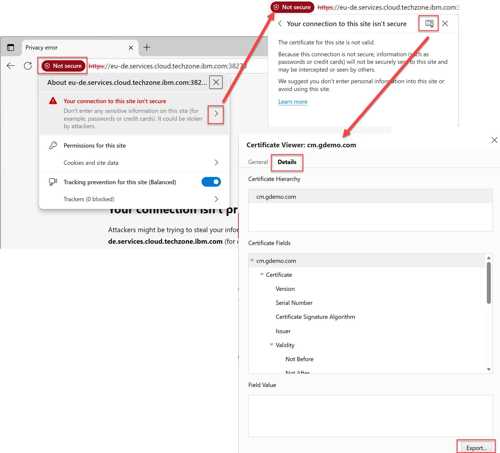{ width="99%" }](../images/va36.webp)
 
1.	Just a saved file should contain the **cm** UI certificate in a *PEM* format. Save it on **sauropod** machine in the directory `/opt/vascanner/certs` as a `vascanner.pem` file. Use this command to create directory on sauropod
```bash
mkdir -p /opt/vascanner/certs
```

1.	The `vascanner.pem` file should look like shown below:
```bash 
cat /root/gn-trainings/vascanner/certs/vascanner.pem 
```
[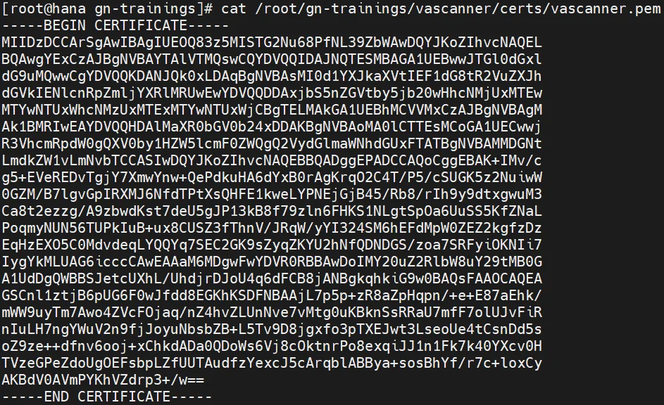{ width="99%" }](../images/va37.webp)
 
1.	Login to **cm** cli and create a new *API key* for *vascanner*.
```bash
grdapi create_api_key name=vascanner
``` 
[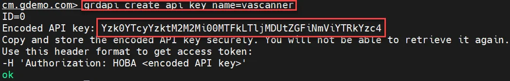{ width="99%" }](../images/va38.webp)
Write down the encoded API key, we need it soon.

1.	On **sauropod** login to the *IBM container registry* and check. The entitlement key is available in the `container_registry.txt` file in training materials.
```bash
podman login cp.icr.io -u cp -p <ibm_registry_key>
```
[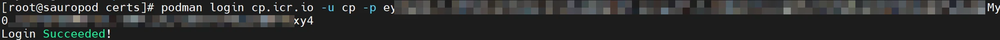{ width="99%" }](../images/va39.webp)
 
1.	Pull *VA scanner* image on **sauropod**.
```bash
podman pull cp.icr.io/cp/ibm-guardium-data-security-center/guardium/vascanner-12.2.0/va-scanner:vascanner-v12.2.0
```
[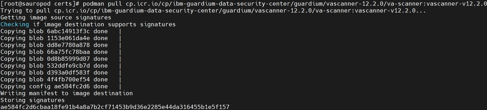{ width="99%" }](../images/va40.webp)

1.	Check that image is correctly pulled and wrote down information about *image id*.
```bash
podman images
```
[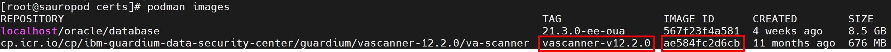{ width="99%" }](../images/va41.webp)
 
1.	Create config file in the `/opt/vascanner/config` on **sauropod**.

    !!! note "Inside 4 variables must be set like that:"
        - GDP_HOST=**cm.demo.guardium**
        - GDP_HOST_PORT=**8443**
        - CLIENT_API_KEY=&lt;encoded API Key from point 8>
        - VA_AGENT_NAME=**VA_SCANNER_ON_SAUROPOD**

    [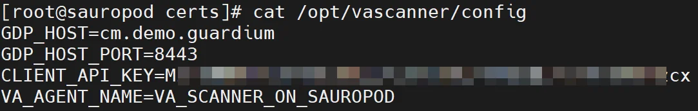{ width="89%" }](../images/va42.webp)
 
1.	Now we are ready to start a *scanner* (insert correct *image id*)
```bash
podman run --network host -d --replace --env-file /opt/vascanner/config --name va-scanner-sauropod -v /opt/vascanner/certs:/var/vascanner/certs <image ID from point 11>
```

1.	You can monitor the container status using:
```bash
podman ps -a
```
[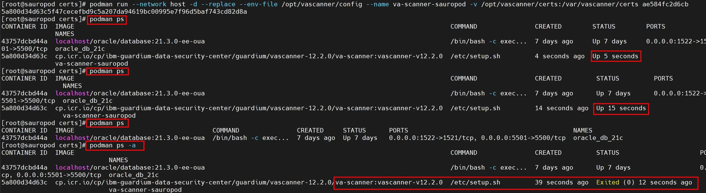{ width="99%" }](../images/va43.webp)
After one minute, even less, the container will stop working (it is expected).
 
1.	Check again the **VA Scanner Job Queue** view in **cm** UI and notice that job is completed and result set is consumed by *VA engine*.
[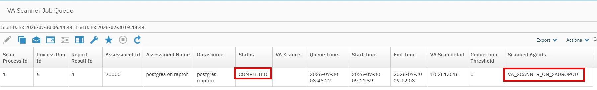{ width="99%" }](../images/va44.webp)
 
1.	You can also check container logs on sauropod/
```bash
podman logs va-scanner-sauropod
```
[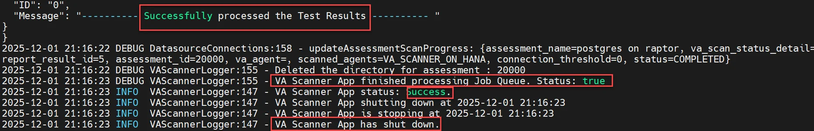{ width="99%" }](../images/va45.webp)

## VA findings dashboard

1.	If the **VULNERABILITY_MANAGEMENT** *feature flag* is enabled on the **cm**, a new **Vulnerability Management** view becomes available. This view provides a quick overview of the security posture of the monitored database engines and centralizes vulnerability assessment findings. The charts provide a visual overview of the identified findings, categorized by critical, high, and other severity levels, as well as grouped by database engine type. Below the charts, you can review the findings in greater detail and examine the specific issues detected by the assessment.
[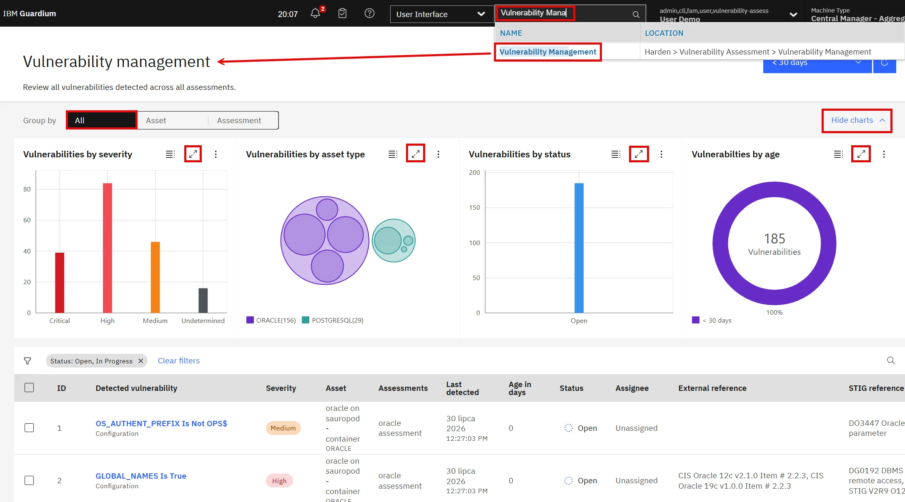{ width="99%" }](../images/va46.webp)
 
1.	Selecting a test from the list opens detailed information about the issue, including remediation guidance, and also allows you to add comments.
[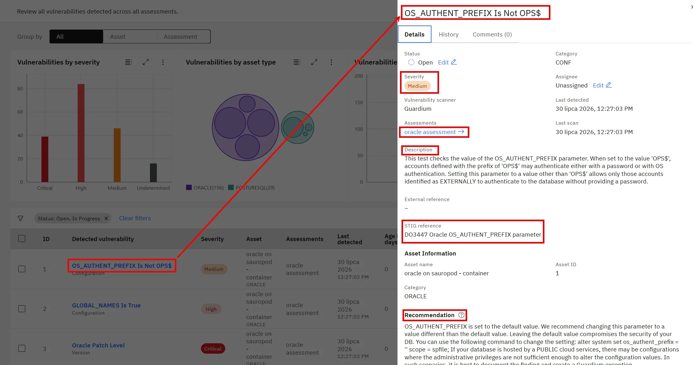{ width="99%" }](../images/va47.webp)

1.	The new view can also be used to manage the remediation process by updating the finding status and assigning remediation tasks or other actions to users with Guardium accounts. This lightweight workflow can be a good fit for smaller organizations or serve as a temporary solution before implementing a full-scale remediation process based on exceptions and formal workflow management.
[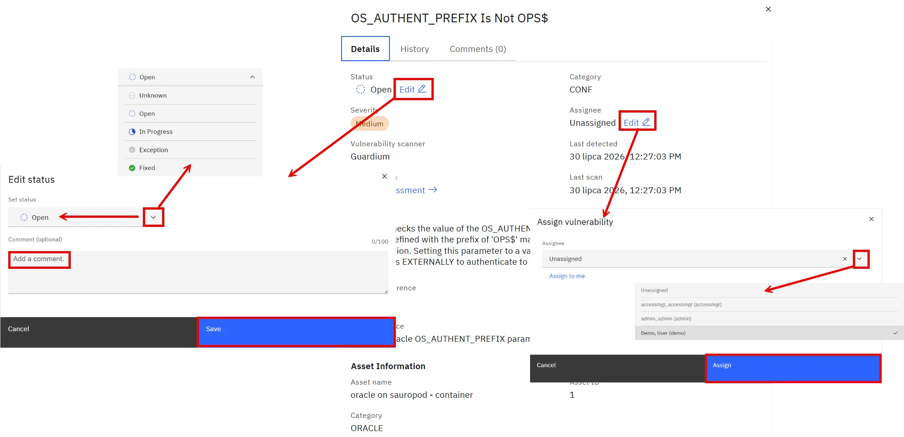{ width="99%" }](../images/va48.webp)

1.	Findings can also be reviewed from the perspective of configured data sources (assets) or by examining the results of individual vulnerability assessment processes that have been configured and executed.
[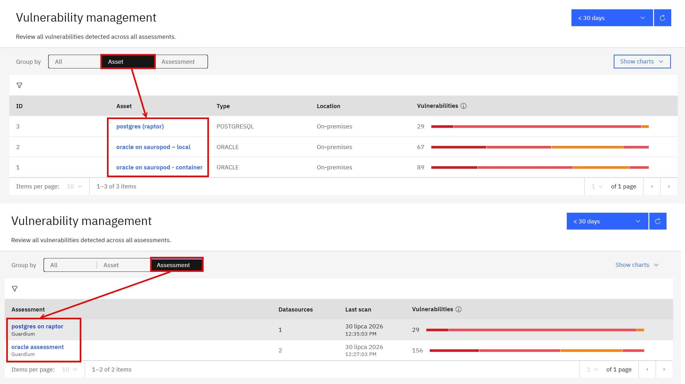{ width="99%" }](../images/va49.webp)

## Appendix

!!! note "Dependencies:"
    Deliverables from this lab are referred in other, it should be fully followed.

!!! note "Resources:"
    - Registry entitlement (use own or ask instruktor to provide one) <https://myibm.ibm.com/products-services/containerlibrary>
    
    
!!! note "Instructor notes:"

 


