# WINSTAP Configuration

## GIM installation on windows machine

1.	Connect to **ceratops** machine using *RDP* client.

2.	In *File Explorer* got to `c:\bootcamp\zip` directory where you *GIM* installers for *Windows* are located. Extract archive for build 12.2_r120201205_1.
[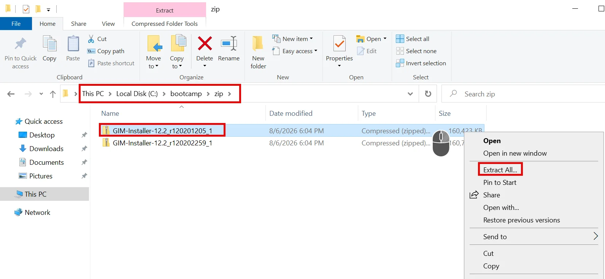{ width="99%" }](../images/winstap1.webp)
 
3.	Go to directory with just unpacked files and start *GIM client* installer – `Setup.exe`.
[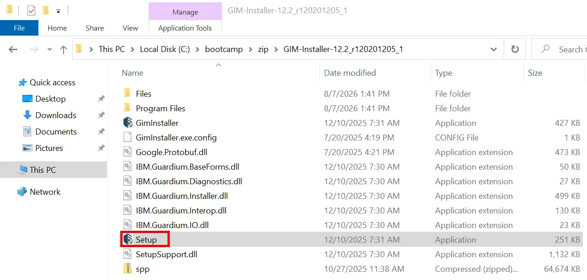{ width="99%" }](../images/winstap2.webp)

4.	Installation wizard will appear. Accept license agreement and **Next** select **Typical** installation.
[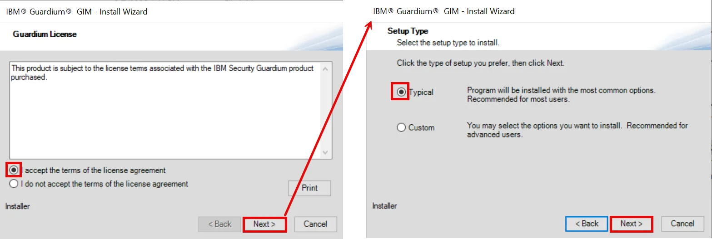{ width="99%" }](../images/winstap3.webp)

5.	Install *GIM* in the **Standard Mode**, insert **cm.demo.guardium** into *Appliance Address* field and select *Auto Assign Local IP* option. Confirm installation start – press **Install** button and wait for confirmation that installation is finished.
[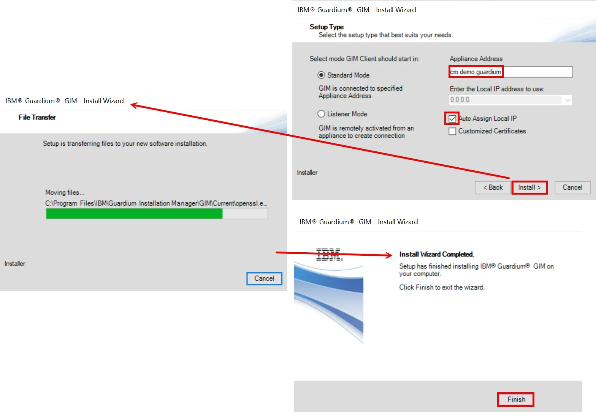{ width="99%" }](../images/winstap4.webp)
 
6.	Go to **cm** UI and open **GIM Processes Monitor** view. Notice that new, *Windows* based *GIM client* appeared on the list.
[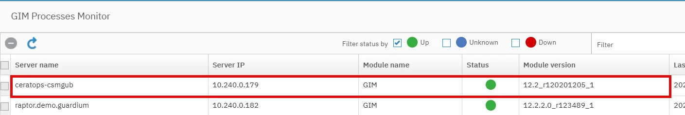{ width="99%" }](../images/winstap5.webp)
 
## STAP installation

1.	In **Setup by Client** view on **cm** select **ceratops** *GIM client*.
[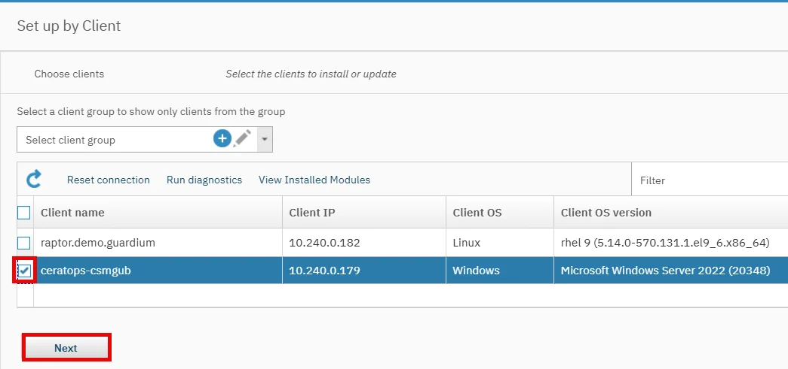{ width="99%" }](../images/winstap6.webp)
 
2.	Then select *WINSTAP 12.2_r120201205_1* for installation (uncheck **Show only latest version** option before).
[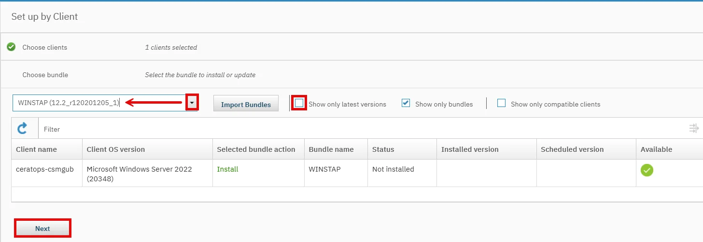{ width="99%" }](../images/winstap7.webp)
 
3.	Set the one parameter only – *WINSTAP_SQLGUARD_IP* with **coll1.demo.guardium** as a value. Finally press **Install** button and start installation.
[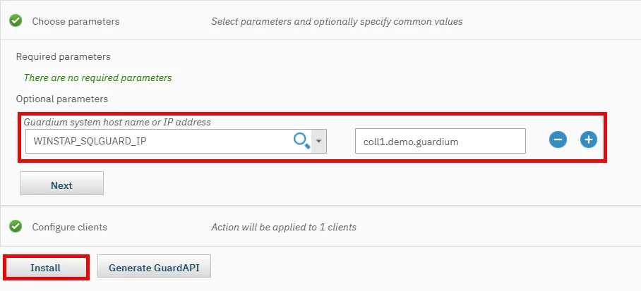{ width="99%" }](../images/winstap8.webp)
 
4.	Wait for confirmation that *STAP* has been installed.
[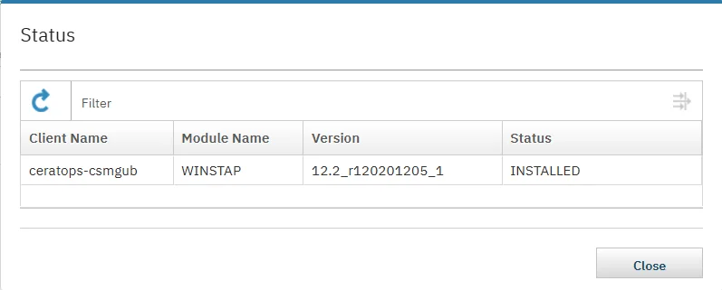{ width="79%" }](../images/winstap9.webp)
 
5.	**S-TAP Control** view on **coll1** should include now new *STAP* instance with IP address of our Windows machine. You should also see that instance discovery process identified *MSSQL* instances on this machine.
[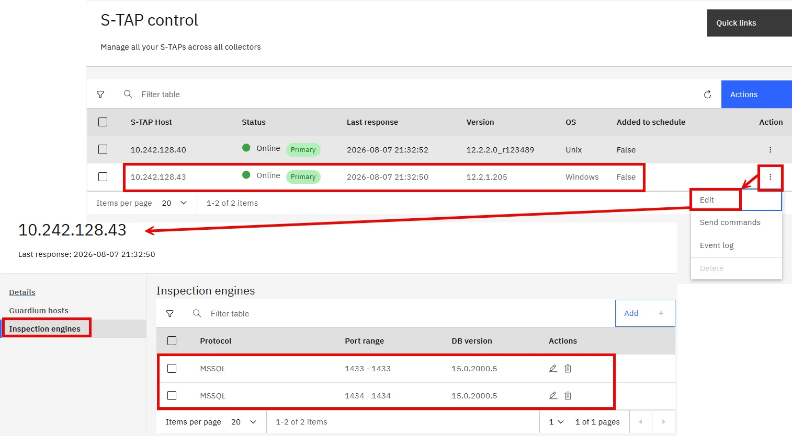{ width="99%" }](../images/winstap10.webp) 

## Traffic SELECT visibility	

1.	In *RDP* session on ceratops open *MSSQL management studio*. Login to database as **sa** user with default service password (use **SQL Server Authentication**).
[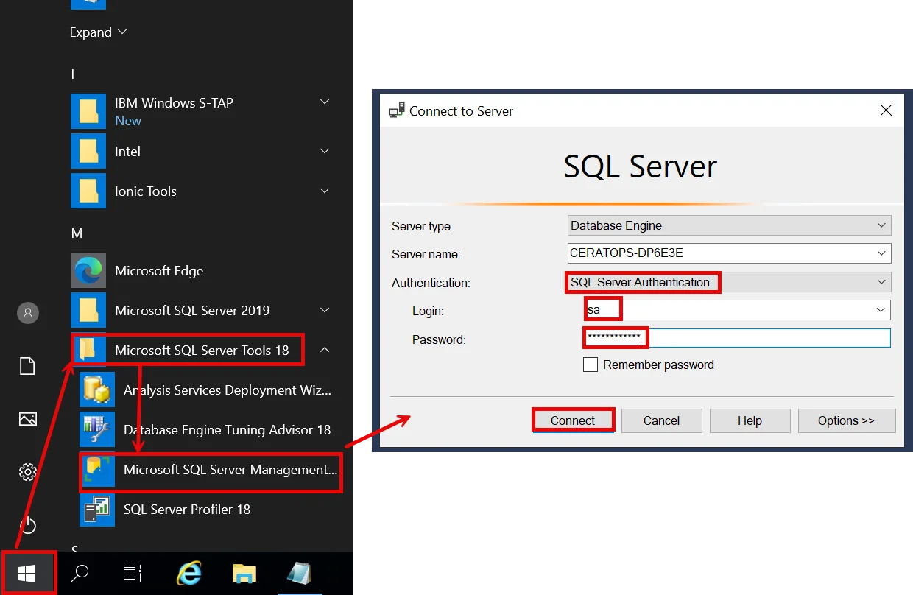{ width="99%" }](../images/winstap11.webp)
 
2.	Open Query editor and execute simple dummy query. Right click :material-mouse-right-click: on the opened instance to display the context menu, then select the **New Query** option. Insert query below to the new area space and use **Execute** button.
```sql
SELECT 'QUERY FROM SMSS';
```
[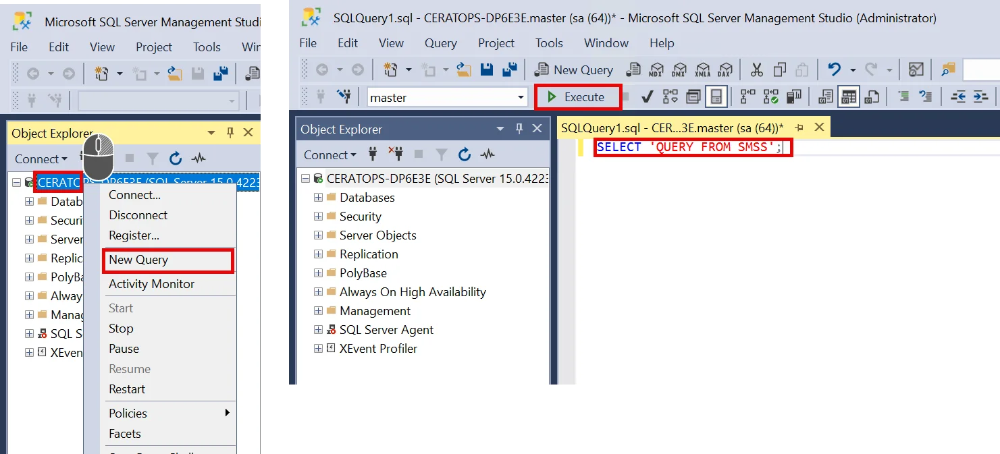{ width="99%" }](../images/winstap12.webp)

3.	Check *Full SQL (Training)* report on **coll1** and confirm that our query is correctly sniffed. 
[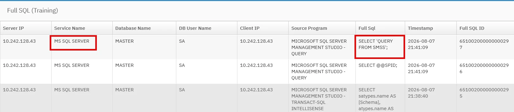{ width="99%" }](../images/winstap13.webp)

## GIM update

1.	In **cm** UI open **Setup by client** to update *GIM client* to version **12.2_r120201205_1**. To see *Windows GIM client bundles* you must uncheck **Show only bundles** option! Then **Install** new version and confirm success.
[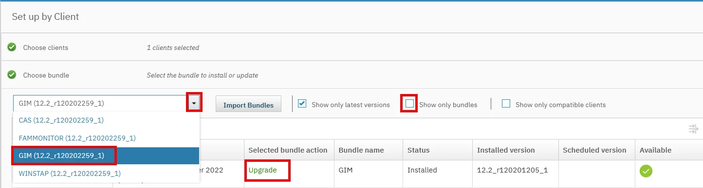{ width="99%" }](../images/winstap14.webp)
[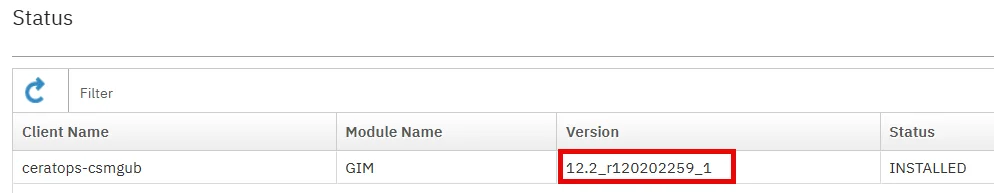{ width="99%" }](../images/winstap15.webp)
 
2.	After successful upgrade check **GIM Process Monitor** view on **cm** to confirm that new version of *GIM client* has been deployed on **ceratops**.
[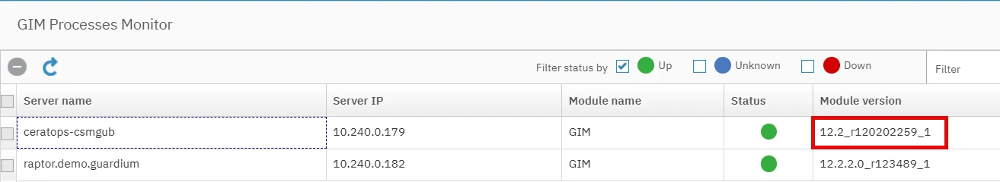{ width="99%" }](../images/winstap16.webp)

3.	If the GIM client instance will have red status try to restart service **IBM Guardium Installation Manager** and check *GIM Process Monitor* again.
[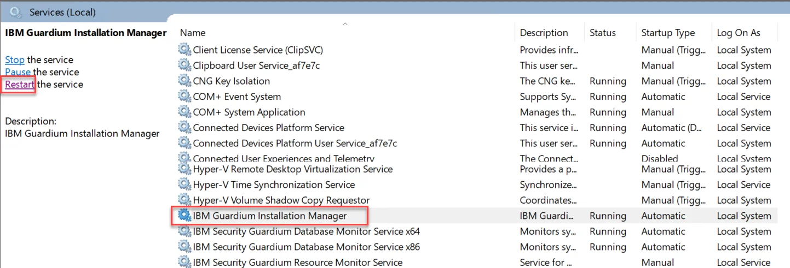{ width="99%" }](../images/winstap17.webp)

## STAP update

1.	Now, upgrade *STAP* to version **12.2_r120202259_1**.
[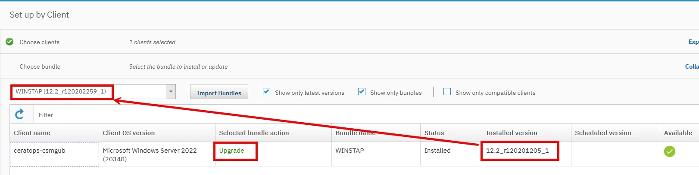{ width="99%" }](../images/winstap18.webp)
[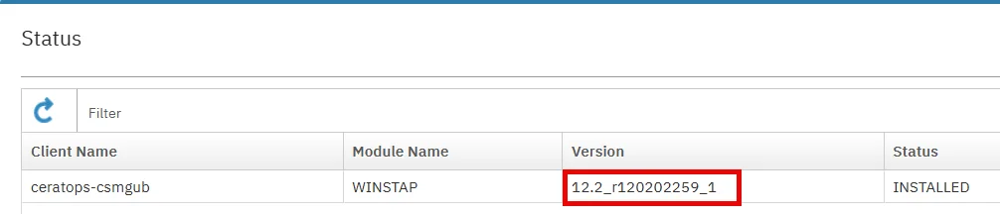{ width="99%" }](../images/winstap19.webp) 
 
2.	Afer successful uprade check version of installed *WINSTAP* in **S-TAP Status** report on **coll1**.
[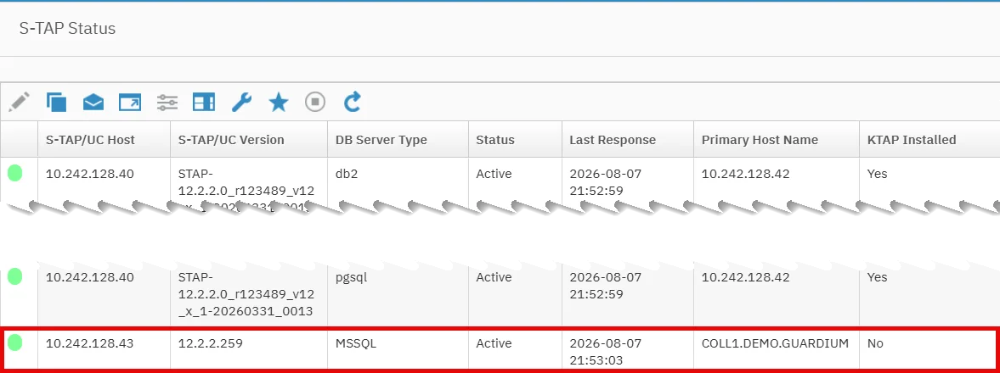{ width="99%" }](../images/winstap20.webp) 
 
3.	In *MSSQL Management Studio* execute new *SQL*, like:
```sql
SELECT 'QUERY FROM SMSS AFTER STAP UPDATE';
```
[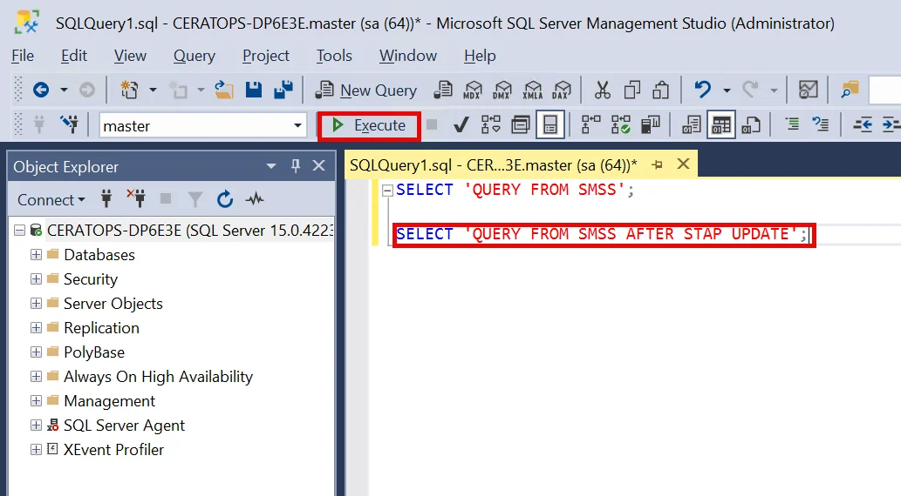{ width="99%" }](../images/winstap21.webp)

4.	The traffic will appear in the report *Full SQL (Training)*. However sometimes the WINSTAP update may require *MSSQL* engine restart.
[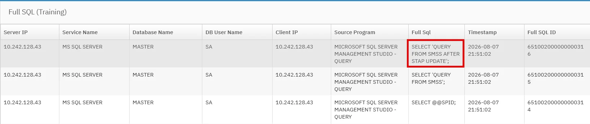{ width="99%" }](../images/winstap22.webp) 

## Appendix

!!! note "Dependencies:"
    Deliverables from this lab are referred in FAM lab. If you do not plan to follow the FAM lab afterwards, you may skip this one.

!!! note "Resources:"
    
!!! note "Instructor notes:"


